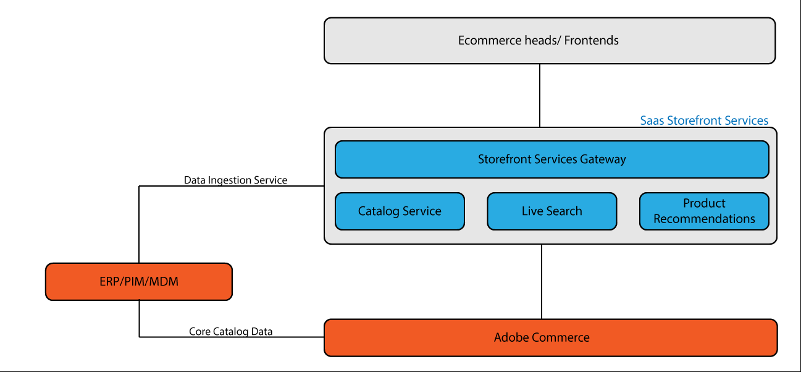

# Servizio di acquisizione feed

>[!NOTE]
>
>Il servizio di acquisizione feed è attualmente in versione beta privata. Non è ancora disponibile per un uso generico.

Il servizio di acquisizione dei feed riduce il tempo necessario per elaborare le modifiche ai prodotti (aggiornamenti dei prezzi, aggiunta di nuovi attributi) ignorando l’istanza di Adobe Commerce e spostando i dati del catalogo da un ERP (Enterprise Resource Planning) di terze parti direttamente nei servizi di Adobe Commerce.

Questo servizio è destinato ai clienti che memorizzano e gestiscono il catalogo dei prodotti in un sistema esterno all’applicazione principale di Adobe Commerce.

I clienti con cataloghi grandi e complessi o che ricevono aggiornamenti frequenti temono che i nuovi dati possano richiedere più tempo del previsto per essere visualizzati nello store live. Poiché Catalog Service sa di quali dati ha bisogno per elaborare questi aggiornamenti, non è necessario inviare i dati tramite il prodotto Commerce di base, ma solo per l’inoltro a Catalog Service. Se si rimuove questo passaggio intermedio, si ottengono miglioramenti in termini di efficienza.

## Flussi di acquisizione dei feed

A seconda della configurazione di Adobe Commerce, l’archiviazione e i flussi di dati possono seguire percorsi diversi.

* In un’istanza standard di Adobe Commerce, il catalogo dei prodotti viene memorizzato all’interno del database di base.
* Quando si utilizzano i servizi Adobe Commerce, i dati del catalogo vengono copiati dal database di base al servizio, quindi elaborati e consegnati da lì.
* Quando i dati del catalogo vengono memorizzati in un sistema di terze parti (ERP, MDM, PIM), passano attraverso l’applicazione Commerce di base e quindi ai servizi Commerce.
* Con il servizio di acquisizione dei feed, i dati dei prodotti passano direttamente dal sistema di terze parti all’infrastruttura dei servizi Commerce.

Ignorando l’applicazione Commerce di base e spostando i dati direttamente nei servizi Commerce, gli aggiornamenti dei prodotti si riflettono nello store più rapidamente. I dati del catalogo di base, come gli SKU, vengono inviati all’applicazione Commerce di base per l’elaborazione separata.

## Partecipa alla versione beta

Il servizio di acquisizione dei feed è progettato per:

* Clienti di medie imprese con implementazioni headless
* Clienti con cataloghi complessi e di grandi dimensioni
* I clienti che non utilizzano l’amministratore Adobe Commerce per gestire i dati del catalogo utilizzano un sistema ERP o di terze parti per gestire i dati del catalogo

Se ti interessa partecipare al programma beta, contatta il team all’indirizzo XXXXX@adobe.com.
