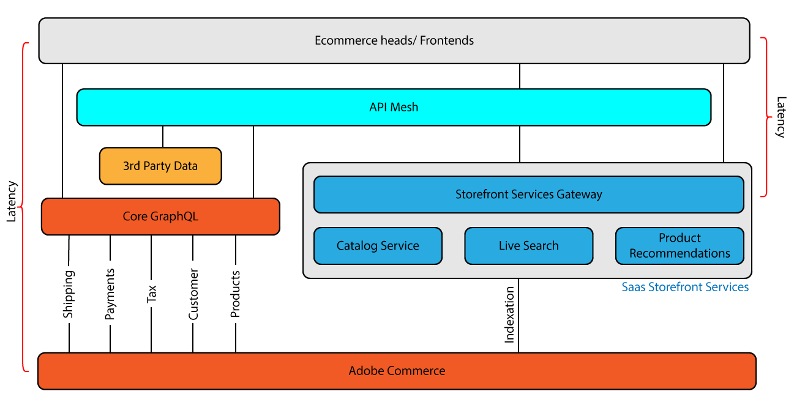

# [!DNL Catalog Service and API Mesh]

Il [Mesh API per Adobe Developer App Builder](https://developer.adobe.com/graphql-mesh-gateway/gateway/overview/) consente agli sviluppatori di integrare API private o di terze parti e altre interfacce con i prodotti Adobe utilizzando Adobe I/O Runtime.



Il primo passaggio per utilizzare la rete API con Catalog Service consiste nel collegare la rete API all’istanza. Consulta le istruzioni dettagliate in [Creare una rete](https://developer.adobe.com/graphql-mesh-gateway/gateway/create-mesh/).

Per completare l&#39;installazione, installare [Pacchetto Adobe Developer CLI](https://developer.adobe.com/runtime/docs/guides/tools/cli_install/).

Una volta configurato Mesh su Adobe I/O Runtime, esegui il seguente comando che aggiunge `CommerceCatalogServiceGraph` alla rete.

```bash
aio api-mesh:source:install "CommerceCatalogServiceGraph" -f variables.json
```

Dove `variables.json` è un file separato che memorizza i valori comunemente utilizzati per Adobe I/O Runtime.
Ad esempio, la chiave API può essere salvata all’interno del file:

```json
{
    "CATALOG_SERVICE_API_KEY":"your_api_key"
}
```

Dopo aver eseguito questo comando, il servizio catalogo deve essere in esecuzione tramite la rete API. È possibile eseguire `aio api-mesh:get` per visualizzare la configurazione della rete aggiornata.

## Esempi di API Mesh

API Mesh consente agli utenti di utilizzare sorgenti di dati esterne per migliorare l’istanza di Adobe Commerce. Può essere utilizzato anche per configurare i dati Commerce esistenti per abilitare nuove funzionalità.

### Abilita prezzi livello

In questo esempio, l’API Mesh viene utilizzata per abilitare i prezzi a livello in Adobe Commerce.
Sostituisci il `name `, `endpoint`, e `x-api-key` valori.

```json
{
  "meshConfig": {
    "sources": [
      {
        "name": "<Commerce Instance Name>",
        "handler": {
          "graphql": {
            "endpoint": "<Adobe Commerce GraphQL endpoint>"
          }
        },
        "transforms": [
            {
                "prefix": {
                    "includeRootOperations": true,
                    "value": "Core_"
                }
            }
        ]
      },
      {
        "name": "CommerceCatalogServiceGraph",
        "handler": {
          "graphql": {
            "endpoint": "https://commerce.adobe.io/catalog-service/graphql/",
            "operationHeaders": {
              "Magento-Store-View-Code": "{context.headers['magento-store-view-code']}",
              "Magento-Website-Code": "{context.headers['magento-website-code']}",
              "Magento-Store-Code": "{context.headers['magento-store-code']}",
              "Magento-Environment-Id": "{context.headers['magento-environment-id']}",
              "Magento-Customer-Group": "{context.headers['magento-customer-group']}"
            },
            "schemaHeaders": {
              "x-api-key": "<YOUR API-KEY>"
            }
          }
        }
      }
    ],
    "additionalTypeDefs": "extend interface ProductView {\n  price_tiers: [Core_TierPrice]\n}\n extend type SimpleProductView {\n  price_tiers: [Core_TierPrice]\n}\n extend type ComplexProductView {\n  price_tiers: [Core_TierPrice]\n}\n",
    "additionalResolvers": [
        {  
            "targetTypeName": "ProductView",
            "targetFieldName": "price_tiers",
            "sourceName": "MagentoStageCore",
            "sourceTypeName": "Query",
            "sourceFieldName": "Core_products",
            "requiredSelectionSet": "{\n    items {\n  sku\n    price_tiers {\n        quantity,\n        final_price {\n          value\n          currency\n        }\n      }\n    }\n  }",
            "sourceArgs": {
                "filter.sku.eq": "{root.sku}"
            },
            "result": "items[0].price_tiers"
        },
        {  
            "targetTypeName": "SimpleProductView",
            "targetFieldName": "price_tiers",
            "sourceName": "MagentoStageCore",
            "sourceTypeName": "Query",
            "sourceFieldName": "Core_products",
            "requiredSelectionSet": "{\n    items {\n  sku\n    price_tiers {\n        quantity,\n        final_price {\n          value\n          currency\n        }\n      }\n    }\n  }",
            "sourceArgs": {
                "filter.sku.eq": "{root.sku}"
            },
            "result": "items[0].price_tiers"
        },
        {  
            "targetTypeName": "ComplexProductView",
            "targetFieldName": "price_tiers",
            "sourceName": "MagentoStageCore",
            "sourceTypeName": "Query",
            "sourceFieldName": "Core_products",
            "requiredSelectionSet": "{\n    items {\n  sku\n    price_tiers {\n        quantity,\n        final_price {\n          value\n          currency\n        }\n      }\n    }\n  }",
            "sourceArgs": {
                "filter.sku.eq": "{root.sku}"
            },
            "result": "items[0].price_tiers"
        }
    ]
   }
}
```

Una volta configurata, esegui una query sulla rete per la determinazione dei prezzi su più livelli:

```graphql
query {
  products(skus: ["24-MB04"]) {
    sku
    description
    price_tiers {
        quantity
        final_price {
          value
          currency
        }
      }
    ... on SimpleProductView {
      id
       
      price {
        final {
          amount {
            value
          }
        }
      }
    }
  }
}
```

### Ottieni un ID entità

Questa mesh aggiunge `entityId` all&#39;interfaccia ProductView. Sostituisci il `name `, `endpoint`, e `x-api-key` valori.

```json
{
    "meshConfig": {
      "sources": [
        {
          "name": "<Commerce Instance Name>",
          "handler": {
            "graphql": {
              "endpoint": "<Adobe Commerce GraphQL endpoint>"
            }
          },
          "transforms": [
              {
                  "prefix": {
                      "includeRootOperations": true,
                        "value": "Core_"
                  }
              }
          ]
        },
        {
          "name": "CommerceCatalogServiceGraph",
          "handler": {
            "graphql": {
              "endpoint": "https://catalog-service.adobe.io/graphql",
              "operationHeaders": {
                "Magento-Store-View-Code": "{context.headers['magento-store-view-code']}",
                "Magento-Website-Code": "{context.headers['magento-website-code']}",
                "Magento-Store-Code": "{context.headers['magento-store-code']}",
                "Magento-Environment-Id": "{context.headers['magento-environment-id']}",
                "x-api-key": "<YOUR_CATALOG_SERVICE_API_KEY>",
                "Magento-Customer-Group": "{context.headers['magento-customer-group']}"
              },
              "schemaHeaders": {
                "x-api-key": "<YOUR_CATALOG_SERVICE_API_KEY>"
              }
            }
          }
        }
      ],
      "additionalTypeDefs": "extend interface ProductView {\n  entityId: String\n}\n extend type SimpleProductView {\n  entityId: String\n}\n extend type ComplexProductView {\n  entityId: String\n}\n",
      "additionalResolvers": [
        {  
            "targetTypeName": "ComplexProductView",
            "targetFieldName": "entityId",
            "sourceName": "MagentoCore",
            "sourceTypeName": "Query",
            "sourceFieldName": "Core_products",
            "requiredSelectionSet": "{ sku\n }",
            "sourceSelectionSet": "{\n    items {\n  sku\n uid\n  }\n    }",
            "sourceArgs": {
                "filter.sku.eq": "{root.sku}"
            },
            "result": "items[0].uid",
            "resultType": "String"
          },
          {
            "targetTypeName": "SimpleProductView",
            "targetFieldName": "entityId",
            "sourceName": "MagentoCore",
            "sourceTypeName": "Query",
            "sourceFieldName": "Core_products",
            "requiredSelectionSet": "{ sku\n }",
            "sourceSelectionSet": "{\n items {\n  sku\n uid\n }}",
            "sourceArgs": {
                "filter.sku.eq": "{root.sku}"
            },
            "result": "items[0].uid",
            "resultType": "String"
          }
      ]
    }
  }
```

`entityId` è ora possibile eseguire una query:

```graphql
query {
  products(skus: ["MH07"]){
    sku
    name
    id
    entityId
  }
}
```
