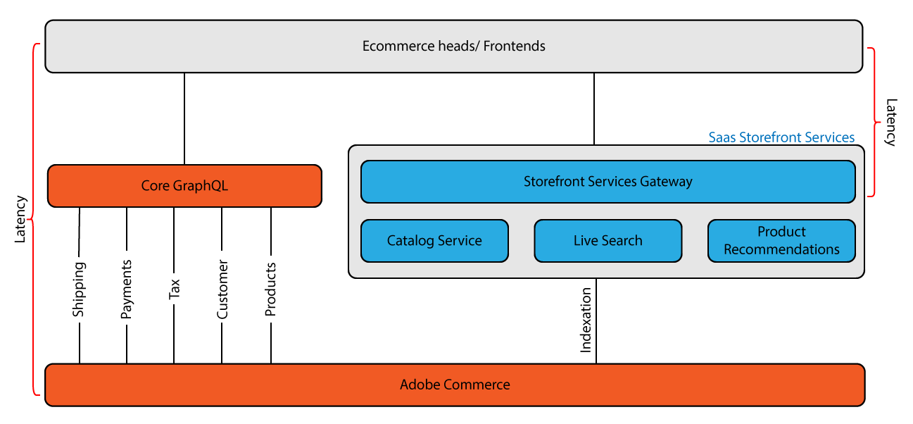

# [!DNL Catalog Service] per Adobe Commerce

Il [!DNL Catalog Service] l&#39;estensione for Adobe Commerce fornisce dati di catalogo avanzati per modelli di visualizzazione (sola lettura) per eseguire in modo rapido e completo il rendering di esperienze di vetrina relative ai prodotti, tra cui:

* Pagine dettagli prodotto
* Pagine di elenco prodotti e categorie
* Pagine dei risultati di ricerca
* Caroselli di prodotti
* Pagine di confronto dei prodotti
* Qualsiasi altra pagina che riproduce i dati di prodotto, come le pagine del carrello, dell’ordine e dell’elenco dei desideri

Il [!DNL Catalog Service] utilizza [GraphQL](https://graphql.org/) per richiedere e ricevere i dati di prodotto. GraphQL è un linguaggio di query che un client front-end utilizza per comunicare con l’API (Application Programming Interface) definita su un back-end come Adobe Commerce. GraphQL è un metodo di comunicazione diffuso perché è leggero e consente a un integratore di sistemi di specificare il contenuto e l’ordine di ciascuna risposta.

Adobe Commerce dispone di due sistemi GraphQL. Il sistema GraphQL di base fornisce un’ampia gamma di query (operazioni di lettura) e mutazioni (operazioni di scrittura) che consentono a un acquirente di interagire con molti tipi di pagine, tra cui prodotto, account cliente, carrello, pagamento e altro ancora. Tuttavia, le query che restituiscono le informazioni sul prodotto non sono ottimizzate per la velocità. Il sistema GraphQL dei servizi può eseguire query solo sui prodotti e sulle informazioni correlate. Queste query sono più performanti di query di base simili.

I clienti di Catalog Service possono utilizzare il nuovo [Indicizzatore prezzi SaaS](../price-index/index.md), che fornisce aggiornamenti più rapidi per la modifica del prezzo e tempi di sincronizzazione.

## Architettura

Il diagramma seguente mostra i due sistemi GraphQL:

Nel sistema GraphQL di base, il PWA invia una richiesta all’applicazione Commerce, che riceve ogni richiesta, la elabora, eventualmente inviando una richiesta tramite più sottosistemi, quindi restituisce una risposta alla vetrina. Questo round trip può causare rallentamenti nei tempi di caricamento delle pagine, con possibili tassi di conversione più bassi.

[!DNL Catalog Service] è un gateway di servizi Storefront. Il servizio accede a un database separato contenente i dettagli del prodotto e le informazioni correlate, ad esempio attributi del prodotto, varianti, prezzi e categorie. Il servizio mantiene il database sincronizzato con Adobe Commerce tramite l’indicizzazione.
Poiché il servizio ignora la comunicazione diretta con l’applicazione, è in grado di ridurre la latenza del ciclo di richiesta e risposta.

I sistemi GraphQL di base e di servizio non comunicano direttamente tra loro. Puoi accedere a ogni sistema da un URL diverso e le chiamate richiedono informazioni di intestazione diverse. I due sistemi GraphQL sono progettati per essere utilizzati insieme. Il [!DNL Catalog Service] Il sistema GraphQL potenzia il sistema di base per rendere più veloci le esperienze della vetrina dei prodotti.

Facoltativamente puoi implementare [Mesh API per Adobe Developer App Builder](https://developer.adobe.com/graphql-mesh-gateway/) integrare i due sistemi Adobe Commerce GraphQL con API private e di terze parti e altre interfacce software tramite Adobe Developer. La mesh può essere configurata in modo da garantire che le chiamate instradate a ciascun endpoint contengano le informazioni di autorizzazione corrette nelle intestazioni.

## Dettagli architetturali

Le sezioni seguenti descrivono alcune delle differenze tra i due sistemi GraphQL.

### Gestione schema

Poiché Catalog Service funziona come un servizio, gli integratori non devono preoccuparsi della versione sottostante di Commerce. La sintassi delle query è la stessa per tutte le versioni. Inoltre, lo schema è coerente per tutti i commercianti. Questa coerenza semplifica la definizione delle best practice e aumenta in modo significativo il riutilizzo dei widget della vetrina.

### Semplificazione dei tipi di prodotto

Lo schema riduce la diversità dei tipi di prodotto a due casi d’uso:

* I prodotti semplici sono quelli definiti con un prezzo e una quantità unici. Catalog Service mappa i tipi di prodotti semplici, virtuali, scaricabili e gift card su `simpleProductViews`.

* I prodotti complessi sono costituiti da più prodotti semplici. Il componente prodotti semplici può avere prezzi diversi. Un prodotto complesso può anche essere definito in modo che l&#39;acquirente possa specificare la quantità di componenti semplici prodotti. Catalog Service mappa i tipi di prodotto configurabili, bundle e raggruppati su `complexProductViews`.

Le opzioni di prodotto complesse sono unificate e si distinguono per il loro comportamento, non per il tipo. Ogni valore di opzione rappresenta un prodotto semplice. Questo valore di opzione ha accesso agli attributi di prodotto semplici, incluso il prezzo. Quando l’acquirente seleziona tutte le opzioni per un prodotto complesso, la combinazione di opzioni selezionate punta a un prodotto semplice specifico. Il prodotto semplice rimane ambiguo finché l’acquirente non seleziona un valore per tutte le opzioni disponibili.

### Prezzi

I prodotti semplici rappresentano l&#39;unità di vendita di base che ha un prezzo. Catalog Service calcola il prezzo regolare prima degli sconti e il prezzo finale dopo gli sconti. I calcoli dei prezzi possono includere imposte sui prodotti fisse. Escludono le promozioni personalizzate.

Un prodotto complesso non ha un prezzo stabilito. Catalog Service restituisce invece i prezzi dei semplici collegati. Ad esempio, un esercente può inizialmente assegnare gli stessi prezzi a tutte le varianti di un prodotto configurabile. Se determinate dimensioni o colori sono impopolari, il commerciante può ridurre i prezzi di tali varianti. Pertanto, il prezzo del prodotto complesso (configurabile) presenta inizialmente una fascia di prezzo, che riflette il prezzo sia delle varianti standard che di quelle impopolari. Dopo che l&#39;acquirente ha selezionato un valore per tutte le opzioni disponibili, la vetrina visualizza un solo prezzo.

>[!NOTE]
>
> Clienti Commerce con [!DNL Catalog Service] possono sfruttare gli aggiornamenti più veloci delle modifiche di prezzo e i tempi di sincronizzazione sui loro siti web con [Indicizzatore prezzi SaaS](../price-index/index.md).

## Implementazione

Il processo di installazione richiede la configurazione del [Connettore Commerce Services](../landing/saas.md). A questo punto, il passaggio successivo consiste nell’aggiornare il codice della vetrina in modo da incorporare il [!DNL Catalog Service] query. Tutti [!DNL Catalog Service] le query vengono instradate al gateway GraphQL. L’URL viene fornito durante il processo di onboarding.
