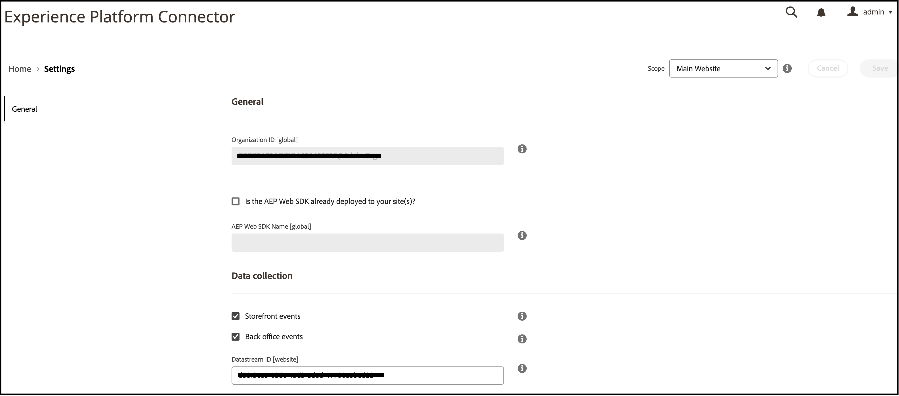
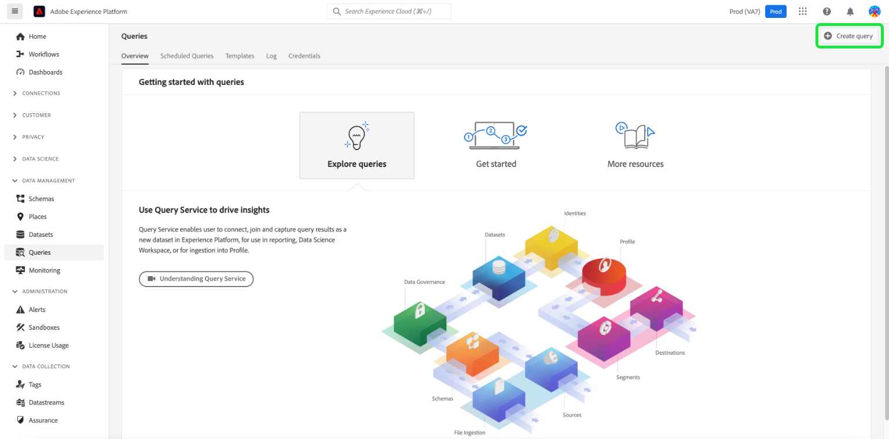
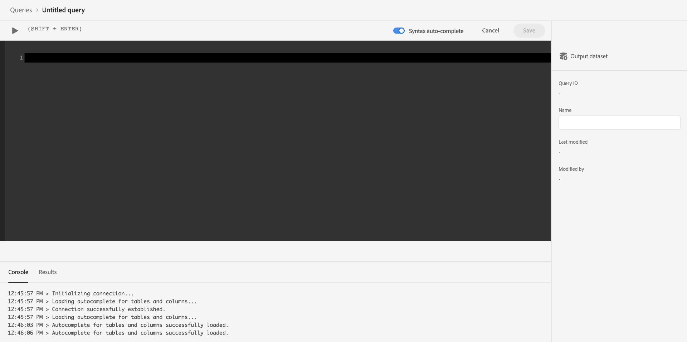

# Connettere dati Commerce a Adobe Experience Platform

Quando installi il connettore di Experience Platform, due nuove pagine di configurazione vengono visualizzate nel **Sistema** menu sotto **Servizi** nel Commercio _Amministratore_.

- Connettore Commerce Services
- Connettore Experience Platform

Per collegare l’istanza Adobe Commerce a Adobe Experience Platform, è necessario configurare entrambi i connettori, a partire dal connettore Commerce Services e al termine del connettore di Experience Platform.

## Aggiornamento del connettore Commerce Services

Se in precedenza hai installato un servizio Adobe Commerce, probabilmente hai già configurato il connettore Commerce Services. In caso contrario, è necessario completare le seguenti attività nel [Connettore Commerce Services](../landing/saas.md) pagina:

1. Accedi al tuo account Commerce per [recuperare le chiavi API di produzione e sandbox](../landing/saas.md#credentials).
1. Seleziona una [Spazio dati SaaS](../landing/saas.md#saas-configuration).
1. Accedi al tuo account Adobe a [recuperare l&#39;ID organizzazione](../landing/saas.md#ims-organization-optional).

Dopo aver configurato il connettore Commerce Services, configura quindi il connettore di Experience Platform.

## Aggiornare il connettore di Experience Platform

In questa sezione, connetti la tua istanza di Adobe Commerce a Adobe Experience Platform utilizzando il tuo ID organizzazione. È quindi possibile specificare il tipo di dati da inviare al bordo dell&#39;Experience Platform - vetrina o back office.



## Generale

1. Accedi al tuo account di Adobe nel [Connettore Commerce Services](../landing/saas.md#organizationid) e seleziona l&#39;ID organizzazione.

   >[!NOTE]
   >
   >Se in precedenza hai configurato il connettore Commerce Services, puoi saltare questo passaggio perché l’ID organizzazione è già stato selezionato.

1. Nell&#39;Admin, vai a **Sistema** > Servizi > **Connettore Experience Platform**.

1. In **Ambito** a discesa, imposta il contesto su **Sito Web**.

1. In **ID organizzazione** , verifica l&#39;ID associato al tuo account Adobe Experience Platform, come configurato nel [Connettore Commerce Services](../landing/saas.md#organizationid). L&#39;ID organizzazione è globale. Per ogni istanza di Adobe Commerce è possibile associare un solo ID organizzazione.

1. (Facoltativo) Se disponi già di un [AEP Web SDK (lega)](https://experienceleague.adobe.com/docs/experience-platform/edge/home.html) implementato nel sito, abilita la casella di controllo e aggiungi il nome dell&#39;SDK web AEP. In caso contrario, puoi lasciare vuoti questi campi e il connettore Experience Platform ne distribuirà uno per te.

   >[!NOTE]
   >
   >Se specifichi il tuo AEP Web SDK, il connettore di Experience Platform utilizza l’ID del datastream associato a tale SDK e non l’ID del datastream specificato in questa pagina (se presente).

## Raccolta dati

In questa sezione viene specificato il tipo di dati che si desidera inviare al bordo Experience Platform. Esistono due tipi di dati: lato client e lato server.

I dati lato client sono dati acquisiti sulla vetrina. Ciò include le interazioni con gli acquirenti, come `View Page`, `View Product`, `Add to Cart`e [elenco richieste](events.md#b2b-events) informazioni (per i commercianti B2B). I dati lato server, o dati di back office, sono dati acquisiti nei server Commerce. Ciò include informazioni sullo stato di un ordine, ad esempio se un ordine è stato effettuato, annullato, rimborsato, spedito o completato.

In **Raccolta dati** selezionare il tipo di dati che si desidera inviare al bordo Experience Platform. Per assicurarti che la tua istanza Adobe Commerce possa iniziare la raccolta dei dati, controlla la [prerequisiti](overview.md#prerequisites).

Per ulteriori informazioni, consulta l’argomento degli eventi . [vetrina](events.md#storefront-events) e [ufficio postale](events.md#back-office-events) eventi.

>[!NOTE]
>
>Tutti i campi nel **Raccolta dati** la sezione si applica al **Sito Web** ambito di applicazione o superiore.

1. Seleziona **Eventi Storefront** se desideri inviare dati comportamentali di vetrina.

   >[!NOTE]
   >
   >La **Eventi Storefront** Se l&#39;SDK per web e l&#39;ID organizzazione AEP sono validi, la casella di controllo viene abilitata automaticamente.

1. Seleziona **Eventi back office** se si desidera inviare informazioni sullo stato dell&#39;ordine, ad esempio se un ordine è stato inserito, annullato, rimborsato o spedito.

   >[!NOTE]
   >
   >Se si seleziona **Eventi back office**, tutti i dati del back office vengono inviati al server Edge di Experience Platform. Se un acquirente sceglie di rinunciare alla raccolta di dati, nell’Experience Platform devi impostare esplicitamente la preferenza relativa alla privacy dell’acquirente. Questo è diverso dagli eventi della vetrina in cui il raccoglitore gestisce già il consenso in base alle preferenze dell&#39;acquirente. [Ulteriori informazioni](https://experienceleague.adobe.com/docs/experience-platform/landing/governance-privacy-security/consent/adobe/dataset.html) informazioni sull&#39;impostazione delle preferenze di privacy di un acquirente nell&#39;Experience Platform.

1. Per garantire l&#39;aggiornamento dei dati dell&#39;evento back office in base a una pianificazione in base a un [cron](https://experienceleague.adobe.com/docs/commerce-admin/systems/tools/cron.html) lavoro, è necessario modificare il `Sales Orders Feed` indicizzare `Update by Schedule`.

   1. Sulla _Amministratore_ barra laterale, vai a **[!UICONTROL System]** > _[!UICONTROL Tools]_>**[!UICONTROL Index Management]**.

   1. Seleziona la casella di controllo per la `Sales Orders Feed` indicizzatore.

   1. Imposta **[!UICONTROL Actions]** a `Update by Schedule`.

   1. Se si abilitano i dati di back office per la prima volta, eseguire i seguenti comandi per reindicizzare e attivare una risincronizzazione. Le successive risincronizzazioni si verificano automaticamente finché il [cron](https://experienceleague.adobe.com/docs/commerce-admin/systems/tools/cron.html) processo configurato correttamente.

      ```bash
      bin/magento index:reindex sales_order_data_exporter_v2
      ```

      ```bash
      bin/magento saas:resync --feed orders
      ```

1. (Ignora questo passaggio se utilizzi un tuo AEP Web SDK.) [Crea](https://experienceleague.adobe.com/docs/experience-platform/edge/datastreams/configure.html#create) un datastream in Adobe Experience Platform o seleziona un datastream esistente da utilizzare per la raccolta.

1. (Ignora questo passaggio se utilizzi un tuo AEP Web SDK.) In **ID Datastream** incolla l’ID del datastream nuovo o esistente.

## Descrizioni dei campi

| Campo | Descrizione |
|--- |--- |
| Ambito | Sito Web specifico in cui si desidera applicare le impostazioni di configurazione. |
| ID organizzazione (globale) | ID appartenente all’organizzazione che ha acquistato il prodotto Adobe DX. Questo ID collega la tua istanza Adobe Commerce a Adobe Experience Platform. |
| AEP Web SDK già distribuito sul sito? | Seleziona questa casella di controllo se hai implementato il tuo AEP Web SDK sul tuo sito |
| Nome SDK web AEP (globale) | Se sul sito è già stato implementato un Experience Platform Web SDK, specificane il nome in questo campo. Questo consente all’SDK per Storefront Event Collector e Storefront Event di utilizzare l’SDK per web di Experience Platform anziché la versione distribuita dal connettore Experience Platform. Se non hai implementato sul tuo sito un Experience Platform Web SDK, puoi lasciare vuoto questo campo e il connettore Experience Platform ne distribuirà uno per te. |
| Eventi Storefront | È selezionato per impostazione predefinita, purché l’ID organizzazione e l’ID del datastream siano validi. Gli eventi Storefront raccolgono dati comportamentali anonimi dai tuoi acquirenti mentre navigano sul tuo sito. |
| Eventi back Office | Se questa opzione è selezionata, il payload dell’evento contiene informazioni sullo stato dell’ordine anonime, ad esempio se un ordine è stato inserito, annullato, rimborsato o spedito. |
| ID Datastream (sito web) | ID che consente il flusso dei dati da Adobe Experience Platform ad altri prodotti DX di Adobe. Questo ID deve essere associato a un sito web specifico all&#39;interno della tua istanza Adobe Commerce specifica. Se specifichi un tuo Experience Platform Web SDK, non specificare un ID datastream in questo campo. Il connettore di Experience Platform utilizza l&#39;ID del datastream associato a tale SDK e ignora eventuali ID del datastream specificati in questo campo (se presenti). |

>[!NOTE]
>
>Dopo l’onboarding, i dati della vetrina iniziano a scorrere fino al bordo Experience Platform. I dati del back office richiedono circa 5 minuti per essere visualizzati sul bordo. Gli aggiornamenti successivi sono visibili sul bordo in base alla pianificazione precedente.

## Conferma la raccolta dei dati dell’evento

Per confermare che i dati vengono raccolti dal tuo negozio Commerce, utilizza la [Debugger Adobe Experience Platform](https://experienceleague.adobe.com/docs/experience-platform/debugger/home.html) per esaminare il tuo sito Commerce. Dopo aver confermato la raccolta dei dati, puoi verificare che i dati dell&#39;evento storefront e back office siano visualizzati sul bordo eseguendo una query che restituisce i dati dal [set di dati creato](overview.md#prerequisites).

1. Seleziona **Query** nella navigazione a sinistra di Experience Platform e fai clic su [!UICONTROL Create Query].

   

1. Quando si apre l’Editor query, immetti una query che seleziona i dati dal set di dati.

   

   Ad esempio, la query potrebbe avere un aspetto simile al seguente:

   ```sql
   SELECT * from `your_dataset_name` ORDER by TIMESTAMP DESC
   ```

1. Dopo l’esecuzione della query, i risultati vengono visualizzati nella **Risultati** accanto alla scheda **Console** scheda . Questa visualizzazione mostra l&#39;output tabulare della query.

   

In questo esempio, puoi visualizzare i dati evento dal [`commerce.productListAdds`](events.md#addtocart), [`commerce.productViews`](events.md#productpageview), [`web.webpagedetails.pageViews`](events.md#pageview)e così via. Questa visualizzazione ti consente di verificare che i dati Commerce siano arrivati al limite.

Se i risultati non sono quelli attesi, apri il set di dati e cerca eventuali importazioni con batch non riusciti. Ulteriori informazioni [risoluzione dei problemi relativi alle importazioni batch](https://experienceleague.adobe.com/docs/experience-platform/ingestion/batch/troubleshooting.html).
