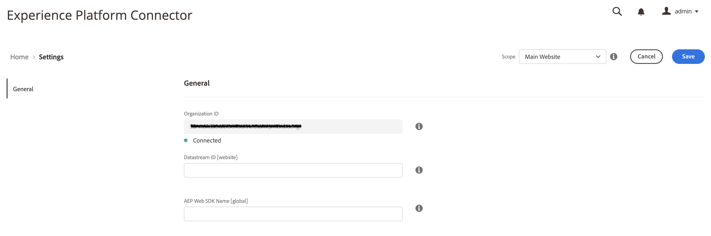

# Connettere dati Commerce a Adobe Experience Platform {#connectaep}

Per collegare l’istanza Adobe Commerce a Adobe Experience Platform, devi fornire un ID organizzazione e un ID datastream.

1. Accedi al tuo account di Adobe nel [Connettore Commerce Services](../landing/saas.md#organizationid) e seleziona l&#39;ID organizzazione.

1. Nell&#39;Admin, vai a **Sistema** > Servizi > **Connettore Experience Platform**.

1. In **Ambito** a discesa, imposta il contesto su **Sito Web**.

1. In **ID organizzazione** , viene visualizzato l’ID associato al tuo account Adobe Experience Platform, come configurato nel [Connettore Commerce Services](../landing/saas.md#organizationid). L&#39;ID organizzazione è globale. Per ogni istanza di Adobe Commerce è possibile associare un solo ID organizzazione.

1. In **ID Datastream** incolla l’ID del datastream che stai impostando [creato](https://experienceleague.adobe.com/docs/experience-platform/edge/datastreams/overview.html#create) in Adobe Experience Platform.

   >[!NOTE]
   >
   >L&#39;ambito dell&#39;ID del datastream deve essere impostato a livello di sito Web o a un livello superiore. A tale livello, lo stesso ID del datastream viene utilizzato per ogni sito web nella gerarchia. Non è possibile impostare l&#39;ambito dell&#39;ID del datastream a livello di storeview.

1. (Facoltativo) Se non hai implementato un SDK Web AEP sul tuo sito, lascia vuoto questo campo e il connettore di Experience Platform ne distribuisce uno per te. In caso contrario, aggiungi il nome del tuo AEP Web SDK.

## Descrizioni dei campi

| Campo | Descrizione |
|--- |--- |
| Ambito | Sito Web specifico in cui si desidera applicare le impostazioni di configurazione. |
| ID organizzazione (globale) | ID appartenente all’organizzazione che ha acquistato il prodotto Adobe DX. Questo ID collega la tua istanza Adobe Commerce a Adobe Experience Platform. |
| ID Datastream (sito web) | ID che consente il flusso dei dati da Adobe Experience Platform ad altri prodotti DX di Adobe. Questo ID deve essere associato a un sito web specifico all&#39;interno della tua istanza Adobe Commerce specifica. |
| Nome SDK web AEP (globale) | Se non hai implementato un SDK Web AEP sul tuo sito, lascia vuoto questo campo e il connettore di Experience Platform ne distribuisce uno per te. Se hai già implementato sul tuo sito un SDK per web AEP, specifica il nome di tale SDK in questo campo. Questo consente all’SDK di Storefront Event Collector e Storefront Event di utilizzare l’SDK per web AEP anziché la versione distribuita dal connettore Experience Platform. |

Con l’estensione del connettore di Experience Platform installata, il collegamento tra Adobe Commerce e Adobe Experience Platform creato e l’ID del Datastream specificato, i dati Commerce iniziano a scorrere fino al bordo di Adobe Experience Platform e ad altri prodotti DX di Adobe.

>[!NOTE]
>
> Il tempo necessario per il flusso dei dati dal bordo ad altri prodotti Adobe DX può variare.

## Dati di Commerce a margine

Quando i dati Commerce vengono inviati al server Edge di Adobe Experience Platform, puoi generare rapporti come segue:

_Dati di Commerce in Adobe Experience Manager_
