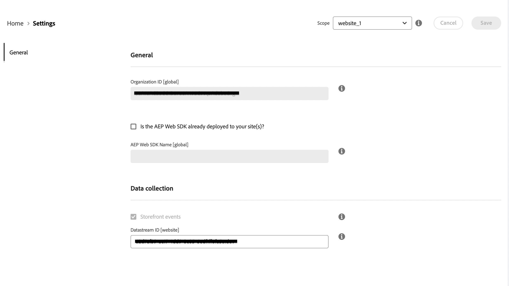
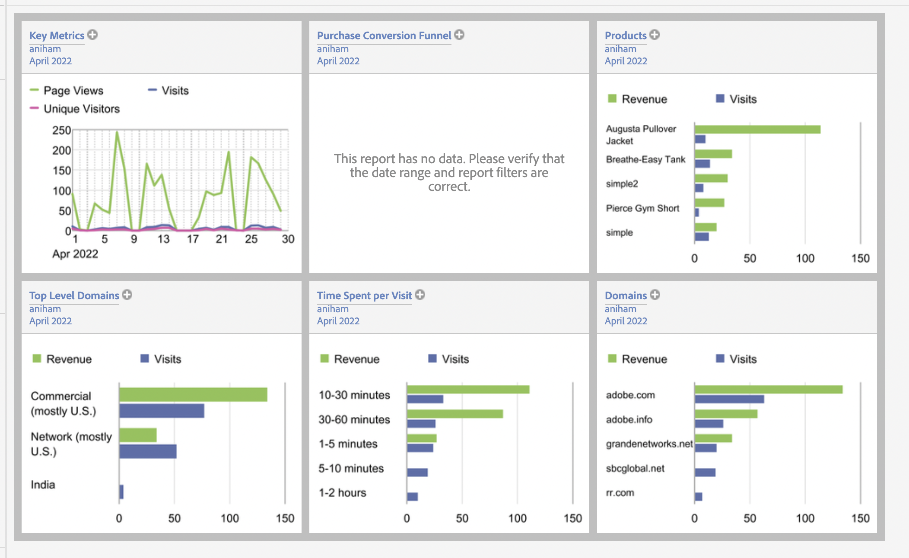

# Connettere dati Commerce a Adobe Experience Platform {#connectaep}

Per collegare l’istanza Adobe Commerce a Adobe Experience Platform, devi fornire un ID organizzazione e un ID datastream.

## Generale

1. Accedi al tuo account di Adobe nel [Connettore Commerce Services](../landing/saas.md#organizationid) e seleziona l&#39;ID organizzazione.

1. Nell&#39;Admin, vai a **Sistema** > Servizi > **Connettore Experience Platform**.

1. In **Ambito** a discesa, imposta il contesto su **Sito Web**.

1. In **ID organizzazione** , viene visualizzato l’ID associato al tuo account Adobe Experience Platform, come configurato nel [Connettore Commerce Services](../landing/saas.md#organizationid). L&#39;ID organizzazione è globale. Per ogni istanza di Adobe Commerce è possibile associare un solo ID organizzazione.

1. (Facoltativo) Se disponi già di un [AEP Web SDK (lega)](https://experienceleague.adobe.com/docs/experience-platform/edge/home.html) implementato nel sito, abilita la casella di controllo e aggiungi il nome dell&#39;SDK web AEP. In caso contrario, puoi lasciare vuoti questi campi e il connettore Experience Platform ne distribuirà uno per te.

   >[!NOTE]
   >
   >Se specifichi il tuo AEP Web SDK, il connettore di Experience Platform utilizza l’ID del datastream associato a tale SDK e non l’ID del datastream specificato in questa pagina (se presente).

## Raccolta dati

>[!NOTE]
>
>Per i commercianti già iscritti al nostro programma beta back office, vedrai una casella di controllo per abilitare gli eventi back office. Se desideri partecipare al programma beta del back office, contatta [drios@adobe.com](mailto:drios@adobe.com).

In **Raccolta dati** Specifica i tipi di dati da raccogliere e inviare al bordo Experience Platform. Per impostazione predefinita, gli eventi di vetrina vengono inviati automaticamente, purché l’SDK web AEP e l’ID organizzazione siano validi. Per ulteriori informazioni, consulta l’argomento degli eventi . [vetrina](events.md#storefront-events) e [ufficio postale](events.md#beta-order-status-events) eventi.

>[!NOTE]
>
>Tutti i campi nel **Raccolta dati** la sezione si applica al **Sito Web** ambito di applicazione o superiore.

1. Seleziona **Eventi back office** se si desidera inviare informazioni sullo stato dell&#39;ordine, ad esempio se un ordine è stato inserito, annullato, rimborsato o spedito.

   >[!NOTE]
   >
   >Per impostazione predefinita, tutti i dati del back office vengono inviati al server Edge di Experience Platform. Se un acquirente sceglie di rinunciare alla raccolta di dati, nell’Experience Platform devi impostare esplicitamente la preferenza relativa alla privacy dell’acquirente. Questo è diverso dagli eventi della vetrina in cui il raccoglitore gestisce già il consenso in base alle preferenze dell&#39;acquirente. [Ulteriori informazioni](https://experienceleague.adobe.com/docs/experience-platform/landing/governance-privacy-security/consent/adobe/dataset.html) informazioni sull&#39;impostazione delle preferenze di privacy di un acquirente nell&#39;Experience Platform.

1. (Ignora questo passaggio se utilizzi un tuo AEP Web SDK.) [Crea](https://experienceleague.adobe.com/docs/experience-platform/edge/datastreams/configure.html#create) un datastream in Adobe Experience Platform o seleziona un datastream esistente da utilizzare per la raccolta.

1. (Ignora questo passaggio se utilizzi un tuo AEP Web SDK.) In **ID Datastream** incolla l’ID del datastream nuovo o esistente.

## Descrizioni dei campi

| Campo | Descrizione |
|--- |--- |
| Ambito | Sito Web specifico in cui si desidera applicare le impostazioni di configurazione. |
| ID organizzazione (globale) | ID appartenente all’organizzazione che ha acquistato il prodotto Adobe DX. Questo ID collega la tua istanza Adobe Commerce a Adobe Experience Platform. |
| AEP Web SDK già distribuito sul sito? | Seleziona questa casella di controllo se hai implementato il tuo AEP Web SDK sul tuo sito |
| Nome SDK web AEP (globale) | Se sul sito è già stato implementato un Experience Platform Web SDK, specificane il nome in questo campo. Questo consente all’SDK per Storefront Event Collector e Storefront Event di utilizzare l’SDK per web di Experience Platform anziché la versione distribuita dal connettore Experience Platform. Se non hai implementato sul tuo sito un Experience Platform Web SDK, puoi lasciare vuoto questo campo e il connettore Experience Platform ne distribuirà uno per te. |
| Eventi Storefront | È selezionato per impostazione predefinita, purché l’ID organizzazione e l’ID del datastream siano validi. Gli eventi Storefront raccolgono dati comportamentali anonimi dai tuoi acquirenti mentre navigano sul tuo sito. |
| Eventi Back Office (Beta) | Se questa opzione è selezionata, il payload dell’evento contiene informazioni sullo stato dell’ordine anonime, ad esempio se un ordine è stato inserito, annullato, rimborsato o spedito. |
| ID Datastream (sito web) | ID che consente il flusso dei dati da Adobe Experience Platform ad altri prodotti DX di Adobe. Questo ID deve essere associato a un sito web specifico all&#39;interno della tua istanza Adobe Commerce specifica. Se specifichi un tuo Experience Platform Web SDK, non specificare un ID datastream in questo campo. Il connettore di Experience Platform utilizza l&#39;ID del datastream associato a tale SDK e ignora eventuali ID del datastream specificati in questo campo (se presenti). |

Con l’estensione del connettore di Experience Platform installata, il collegamento tra Adobe Commerce e Adobe Experience Platform creato e l’ID del Datastream specificato, i dati Commerce iniziano a scorrere fino al bordo di Adobe Experience Platform e ad altri prodotti DX di Adobe.

>[!NOTE]
>
> Il tempo necessario per il flusso dei dati dal bordo ad altri prodotti Adobe DX può variare.

## Dati di Commerce a margine

Quando i dati Commerce vengono inviati al server Edge di Adobe Experience Platform, puoi generare rapporti come segue:

_Dati di Commerce in Adobe Experience Manager_
