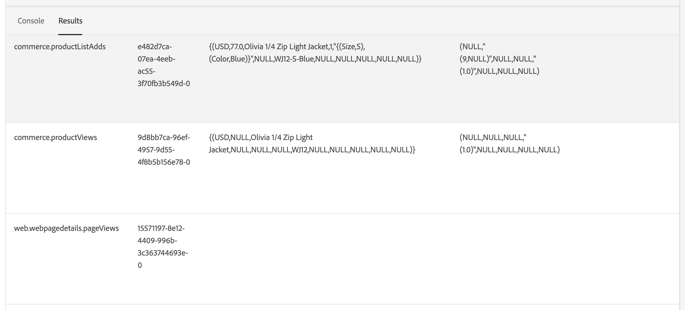

# Connettere i dati di Commerce a Adobe Experience Platform

Quando installi il connettore di Experience Platform, vengono visualizzate due nuove pagine di configurazione nel **Sistema** menu in **Servizi** in Commerce _Amministratore_.

- Connettore Commerce Services
- Connettore Experience Platform

Per collegare l’istanza di Adobe Commerce a Adobe Experience Platform, è necessario configurare entrambi i connettori, partendo dal connettore Commerce Services e terminando con il connettore di Experience Platform.

## Aggiornare il connettore Commerce Services

Se in precedenza hai installato un servizio Adobe Commerce, probabilmente hai già configurato il connettore Commerce Services. In caso contrario, è necessario completare le seguenti attività nella [Connettore Commerce Services](../landing/saas.md) pagina:

1. Accedi al tuo account Commerce per [recuperare le chiavi API di produzione e sandbox](../landing/saas.md#credentials).
1. Seleziona un [Spazio dati SaaS](../landing/saas.md#saas-configuration).
1. Accedi al tuo account Adobe per [recuperare l’ID organizzazione](../landing/saas.md#ims-organization-optional).

Dopo aver configurato il connettore Commerce Services, puoi configurare il connettore di Experience Platform.

## Aggiornare il connettore di Experience Platform

In questa sezione, connetti la tua istanza di Adobe Commerce a Adobe Experience Platform utilizzando il tuo ID organizzazione. Puoi quindi specificare il tipo di dati da inviare al server Edge di Experience Platform: vetrina e ufficio di back office.


## Generale

1. In Admin (Amministrazione), vai a **Sistema** > Servizi > **Connettore Experience Platform**.

1. Il giorno **Impostazioni** scheda in **Generale**, verifica l’ID associato al tuo account Adobe Experience Platform, come configurato in [Connettore Commerce Services](../landing/saas.md#organizationid). L’ID organizzazione è globale. È possibile associare un solo ID organizzazione per istanza di Adobe Commerce.

1. In **Ambito** , impostare il contesto su **Sito Web**.

1. (Facoltativo) Se disponi già di un’ [AEP Web SDK (lega)](https://experienceleague.adobe.com/docs/experience-platform/edge/home.html) implementato nel sito, abilita la casella di controllo e aggiungi il nome dell’SDK web AEP. In caso contrario, lascia vuoti questi campi e il connettore Experience Platform ne distribuisce uno.

   >[!NOTE]
   >
   >Se specifichi un tuo AEP Web SDK, il connettore Experience Platform utilizza l’ID dello stream di dati associato a tale SDK e non l’ID dello stream di dati specificato in questa pagina (se presente).

## Raccolta dati

In questa sezione viene specificato il tipo di dati che si desidera inviare al server Edge di Experience Platform. Esistono due tipi di dati: lato client e lato server.

I dati lato client sono dati acquisiti nella vetrina. Ciò include le interazioni con l’acquirente, come `View Page`, `View Product`, `Add to Cart`, e [elenco richieste di acquisto](events.md#b2b-events) informazioni (per gli esercenti B2B). I dati lato server, o dati di back office, sono dati acquisiti nei server Commerce. Ciò include informazioni sullo stato di un ordine, ad esempio se un ordine è stato effettuato, annullato, rimborsato, spedito o completato.

Per garantire che la tua istanza di Adobe Commerce possa iniziare la raccolta dei dati, controlla [prerequisiti](overview.md#prerequisites).

Per ulteriori informazioni sugli eventi, consulta l’argomento [vetrina](events.md#storefront-events) e [back office](events.md#back-office-events) eventi.

>[!NOTE]
>
>Tutti i campi in **Raccolta dati** sezione applicabile al **Sito Web** ambito o superiore.

1. Seleziona **Eventi vetrina** se desideri inviare dati comportamentali della vetrina.

   >[!NOTE]
   >
   >Il **Eventi vetrina** La casella di controllo viene abilitata automaticamente se AEP Web SDK e l’ID organizzazione sono validi.

1. Seleziona **Eventi back office** se si desidera inviare informazioni sullo stato dell&#39;ordine, ad esempio se un ordine è stato effettuato, annullato, rimborsato o spedito.

   >[!NOTE]
   >
   >Se si seleziona **Eventi back office**, tutti i dati di back office vengono inviati a Experience Platform Edge. Se un acquirente sceglie di rinunciare alla raccolta dei dati, devi impostare esplicitamente la preferenza relativa alla privacy dell&#39;acquirente nell&#39;Experience Platform. Questo è diverso dagli eventi di vetrina in cui l’agente di raccolta gestisce già il consenso in base alle preferenze dell’acquirente. [Ulteriori informazioni](https://experienceleague.adobe.com/docs/experience-platform/landing/governance-privacy-security/consent/adobe/dataset.html) informazioni sull&#39;impostazione delle preferenze relative alla privacy di un acquirente nell&#39;Experience Platform.

1. Per garantire l&#39;aggiornamento dei dati degli eventi di back office in base a una pianificazione in base a [cron](https://experienceleague.adobe.com/docs/commerce-admin/systems/tools/cron.html) processo, è necessario modificare il `Sales Orders Feed` indice a `Update by Schedule`.

   1. Il giorno _Amministratore_ barra laterale, vai a **[!UICONTROL System]** > _[!UICONTROL Tools]_>**[!UICONTROL Index Management]**.

   1. Seleziona la casella di controllo per il `Sales Orders Feed` indicizzatore.

   1. Imposta **[!UICONTROL Actions]** a `Update by Schedule`.

   1. Se si abilitano i dati di back office per la prima volta, eseguire i seguenti comandi per reindicizzare e attivare una risincronizzazione. Le successive risincronizzazioni si verificano automaticamente se il [cron](https://experienceleague.adobe.com/docs/commerce-admin/systems/tools/cron.html) il processo è configurato correttamente.

      ```bash
      bin/magento index:reindex sales_order_data_exporter_v2
      ```

      ```bash
      bin/magento saas:resync --feed orders
      ```

1. (Ignora questo passaggio se utilizzi un tuo AEP Web SDK personale.) [Crea](https://experienceleague.adobe.com/docs/experience-platform/edge/datastreams/configure.html#create) uno stream di dati in Adobe Experience Platform o seleziona uno stream di dati esistente da utilizzare per la raccolta.

1. (Ignora questo passaggio se utilizzi un tuo AEP Web SDK personale.) In **ID flusso di dati** incolla l’ID dello stream di dati nuovo o esistente.

## Descrizioni dei campi

| Campo | Descrizione |
|--- |--- |
| Ambito | Sito Web specifico in cui desideri applicare le impostazioni di configurazione. |
| ID organizzazione (globale) | ID che appartiene all&#39;organizzazione che ha acquistato il prodotto Adobe DX. Questo ID collega l’istanza di Adobe Commerce a Adobe Experience Platform. |
| AEP Web SDK è già distribuito sul tuo sito? | Seleziona questa casella di controllo se hai implementato il tuo AEP Web SDK sul tuo sito |
| Nome AEP Web SDK (globale) | Se hai già distribuito un Experience Platform Web SDK sul tuo sito, specifica il nome di tale SDK in questo campo. Questo consente a Storefront Event Collector e Storefront Event SDK di utilizzare il tuo Experience Platform Web SDK invece della versione distribuita dal connettore Experience Platform. Se non hai distribuito un Experience Platform Web SDK sul tuo sito, lascia vuoto questo campo e il connettore Experience Platform ne distribuisce uno. |
| Eventi vetrina | È selezionato per impostazione predefinita, purché l’ID organizzazione e l’ID dello stream di dati siano validi. Gli eventi di vetrina raccolgono dati comportamentali anonimi dai tuoi acquirenti durante la navigazione sul tuo sito. |
| Eventi di back office | Se selezionato, il payload dell’evento contiene informazioni anonime sullo stato dell’ordine, ad esempio se un ordine è stato effettuato, annullato, rimborsato o spedito. |
| ID flusso di dati (sito web) | ID che consente il flusso di dati da Adobe Experience Platform ad altri prodotti Adobe DX. Questo ID deve essere associato a un sito web specifico all’interno della tua istanza Adobe Commerce specifica. Se specifichi un Experience Platform Web SDK personalizzato, non specificare un ID dello stream di dati in questo campo. Il connettore Experience Platform utilizza l’ID dello stream di dati associato a tale SDK e ignora qualsiasi ID dello stream di dati specificato in questo campo (se presente). |

>[!NOTE]
>
>Dopo l’onboarding, i dati della vetrina iniziano a fluire verso il server Edge di Experience Platform. I dati di back office richiedono circa cinque minuti per essere visualizzati ai margini. Gli aggiornamenti successivi sono visibili sul server Edge in base alla pianificazione cron.

## (Beta) Inviare dati storici dell’ordine

>[!NOTE]
>
>Questa funzione è disponibile solo per gli utenti beta. Per partecipare alla versione beta, invia un’e-mail al seguente indirizzo: [dataconnection@adobe.com](mailto:dataconnection@adobe.com).

Adobe Commerce raccoglie fino a cinque anni di dati cronologici sugli ordini e sullo stato. Puoi utilizzare il connettore Experience Platform per inviare i dati storici all’Experience Platform per arricchire i profili dei clienti in base a tali ordini passati. I dati vengono memorizzati in un set di dati in Experience Platform.

Sebbene Commerce raccolga già i dati storici dell’ordine, è necessario completare diverse attività per inviare tali dati ad Experience Platform. Le sezioni seguenti ti guidano attraverso il processo.

### Installare la versione beta dell’ordine cronologico

Per abilitare la raccolta di dati storici sugli ordini per la versione beta, devi aggiornare la directory principale del progetto [!DNL Composer] `.json` file come segue:

1. Apri la directory principale `composer.json` file e ricerca `magento/experience-platform-connector`.

1. In `require` , aggiorna il numero di versione come segue:

   ```json
   "require": {
      ...
      "magento/experience-platform-connector": "^3.0.0-beta1",
      ...
    }
   ```

1. Per gli esercenti B2B, aggiorna il `.json` file come segue:

   ```json
   "require": {
     ...
     "magento/experience-platform-connector-b2b": "^2.0.0-beta1"
     ...
   }
   ```

1. **Salva** `composer.json`. Quindi, esegui quanto segue dalla riga di comando:

   ```bash
   composer update magento/experience-platform-connector –-with-dependencies
   ```

   oppure, per gli esercenti B2B:

   ```bash
   composer update magento/experience-platform-connector-b2b --with-dependencies
   ```

### Configurare l’ordine storico beta

Per garantire che la cronologia degli ordini dei clienti possa essere inviata ad Experience Platform, devi specificare le credenziali che collegano l’istanza Commerce ad Experience Platform. Se hai già installato e attivato [Audience Activation](https://experienceleague.adobe.com/docs/commerce-admin/customers/audience-activation.html) hai già specificato le credenziali necessarie e puoi saltare questo passaggio. La procedura seguente illustra come installare e abilitare l’estensione Audience Activation:

>[!NOTE]
>
>In questa sezione, immetti le credenziali dalla console per sviluppatori. Assicurati che il progetto della console per sviluppatori disponga del [ruoli e autorizzazioni configurati](https://experienceleague.adobe.com/docs/experience-platform/landing/platform-apis/api-authentication.html#assign-api-to-a-role).

1. Il giorno _Amministratore_ barra laterale, vai a **[!UICONTROL Stores]** > _[!UICONTROL Settings]_>**[!UICONTROL Configuration]**.

1. Espandi **[!UICONTROL Services]** e seleziona **[!UICONTROL Experience Platform Connector]**.

1. Immetti le credenziali di configurazione trovate in [console per sviluppatori](https://developer.adobe.com/console/home).

   {width="700" zoomable="yes"}

   >[!NOTE]
   >
   >Per la versione beta, Commerce utilizza le credenziali JSON Web Tokens (JWT) nella console per sviluppatori. Dopo la versione beta, Commerce utilizzerà OAuth 2.0 nella console per sviluppatori.

1. Clic **Salva configurazione**.

### Impostare il servizio di sincronizzazione ordini

Dopo aver immesso le credenziali sviluppatore, puoi impostare il servizio di sincronizzazione degli ordini. Il servizio di sincronizzazione degli ordini utilizza [Framework coda messaggi](https://developer.adobe.com/commerce/php/development/components/message-queues/) e RabbitMQ. Dopo aver completato questi passaggi, i dati sullo stato dell’ordine possono essere sincronizzati con SaaS, operazione necessaria prima dell’invio all’Experience Platform.

1. [Abilita](https://experienceleague.adobe.com/docs/commerce-cloud-service/user-guide/configure/service/rabbitmq.html) RabbitMQ.

   >[!NOTE]
   >
   >RabbitMQ è già configurato per le versioni Commerce 2.4.7 e successive, ma devi abilitare i consumatori.

1. Abilitare i consumatori della coda di messaggi in base al processo cron in `.magento.env.yaml` utilizzo `CRON_CONSUMERS_RUNNER` variabile di ambiente.

   ```yaml
      stage:
        deploy:
          CRON_CONSUMERS_RUNNER:
            cron_run: true
   ```

   >[!NOTE]
   >
   >Consulta la [documentazione sulle variabili di distribuzione](https://experienceleague.adobe.com/docs/commerce-cloud-service/user-guide/configure/env/stage/variables-deploy.html#cron_consumers_runner) per scoprire tutte le opzioni di configurazione disponibili.

Con il servizio di sincronizzazione degli ordini abilitato, puoi quindi specificare l’intervallo di date dell’ordine cronologico nella pagina del connettore Experience Platform.

### Specifica intervallo date cronologia ordini

In questa sezione viene specificato l&#39;intervallo di date per gli ordini cronologici da inviare all&#39;Experience Platform.

{width="700" zoomable="yes"}

1. In Admin (Amministrazione), vai a **Sistema** > Servizi > **Connettore Experience Platform**.

1. Seleziona la **Cronologia ordini** scheda.

1. Sotto **Sincronizzazione cronologia ordini**, immetti il **ID set di dati**. Deve essere lo stesso set di dati associato allo stream di dati specificato nella [raccolta dati](#data-collection) sopra.

   1. Per accedere all’ID del set di dati, apri l’interfaccia utente di Experience Platform e seleziona **Set di dati** nel menu di navigazione a sinistra per aprire **Set di dati** dashboard. Il dashboard elenca tutti i set di dati disponibili per l’organizzazione. Vengono visualizzati i dettagli di ciascun set di dati elencato, tra cui il nome, lo schema a cui il set di dati aderisce e lo stato dell’esecuzione dell’acquisizione più recente.
   1. Apri il set di dati associato allo stream di dati.
   1. Nel riquadro a destra vengono visualizzati i dettagli sul set di dati. Copia l’ID del set di dati.

   {width="700" zoomable="yes"}

1. In **Da** e **A** I campi specificano l’intervallo di dati per i dati cronologici dell’ordine che desideri inviare. Non puoi selezionare un intervallo di date superiore a cinque anni.

1. Seleziona [!UICONTROL Start Sync] per avviare la sincronizzazione. I dati storici dell’ordine sono dati in batch, anziché dati di vetrina e di back office che sono dati in streaming. L’invio dei dati in batch in Experience Platform richiede circa 45 minuti.

   >[!NOTE]
   >
   >Per la versione beta, se attivi una sincronizzazione più volte sullo stesso intervallo di tempo o su un intervallo di tempo sovrapposto, nel set di dati verranno visualizzati eventi duplicati.

## Conferma la raccolta dei dati dell’evento

Per confermare che i dati vengono raccolti dal tuo archivio Commerce, utilizza [Adobe Experience Platform Debugger](https://experienceleague.adobe.com/docs/experience-platform/debugger/home.html) per esaminare il tuo sito Commerce. Dopo aver confermato che i dati vengono raccolti, è possibile verificare che i dati dell&#39;evento della vetrina e del back office vengano visualizzati nella periferia eseguendo una query che restituisce i dati dalla [set di dati creato](overview.md#prerequisites).

1. Seleziona **Query** nel menu di navigazione a sinistra di Experience Platform, fai clic su [!UICONTROL Create Query].

   

1. All’apertura dell’editor delle query, immetti una query che selezioni i dati dal set di dati.

   

   Ad esempio, la query potrebbe essere simile alla seguente:

   ```sql
   SELECT * from `your_dataset_name` ORDER by TIMESTAMP DESC
   ```

1. Dopo l’esecuzione della query, i risultati vengono visualizzati nel **Risultati** accanto alla scheda **Console** scheda. Questa vista mostra l’output tabulare della query.

   

In questo esempio, puoi visualizzare i dati dell’evento dal [`commerce.productListAdds`](events.md#addtocart), [`commerce.productViews`](events.md#productpageview), [`web.webpagedetails.pageViews`](events.md#pageview)e così via. Questa vista ti consente di verificare che i dati di Commerce siano arrivati all’edge.

Se i risultati non sono quelli previsti, apri il set di dati e cerca eventuali importazioni batch non riuscite. Ulteriori informazioni su [risoluzione dei problemi relativi alle importazioni batch](https://experienceleague.adobe.com/docs/experience-platform/ingestion/batch/troubleshooting.html).
