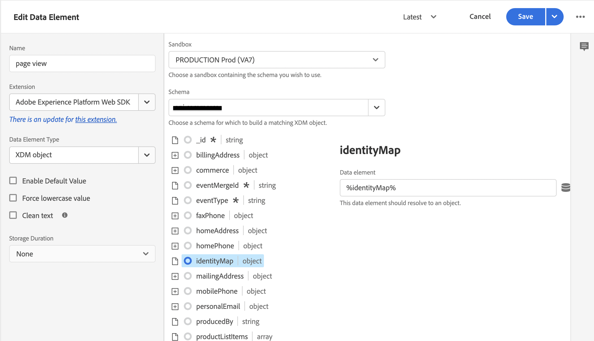
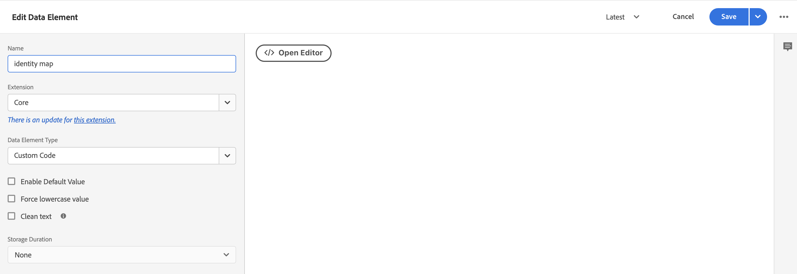
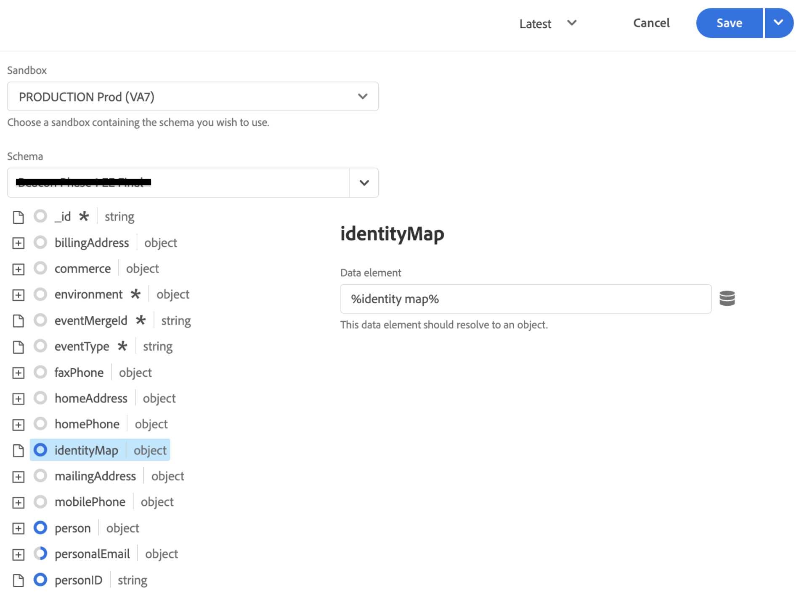

# Raccogliere dati di Commerce tramite tag Adobe Experience Platform

Anche se è possibile utilizzare il connettore Experienci Platform per pubblicare e abbonarsi a eventi storefront, alcuni commercianti potrebbero già utilizzare una soluzione di raccolta dati, ad esempio [Tag Adobe Experience Platform](https://experienceleague.adobe.com/docs/platform-learn/data-collection/tags/create-a-property.html). Per questi commercianti, Adobe Commerce fornisce un’opzione di sola pubblicazione nel connettore Experienci Platform che utilizza l’SDK Adobe Commerce Event.


_Flusso dei dati del connettore di Experience Platform con i tag_

In questo argomento, imparerai a mappare i valori dell’evento storefront forniti dal connettore Experienci Platform alla soluzione di tag Adobe Experience Platform già in uso.

## Raccogliere dati evento da Adobe Commerce

Per raccogliere i dati dell’evento Commerce:

- Installare [SDK per eventi di Adobe Commerce](https://github.com/adobe/commerce-events/tree/main/packages/commerce-events-sdk). Per le vetrine PHP, vedere [installare](install.md) argomento. Per le vetrine dei PWA Studi, vedi [Guida di PWA Studi](https://developer.adobe.com/commerce/pwa-studio/integrations/adobe-commerce/aep/).

  >[!NOTE]
  >
  > Esegui **non** [configura](connect-data.md) l’ID organizzazione e l’ID dello stream di dati.

## Mappatura dei dati della vetrina Commerce su Adobe Experience Platform

Per mappare i dati della vetrina Commerce a Adobe Experience Platform, configura e installa quanto segue dai tag di Adobe Experience Platform:

1. [Impostare una proprietà tag](https://experienceleague.adobe.com/docs/platform-learn/implement-in-websites/configure-tags/create-a-property.html) in Raccolta dati di Adobe Experience Platform.

1. Sotto **Authoring**, seleziona **Estensioni** e installare e configurare le seguenti estensioni:

   - [Adobe Client Data Layer](https://experienceleague.adobe.com/docs/experience-platform/tags/extensions/adobe/client-data-layer/overview.html)

   - [Adobe Experience Platform Web SDK](https://experienceleague.adobe.com/docs/experience-platform/edge/fundamentals/installing-the-sdk.html)

1. [Pubblica tag](https://experienceleague.adobe.com/docs/experience-platform/tags/publish/overview.html) nell&#39;ambiente di sviluppo.

1. Segui le **Mappatura degli eventi** I passaggi seguenti per configurare elementi di dati e regole per eventi specifici.

### Mappatura di eventi

Poiché la raccolta dei dati utilizzando i tag è diversa dall’utilizzo dell’SDK degli eventi di Adobe Commerce, è importante comprendere i termini equivalenti utilizzati in entrambi i framework.

| Termine dei tag Adobe Experience Platform | Termine Adobe Commerce Event SDK |
|---|---|
| _elementi dati_ | contesto |
| _regole_ | evento |
|  | _condizioni di regola_ - listener di eventi (da ACDL)<br><br>_azioni di regola_ - gestori di eventi (invia a Adobe Experience Platform) |

Quando aggiorni gli elementi dati e le regole nei tag Adobe Experience Platform con dati evento specifici per Adobe Commerce, puoi adottare alcuni passaggi comuni.

Ad esempio, aggiungiamo l’Adobe Commerce `signOut` ai tag di Adobe Experience Platform. I passaggi descritti di seguito, fatta eccezione per i valori specifici impostati, descrivono come aggiungere [elementi dati](https://experienceleague.adobe.com/docs/experience-platform/collection/e2e.html#data-element) e [regole](https://experienceleague.adobe.com/docs/experience-platform/collection/e2e.html#create-a-rule), applicabili a tutti gli eventi Adobe Commerce che stai aggiungendo ai tag.

1. Creare un elemento dati:

   
   _Creare un nuovo elemento dati_

1. Imposta **Nome** a `sign out`.

1. Imposta **Estensione** a `Adobe Experience Platform Web SDK`.

1. Imposta **Tipo di elemento dati** a `XDM object`.

1. Seleziona la **Sandbox** e **Schema** che desideri aggiornare.

1. Sotto **userAccount** > **logout**, imposta **valore** in **Disconnessione visitatore** a `1`.

   
   _Aggiorna valore disconnessione_

1. Seleziona **Salva**.

1. Crea una regola:

   
   _Crea nuova regola_

1. Seleziona **Aggiungi** in **EVENTI**.

1. Imposta **Estensione** a `Adobe Client Data Layer`.

1. Imposta **Tipo di evento** a `Data Pushed`.

1. Seleziona **Evento specifico** e imposta **Evento/Chiave per cui registrarsi** a `sign-out`.

1. Seleziona **Mantieni modifiche** per salvare la nuova regola.

1. Aggiungi un’azione.

1. Imposta **Estensione** a `Adobe Experience Platform Web SDK`.

1. Imposta **Tipo di azione** a `Send Event`.

1. Imposta **Istanza** a `Alloy`.

1. Imposta **Tipo** a `userAccount.logout`.

1. Imposta **Dati XDM** a `%sign out%`.

1. Clic **Salva**.

   Hai creato un elemento dati nello schema per il `signOut` da Adobe Commerce. Inoltre, hai creato una regola con un’azione specifica che deve verificarsi quando l’evento viene attivato dalla vetrina Adobe Commerce.

Ripeti i passaggi precedenti nei tag per ciascuno degli eventi Adobe Commerce descritti di seguito.

## Eventi disponibili

Per ciascuno dei seguenti eventi, mappa gli eventi Adobe Commerce nel tuo XDM seguendo i passaggi precedenti.

- [&#39;signOut&#39;](#signout)
- [&quot;signIn&quot;](#signin)
- [&quot;createAccount&quot;](#createaccount)
- [&quot;editAccount&quot;](#editaccount)
- [&quot;pageView&quot;](#pageview)
- [&quot;productView&quot;](#productview)
- [&quot;searchRequestSent&quot;](#searchrequestsent)
- [&quot;searchResponseReceived&quot;](#searchresponsereceived)
- [&quot;addToCart&quot;](#addtocart)
- [&quot;openCart&quot;](#opencart)
- [&#39;viewCart&#39;](#viewcart)
- [&quot;removeFromCart&quot;](#removefromcart)
- [&quot;beginCheckout&quot;](#initiatecheckout)
- [&quot;placeOrder&quot;](#placeorder)

### disconnetti

Attivazione quando un acquirente tenta di uscire.

#### Elementi dati

Crea il seguente elemento dati:

1. Esci:

   - **Nome**: `Sign out`
   - **Estensione**: `Adobe Experience Platform Web SDK`
   - **Tipo di elemento dati**: `XDM object`
   - **Gruppo di campi**: `userAccount` > `logout`
   - **Disconnessione visitatore**: **Valore** = `1`

#### Regole 

- **Nome**: `Sign out`
- **Estensione**: `Adobe Client Data Layer`
- **Tipo di evento**: `Data Pushed`
- **Evento specifico**: `sign-out`

##### Azioni

- **Estensione**: `Adobe Experience Platform Web SDK`
- **Tipo di azione**: `Send event`
- **Tipo**: `userAccount.logout`
- **Dati XDM**: `%sign-out%`

### signIn

Attivazione quando un acquirente tenta di accedere.

#### Elementi dati

Crea i seguenti elementi dati:

1. E-mail account:

   - **Nome**: `account email`
   - **Estensione**: `Adobe Client Data Layer`
   - **Tipo di elemento dati**: `Data Layer Computed State`
   - **[Facoltativo] percorso**: `accountContext.emailAddress`

1. Tipo di account:

   - **Nome**: `account type`
   - **Estensione**: `Adobe Client Data Layer`
   - **Tipo di elemento dati**: `Data Layer Computed State`
   - **[Facoltativo] percorso**: `accountContext.accountType`

1. ID account:

   - **Nome**: `account id`
   - **Estensione**: `Adobe Client Data Layer`
   - **Tipo di elemento dati**: `Data Layer Computed State`
   - **[Facoltativo] percorso***: `accountContext.accountId`

1. Accedi:

   - **Nome**: `sign in`
   - **Estensione**: `Adobe Experience Platform Web SDK`
   - **Tipo di elemento dati**: `XDM object`
   - **Gruppo di campi**: `person` > `accountID`
   - **ID account**: **Valore** = `%account id%`
   - **Gruppo di campi**: `person` > `accountType`
   - **Tipo di account**: **Valore** = `%account type%`
   - **Gruppo di campi**: `person` > `personalEmailID`
   - **Indirizzo e-mail personale**: **Valore** = `%account email%`
   - **Gruppo di campi**: `personalEmail` > `address`
   - **Indirizzo**: **Valore** = `%account email%`
   - **Gruppo di campi**: `userAccount` > `login`
   - **Accesso visitatore**: **Valore** = `1`

#### Regole 

- **Nome**: `sign in`
- **Estensione**: `Adobe Client Data Layer`
- **Tipo di evento**: `Data Pushed`
- **Evento specifico**: `sign-in`

##### Azioni

- **Estensione**: `Adobe Experience Platform Web SDK`
- **Tipo di azione**: `Send event`
- **Tipo**: `userAccount.login`
- **Dati XDM**: `%sign in%`

### createAccount

Attivazione quando un acquirente tenta di creare un account.

#### Elementi dati

Crea i seguenti elementi dati:

1. E-mail account:

   - **Nome**: `account email`
   - **Estensione**: `Adobe Client Data Layer`
   - **Tipo di elemento dati**: `Data Layer Computed State`
   - **[Facoltativo] percorso**: `accountContext.emailAddress`

1. Tipo di account:

   - **Nome**: `account type`
   - **Estensione**: `Adobe Client Data Layer`
   - **Tipo di elemento dati**: `Data Layer Computed State`
   - **[Facoltativo] percorso**: `accountContext.accountType`

1. ID account:

   - **Nome**: `account id`
   - **Estensione**: `Adobe Client Data Layer`
   - **Tipo di elemento dati**: `Data Layer Computed State`
   - **[Facoltativo] percorso**: `accountContext.accountId`

1. Crea account:

   - **Nome**: `Create account`
   - **Estensione**: `Adobe Experience Platform Web SDK`
   - **Tipo di elemento dati**: `XDM object`
   - **Gruppo di campi**: `person` > `accountID`
   - **ID account**: **Valore** = `%account id%`
   - **Gruppo di campi**: `person` > `accountType`
   - **Tipo di account**: **Valore** = `%account type%`
   - **Gruppo di campi**: `person` > `personalEmailID`
   - **Indirizzo e-mail personale**: **Valore** = `%account email%`
   - **Gruppo di campi**: `personalEmail` > `address`
   - **Indirizzo**: **Valore** = `%account email%`
   - **Gruppo di campi**: `userAccount` > `createProfile`
   - **Creazione profilo account**: **Valore** = `1`

#### Regole 

- **Nome**: `Create account`
- **Estensione**: `Adobe Client Data Layer`
- **Tipo di evento**: `Data Pushed`
- **Evento specifico**: `create-account`

##### Azioni

- **Estensione**: `Adobe Experience Platform Web SDK`
- **Tipo di azione**: `Send event`
- **Tipo**: `userAccount.createProfile`
- **Dati XDM**: `%create account%`

### editAccount

Attivazione quando un acquirente tenta di modificare un account.

#### Elementi dati

Crea i seguenti elementi dati:

1. E-mail account:

   - **Nome**: `account email`
   - **Estensione**: `Adobe Client Data Layer`
   - **Tipo di elemento dati**: `Data Layer Computed State`
   - **[Facoltativo] percorso**: `accountContext.emailAddress`

1. Tipo di account:

   - **Nome**: `account type`
   - **Estensione**: `Adobe Client Data Layer`
   - **Tipo di elemento dati**: `Data Layer Computed State`
   - **[Facoltativo] percorso**: `accountContext.accountType`

1. ID account:

   - **Nome**: `account id`
   - **Estensione**: `Adobe Client Data Layer`
   - **Tipo di elemento dati**: `Data Layer Computed State`
   - **[Facoltativo] percorso**: `accountContext.accountId`

1. Modifica account:

   - **Nome**: `Edit account`
   - **Estensione**: `Adobe Experience Platform Web SDK`
   - **Tipo di elemento dati**: `XDM object`
   - **Gruppo di campi**: `person` > `accountID`
   - **ID account**: **Valore** = `%account id%`
   - **Gruppo di campi**: `person` > `accountType`
   - **Tipo di account**: **Valore** = `%account type%`
   - **Gruppo di campi**: `person` > `personalEmailID`
   - **Indirizzo e-mail personale**: **Valore** = `%account email%`
   - **Gruppo di campi**: `personalEmail` > `address`
   - **Indirizzo**: **Valore** = `%account email%`
   - **Gruppo di campi**: `userAccount` > `updateProfile`
   - **Creazione profilo account**: **Valore** = `1`

#### Regole

- **Nome**: `Edit account`
- **Estensione**: `Adobe Client Data Layer`
- **Tipo di evento**: `Data Pushed`
- **Evento specifico**: `edit-account`

##### Azioni

- **Estensione**: `Adobe Experience Platform Web SDK`
- **Tipo di azione**: `Send event`
- **Tipo**: `userAccount.updateProfile`
- **Dati XDM**: `%edit account%`

### pageView

Attivazione al caricamento di qualsiasi pagina.

#### Elementi dati

Crea i seguenti elementi dati:

1. Nome pagina:

   - **Nome**: `page name`
   - **Estensione**: `Adobe Client Data Layer`
   - **Tipo di elemento dati**: `Data Layer Computed State`
   - **[Facoltativo] percorso**: `pageContext.pageName`

#### Regole 

- **Nome**: `page view`
- **Estensione**: `Adobe Client Data Layer`
- **Tipo di evento**: `Data Pushed`
- **Evento specifico**: `page-view`

##### Azioni

- **Estensione**: `Adobe Experience Platform Web SDK`
- **Tipo di azione**: `Send event`
- **Tipo**: `web.webPageDetails.pageViews`
- **Dati XDM**: `%page view%`

### productView

Attivazione al caricamento di qualsiasi pagina di prodotto.

#### Elementi dati

Crea i seguenti elementi dati:

1. Nome prodotto:

   - **Nome**: `product name`
   - **Estensione**: `Adobe Client Data Layer`
   - **Tipo di elemento dati**: `Data Layer Computed State`
   - **[Facoltativo] percorso**: `productContext.name`

1. SKU prodotto:

   - **Nome**: `product sku`
   - **Estensione**: `Adobe Client Data Layer`
   - **Tipo di elemento dati**: `Data Layer Computed State`
   - **[Facoltativo] percorso**: `productContext.sku`

1. URL immagine prodotto:

   - **Nome**: `product image`
   - **Estensione**: `Adobe Client Data Layer`
   - **Tipo di elemento dati**: `Data Layer Computed State`
   - **[Facoltativo] percorso**: `productContext.mainImageUrl`

1. Valuta prodotto:

   - **Nome**: `product currency`
   - **Estensione**: `Adobe Client Data Layer`
   - **Tipo di elemento dati**: `Data Layer Computed State`
   - **[Facoltativo] percorso**: `productContext.pricing.currencyCode`

1. Codice valuta:

   - **Nome**: `currency code`
   - **Estensione**: `Core`
   - **Tipo di elemento dati**: `Custom Code`
   - **Apri editor**:

   ```bash
   return _satellite.getVar('product currency') || _satellite.getVar('storefront').storeViewCurrencyCode
   ```

1. Prezzo speciale:

   - **Nome**: `special price`
   - **Estensione**: `Adobe Client Data Layer`
   - **Tipo di elemento dati**: `Data Layer Computed State`
   - **[Facoltativo] percorso**: `productContext.pricing.specialPrice`

1. Prezzo normale:

   - **Nome**: `regular price`
   - **Estensione**: `Adobe Client Data Layer`
   - **Tipo di elemento dati**: `Data Layer Computed State`
   - **[Facoltativo] percorso**: `productContext.pricing.regularPrice`

1. Prezzo del prodotto:

   - **Nome**: `product price`
   - **Estensione**: `Core`
   - **Tipo di elemento dati**: `Custom Code`
   - **Apri editor**:

   ```bash
   return _satellite.getVar('product regular price') || _satellite.getVar('product special price')
   ```

1. Visualizzazione prodotto:

   - **Nome**: `product view`
   - **Estensione**: `Adobe Experience Platform Web SDK`
   - **Tipo di elemento dati**: `XDM object`
   - **Gruppo di campi**: `productListItems`. Seleziona **Fornisci singoli elementi** e fai clic su **Aggiungi elemento** pulsante. Poiché questa vista è destinata a un PDP, è possibile compilare con un singolo elemento.
   - **Gruppo di campi**: `productListItems` > `name`
   - **Nome**: **Valore** = `%product name%`
   - **Gruppo di campi**: `productListItems` > `SKU`
   - **SKU**: **Valore** = `%product sku%`
   - **Gruppo di campi**: `productListItems` > `priceTotal`
   - **Prezzo totale**: **Valore** = `%product price%`
   - **Gruppo di campi**: `productListItems` > `currencyCode`
   - **Codice valuta**: **Valore** = `%currency code%`
   - **Gruppo di campi**: `productListItems` > `ProductImageUrl`
   - **ProductImageUrl**: **Valore** = `%product image%`
   - **Gruppo di campi**: `commerce` > `productViews` > `value`
   - **valore**: **Valore** = `1`

#### Regole 

- **Nome**: `product view`
- **Estensione**: `Adobe Client Data Layer`
- **Tipo di evento**: `Data Pushed`
- **Evento specifico**: `product-page-view`

##### Azioni

- **Estensione**: `Adobe Experience Platform Web SDK`
- **Tipo di azione**: `Send event`
- **Tipo**: `commerce.productViews`
- **Dati XDM**: `%product view%`

### searchRequestSent

Attivazione da eventi nel popover &quot;cerca durante la digitazione&quot; e da eventi nelle pagine dei risultati di ricerca.

#### Elementi dati

Crea i seguenti elementi dati:

1. Cerca input

   - **Nome**: `search input`
   - **Estensione**: `Adobe Client Data Layer`
   - **Tipo di elemento dati**: `Data Layer Computed State`
   - **[Facoltativo] percorso**: `searchInputContext.units[0]`

1. Cerca frase di input

   - **Nome**: `search input phrase`
   - **Estensione**: `Core`
   - **Tipo di elemento dati**: `Custom Code`
   - **Apri editor**:

   ```bash
   return _satellite.getVar('search input').phrase;
   ```

1. Cerca ordinamento input

   - **Nome**: `search input sort`
   - **Estensione**: `Core`
   - **Tipo di elemento dati**: `Custom Code`
   - **Apri editor**:

   ```bash
   const searchInput = _satellite.getVar('search input');
   const sortFromInput = searchInput ? searchInput.sort : [];
   const sort = sortFromInput.map((searchSort) => {
       return {
           attribute: searchSort.attribute,
           order: searchSort.direction,
       };
   });
   return sort;
   ```

1. Cerca filtri di input

   - **Nome**: `search input filters`
   - **Estensione**: `Core`
   - **Tipo di elemento dati**: `Custom Code`
   - **Apri editor**:

   ```bash
   const searchInput = _satellite.getVar('search input');
   const filtersFromInput = searchInput ? searchInput.filter : [];
   const filters = filtersFromInput.map(
       (searchFilter) => {
           let value = [];
           let isRange = false;
           if (searchFilter.eq) {
               value.push(searchFilter.eq);
           } else if (searchFilter.in) {
               value = searchFilter.in;
           } else if (searchFilter.range) {
               isRange = true;
               value.push(String(searchFilter.range.from));
               value.push(String(searchFilter.range.to));
           }
           return {
               attribute: searchFilter.attribute,
               value,
               isRange,
           };
       }
   );
   
   return filters;
   ```

1. Richiesta di ricerca:

   - **Nome**: `search request`
   - **Estensione**: `Adobe Experience Platform Web SDK`
   - **Tipo di elemento dati**: `XDM object`
   - **Gruppo di campi**: `siteSearch` > `phrase`
   - **valore**: non ancora disponibile
   - **Gruppo di campi**: `siteSearch` > `sort`. Seleziona **Fornisci l&#39;intero oggetto**.
   - **Gruppo di campi**: `siteSearch` > `filter`. Seleziona **Fornisci l&#39;intero oggetto**.
   - **Gruppo di campi**: `searchRequest` > `id`
   - **Identificatore univoco**: **Valore** = `%search request ID%`
   - **Gruppo di campi**: `searchRequest` > `value`
   - **valore**: **Valore** = `1`

#### Regole 

- **Nome**: `search request sent`
- **Estensione**: `Adobe Client Data Layer`
- **Tipo di evento**: `Data Pushed`
- **Evento specifico**: `search-request-sent`

##### Azioni

- **Estensione**: `Adobe Experience Platform Web SDK`
- **Tipo di azione**: `Send event`
- **Tipo**: `searchRequest`
- **Dati XDM**: `%search request%`

### searchResponseReceived

Attivazione quando Live Search restituisce i risultati per la pagina dei risultati di ricerca o popover &quot;cerca durante la digitazione&quot;.

#### Elementi dati

Crea i seguenti elementi dati:

1. Risultati ricerca:

   - **Nome**: `search results`
   - **Estensione**: `Adobe Client Data Layer`
   - **Tipo di elemento dati**: `Data Layer Computed State`
   - **[Facoltativo] percorso**: `searchResultsContext.units[0]`

1. Numero di risultati della ricerca:

   - **Nome**: `search result number of products`
   - **Estensione**: `Core`
   - **Tipo di elemento dati**: `Custom Code`
   - **Apri editor**:

   ```bash
   return _satellite.getVar('search result').products.length;
   ```

1. Prodotti dei risultati di ricerca:

   - **Nome**: `search result products`
   - **Estensione**: `Core`
   - **Tipo di elemento dati**: `Custom Code`
   - **Apri editor**:

   ```bash
   const searchResult = _satellite.getVar('search result');
   const productsFromResult = searchResult.products ? searchResult.products : [];
   const products = productsFromResult.map(
       (product) => {
           return { SKU: product.sku, name: product.name };
       }
   );
   return products;
   ```

1. Suggerimenti risultati ricerca:

   - **Nome**: `search result products`
   - **Estensione**: `Core`
   - **Tipo di elemento dati**: `Custom Code`
   - **Apri editor**:

   ```bash
   const searchResult = _satellite.getVar('search result');
   const suggestionsFromResult = searchResult.suggestions ? searchResult.suggestions : [];
   const suggestions = suggestionsFromResult.map((suggestion) => suggestion.suggestion);
   return suggestions;
   ```

1. URL immagine prodotto:

   - **Nome**: `product image`
   - **Estensione**: `Adobe Client Data Layer`
   - **Tipo di elemento dati**: `Data Layer Computed State`
   - **[Facoltativo] percorso**: `productContext.mainImageUrl`

1. Risposta di ricerca:

   - **Nome**: `search response`
   - **Estensione**: `Adobe Experience Platform Web SDK`
   - **Tipo di elemento dati**: `XDM object`
   - **Gruppo di campi**: `siteSearch` > `suggestions`. Seleziona **Fornisci l&#39;intero oggetto**.
   - **Elemento dati**: `%search result suggestions%`
   - **Gruppo di campi**: `siteSearch` > `numberOfResults`
   - **valore**: `%search result number of products%`
   - **Gruppo di campi**: `productListItems`. Seleziona **Fornisci l&#39;intero oggetto**.
   - **Gruppo di campi**: `productListItems` > `ProductImageUrl`
   - **ProductImageUrl**: **Valore** = `%product image%`
   - **Elemento dati**: `%search result products%`
   - **Gruppo di campi**: `searchResponse` > `id`
   - **Identificatore univoco**: **Valore** = `%search response ID%`
   - **Gruppo di campi**: `searchResponse` > `value`
   - **valore**: **Valore** = `1`

#### Regole 

- **Nome**: `search response received`
- **Estensione**: `Adobe Client Data Layer`
- **Tipo di evento**: `Data Pushed`
- **Evento specifico**: `search-response-received`

##### Azioni

- **Estensione**: `Adobe Experience Platform Web SDK`
- **Tipo di azione**: `Send event`
- **Tipo**: `searchResponse`
- **Dati XDM**: `%search response%`

### addToCart

Attivazione quando un prodotto viene aggiunto a un carrello o ogni volta che la quantità di un prodotto nel carrello viene incrementata.

#### Elementi dati

Crea i seguenti elementi dati:

1. Nome prodotto:

   - **Nome**: `product name`
   - **Estensione**: `Adobe Client Data Layer`
   - **Tipo di elemento dati**: `Data Layer Computed State`
   - **[Facoltativo] percorso**: `productContext.name`

1. SKU prodotto:

   - **Nome**: `product sku`
   - **Estensione**: `Adobe Client Data Layer`
   - **Tipo di elemento dati**: `Data Layer Computed State`
   - **[Facoltativo] percorso**: `productContext.sku`

1. Codice valuta:

   - **Nome**: `currency code`
   - **Estensione**: `Adobe Client Data Layer`
   - **Tipo di elemento dati**: `Data Layer Computed State`
   - **[Facoltativo] percorso**: `productContext.pricing.currencyCode`

1. Prezzo speciale del prodotto:

   - **Nome**: `product special price`
   - **Estensione**: `Adobe Client Data Layer`
   - **Tipo di elemento dati**: `Data Layer Computed State`
   - **[Facoltativo] percorso**: `productContext.pricing.specialPrice`

1. URL immagine prodotto:

   - **Nome**: `product image`
   - **Estensione**: `Adobe Client Data Layer`
   - **Tipo di elemento dati**: `Data Layer Computed State`
   - **[Facoltativo] percorso**: `productContext.mainImageUrl`

1. Prezzo normale del prodotto:

   - **Nome**: `product regular price`
   - **Estensione**: `Adobe Client Data Layer`
   - **Tipo di elemento dati**: `Data Layer Computed State`
   - **[Facoltativo] percorso**: `productContext.pricing.regularPrice`

1. Prezzo del prodotto:

   - **Nome**: `product price`
   - **Estensione**: `Core`
   - **Tipo di elemento dati**: `Custom Code`
   - **Apri editor**:

   ```bash
   return _satellite.getVar('product regular price') || _satellite.getVar('product special price') 
   ```

1. Carrello:

   - **Nome**: `cart`
   - **Estensione**: `Adobe Client Data Layer`
   - **Tipo di elemento dati**: `Data Layer Computed State`
   - **[Facoltativo] percorso**: `shoppingCartContext`

1. ID carrello:

   - **Nome**: `cart id`
   - **Estensione**: `Core`
   - **Tipo di elemento dati**: `Custom Code`
   - **Apri editor**:

   ```bash
   return _satellite.getVar('cart').id
   ```

1. Aggiungi al carrello:

   - **Nome**: `add to cart`
   - **Estensione**: `Adobe Experience Platform Web SDK`
   - **Tipo di elemento dati**: `XDM object`
   - **Gruppo di campi**: `productListItems`. Seleziona **Fornisci singoli elementi** e fai clic su **Aggiungi elemento** pulsante. Poiché questa vista è destinata a un PDP, è possibile compilare con un singolo elemento.
   - **Gruppo di campi**: `productListItems` > `name`
   - **Nome**: **Valore** = `%product name%`
   - **Gruppo di campi**: `productListItems` > `SKU`
   - **SKU**: **Valore** = `%product sku%`
   - **Gruppo di campi**: `productListItems` > `priceTotal`
   - **Prezzo totale**: **Valore** = `%product price%`
   - **Gruppo di campi**: `productListItems` > `currencyCode`
   - **Gruppo di campi**: `productListItems` > `ProductImageUrl`
   - **ProductImageUrl**: **Valore** = `%product image%`
   - **Codice valuta**: **Valore** = `%currency code%`
   - **Gruppo di campi**: `commerce` > `cart` > `cartID`
   - **ID carrello**: **Valore** = `%cart id%`
   - **Gruppo di campi**: `commerce` > `productListAdds` > `value`
   - **valore**: **Valore** = `1`

#### Regole 

- **Nome**: `add to cart`
- **Estensione**: `Adobe Client Data Layer`
- **Tipo di evento**: `Data Pushed`
- **Evento specifico**: `add-to-cart`

##### Azioni

- **Estensione**: `Adobe Experience Platform Web SDK`
- **Tipo di azione**: `Send event`
- **Tipo**: `commerce.productListAdds`
- **Dati XDM**: `%add to cart%`

### openCart

Attivazione quando viene creato un nuovo carrello, che si verifica quando un prodotto viene aggiunto a un carrello vuoto.

#### Elementi dati

Crea il seguente elemento dati:

1. Apri carrello:

   - **Nome**: `open cart`
   - **Estensione**: `Adobe Experience Platform Web SDK`
   - **Tipo di elemento dati**: `XDM object`
   - **Gruppo di campi**: `commerce` > `productListOpens` > `value`
   - **valore**: **Valore** = `1`
   - **Gruppo di campi**: `commerce` > `cart` > `cartID`
   - **ID carrello**: **Valore** = `%cart id%`
   - **Gruppo di campi**: `productListItems`. Per `productListItems`, è possibile precalcolare più elementi. Seleziona **productListItems** > **Fornire l&#39;intero array**.

#### Regole 

- **Nome**: `open cart`
- **Estensione**: `Adobe Client Data Layer`
- **Tipo di evento**: `Data Pushed`
- **Evento specifico**: `open-cart`

##### Azioni

- **Estensione**: `Adobe Experience Platform Web SDK`
- **Tipo di azione**: `Send event`
- **Tipo**: `commerce.productListOpens`
- **Dati XDM**: `%open cart%`

### viewCart

Attivazione al caricamento di qualsiasi pagina del carrello.

#### Elementi dati

Crea i seguenti elementi dati:

1. Vetrina:

   - **Nome**: `storefront`
   - **Estensione**: `Adobe Client Data Layer`
   - **Tipo di elemento dati**: `Data Layer Computed State`
   - **[Facoltativo] percorso**: `storefrontInstanceContext`

1. URL immagine prodotto:

   - **Nome**: `product image`
   - **Estensione**: `Adobe Client Data Layer`
   - **Tipo di elemento dati**: `Data Layer Computed State`
   - **[Facoltativo] percorso**: `productContext.mainImageUrl`

   1. Carrello:

   - **Nome**: `cart`
   - **Estensione**: `Adobe Client Data Layer`
   - **Tipo di elemento dati**: `Data Layer Computed State`
   - **[Facoltativo] percorso**: `shoppingCartContext`

1. ID carrello:

   - **Nome**: `cart id`
   - **Estensione**: `Core`
   - **Tipo di elemento dati**: `Custom Code`
   - **Apri editor**:

   ```bash
   return _satellite.getVar('cart').id
   ```

1. Elementi elenco prodotti:

   - **Nome**: `product list items:`
   - **Estensione**: `Core`
   - **Tipo di elemento dati**: `Custom Code`
   - **Apri editor**:

   ```bash
   const storefrontContext = _satellite.getVar('storefront');
   const cart = _satellite.getVar('cart');
   
   const returnList = [];
   cart.items.forEach(item => {
       const selectedOptions = [];
       item.configurableOptions?.forEach(option => {
           selectedOptions.push({
               attribute: option.optionLabel,
               value: option.valueLabel,
           });
       });
   
       const productListItem = {
           SKU: item.product.sku,
           name: item.product.name,
           quantity: item.quantity,
           priceTotal: item.prices.price.value * item.quantity,
           currencyCode: item.prices.price.currency ? item.prices.price.currency : storefrontContext.storeViewCurrencyCode,
           selectedOptions: selectedOptions,
       };
   
       returnList.push(productListItem);
   });
   return returnList;
   ```

1. Visualizza carrello:

   - **Nome**: `view cart`
   - **Estensione**: `Adobe Experience Platform Web SDK`
   - **Tipo di elemento dati**: `XDM object`
   - **Gruppo di campi**: `productListItems`. Per `productListItems`, possono essere presenti più elementi precalcolati. Seleziona **productListItems** > **Popolare l’intero array**.
   - **Elemento dati**: `%product list items%`
   - **Gruppo di campi**: `productListItems` > `ProductImageUrl`
   - **ProductImageUrl**: **Valore** = `%product image%`
   - **Gruppo di campi**: `commerce` > `cart` > `cartID`
   - **ID carrello**: **Valore** = `%cart id%`
   - **Gruppo di campi**: `commerce` > `productListViews` > `value`
   - **valore**: **Valore** = `1`

#### Regole

- **Nome**: `view cart`
- **Estensione**: `Adobe Client Data Layer`
- **Tipo di evento**: `Data Pushed`
- **Evento specifico**: `shopping-cart-view`

##### Azioni

- **Estensione**: `Adobe Experience Platform Web SDK`
- **Tipo di azione**: `Send event`
- **Tipo**: `commerce.productListViews`
- **Dati XDM**: `%view cart%`

### removeFromCart

Attivazione quando un prodotto viene rimosso da un carrello o ogni volta che la quantità di un prodotto nel carrello viene diminuita.

#### Elementi dati

Crea i seguenti elementi dati:

1. Nome prodotto:

   - **Nome**: `product name`
   - **Estensione**: `Adobe Client Data Layer`
   - **Tipo di elemento dati**: `Data Layer Computed State`
   - **[Facoltativo] percorso**: `productContext.name`

1. SKU prodotto:

   - **Nome**: `product sku`
   - **Estensione**: `Adobe Client Data Layer`
   - **Tipo di elemento dati**: `Data Layer Computed State`
   - **[Facoltativo] percorso**: `productContext.sku`

1. Codice valuta:

   - **Nome**: `currency code`
   - **Estensione**: `Adobe Client Data Layer`
   - **Tipo di elemento dati**: `Data Layer Computed State`
   - **[Facoltativo] percorso**: `productContext.pricing.currencyCode`

1. Prezzo speciale del prodotto:

   - **Nome**: `product special price`
   - **Estensione**: `Adobe Client Data Layer`
   - **Tipo di elemento dati**: `Data Layer Computed State`
   - **[Facoltativo] percorso**: `productContext.pricing.specialPrice`

1. Prezzo normale del prodotto:

   - **Nome**: `product regular price`
   - **Estensione**: `Adobe Client Data Layer`
   - **Tipo di elemento dati**: `Data Layer Computed State`
   - **[Facoltativo] percorso**: `productContext.pricing.regularPrice`

1. Prezzo del prodotto:

   - **Nome**: `product price`
   - **Estensione**: `Core`
   - **Tipo di elemento dati**: `Custom Code`
   - **Apri editor**:

   ```bash
   return _satellite.getVar('product regular price') || _satellite.getVar('product special price') 
   ```

1. Carrello:

   - **Nome**: `cart`
   - **Estensione**: `Adobe Client Data Layer`
   - **Tipo di elemento dati**: `Data Layer Computed State`
   - **[Facoltativo] percorso**: `shoppingCartContext`

1. ID carrello:

   - **Nome**: `cart id`
   - **Estensione**: `Core`
   - **Tipo di elemento dati**: `Custom Code`
   - **Apri editor**:

   ```bash
   return _satellite.getVar('cart').id
   ```

1. Rimuovi dal carrello:

   - **Nome**: `remove from cart`
   - **Estensione**: `Adobe Experience Platform Web SDK`
   - **Tipo di elemento dati**: `XDM object`
   - **Gruppo di campi**: `productListItems`. Seleziona **Fornisci singoli elementi** e fai clic su **Aggiungi elemento** pulsante. Poiché questa vista è destinata a un PDP, è possibile compilare con un singolo elemento.
   - **Gruppo di campi**: `productListItems` > `name`
   - **Nome**: **Valore** = `%product name%`
   - **Gruppo di campi**: `productListItems` > `SKU`
   - **SKU**: **Valore** = `%product sku%`
   - **Gruppo di campi**: `productListItems` > `priceTotal`
   - **Prezzo totale**: **Valore** = `%product price%`
   - **Gruppo di campi**: `productListItems` > `currencyCode`
   - **Codice valuta**: **Valore** = `%currency code%`
   - **Gruppo di campi**: `commerce` > `cart` > `cartID`
   - **ID carrello**: **Valore** = `%cart id%`
   - **Gruppo di campi**: `commerce` > `productListRemovals` > `value`
   - **valore**: **Valore** = `1`

#### Regole 

- **Nome**: `remove from cart`
- **Estensione**: `Adobe Client Data Layer`
- **Tipo di evento**: `Data Pushed`
- **Evento specifico**: `remove-from-cart`

##### Azioni

- **Estensione**: `Adobe Experience Platform Web SDK`
- **Tipo di azione**: `Send event`
- **Tipo**: `commerce.productListRemovals`
- **Dati XDM**: `%remove from cart%`

### beginCheckout

Attivazione quando l&#39;acquirente fa clic su un pulsante di pagamento.

#### Elementi dati

Crea i seguenti elementi dati:

1. Vetrina:

   - **Nome**: `storefront`
   - **Estensione**: `Adobe Client Data Layer`
   - **Tipo di elemento dati**: `Data Layer Computed State`
   - **[Facoltativo] percorso**: `storefrontInstanceContext`

1. URL immagine prodotto:

   - **Nome**: `product image`
   - **Estensione**: `Adobe Client Data Layer`
   - **Tipo di elemento dati**: `Data Layer Computed State`
   - **[Facoltativo] percorso**: `productContext.mainImageUrl`

1. Carrello:

   - **Nome**: `cart`
   - **Estensione**: `Adobe Client Data Layer`
   - **Tipo di elemento dati**: `Data Layer Computed State`
   - **[Facoltativo] percorso**: `shoppingCartContext`

1. ID carrello:

   - **Nome**: `cart id`
   - **Estensione**: `Core`
   - **Tipo di elemento dati**: `Custom Code`
   - **Apri editor**:

   ```bash
   return _satellite.getVar('cart').id
   ```

1. Elementi elenco prodotti:

   - **Nome**: `product list items`
   - **Estensione**: `Core`
   - **Tipo di elemento dati**: `Custom Code`
   - **Apri editor**:

   ```bash
   const storefrontContext = _satellite.getVar('storefront');
   const cart = _satellite.getVar('cart');
   
   const returnList = [];
   cart.items.forEach(item => {
       const selectedOptions = [];
       item.configurableOptions?.forEach(option => {
           selectedOptions.push({
               attribute: option.optionLabel,
               value: option.valueLabel,
           });
       });
   
       const productListItem = {
           SKU: item.product.sku,
           name: item.product.name,
           quantity: item.quantity,
           priceTotal: item.prices.price.value * item.quantity,
           currencyCode: item.prices.price.currency ? item.prices.price.currency : storefrontContext.storeViewCurrencyCode,
           selectedOptions: selectedOptions,
       };
   
       returnList.push(productListItem);
   });
   return returnList;
   ```

1. Avvia estrazione:

   - **Nome**: `initiate checkout`
   - **Estensione**: `Adobe Experience Platform Web SDK`
   - **Tipo di elemento dati**: `XDM object`
   - **Gruppo di campi**: `productListItems`. Per `productListItems`, possono essere presenti più elementi precalcolati. Seleziona **productListItems** > **Popolare l’intero array**.
   - **Elemento dati**: `%product list items%`
   - **Gruppo di campi**: `productListItems` > `ProductImageUrl`
   - **ProductImageUrl**: **Valore** = `%product image%`
   - **Gruppo di campi**: `commerce` > `cart` > `cartID`
   - **ID carrello**: **Valore** = `%cart id%`
   - **Gruppo di campi**: `commerce` > `checkouts` > `value`
   - **valore**: **Valore** = `1`

#### Regole 

- **Nome**: `initiate checkout`
- **Estensione**: `Adobe Client Data Layer`
- **Tipo di evento**: `Data Pushed`
- **Evento specifico**: `initiate-checkout`

##### Azioni

- **Estensione**: `Adobe Experience Platform Web SDK`
- **Tipo di azione**: `Send event`
- **Tipo**: `commerce.checkouts`
- **Dati XDM**: `%initiate checkout%`

### placeOrder

Attivazione quando l’acquirente effettua un ordine.

#### Elementi dati

Crea i seguenti elementi dati:

1. E-mail account:

   - **Nome**: `account email`
   - **Estensione**: `Adobe Client Data Layer`
   - **Tipo di elemento dati**: `Data Layer Computed State`
   - **[Facoltativo] percorso**: `accountContext.emailAddress`

1. Vetrina:

   - **Nome**: `storefront`
   - **Estensione**: `Adobe Client Data Layer`
   - **Tipo di elemento dati**: `Data Layer Computed State`
   - **[Facoltativo] percorso**: `storefrontInstanceContext`

1. URL immagine prodotto:

   - **Nome**: `product image`
   - **Estensione**: `Adobe Client Data Layer`
   - **Tipo di elemento dati**: `Data Layer Computed State`
   - **[Facoltativo] percorso**: `productContext.mainImageUrl`

1. Carrello:

   - **Nome**: `cart`
   - **Estensione**: `Adobe Client Data Layer`
   - **Tipo di elemento dati**: `Data Layer Computed State`
   - **[Facoltativo] percorso**: `shoppingCartContext`

1. ID carrello:

   - **Nome**: `cart id`
   - **Estensione**: `Core`
   - **Tipo di elemento dati**: `Custom Code`
   - **Apri editor**:

   ```bash
   return _satellite.getVar('cart').id
   ```

1. Ordine:

   - **Nome**: `order`
   - **Estensione**: `Adobe Client Data Layer`
   - **Tipo di elemento dati**: `Data Layer Computed State`
   - **[Facoltativo] percorso**: `orderContext`

1. Ordine commerce:

   - **Nome**: `commerce order`
   - **Estensione**: `Core`
   - **Tipo di elemento dati**: `Custom Code`
   - **Apri editor**:

   ```bash
   const order = _satellite.getVar('order');
   const storefront = _satellite.getVar('storefront');
   
   if (order.payments && order.payments.length) {
       payments = order.payments.map(payment => {
           return {
               paymentAmount: payment.total,
               paymentType: payment.paymentMethodCode,
               transactionID: order.orderId.toString(),
           };
       });
   } else {
       payments = [
           {
               paymentAmount: order.grandTotal,
               paymentType: order.paymentMethodCode,
               transactionID: order.orderId.toString(),
           },
       ];
   }
   
   return {
       purchaseID: order.orderId.toString(),
       currencyCode: storefront.storeViewCurrencyCode,
       payments,
   };
   ```

1. Spedizione ordine:

   - **Nome**: `order shipping`
   - **Estensione**: `Core`
   - **Tipo di elemento dati**: `Custom Code`
   - **Apri editor**:

   ```bash
   const order = _satellite.getVar('order');
   return {
       shippingMethod: order.shipping.shippingMethod,
       shippingAmount: order.shipping.shippingAmount || 0,
   }
   ```

1. ID promozione:

   - **Nome**: `promotion id`
   - **Estensione**: `Core`
   - **Tipo di elemento dati**: `Custom Code`
   - **Apri editor**:

   ```bash
   return _satellite.getVar('order').appliedCouponCode
   ```

1. Elementi elenco prodotti:

   - **Nome**: `product list items`
   - **Estensione**: `Core`
   - **Tipo di elemento dati**: `Custom Code`
   - **Apri editor**:

   ```bash
   const storefrontContext = _satellite.getVar('storefront');
   const cart = _satellite.getVar('cart');
   
   const returnList = [];
   cart.items.forEach(item => {
       const selectedOptions = [];
       item.configurableOptions?.forEach(option => {
           selectedOptions.push({
               attribute: option.optionLabel,
               value: option.valueLabel,
           });
       });
   
       const productListItem = {
           SKU: item.product.sku,
           name: item.product.name,
           quantity: item.quantity,
           priceTotal: item.prices.price.value * item.quantity,
           currencyCode: item.prices.price.currency ? item.prices.price.currency : storefrontContext.storeViewCurrencyCode,
           selectedOptions: selectedOptions,
       };
   
       returnList.push(productListItem);
   });
   return returnList;
   ```

1. Ordinamento:

   - **Nome**: `place order`
   - **Estensione**: `Adobe Experience Platform Web SDK`
   - **Tipo di elemento dati**: `XDM object`
   - **Gruppo di campi**: `productListItems`. Per `productListItems`, possono essere presenti più elementi precalcolati. Seleziona **productListItems** > **Popolare l’intero array**.
   - **Elemento dati**: `%product list items%`
   - **Gruppo di campi**: `productListItems` > `ProductImageUrl`
   - **ProductImageUrl**: **Valore** = `%product image%`
   - **Gruppo di campi**: `commerce` > `order`
   - **Identificatore univoco**: **Valore** = `%commerce order%`
   - **Gruppo di campi**: `commerce` > `shipping`
   - **Identificatore univoco**: **Valore** = `%order shipping%`
   - **Gruppo di campi**: `commerce` > `promotionID`
   - **ID promozione**: **Valore** = `%promotion id%`
   - **Gruppo di campi**: `commerce` > `purchases` > `value`
   - **valore**: **Valore** = `1`
   - **Indirizzo e-mail personale**: **Valore** = `%account email%`
   - **Gruppo di campi**: `personalEmail` > `address`
   - **Indirizzo**: **Valore** = `%account email%`

#### Regole 

- **Nome**: `place order`
- **Estensione**: `Adobe Client Data Layer`
- **Tipo di evento**: `Data Pushed`
- **Evento specifico**: `place-order`

##### Azioni

- **Estensione**: `Adobe Experience Platform Web SDK`
- **Tipo di azione**: `Send event`
- **Tipo**: `commerce.order`
- **Dati XDM**: `%place order%`

## Impostare l’identità negli eventi storefront

Gli eventi storefront contengono informazioni sul profilo in base al `personalEmail` (per eventi account) e `identityMap` (per tutti gli altri eventi storefront). Il connettore di Experience Platform si unisce e genera profili basati su questi due campi. Ogni campo, tuttavia, prevede diversi passaggi da seguire per creare i profili:

>[!NOTE]
>
>Se disponi di una configurazione precedente che si basa su campi diversi, puoi continuare a utilizzarli.

- `personalEmail` : si applica solo agli eventi dell’account. Segui i passaggi, le regole e le azioni descritti [sopra](#createaccount)
- `identityMap` : si applica a tutti gli altri eventi storefront. Vedi l’esempio seguente.

### Esempio

I passaggi seguenti mostrano come configurare un `pageView` evento con `identityMap` nel connettore di Experience Platform:

1. Configura l’elemento dati con il codice personalizzato per ECID:

   
   _Configurare l’elemento dati con il codice personalizzato_

1. Seleziona [!UICONTROL Open Editor] e aggiungi il seguente codice personalizzato:

   ```javascript
   return alloy("getIdentity").then((result) => {
       var identityMap = {
           ECID: [
           {
               id: ecid,
               primary: true
           }
           ],
           email: [
           {
               id: email,
               primary: false
           }
           ]
       };
     _satelite.setVar("identityMap", identityMap);
   });
   ```

1. Aggiornare lo schema XDM con `identityMap` impostato come ECID:

   
   _Imposta identityMap come ECID_

1. Definisci le azioni della regola che recuperano l’ECID:

   
   _Recuperare ECID_

## Impostare l&#39;identità negli eventi di back office

A differenza degli eventi storefront che utilizzano ECID per identificare e collegare le informazioni del profilo, i dati degli eventi back office sono basati su SaaS e quindi non è disponibile alcun ECID. Per gli eventi di back office, è necessario utilizzare l’e-mail per identificare in modo univoco gli acquirenti. In questa sezione imparerai a collegare i dati di un evento di back office a un ECID utilizzando l’e-mail.

1. Crea un elemento di mappa delle identità.

   
   _Crea mappa identità back office_

1. Seleziona [!UICONTROL Open Editor] e aggiungi il seguente codice personalizzato:

```javascript
const IdentityMap = {
  "ECID": [
    {
      id:  _satellite.getVar('ECID'),
      primary: true,
    },
  ],
};
 
if (_satellite.getVar('account email')) {
    IdentityMap.email = [
        {
            id: _satellite.getVar('account email'),
            primary: false,
        },
    ];
}
return IdentityMap;
```

1. Aggiungi questo nuovo elemento a ogni `identityMap` campo.

   
   _Aggiornare ogni identityMap_

## Impostazione del consenso

Il consenso per la raccolta dati del connettore Adobe Commerce e Experienci Platform è abilitato per impostazione predefinita. La rinuncia viene gestita tramite [`mg_dnt` cookie](https://experienceleague.adobe.com/docs/commerce-admin/start/compliance/privacy/compliance-cookie-law.html). Se scegli di utilizzare, segui i passaggi qui descritti `mg_dnt` per gestire il consenso. Il [Documentazione di Adobe Experience Platform Web SDK](https://experienceleague.adobe.com/docs/experience-platform/edge/consent/supporting-consent.html) dispone di diverse opzioni aggiuntive per la gestione del consenso.

1. Creare un **Codice personalizzato core** elemento dati (`%do not track cookie%`) per `mg_dnt` cookie:

   
   _Crea, non tenere traccia dell’elemento dati_

1. Creare un **Codice personalizzato core** elemento dati (`%consent%`) che restituisce `out` se il cookie è impostato e `in` altrimenti:

   
   _Creare un elemento di dati di consenso_

1. Configurare l’estensione Adobe Experience Platform Web SDK con `%consent%` data element:

   
   _Aggiornare l’SDK con il consenso_

## Avvisi

- La mancata esecuzione della procedura per disattivare la raccolta di Experienci Platform comporta il doppio conteggio degli eventi
- La mancata configurazione di mappature/eventi come descritto in questo argomento può influire sulle bacheche di Adobe Analytics
- Non è possibile impostare Target tramite il connettore Experienci Platform se la raccolta dati è disabilitata
