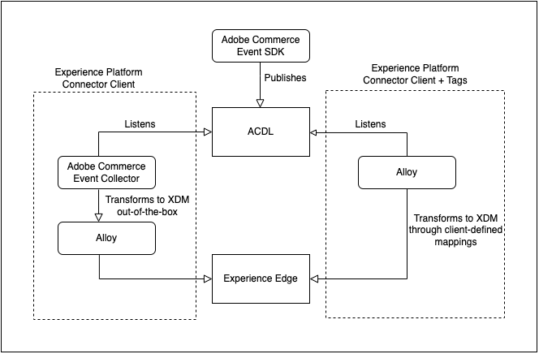
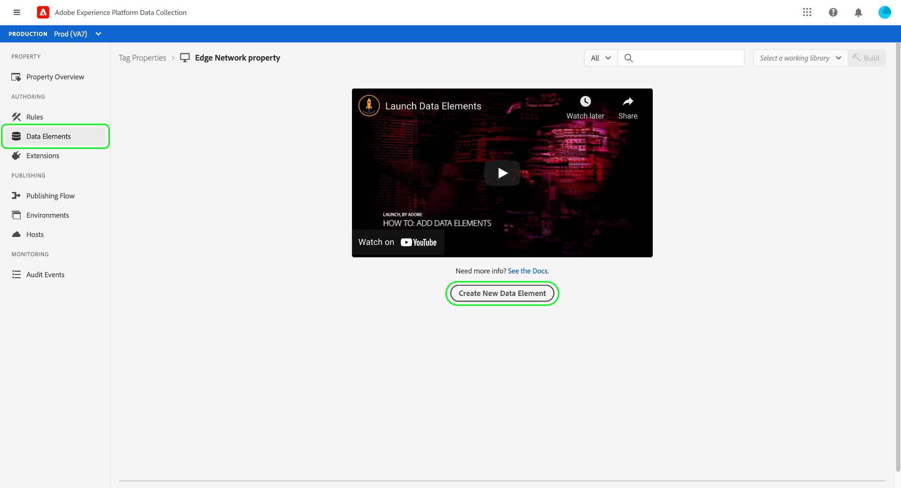
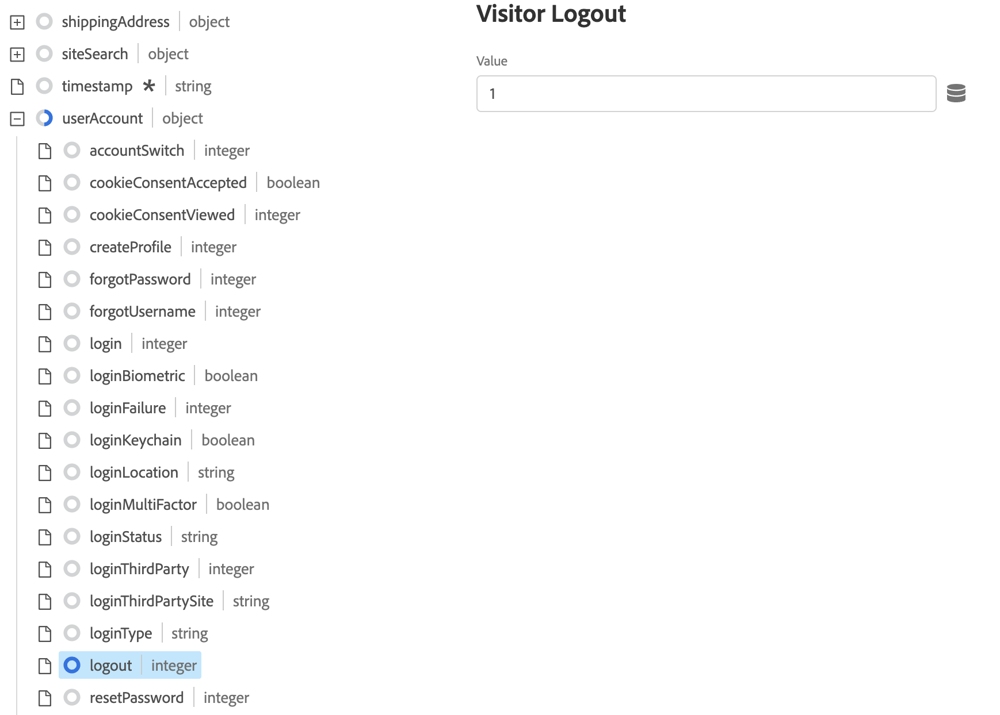
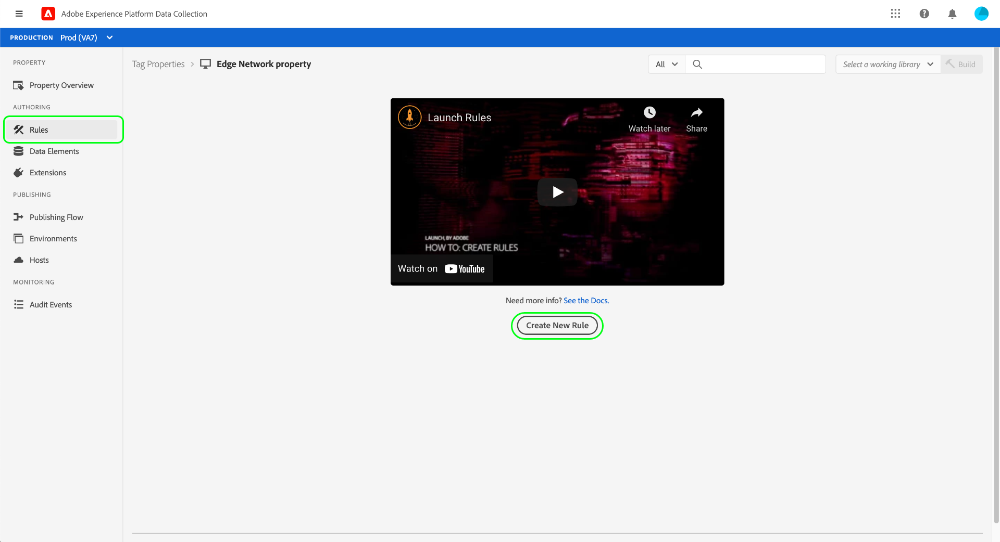
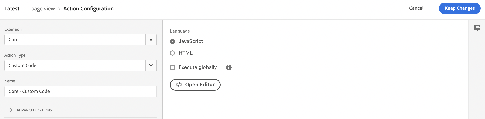
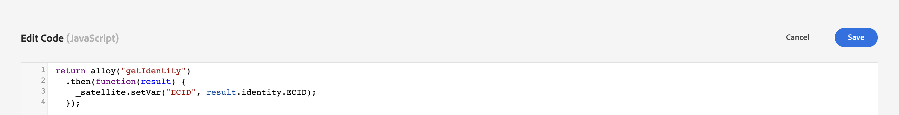
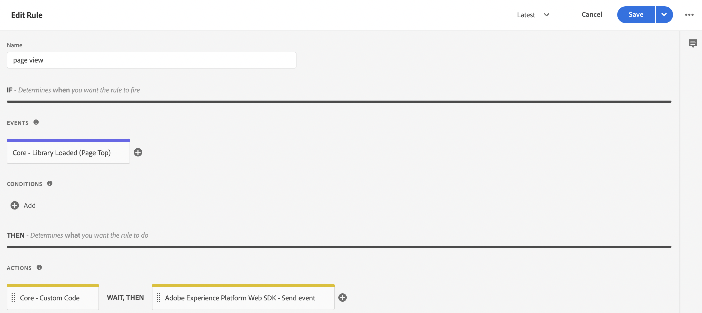
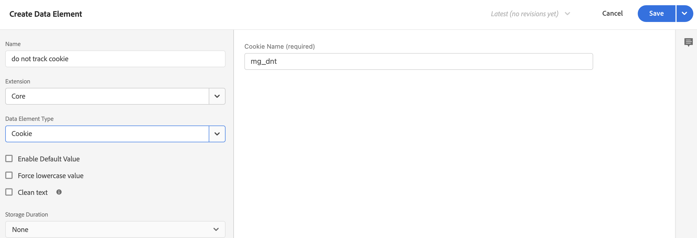
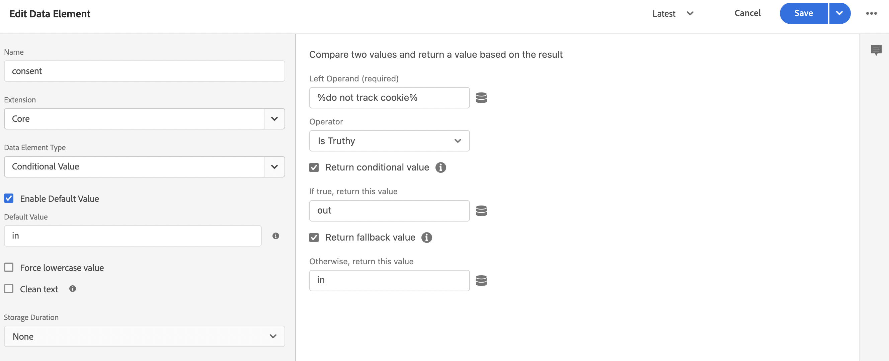
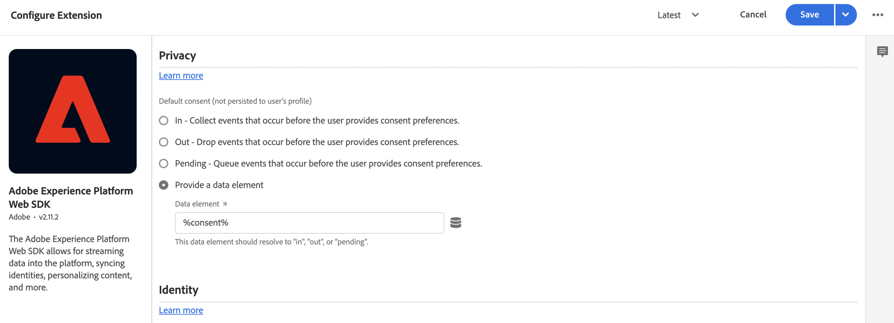

# Raccogliere dati Commerce tramite tag Adobe Experience Platform

Anche se puoi utilizzare il connettore Experience Platform per pubblicare e abbonarti a eventi storefront, alcuni merchants potrebbero già utilizzare una soluzione di raccolta dati, ad esempio la [Tag Adobe Experience Platform](https://experienceleague.adobe.com/docs/platform-learn/data-collection/tags/create-a-property.html?lang=en). Per questi merchants, Adobe Commerce fornisce un’opzione di sola pubblicazione nel connettore di Experience Platform che utilizza l’SDK per eventi di Adobe Commerce.


_Flusso dei dati del connettore di Experience Platform con tag_

In questo argomento viene illustrato come mappare i valori dell’evento storefront forniti dal connettore Experience Platform alla soluzione tag Adobe Experience Platform già in uso.

## Raccogliere dati evento da Adobe Commerce

Per raccogliere i dati dell’evento Commerce:

- Installa il [Adobe Commerce Events SDK](https://github.com/adobe/commerce-events/tree/main/packages/commerce-events-sdk). Per i vetrini PHP, vedi [installare](install.md) argomento. Per i vetrini PWA Studi, consulta la sezione [Guida di PWA Studi](https://developer.adobe.com/commerce/pwa-studio/integrations/adobe-commerce/aep/).

   >[!NOTE]
   >
   > Do **not** [configurare](connect-data.md) ID organizzazione e ID archivio dati.

## Mappatura dei dati della vetrina Commerce su Adobe Experience Platform

Per mappare i dati della vetrina Commerce su Adobe Experience Platform, configura e installa quanto segue dai tag Adobe Experience Platform:

1. [Impostare una proprietà tag](https://experienceleague.adobe.com/docs/platform-learn/implement-in-websites/configure-tags/create-a-property.html?lang=en) nella raccolta dati di Adobe Experience Platform.

1. Sotto **Authoring**, seleziona **Estensioni** e installa e configura le seguenti estensioni:

   - [Livello dati client di Adobe](https://experienceleague.adobe.com/docs/experience-platform/tags/extensions/adobe/client-data-layer/overview.html)

   - [Adobe Experience Platform Web SDK](https://experienceleague.adobe.com/docs/experience-platform/edge/fundamentals/installing-the-sdk.html)

1. [Pubblica tag](https://experienceleague.adobe.com/docs/experience-platform/tags/publish/overview.html) nell’ambiente di sviluppo.

1. Segui **Mappatura degli eventi** i passaggi seguenti per configurare elementi dati e regole per eventi specifici.

### Mappatura degli eventi

Poiché la raccolta di dati utilizzando i tag è diversa dall’utilizzo dell’SDK per eventi di Adobe Commerce, è importante comprendere i termini equivalenti utilizzati in entrambi i framework.

| Termine dei tag Adobe Experience Platform | Termine SDK evento Adobe Commerce |
|---|---|
| _elementi dati_ | contesto |
| _regole_ | event |
|  | _condizioni di regola_ - listener di eventi (da ACDL)<br><br>_azioni di regola_ - gestori eventi (invio a Adobe Experience Platform) |

Quando aggiorni gli elementi dati e le regole nei tag Adobe Experience Platform con dati evento specifici per Adobe Commerce, puoi adottare alcuni passaggi comuni.

Ad esempio, aggiungiamo Adobe Commerce `signOut` ai tag Adobe Experience Platform. I passaggi descritti di seguito, ad eccezione dei valori specifici impostati, descrivono come aggiungere [elementi dati](https://experienceleague.adobe.com/docs/experience-platform/collection/e2e.html#data-element) e [regole](https://experienceleague.adobe.com/docs/experience-platform/collection/e2e.html#create-a-rule), che si applica a tutti gli eventi Adobe Commerce che stai aggiungendo ai tag.

1. Creare un elemento dati:

   
   _Crea nuovo elemento dati_

1. Imposta **Nome** a `sign out`.

1. Imposta **Estensione** a `Adobe Experience Platform Web SDK`.

1. Imposta **Tipo di elemento dati** a `XDM object`.

1. Seleziona la **Sandbox** e **Schema** che si desidera aggiornare.

1. Sotto **userAccount** > **disconnessione**, imposta le **value** in **Disconnessione visitatori** a `1`.

   
   _Aggiorna valore disconnessione_

1. Seleziona **Salva**.

1. Crea una regola:

   
   _Crea nuova regola_

1. Seleziona **Aggiungi** sotto **EVENTI**.

1. Imposta **Estensione** a `Adobe Client Data Layer`.

1. Imposta **Tipo evento** a `Data Pushed`.

1. Seleziona **Evento specifico** e imposta **Evento/Chiave per la registrazione** a `sign-out`.

1. Seleziona **Mantieni modifiche** per salvare la nuova regola.

1. Aggiungi un&#39;azione.

1. Imposta **Estensione** a `Adobe Experience Platform Web SDK`.

1. Imposta **Tipo di azione** a `Send Event`.

1. Imposta **Istanza** a `Alloy`.

1. Imposta **Tipo** a `userAccount.logout`.

1. Imposta **Dati XDM** a `%sign out%`.

1. Fai clic su **Salva**.

   Hai creato un elemento dati nello schema per `signOut` da Adobe Commerce. Inoltre, hai creato una regola con un&#39;azione specifica che dovrebbe verificarsi quando quell&#39;evento viene attivato dalla vetrina Adobe Commerce.

Ripeti i passaggi indicati sopra nei tag per ciascuno degli eventi Adobe Commerce descritti di seguito.

## Eventi disponibili

Per ciascuno dei seguenti eventi, mappa gli eventi Adobe Commerce al tuo XDM seguendo i passaggi precedenti.

- [`signOut`](#signout)
- [`signIn`](#signin)
- [`createAccount`](#createaccount)
- [`editAccount`](#editaccount)
- [`pageView`](#pageview)
- [`productView`](#productview)
- [`searchRequestSent`](#searchrequestsent)
- [`searchResponseReceived`](#searchresponsereceived)
- [`addToCart`](#addtocart)
- [`openCart`](#opencart)
- [`viewCart`](#viewcart)
- [`removeFromCart`](#removefromcart)
- [`startCheckout`](#initiatecheckout)
- [`placeOrder`](#placeorder)

### signOut {#signout}

Attivazione quando un acquirente tenta di disconnettersi.

#### Elementi dati

Crea il seguente elemento dati:

1. Esci:

   - **Nome**: `Sign out`
   - **Estensione**: `Adobe Experience Platform Web SDK`
   - **Tipo di elemento dati**: `XDM object`
   - **Gruppo di campi**: `userAccount` > `logout`
   - **Disconnessione visitatori**: **Valore** = `1`

#### Regole 

- **Nome**: `Sign out`
- **Estensione**: `Adobe Client Data Layer`
- **Tipo evento**: `Data Pushed`
- **Evento specifico**: `sign-out`

##### Azioni

- **Estensione**: `Adobe Experience Platform Web SDK`
- **Tipo di azione**: `Send event`
- **Tipo**: `userAccount.logout`
- **Dati XDM**: `%sign-out%`

### signIn {#signin}

Attivazione quando un acquirente tenta di accedere.

#### Elementi dati

Crea i seguenti elementi dati:

1. Indirizzo e-mail account:

   - **Nome**: `account email`
   - **Estensione**: `Adobe Client Data Layer`
   - **Tipo di elemento dati**: `Data Layer Computed State`
   - **[Facoltativo] path**: `accountContext.emailAddress`

1. Tipo di conto:

   - **Nome**: `account type`
   - **Estensione**: `Adobe Client Data Layer`
   - **Tipo di elemento dati**: `Data Layer Computed State`
   - **[Facoltativo] path**: `accountContext.accountType`

1. ID account:

   - **Nome**: `account id`
   - **Estensione**: `Adobe Client Data Layer`
   - **Tipo di elemento dati**: `Data Layer Computed State`
   - **[Facoltativo] path***: `accountContext.accountId`

1. Accesso:

   - **Nome**: `sign in`
   - **Estensione**: `Adobe Experience Platform Web SDK`
   - **Tipo di elemento dati**: `XDM object`
   - **Gruppo di campi**: `person` > `accountID`
   - **ID account**: **Valore** = `%account id%`
   - **Gruppo di campi**: `person` > `accountType`
   - **Tipo di conto**: **Valore** = `%account type%`
   - **Gruppo di campi**: `person` > `personalEmailID`
   - **Indirizzo e-mail personale**: **Valore** = `%account email%`
   - **Gruppo di campi**: `personalEmail` > `address`
   - **Indirizzo**: **Valore** = `%account email%`
   - **Gruppo di campi**: `userAccount` > `login`
   - **Accesso visitatore**: **Valore** = `1`

#### Regole 

- **Nome**: `sign in`
- **Estensione**: `Adobe Client Data Layer`
- **Tipo evento**: `Data Pushed`
- **Evento specifico**: `sign-in`

##### Azioni

- **Estensione**: `Adobe Experience Platform Web SDK`
- **Tipo di azione**: `Send event`
- **Tipo**: `userAccount.login`
- **Dati XDM**: `%sign in%`

### createAccount {#createaccount}

Attivazione quando un acquirente tenta di creare un account.

#### Elementi dati

Crea i seguenti elementi dati:

1. Indirizzo e-mail account:

   - **Nome**: `account email`
   - **Estensione**: `Adobe Client Data Layer`
   - **Tipo di elemento dati**: `Data Layer Computed State`
   - **[Facoltativo] path**: `accountContext.emailAddress`

1. Tipo di conto:

   - **Nome**: `account type`
   - **Estensione**: `Adobe Client Data Layer`
   - **Tipo di elemento dati**: `Data Layer Computed State`
   - **[Facoltativo] path**: `accountContext.accountType`

1. ID account:

   - **Nome**: `account id`
   - **Estensione**: `Adobe Client Data Layer`
   - **Tipo di elemento dati**: `Data Layer Computed State`
   - **[Facoltativo] path**: `accountContext.accountId`

1. Crea account:

   - **Nome**: `Create account`
   - **Estensione**: `Adobe Experience Platform Web SDK`
   - **Tipo di elemento dati**: `XDM object`
   - **Gruppo di campi**: `person` > `accountID`
   - **ID account**: **Valore** = `%account id%`
   - **Gruppo di campi**: `person` > `accountType`
   - **Tipo di conto**: **Valore** = `%account type%`
   - **Gruppo di campi**: `person` > `personalEmailID`
   - **Indirizzo e-mail personale**: **Valore** = `%account email%`
   - **Gruppo di campi**: `personalEmail` > `address`
   - **Indirizzo**: **Valore** = `%account email%`
   - **Gruppo di campi**: `userAccount` > `createProfile`
   - **Crea profilo account**: **Valore** = `1`

#### Regole 

- **Nome**: `Create account`
- **Estensione**: `Adobe Client Data Layer`
- **Tipo evento**: `Data Pushed`
- **Evento specifico**: `create-account`

##### Azioni

- **Estensione**: `Adobe Experience Platform Web SDK`
- **Tipo di azione**: `Send event`
- **Tipo**: `userAccount.createProfile`
- **Dati XDM**: `%create account%`

### editAccount {#editaccount}

Attivazione quando un acquirente tenta di modificare un account.

#### Elementi dati

Crea i seguenti elementi dati:

1. Indirizzo e-mail account:

   - **Nome**: `account email`
   - **Estensione**: `Adobe Client Data Layer`
   - **Tipo di elemento dati**: `Data Layer Computed State`
   - **[Facoltativo] path**: `accountContext.emailAddress`

1. Tipo di conto:

   - **Nome**: `account type`
   - **Estensione**: `Adobe Client Data Layer`
   - **Tipo di elemento dati**: `Data Layer Computed State`
   - **[Facoltativo] path**: `accountContext.accountType`

1. ID account:

   - **Nome**: `account id`
   - **Estensione**: `Adobe Client Data Layer`
   - **Tipo di elemento dati**: `Data Layer Computed State`
   - **[Facoltativo] path**: `accountContext.accountId`

1. Modifica account:

   - **Nome**: `Edit account`
   - **Estensione**: `Adobe Experience Platform Web SDK`
   - **Tipo di elemento dati**: `XDM object`
   - **Gruppo di campi**: `person` > `accountID`
   - **ID account**: **Valore** = `%account id%`
   - **Gruppo di campi**: `person` > `accountType`
   - **Tipo di conto**: **Valore** = `%account type%`
   - **Gruppo di campi**: `person` > `personalEmailID`
   - **Indirizzo e-mail personale**: **Valore** = `%account email%`
   - **Gruppo di campi**: `personalEmail` > `address`
   - **Indirizzo**: **Valore** = `%account email%`
   - **Gruppo di campi**: `userAccount` > `updateProfile`
   - **Crea profilo account**: **Valore** = `1`

#### Regole

- **Nome**: `Edit account`
- **Estensione**: `Adobe Client Data Layer`
- **Tipo evento**: `Data Pushed`
- **Evento specifico**: `edit-account`

##### Azioni

- **Estensione**: `Adobe Experience Platform Web SDK`
- **Tipo di azione**: `Send event`
- **Tipo**: `userAccount.updateProfile`
- **Dati XDM**: `%edit account%`

### pageView {#pageview}

Attivazione al caricamento di qualsiasi pagina.

#### Elementi dati

Crea i seguenti elementi dati:

1. Nome pagina:

   - **Nome**: `page name`
   - **Estensione**: `Adobe Client Data Layer`
   - **Tipo di elemento dati**: `Data Layer Computed State`
   - **[Facoltativo] path**: `pageContext.pageName`

#### Regole 

- **Nome**: `page view`
- **Estensione**: `Adobe Client Data Layer`
- **Tipo evento**: `Data Pushed`
- **Evento specifico**: `page-view`

##### Azioni

- **Estensione**: `Adobe Experience Platform Web SDK`
- **Tipo di azione**: `Send event`
- **Tipo**: `web.webPageDetails.pageViews`
- **Dati XDM**: `%page view%`

### productView {#productview}

Attivazione al caricamento di qualsiasi pagina di prodotto.

#### Elementi dati

Crea i seguenti elementi dati:

1. Nome del prodotto:

   - **Nome**: `product name`
   - **Estensione**: `Adobe Client Data Layer`
   - **Tipo di elemento dati**: `Data Layer Computed State`
   - **[Facoltativo] path**: `productContext.name`

1. SKU del prodotto:

   - **Nome**: `product sku`
   - **Estensione**: `Adobe Client Data Layer`
   - **Tipo di elemento dati**: `Data Layer Computed State`
   - **[Facoltativo] path**: `productContext.sku`

1. URL immagine prodotto:

   - **Nome**: `product image`
   - **Estensione**: `Adobe Client Data Layer`
   - **Tipo di elemento dati**: `Data Layer Computed State`
   - **[Facoltativo] path**: `productContext.mainImageUrl`

1. Valuta del prodotto:

   - **Nome**: `product currency`
   - **Estensione**: `Adobe Client Data Layer`
   - **Tipo di elemento dati**: `Data Layer Computed State`
   - **[Facoltativo] path**: `productContext.pricing.currencyCode`

1. Codice valuta:

   - **Nome**: `currency code`
   - **Estensione**: `Core`
   - **Tipo di elemento dati**: `Custom Code`
   - **Open Editor**:

   ```bash
   return _satellite.getVar('product currency') || _satellite.getVar('storefront').storeViewCurrencyCode
   ```

1. Prezzo speciale:

   - **Nome**: `special price`
   - **Estensione**: `Adobe Client Data Layer`
   - **Tipo di elemento dati**: `Data Layer Computed State`
   - **[Facoltativo] path**: `productContext.pricing.specialPrice`

1. Prezzo regolare:

   - **Nome**: `regular price`
   - **Estensione**: `Adobe Client Data Layer`
   - **Tipo di elemento dati**: `Data Layer Computed State`
   - **[Facoltativo] path**: `productContext.pricing.regularPrice`

1. Prezzo del prodotto:

   - **Nome**: `product price`
   - **Estensione**: `Core`
   - **Tipo di elemento dati**: `Custom Code`
   - **Open Editor**:

   ```bash
   return _satellite.getVar('product regular price') || _satellite.getVar('product special price')
   ```

1. Vista prodotto:

   - **Nome**: `product view`
   - **Estensione**: `Adobe Experience Platform Web SDK`
   - **Tipo di elemento dati**: `XDM object`
   - **Gruppo di campi**: `productListItems`. Seleziona **Fornire singoli elementi** e fai clic su **Aggiungi elemento** pulsante . Poiché questa visualizzazione è per un PDP, è possibile compilare con un singolo elemento.
   - **Gruppo di campi**: `productListItems` > `name`
   - **Nome**: **Valore** = `%product name%`
   - **Gruppo di campi**: `productListItems` > `SKU`
   - **SKU**: **Valore** = `%product sku%`
   - **Gruppo di campi**: `productListItems` > `priceTotal`
   - **Totale del prezzo**: **Valore** = `%product price%`
   - **Gruppo di campi**: `productListItems` > `currencyCode`
   - **Codice valuta**: **Valore** = `%currency code%`
   - **Gruppo di campi**: `productListItems` > `ProductImageUrl`
   - **ProductImageUrl**: **Valore** = `%product image%`
   - **Gruppo di campi**: `commerce` > `productViews` > `value`
   - **value**: **Valore** = `1`

#### Regole 

- **Nome**: `product view`
- **Estensione**: `Adobe Client Data Layer`
- **Tipo evento**: `Data Pushed`
- **Evento specifico**: `product-page-view`

##### Azioni

- **Estensione**: `Adobe Experience Platform Web SDK`
- **Tipo di azione**: `Send event`
- **Tipo**: `commerce.productViews`
- **Dati XDM**: `%product view%`

### searchRequestSent {#searchrequestsent}

Attivato dagli eventi nel puntatore &quot;ricerca durante la digitazione&quot; e dagli eventi nelle pagine dei risultati di ricerca.

#### Elementi dati

Crea i seguenti elementi dati:

1. Ingresso di ricerca

   - **Nome**: `search input`
   - **Estensione**: `Adobe Client Data Layer`
   - **Tipo di elemento dati**: `Data Layer Computed State`
   - **[Facoltativo] path**: `searchInputContext.units[0]`

1. Frase di input di ricerca

   - **Nome**: `search input phrase`
   - **Estensione**: `Core`
   - **Tipo di elemento dati**: `Custom Code`
   - **Open Editor**:

   ```bash
   return _satellite.getVar('search input').phrase;
   ```

1. Ordinamento degli input di ricerca

   - **Nome**: `search input sort`
   - **Estensione**: `Core`
   - **Tipo di elemento dati**: `Custom Code`
   - **Open Editor**:

   ```bash
   const searchInput = _satellite.getVar('search input');
   const sortFromInput = searchInput ? searchInput.sort : [];
   const sort = sortFromInput.map((searchSort) => {
       return {
           attribute: searchSort.attribute,
           order: searchSort.direction,
       };
   });
   return sort;
   ```

1. Ricerca di filtri di input

   - **Nome**: `search input filters`
   - **Estensione**: `Core`
   - **Tipo di elemento dati**: `Custom Code`
   - **Open Editor**:

   ```bash
   const searchInput = _satellite.getVar('search input');
   const filtersFromInput = searchInput ? searchInput.filter : [];
   const filters = filtersFromInput.map(
       (searchFilter) => {
           let value = [];
           let isRange = false;
           if (searchFilter.eq) {
               value.push(searchFilter.eq);
           } else if (searchFilter.in) {
               value = searchFilter.in;
           } else if (searchFilter.range) {
               isRange = true;
               value.push(String(searchFilter.range.from));
               value.push(String(searchFilter.range.to));
           }
           return {
               attribute: searchFilter.attribute,
               value,
               isRange,
           };
       }
   );
   
   return filters;
   ```

1. Richiesta di ricerca:

   - **Nome**: `search request`
   - **Estensione**: `Adobe Experience Platform Web SDK`
   - **Tipo di elemento dati**: `XDM object`
   - **Gruppo di campi**: `siteSearch` > `phrase`
   - **value**: Non ancora disponibile
   - **Gruppo di campi**: `siteSearch` > `sort`. Seleziona **Fornire un intero oggetto**.
   - **Gruppo di campi**: `siteSearch` > `filter`. Seleziona **Fornire un intero oggetto**.
   - **Gruppo di campi**: `searchRequest` > `value`
   - **value**: **Valore** = `1`

#### Regole 

- **Nome**: `search request sent`
- **Estensione**: `Adobe Client Data Layer`
- **Tipo evento**: `Data Pushed`
- **Evento specifico**: `search-request-sent`

##### Azioni

- **Estensione**: `Adobe Experience Platform Web SDK`
- **Tipo di azione**: `Send event`
- **Tipo**: `searchRequest`
- **Dati XDM**: `%search request%`

### searchResponseReceived {#searchresponsereceived}

Attivato quando Live Search restituisce i risultati per la pagina &quot;search as you type&quot; o risultati di ricerca.

#### Elementi dati

Crea i seguenti elementi dati:

1. Risultati della ricerca:

   - **Nome**: `search results`
   - **Estensione**: `Adobe Client Data Layer`
   - **Tipo di elemento dati**: `Data Layer Computed State`
   - **[Facoltativo] path**: `searchResultsContext.units[0]`

1. Numero di risultati della ricerca:

   - **Nome**: `search result number of products`
   - **Estensione**: `Core`
   - **Tipo di elemento dati**: `Custom Code`
   - **Open Editor**:

   ```bash
   return _satellite.getVar('search result').products.length;
   ```

1. Risultati ricerca prodotti:

   - **Nome**: `search result products`
   - **Estensione**: `Core`
   - **Tipo di elemento dati**: `Custom Code`
   - **Open Editor**:

   ```bash
   const searchResult = _satellite.getVar('search result');
   const productsFromResult = searchResult.products ? searchResult.products : [];
   const products = productsFromResult.map(
       (product) => {
           return { SKU: product.sku, name: product.name };
       }
   );
   return products;
   ```

1. Suggerimenti per i risultati della ricerca:

   - **Nome**: `search result products`
   - **Estensione**: `Core`
   - **Tipo di elemento dati**: `Custom Code`
   - **Open Editor**:

   ```bash
   const searchResult = _satellite.getVar('search result');
   const suggestionsFromResult = searchResult.suggestions ? searchResult.suggestions : [];
   const suggestions = suggestionsFromResult.map((suggestion) => suggestion.suggestion);
   return suggestions;
   ```

1. URL immagine prodotto:

   - **Nome**: `product image`
   - **Estensione**: `Adobe Client Data Layer`
   - **Tipo di elemento dati**: `Data Layer Computed State`
   - **[Facoltativo] path**: `productContext.mainImageUrl`

1. Risposta di ricerca:

   - **Nome**: `search response`
   - **Estensione**: `Adobe Experience Platform Web SDK`
   - **Tipo di elemento dati**: `XDM object`
   - **Gruppo di campi**: `siteSearch` > `suggestions`. Seleziona **Fornire un intero oggetto**.
   - **Elemento dati**: `%search result suggestions%`
   - **Gruppo di campi**: `siteSearch` > `numberOfResults`
   - **value**: `%search result number of products%`
   - **Gruppo di campi**: `productListItems`. Seleziona **Fornire un intero oggetto**.
   - **Gruppo di campi**: `productListItems` > `ProductImageUrl`
   - **ProductImageUrl**: **Valore** = `%product image%`
   - **Elemento dati**: `%search result products%`
   - **Gruppo di campi**: `searchResponse` > `value`
   - **value**: **Valore** = `1`

#### Regole 

- **Nome**: `search response received`
- **Estensione**: `Adobe Client Data Layer`
- **Tipo evento**: `Data Pushed`
- **Evento specifico**: `search-response-received`

##### Azioni

- **Estensione**: `Adobe Experience Platform Web SDK`
- **Tipo di azione**: `Send event`
- **Tipo**: `searchResponse`
- **Dati XDM**: `%search response%`

### addToCart {#addtocart}

Attivazione quando un prodotto viene aggiunto a un carrello o ogni volta che la quantità di un prodotto nel carrello viene incrementata.

#### Elementi dati

Crea i seguenti elementi dati:

1. Nome del prodotto:

   - **Nome**: `product name`
   - **Estensione**: `Adobe Client Data Layer`
   - **Tipo di elemento dati**: `Data Layer Computed State`
   - **[Facoltativo] path**: `productContext.name`

1. SKU del prodotto:

   - **Nome**: `product sku`
   - **Estensione**: `Adobe Client Data Layer`
   - **Tipo di elemento dati**: `Data Layer Computed State`
   - **[Facoltativo] path**: `productContext.sku`

1. Codice valuta:

   - **Nome**: `currency code`
   - **Estensione**: `Adobe Client Data Layer`
   - **Tipo di elemento dati**: `Data Layer Computed State`
   - **[Facoltativo] path**: `productContext.pricing.currencyCode`

1. Prezzo speciale del prodotto:

   - **Nome**: `product special price`
   - **Estensione**: `Adobe Client Data Layer`
   - **Tipo di elemento dati**: `Data Layer Computed State`
   - **[Facoltativo] path**: `productContext.pricing.specialPrice`

1. URL immagine prodotto:

   - **Nome**: `product image`
   - **Estensione**: `Adobe Client Data Layer`
   - **Tipo di elemento dati**: `Data Layer Computed State`
   - **[Facoltativo] path**: `productContext.mainImageUrl`

1. Prezzo normale del prodotto:

   - **Nome**: `product regular price`
   - **Estensione**: `Adobe Client Data Layer`
   - **Tipo di elemento dati**: `Data Layer Computed State`
   - **[Facoltativo] path**: `productContext.pricing.regularPrice`

1. Prezzo del prodotto:

   - **Nome**: `product price`
   - **Estensione**: `Core`
   - **Tipo di elemento dati**: `Custom Code`
   - **Open Editor**:

   ```bash
   return _satellite.getVar('product regular price') || _satellite.getVar('product special price') 
   ```

1. Carrello:

   - **Nome**: `cart`
   - **Estensione**: `Adobe Client Data Layer`
   - **Tipo di elemento dati**: `Data Layer Computed State`
   - **[Facoltativo] path**: `shoppingCartContext`

1. ID carrello:

   - **Nome**: `cart id`
   - **Estensione**: `Core`
   - **Tipo di elemento dati**: `Custom Code`
   - **Open Editor**:

   ```bash
   return _satellite.getVar('cart').id
   ```

1. Aggiungi al carrello:

   - **Nome**: `add to cart`
   - **Estensione**: `Adobe Experience Platform Web SDK`
   - **Tipo di elemento dati**: `XDM object`
   - **Gruppo di campi**: `productListItems`. Seleziona **Fornire singoli elementi** e fai clic su **Aggiungi elemento** pulsante . Poiché questa visualizzazione è per un PDP, è possibile compilare con un singolo elemento.
   - **Gruppo di campi**: `productListItems` > `name`
   - **Nome**: **Valore** = `%product name%`
   - **Gruppo di campi**: `productListItems` > `SKU`
   - **SKU**: **Valore** = `%product sku%`
   - **Gruppo di campi**: `productListItems` > `priceTotal`
   - **Totale del prezzo**: **Valore** = `%product price%`
   - **Gruppo di campi**: `productListItems` > `currencyCode`
   - **Gruppo di campi**: `productListItems` > `ProductImageUrl`
   - **ProductImageUrl**: **Valore** = `%product image%`
   - **Codice valuta**: **Valore** = `%currency code%`
   - **Gruppo di campi**: `commerce` > `cart` > `cartID`
   - **ID carrello**: **Valore** = `%cart id%`
   - **Gruppo di campi**: `commerce` > `productListAdds` > `value`
   - **value**: **Valore** = `1`

#### Regole 

- **Nome**: `add to cart`
- **Estensione**: `Adobe Client Data Layer`
- **Tipo evento**: `Data Pushed`
- **Evento specifico**: `add-to-cart`

##### Azioni

- **Estensione**: `Adobe Experience Platform Web SDK`
- **Tipo di azione**: `Send event`
- **Tipo**: `commerce.productListAdds`
- **Dati XDM**: `%add to cart%`

### openCart {#opencart}

Attivazione quando viene creato un nuovo carrello, che si verifica quando un prodotto viene aggiunto a un carrello vuoto.

#### Elementi dati

Crea il seguente elemento dati:

1. Carrello aperto:

   - **Nome**: `open cart`
   - **Estensione**: `Adobe Experience Platform Web SDK`
   - **Tipo di elemento dati**: `XDM object`
   - **Gruppo di campi**: `commerce` > `productListOpens` > `value`
   - **value**: **Valore** = `1`
   - **Gruppo di campi**: `commerce` > `cart` > `cartID`
   - **ID carrello**: **Valore** = `%cart id%`
   - **Gruppo di campi**: `productListItems`. Per `productListItems`, è possibile precalcolare più elementi. Seleziona **productListItems** > **Fornire un intero array**.

#### Regole 

- **Nome**: `open cart`
- **Estensione**: `Adobe Client Data Layer`
- **Tipo evento**: `Data Pushed`
- **Evento specifico**: `open-cart`

##### Azioni

- **Estensione**: `Adobe Experience Platform Web SDK`
- **Tipo di azione**: `Send event`
- **Tipo**: `commerce.productListOpens`
- **Dati XDM**: `%open cart%`

### viewCart {#viewcart}

Attivazione quando viene caricata una pagina del carrello.

#### Elementi dati

Crea i seguenti elementi dati:

1. Storefront:

   - **Nome**: `storefront`
   - **Estensione**: `Adobe Client Data Layer`
   - **Tipo di elemento dati**: `Data Layer Computed State`
   - **[Facoltativo] path**: `storefrontInstanceContext`

1. URL immagine prodotto:

   - **Nome**: `product image`
   - **Estensione**: `Adobe Client Data Layer`
   - **Tipo di elemento dati**: `Data Layer Computed State`
   - **[Facoltativo] path**: `productContext.mainImageUrl`
   1. Carrello:
   - **Nome**: `cart`
   - **Estensione**: `Adobe Client Data Layer`
   - **Tipo di elemento dati**: `Data Layer Computed State`
   - **[Facoltativo] path**: `shoppingCartContext`


1. ID carrello:

   - **Nome**: `cart id`
   - **Estensione**: `Core`
   - **Tipo di elemento dati**: `Custom Code`
   - **Open Editor**:

   ```bash
   return _satellite.getVar('cart').id
   ```

1. Voci elenco prodotti:

   - **Nome**: `product list items:`
   - **Estensione**: `Core`
   - **Tipo di elemento dati**: `Custom Code`
   - **Open Editor**:

   ```bash
   const storefrontContext = _satellite.getVar('storefront');
   const cart = _satellite.getVar('cart');
   
   const returnList = [];
   cart.items.forEach(item => {
       const selectedOptions = [];
       item.configurableOptions?.forEach(option => {
           selectedOptions.push({
               attribute: option.optionLabel,
               value: option.valueLabel,
           });
       });
   
       const productListItem = {
           SKU: item.product.sku,
           name: item.product.name,
           quantity: item.quantity,
           priceTotal: item.prices.price.value * item.quantity,
           currencyCode: item.prices.price.currency ? item.prices.price.currency : storefrontContext.storeViewCurrencyCode,
           selectedOptions: selectedOptions,
       };
   
       returnList.push(productListItem);
   });
   return returnList;
   ```

1. Visualizza carrello:

   - **Nome**: `view cart`
   - **Estensione**: `Adobe Experience Platform Web SDK`
   - **Tipo di elemento dati**: `XDM object`
   - **Gruppo di campi**: `productListItems`. Per `productListItems`, possono esserci più elementi che vengono precalcolati. Seleziona **productListItems** > **Popolare l&#39;intero array**.
   - **Elemento dati**: `%product list items%`
   - **Gruppo di campi**: `productListItems` > `ProductImageUrl`
   - **ProductImageUrl**: **Valore** = `%product image%`
   - **Gruppo di campi**: `commerce` > `cart` > `cartID`
   - **ID carrello**: **Valore** = `%cart id%`
   - **Gruppo di campi**: `commerce` > `productListViews` > `value`
   - **value**: **Valore** = `1`

#### Regole

- **Nome**: `view cart`
- **Estensione**: `Adobe Client Data Layer`
- **Tipo evento**: `Data Pushed`
- **Evento specifico**: `shopping-cart-view`

##### Azioni

- **Estensione**: `Adobe Experience Platform Web SDK`
- **Tipo di azione**: `Send event`
- **Tipo**: `commerce.productListViews`
- **Dati XDM**: `%view cart%`

### removeFromCart {#removefromcart}

Attivazione quando un prodotto viene rimosso da un carrello o ogni volta che la quantità di un prodotto nel carrello viene diminuita.

#### Elementi dati

Crea i seguenti elementi dati:

1. Nome del prodotto:

   - **Nome**: `product name`
   - **Estensione**: `Adobe Client Data Layer`
   - **Tipo di elemento dati**: `Data Layer Computed State`
   - **[Facoltativo] path**: `productContext.name`

1. SKU del prodotto:

   - **Nome**: `product sku`
   - **Estensione**: `Adobe Client Data Layer`
   - **Tipo di elemento dati**: `Data Layer Computed State`
   - **[Facoltativo] path**: `productContext.sku`

1. Codice valuta:

   - **Nome**: `currency code`
   - **Estensione**: `Adobe Client Data Layer`
   - **Tipo di elemento dati**: `Data Layer Computed State`
   - **[Facoltativo] path**: `productContext.pricing.currencyCode`

1. Prezzo speciale del prodotto:

   - **Nome**: `product special price`
   - **Estensione**: `Adobe Client Data Layer`
   - **Tipo di elemento dati**: `Data Layer Computed State`
   - **[Facoltativo] path**: `productContext.pricing.specialPrice`

1. Prezzo normale del prodotto:

   - **Nome**: `product regular price`
   - **Estensione**: `Adobe Client Data Layer`
   - **Tipo di elemento dati**: `Data Layer Computed State`
   - **[Facoltativo] path**: `productContext.pricing.regularPrice`

1. Prezzo del prodotto:

   - **Nome**: `product price`
   - **Estensione**: `Core`
   - **Tipo di elemento dati**: `Custom Code`
   - **Open Editor**:

   ```bash
   return _satellite.getVar('product regular price') || _satellite.getVar('product special price') 
   ```

1. Carrello:

   - **Nome**: `cart`
   - **Estensione**: `Adobe Client Data Layer`
   - **Tipo di elemento dati**: `Data Layer Computed State`
   - **[Facoltativo] path**: `shoppingCartContext`

1. ID carrello:

   - **Nome**: `cart id`
   - **Estensione**: `Core`
   - **Tipo di elemento dati**: `Custom Code`
   - **Open Editor**:

   ```bash
   return _satellite.getVar('cart').id
   ```

1. Rimuovi dal carrello:

   - **Nome**: `remove from cart`
   - **Estensione**: `Adobe Experience Platform Web SDK`
   - **Tipo di elemento dati**: `XDM object`
   - **Gruppo di campi**: `productListItems`. Seleziona **Fornire singoli elementi** e fai clic su **Aggiungi elemento** pulsante . Poiché questa visualizzazione è per un PDP, è possibile compilare con un singolo elemento.
   - **Gruppo di campi**: `productListItems` > `name`
   - **Nome**: **Valore** = `%product name%`
   - **Gruppo di campi**: `productListItems` > `SKU`
   - **SKU**: **Valore** = `%product sku%`
   - **Gruppo di campi**: `productListItems` > `priceTotal`
   - **Totale del prezzo**: **Valore** = `%product price%`
   - **Gruppo di campi**: `productListItems` > `currencyCode`
   - **Codice valuta**: **Valore** = `%currency code%`
   - **Gruppo di campi**: `commerce` > `cart` > `cartID`
   - **ID carrello**: **Valore** = `%cart id%`
   - **Gruppo di campi**: `commerce` > `productListRemovals` > `value`
   - **value**: **Valore** = `1`

#### Regole 

- **Nome**: `remove from cart`
- **Estensione**: `Adobe Client Data Layer`
- **Tipo evento**: `Data Pushed`
- **Evento specifico**: `remove-from-cart`

##### Azioni

- **Estensione**: `Adobe Experience Platform Web SDK`
- **Tipo di azione**: `Send event`
- **Tipo**: `commerce.productListRemovals`
- **Dati XDM**: `%remove from cart%`

### startCheckout {#initiatecheckout}

Attivazione quando l&#39;acquirente fa clic su un pulsante di pagamento.

#### Elementi dati

Crea i seguenti elementi dati:

1. Storefront:

   - **Nome**: `storefront`
   - **Estensione**: `Adobe Client Data Layer`
   - **Tipo di elemento dati**: `Data Layer Computed State`
   - **[Facoltativo] path**: `storefrontInstanceContext`

1. URL immagine prodotto:

   - **Nome**: `product image`
   - **Estensione**: `Adobe Client Data Layer`
   - **Tipo di elemento dati**: `Data Layer Computed State`
   - **[Facoltativo] path**: `productContext.mainImageUrl`

1. Carrello:

   - **Nome**: `cart`
   - **Estensione**: `Adobe Client Data Layer`
   - **Tipo di elemento dati**: `Data Layer Computed State`
   - **[Facoltativo] path**: `shoppingCartContext`

1. ID carrello:

   - **Nome**: `cart id`
   - **Estensione**: `Core`
   - **Tipo di elemento dati**: `Custom Code`
   - **Open Editor**:

   ```bash
   return _satellite.getVar('cart').id
   ```

1. Voci elenco prodotti:

   - **Nome**: `product list items`
   - **Estensione**: `Core`
   - **Tipo di elemento dati**: `Custom Code`
   - **Open Editor**:

   ```bash
   const storefrontContext = _satellite.getVar('storefront');
   const cart = _satellite.getVar('cart');
   
   const returnList = [];
   cart.items.forEach(item => {
       const selectedOptions = [];
       item.configurableOptions?.forEach(option => {
           selectedOptions.push({
               attribute: option.optionLabel,
               value: option.valueLabel,
           });
       });
   
       const productListItem = {
           SKU: item.product.sku,
           name: item.product.name,
           quantity: item.quantity,
           priceTotal: item.prices.price.value * item.quantity,
           currencyCode: item.prices.price.currency ? item.prices.price.currency : storefrontContext.storeViewCurrencyCode,
           selectedOptions: selectedOptions,
       };
   
       returnList.push(productListItem);
   });
   return returnList;
   ```

1. Avvia il pagamento:

   - **Nome**: `initiate checkout`
   - **Estensione**: `Adobe Experience Platform Web SDK`
   - **Tipo di elemento dati**: `XDM object`
   - **Gruppo di campi**: `productListItems`. Per `productListItems`, possono esserci più elementi che vengono precalcolati. Seleziona **productListItems** > **Popolare l&#39;intero array**.
   - **Elemento dati**: `%product list items%`
   - **Gruppo di campi**: `productListItems` > `ProductImageUrl`
   - **ProductImageUrl**: **Valore** = `%product image%`
   - **Gruppo di campi**: `commerce` > `cart` > `cartID`
   - **ID carrello**: **Valore** = `%cart id%`
   - **Gruppo di campi**: `commerce` > `checkouts` > `value`
   - **value**: **Valore** = `1`

#### Regole 

- **Nome**: `initiate checkout`
- **Estensione**: `Adobe Client Data Layer`
- **Tipo evento**: `Data Pushed`
- **Evento specifico**: `initiate-checkout`

##### Azioni

- **Estensione**: `Adobe Experience Platform Web SDK`
- **Tipo di azione**: `Send event`
- **Tipo**: `commerce.checkouts`
- **Dati XDM**: `%initiate checkout%`

### placeOrder {#placeorder}

Attivazione quando l&#39;acquirente effettua un ordine.

#### Elementi dati

Crea i seguenti elementi dati:

1. Storefront:

   - **Nome**: `storefront`
   - **Estensione**: `Adobe Client Data Layer`
   - **Tipo di elemento dati**: `Data Layer Computed State`
   - **[Facoltativo] path**: `storefrontInstanceContext`

1. URL immagine prodotto:

   - **Nome**: `product image`
   - **Estensione**: `Adobe Client Data Layer`
   - **Tipo di elemento dati**: `Data Layer Computed State`
   - **[Facoltativo] path**: `productContext.mainImageUrl`

1. Carrello:

   - **Nome**: `cart`
   - **Estensione**: `Adobe Client Data Layer`
   - **Tipo di elemento dati**: `Data Layer Computed State`
   - **[Facoltativo] path**: `shoppingCartContext`

1. ID carrello:

   - **Nome**: `cart id`
   - **Estensione**: `Core`
   - **Tipo di elemento dati**: `Custom Code`
   - **Open Editor**:

   ```bash
   return _satellite.getVar('cart').id
   ```

1. Ordine:

   - **Nome**: `order`
   - **Estensione**: `Adobe Client Data Layer`
   - **Tipo di elemento dati**: `Data Layer Computed State`
   - **[Facoltativo] path**: `orderContext`

1. Ordine commerciale:

   - **Nome**: `commerce order`
   - **Estensione**: `Core`
   - **Tipo di elemento dati**: `Custom Code`
   - **Open Editor**:

   ```bash
   const order = _satellite.getVar('order');
   const storefront = _satellite.getVar('storefront');
   
   if (order.payments && order.payments.length) {
       payments = order.payments.map(payment => {
           return {
               paymentAmount: payment.total,
               paymentType: payment.paymentMethodCode,
               transactionID: order.orderId.toString(),
           };
       });
   } else {
       payments = [
           {
               paymentAmount: order.grandTotal,
               paymentType: order.paymentMethodCode,
               transactionID: order.orderId.toString(),
           },
       ];
   }
   
   return {
       purchaseID: order.orderId.toString(),
       currencyCode: storefront.storeViewCurrencyCode,
       payments,
   };
   ```

1. Spedizione ordine:

   - **Nome**: `order shipping`
   - **Estensione**: `Core`
   - **Tipo di elemento dati**: `Custom Code`
   - **Open Editor**:

   ```bash
   const order = _satellite.getVar('order');
   return {
       shippingMethod: order.shipping.shippingMethod,
       shippingAmount: order.shipping.shippingAmount || 0,
   }
   ```

1. ID promozione:

   - **Nome**: `promotion id`
   - **Estensione**: `Core`
   - **Tipo di elemento dati**: `Custom Code`
   - **Open Editor**:

   ```bash
   return _satellite.getVar('order').appliedCouponCode
   ```

1. Voci elenco prodotti:

   - **Nome**: `product list items`
   - **Estensione**: `Core`
   - **Tipo di elemento dati**: `Custom Code`
   - **Open Editor**:

   ```bash
   const storefrontContext = _satellite.getVar('storefront');
   const cart = _satellite.getVar('cart');
   
   const returnList = [];
   cart.items.forEach(item => {
       const selectedOptions = [];
       item.configurableOptions?.forEach(option => {
           selectedOptions.push({
               attribute: option.optionLabel,
               value: option.valueLabel,
           });
       });
   
       const productListItem = {
           SKU: item.product.sku,
           name: item.product.name,
           quantity: item.quantity,
           priceTotal: item.prices.price.value * item.quantity,
           currencyCode: item.prices.price.currency ? item.prices.price.currency : storefrontContext.storeViewCurrencyCode,
           selectedOptions: selectedOptions,
       };
   
       returnList.push(productListItem);
   });
   return returnList;
   ```

1. Ordine:

   - **Nome**: `place order`
   - **Estensione**: `Adobe Experience Platform Web SDK`
   - **Tipo di elemento dati**: `XDM object`
   - **Gruppo di campi**: `productListItems`. Per `productListItems`, possono esserci più elementi che vengono precalcolati. Seleziona **productListItems** > **Popolare l&#39;intero array**.
   - **Elemento dati**: `%product list items%`
   - **Gruppo di campi**: `productListItems` > `ProductImageUrl`
   - **ProductImageUrl**: **Valore** = `%product image%`
   - **Gruppo di campi**: `commerce` > `order`
   - **Identificatore univoco**: **Valore** = `%commerce order%`
   - **Gruppo di campi**: `commerce` > `shipping`
   - **Identificatore univoco**: **Valore** = `%order shipping%`
   - **Gruppo di campi**: `commerce` > `promotionID`
   - **ID promozione**: **Valore** = `%promotion id%`
   - **Gruppo di campi**: `commerce` > `purchases` > `value`
   - **value**: **Valore** = `1`

#### Regole 

- **Nome**: `place order`
- **Estensione**: `Adobe Client Data Layer`
- **Tipo evento**: `Data Pushed`
- **Evento specifico**: `place-order`

##### Azioni

- **Estensione**: `Adobe Experience Platform Web SDK`
- **Tipo di azione**: `Send event`
- **Tipo**: `commerce.order`
- **Dati XDM**: `%place order%`

## Impostazione dell&#39;identità

I profili del connettore di Experience Platform vengono uniti e generati in base al `personID` e `personalEmail` campi di identità in eventi di esperienza XDM. 

Se disponi di una configurazione precedente che si basa su campi diversi, puoi continuare a utilizzarli. Per impostare i campi di identità del profilo del connettore di Experience Platform, devi impostare i campi seguenti:

- `personalEmail` - Solo eventi dell&#39;account - segui i passaggi descritti sopra per gli eventi dell&#39;account
- `personID` - Tutti gli altri eventi:

   - Se si sta già acquisendo `ECID` nei tag è possibile impostare `personID` in tutte le regole dell&#39;SDK Web di Adobe Experience Platform per `%ECID%`.
   - Per acquisire `ECID` nei tag è necessario aggiungere un **Codice personalizzato** per inviare le regole dell’evento seguenti [Documentazione sui tag](https://experienceleague.adobe.com/docs/experience-platform/edge/extension/accessing-the-ecid.html). Vedi l&#39;esempio seguente.

### Esempio

Le immagini seguenti mostrano come configurare un `pageView` evento con `personID` nel connettore di Experience Platform:

1. Configura l&#39;elemento dati con codice personalizzato per ECID:

   
   _Configurare l’elemento dati con codice personalizzato_

1. Aggiungi il codice personalizzato ECID:

   
   _Codice per impostare ECID nell’elemento dati_

1. Aggiorna lo schema XDM con personID impostato come ECID:

   
   _Imposta personID come ECID_

1. Definisci le azioni della regola che recuperano ECID:

   
   _Recupera ECID_

## Impostazione del consenso

Il consenso per la raccolta dei dati del connettore Adobe Commerce e Experience Platform è abilitato per impostazione predefinita. La rinuncia viene gestita tramite la funzione [`mg_dnt` cookie](https://docs.magento.com/user-guide/stores/cookie-reference.html). Puoi seguire i passaggi descritti qui se scegli di utilizzare `mg_dnt` per gestire il consenso. La [Documentazione di Adobe Experience Platform Web SDK](https://experienceleague.adobe.com/docs/experience-platform/edge/consent/supporting-consent.html?lang=en) dispone di diverse opzioni aggiuntive per gestire il consenso.

1. Crea un **Codice personalizzato core** elemento dati (`%do not track cookie%`) per `mg_dnt` cookie:

   
   _Crea non tiene traccia dell’elemento dati_

1. Crea un **Codice personalizzato core** elemento dati (`%consent%`) che restituisce `out` se il cookie è impostato e `in` altrimenti:

   
   _Crea elemento dati di consenso_

1. Configura l&#39;estensione Adobe Experience Platform Web SDK con `%consent%` elemento dati:

   
   _Aggiorna l&#39;SDK con il consenso_

## Avvisi

- Se non si seguono i passaggi per disattivare la raccolta di Experienci Platform, gli eventi vengono conteggiati due volte
- La mancata configurazione di mappature/eventi come descritto in questo argomento può influenzare le bacheche Adobe Analytics
- Non è possibile impostare Target tramite il connettore Experience Platform se la raccolta dati è disabilitata
