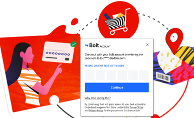

# Guide ai servizi Adobe Commerce

Adobe fornisce una raccolta di Commerce, integration e data services per aiutare gli esercenti a supportare componenti chiave della loro attività.

<table>
<tr>
  <td valign="top" width="200">
      </td>
   <td valign="top"><a href="https://experienceleague.adobe.com/docs/commerce-merchant-services/live-search/overview.html"><strong>[!DNL Live Search]</strong></a>  
    
Implementa questo strumento di ricerca basato sull’intelligenza artificiale che offre risultati più intelligenti, più rapidi e rilevanti per gli acquirenti B2C.

  </td>
   </tr>
<tr>
   <td valign="top" width="200">
       </td>
   <td valign="top">
   <a href="https://experienceleague.adobe.com/docs/commerce-merchant-services/product-recommendations/overview.html"><strong>[!DNL Product Recommendations]</strong></a>
    
Aggiungi consigli alimentati dall’intelligenza artificiale in base al comportamento dell’acquirente, alle tendenze popolari, alla somiglianza del prodotto e altro ancora.

  </td>
   </tr>
<tr>
    <td valign="top" width="200px">
       </td>
   <td valign="top"><a href="https://experienceleague.adobe.com/docs/commerce-merchant-services/catalog-service/guide-overview.html"> <strong>Servizio catalogo</strong></a>  
    
Offri ai tuoi clienti un’esperienza di prodotto ottimizzata, incrementando le prestazioni, migliorando la scalabilità e aumentando le conversioni.

  </td>
   </tr>
<tr>
  <td valign="top" width="200px">
    </td>
   <td valign="top"><a href="https://experienceleague.adobe.com/docs/commerce-merchant-services/payment-services/guide-overview.html"><strong>Servizi di pagamento</strong></a>   <em>(Disponibile per Magento Open Source)</em>
    
Favorire la soddisfazione dei clienti offrendo facilmente vari metodi di pagamento, tra cui rate di pagamento senza interessi, e un'unica vista sull'elaborazione dei pagamenti, gli ordini e le fatture.

  </td>
    </tr>
<tr>
  <td valign="top" width="200px">
    </td>
   <td valign="top"><a href="https://experienceleague.adobe.com/docs/commerce-merchant-services/quick-checkout/overview.html"><strong>Pagamento rapido</strong></a>   <em>(Disponibile per Magento Open Source)</em>
    
Convertire gli acquirenti unici in titolari di account fedeli offrendo un'esperienza di acquisto veloce e intuitiva.

  </td>
    </tr>
<tr>
    <td valign="top">
       </td>
   <td valign="top"><a href="https://experienceleague.adobe.com/docs/commerce-merchant-services/store-fulfillment/guide-overview.html"> <strong>Evasione del negozio</strong></a>  <em>(Disponibile per Magento Open Source)</em>
    
Offri un flusso di lavoro di acquisto on-line di livello superiore, prendi in negozio (BOPIS) l'esperienza dei clienti e massimizza la produttività dei dipendenti, fornendo un flusso di lavoro completo di evasione abilitato tramite un dispositivo mobile.

  </td>
   </tr>
<tr>
    <td valign="top" width="200px">
       </td>
   <td valign="top"><a href="https://experienceleague.adobe.com/docs/commerce-channels/amazon/guide-overview.html"> <strong>Canale di vendita Amazon</strong></a>  <em>(Disponibile per Magento Open Source)</em>
    
È possibile integrarsi con la più grande destinazione globale di acquisti online al mondo per consentire le vendite di Amazon, fornire automazione e sincronizzazione dei dati, gestire gli elenchi di Amazon e altro ancora tramite un unico dashboard.

  </td>
   </tr>
<tr>
    <td valign="top">
       </td>
   <td valign="top"><a href="https://experienceleague.adobe.com/docs/commerce-channels/channel-manager/guide-overview.html"> <strong>Channel Manager</strong></a>  <em>(Disponibile per Magento Open Source)</em>
    
Aumentare le vendite, raggiungere nuovi clienti, semplificare le operazioni e risparmiare tempo integrando con Walmart Marketplace. Consente al personale di gestire le vendite, l'inventario e i prezzi di Walmart Marketplace in modo semplice e in Commerce.

  </td>
   </tr>
</table>

## Connessione ai servizi

La [Connettore Commerce Services](saas.md) fornisce l’integrazione per la tua istanza di Adobe Commerce o Magento Open Source utilizzando una chiave API e una chiave privata. Per i servizi dati (solo Adobe Commerce), puoi anche specificare lo spazio dati nella configurazione.
