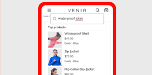

# <!-- use banner as heading --> {#documentation}

Adobe fornisce una raccolta di servizi in hosting per aiutare i commercianti a supportare componenti chiave della loro attività.

## Servizi disponibili

<table>
<tr>
   <td valign="top">
       
    
<a href="https://experienceleague.adobe.com/docs/commerce-merchant-services/product-recommendations/overview.html">
    <strong>[!DNL Product Recommendations]</strong></a>
    

    
(Solo Adobe Commerce) <em>Aggiungi consigli alimentati dall’intelligenza artificiale in base al comportamento dell’acquirente, alle tendenze popolari, alla somiglianza del prodotto e altro ancora.</em>

     
  </td>
  <td valign="top">
      
    

    <a href="https://experienceleague.adobe.com/docs/commerce-merchant-services/live-search/overview.html"><strong>[!DNL Live Search]</strong></a>
    

    
(Solo Adobe Commerce) <em>Implementa questo strumento di ricerca basato sull’intelligenza artificiale che offre risultati più intelligenti, più rapidi e rilevanti per gli acquirenti B2C.</em>

     
  </td>
</tr>
<tr>
  <td valign="top">
    
    

    <a href="https://experienceleague.adobe.com/docs/commerce-merchant-services/payment-services/guide-overview.html"><strong>[!DNL Payment Services]</strong></a>
    

    <em>Favorire la soddisfazione dei clienti offrendo facilmente vari metodi di pagamento, tra cui rate di pagamento senza interessi, e un'unica vista sull'elaborazione dei pagamenti, gli ordini e le fatture direttamente nel dashboard dell'amministratore.</em>
     
  </td>
    <td valign="top">
       
    
<a href="https://experienceleague.adobe.com/docs/commerce-channels/amazon/guide-overview.html">
    <strong>[!DNL Amazon Sales Channel]</strong></a>
    

    
<em>Crea esperienze di e-commerce multicanale per i clienti B2B e B2C su un’unica piattaforma. Da catalogo a pagamento per la realizzazione, questa tecnologia a prova di futuro offre una piattaforma di e-commerce all’infinito flessibile, estensibile e scalabile.</em>

     
  </td>
</tr>
</table>

## Connessione ai servizi

La [Connettore Commerce Services](saas.md) fornisce l’integrazione per la tua istanza di Adobe Commerce o Magento Open Source utilizzando una chiave API e una chiave privata. Per i servizi dati (solo Adobe Commerce), puoi anche specificare lo spazio dati nella configurazione.

## Sincronizzazione del catalogo

Per i servizi che utilizzano dati di catalogo (Product Recommendations e Live Search), la [Sincronizzazione catalogo](catalog-sync.md) elabora esporta i dati di prodotto dal server Commerce a Commerce Services su base continuativa per mantenere i servizi aggiornati.

## Novità

Di seguito sono riportate le modifiche recenti apportate alla documentazione:

* È stato aggiornato il [!DNL Live Search] note sulla versione per [Versione 2.0](/help/live-search/release-notes.md).
* È stata aggiunta una sezione (_Limiti e soglie_) al [Installa [!DNL Live Search]](/help/live-search/install.md) argomento.
* Aggiunto [[!DNL Payment Services] guida](/help/payment-services/guide-overview.md) con le informazioni più recenti sulla nuova estensione marketplace e sul servizio in hosting v1.0.0.
* La [!DNL Live Search] [Dashboard dei rapporti sulle prestazioni](/help/live-search/performance.md) fornisce informazioni sull’efficacia dei termini di ricerca utilizzati dagli acquirenti.
* È stato aggiunto il supporto B2B in [[!DNL Product Recommendations]](/help/product-recommendations/overview.md).
