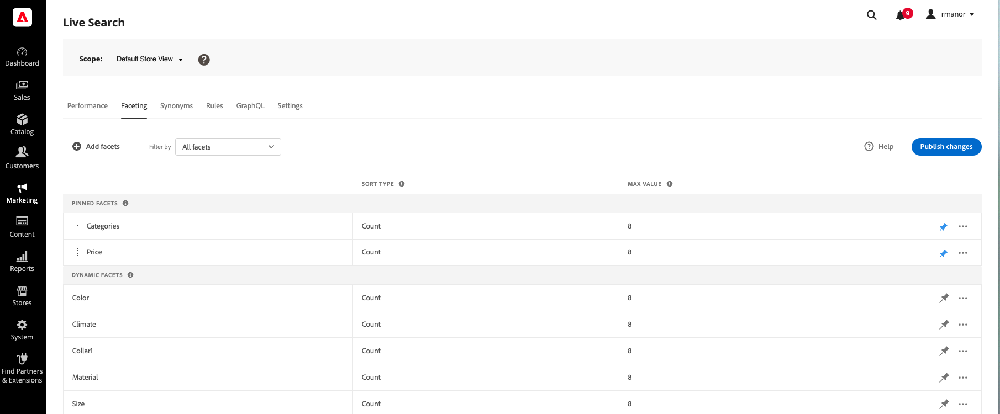

# Area di lavoro di visualizzazione

La [!DNL Live Search] workspace elenca tutti i facet attualmente disponibili e fornisce l’accesso agli strumenti necessari per impostare e gestire i facet. I facet bloccati vengono visualizzati per primi nell’elenco dei facet esistenti, seguiti dai facet dinamici. L’elenco può essere filtrato per mostrare tutti i facet, o solo quelli che sono bloccati o dinamici.

## Imposta l&#39;ambito

Se l&#39;installazione di Adobe Commerce include più viste Store, imposta **Ambito** al [vista store](https://docs.magento.com/user-guide/configuration/scope.html) dove si applicano le impostazioni dei facet.

## Filtrare l’elenco

1. Fai clic sul pulsante **Filtra per** controllo.
1. Scegliere una delle opzioni seguenti:

   * Tutti i filtri
   * Fessura
   * Dinamico

   

## Aggiungi un facet

1. Fai clic su **Aggiungi facet**.
1. Vedi [Aggiungi facet](facets-add.md) per istruzioni dettagliate.

## Descrizioni delle colonne

| Colonna | Descrizione |
|--- |--- |
| (prima colonna) | Elenca i facet agganciati e dinamici [etichetta](facets-type.md) che è visibile all&#39;acquirente. |
| Seleziona tipo | La [metodo di selezione](facets-type.md) che viene assegnato all’attributo di prodotto corrispondente. La `single select` viene utilizzato per tutti [!DNL Commerce] vetrine. Per implementazioni headless, `multi-select` il tipo può essere assegnato con un operatore logico (`or` o `and`) per determinare il set di prodotti restituiti. |
| Tipo di ordinamento | La [ordinamento](facets-type.md) di valori facet. I facet sono ordinati alfabeticamente per tutti [!DNL Commerce] vetrine. Per [senza testa] implementazioni, i facet possono essere ordinati alfabeticamente o per conteggio. Opzioni: Alfabetico, conteggio (solo senza testa) |
| Valore massimo | Il numero di valori di facet disponibili nella vetrina come filtri, con un massimo di 10. |

## Controlli

| Controllo | Descrizione |
|--- |--- |
| Aggiungi facet | Apre la [editor di facet](facets-add.md). |
| Filtra per | Determina la [tipo di facet](facets-type.md) che compaiono nell&#39;elenco. Opzioni: Tutto, Bloccato, Dinamico |
