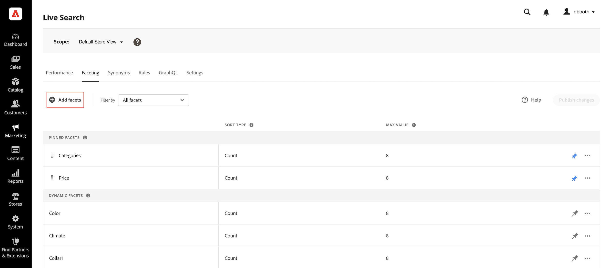
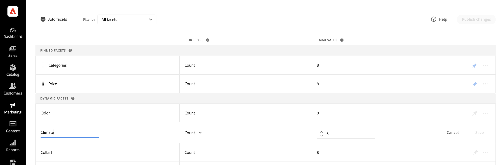

# Aggiungi facet

Qualsiasi attributo di prodotto filtrabile può essere utilizzato come facet. Il *Aggiungi facet* Il pannello elenca i facet correnti e semplifica l’assegnazione di attributi di prodotto aggiuntivi come facet. Durante questo processo in tre fasi, viene scelto un attributo da utilizzare come facet, le proprietà vengono modificate se necessario e le modifiche pubblicate nella vetrina.

## Passaggio 1: aggiungere un facet

1. In Admin (Amministrazione), vai a **Marketing** > SEO e ricerca > **[!DNL Live Search]**.
1. Il giorno *Faceting* , fare clic su **Aggiungi facet**.
1. In *Aggiungi facet* elenco, ogni attributo disponibile ha un . Completa una delle seguenti operazioni:

   * In *Attributi faceting* selezionare l&#39;attributo di prodotto da utilizzare come facet e fare clic su **Aggiungi**.
   * Per trovare un attributo di prodotto specifico, inserisci i primi caratteri del nome dell’attributo in *Ricerca* casella. Quindi, fai clic su **Aggiungi**.

      Per configurare intervalli e raggruppamenti di price faceting, fare riferimento a [Impostazioni](settings.md). Per ulteriori informazioni, consulta [Tipi di facet](facets-type.md).
Il facet viene aggiunto alla parte inferiore del *Facet dinamici* e *Pubblica modifiche* diventa disponibile.

1. Se il facet che desideri aggiungere non è stato trovato, vai a **Negozi** > Attributi > **Prodotto** e verifica che l’attributo abbia il valore [proprietà richieste](facets.md) da utilizzare come facet. Se necessario, aggiorna le seguenti proprietà della vetrina dell’attributo:

   * Utilizzo in Ricerca - `Yes`
   * Utilizzo in Navigazione a livelli dei risultati di ricerca - `Yes`
   * Uso in navigazione a livelli - `Filterable (with results)`

1. Quando richiesto, aggiorna la cache.

   Il facet diventa disponibile nella vetrina alla successiva sincronizzazione del catalogo con [!DNL Live Search]. Se il facet non è disponibile dopo due ore, vedere [Sincronizza dati catalogo](install.md#synchronize-catalog-data).

## Passaggio 2: modificare le proprietà del facet (facoltativo)

1. Per modificare le proprietà del facet, fate clic su **Altro** () nella colonna di estrema destra.
1. Scegliere dal menu **Modifica**. Quindi, regola le seguenti proprietà in base alle esigenze.

   * Etichetta - ([Headless](facets-type.md) solo) Immettete l&#39;etichetta di sfaccettatura che desiderate usare.
   * Tipo di ordinamento: i facet sono ordinati alfabeticamente per tutti [!DNL Commerce] vetrine. Per le implementazioni headless, i facet possono essere ordinati alfabeticamente o per conteggio. Opzioni: Alfabetico, Conteggio (solo headless)
   * Valore massimo: immettere il numero massimo di valori di facet visualizzati nella vetrina. Voci valide: 0 - 30; valore predefinito: 8

1. Al termine, fai clic su **Salva**.

   

1. Per fissare il facet alla parte superiore del *Filtri* , fare clic sulla puntina grigia ().
1. Per modificare l&#39;ordine del facet fissato, fare clic sul pulsante **Sposta** () e trascinare la riga in una nuova posizione nella *Facet bloccati* sezione.

## Passaggio 3: Pubblicare le modifiche

1. Al termine della facet, fate clic su **Pubblica modifiche**.
1. Attendere che il facet venga visualizzato nell&#39;archivio.
Se il facet non è disponibile dopo due ore, vedere [Verifica esportazione](install.md#synchronize-catalog-data) nelle istruzioni di installazione.

## Descrizioni dei campi

| Campo | Descrizione |
|--- |--- |
| Etichetta | ([Headless](facets-type.md) solo) Il [etichetta facet](facets-type.md) visibile nella vetrina, può essere modificato per coerenza con il tuo marchio. |
| Tipo di ordinamento | Il metodo utilizzato per [sort](facets-type.md) facet. Tutti [!DNL Commerce] storefronts ordina alfabeticamente solo i facet. Anche le implementazioni headless possono essere ordinate per `Count`. Opzioni: Alfabetico - Ordina alfabeticamente i facet. Conteggio - (Solo headless) Ordina i facet in base al numero di corrispondenze trovate. |
| Valore massimo | Il numero massimo di valori che possono essere visualizzati nella vetrina per ogni facet. I facet che rappresentano un intervallo di valori vengono distribuiti in modo uniforme. Voci valide: 0 - 30; valore predefinito: 8 |

### Controlli

| Controllo | Descrizione |
|--- |--- |
|  | Fissa o sblocca una sfaccettatura nella parte superiore del *Filtri* elenco. |
|  | Visualizza un menu di ulteriori azioni che possono essere applicate al facet selezionato. Opzioni: Modifica, Elimina |
|  | Utilizza il *Sposta* per trascinare una sfaccettatura bloccata in un&#39;altra posizione nella *Facet bloccati* sezione. |
