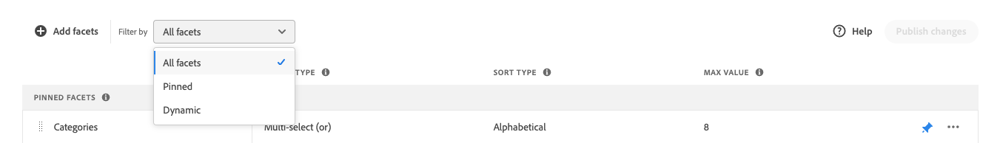
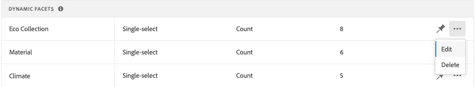
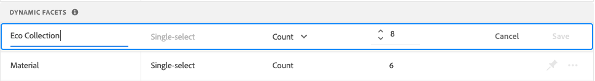
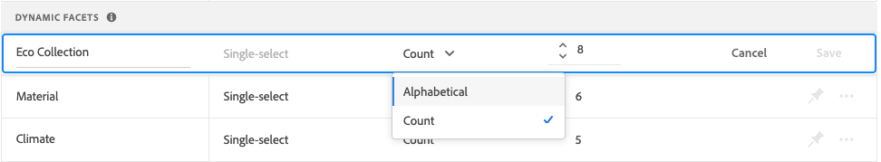
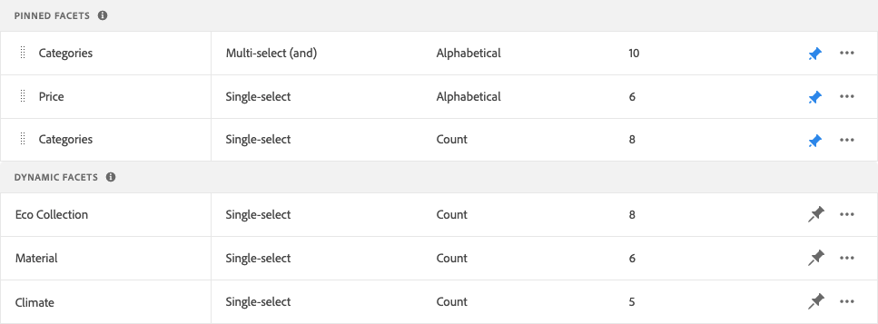
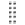

# Gestisci facet

Segui queste istruzioni per aggiornare le proprietà dei facet esistenti o modificarne la presentazione nella vetrina.

## Configurare i raggruppamenti di facet del prezzo

Fai riferimento a [Impostazioni](settings.md) per configurare gli intervalli e i raggruppamenti per la definizione del prezzo.

## Modifica facet

1. Trova il facet da modificare.
1. Se nell’elenco sono presenti molti facet, imposta *Filtra per* in una delle seguenti situazioni:

   * Fessura
   * Dinamico

   Per ulteriori informazioni, vai a [Tipi di facet](facets-type.md).

   

1. Per modificare le proprietà del facet, fai clic su **Altro** Opzioni (..).
1. Fai clic su **Modifica**

   

1. Per modificare l’etichetta del facet, effettua una delle seguenti operazioni:

   * Per [!DNL Commerce] vetrina, modifica [etichetta attributo](https://experienceleague.adobe.com/docs/commerce-admin/catalog/product-attributes/product-attributes.html).
   * Per un’implementazione headless, fai clic sul valore nella prima colonna e modifica il testo in base alle esigenze.

   

1. (Solo senza intestazione) Per modificare il metodo utilizzato per ordinare i valori dei facet, fai clic sul valore nel *Tipo di ordinamento* e scegliere una delle seguenti opzioni:

   * Alfabetico
   * Conteggio

   

1. In **Valore massimo** imposta il numero massimo (da 0 a 10) dei valori del filtro facet da visualizzare nella vetrina.
1. Al termine, fai clic su **Salva**.
Le modifiche verranno visualizzate nella vetrina solo dopo la pubblicazione.

## Facet pin/sblocca

Il pin cambia colore quando viene fatto clic su e viene utilizzato per spostare il facet in *Facet bloccate* o *Facet dinamici* sezione .

1. Per fissare un facet nella parte superiore del *Filtri* elenco, trova il facet nel *Facet dinamici* e fai clic sul pin grigio ().
Il perno diventa blu e il facet si sposta *Facet bloccate* sezione .
1. Per sbloccare un facet, trova il facet nel *Facet bloccate* e fai clic sul pin blu ().
Il perno diventa grigio e il facet si sposta verso il *Facet dinamici* sezione .

   

## Sposta facet bloccato

L’ordine dei facet bloccati può essere modificato spostando la riga in una posizione diversa. I facet bloccati hanno un *Sposta* icona () all’inizio della riga. A differenza dei facet bloccati, i facet dinamici non possono essere spostati.

1. Trova il facet nel *Facet bloccate* sezione dell&#39;elenco.
1. Utilizza la **Sposta** () per trascinare la riga in una nuova posizione *Facet bloccate* sezione .
Dopo la pubblicazione delle modifiche, i facet riordinati vengono visualizzati nella vetrina *Filtri* elenco.

## Elimina facet

1. Trova il facet nell’elenco e fai clic su **Altro** Opzioni (..).
1. Fai clic su **Elimina**.
1. Quando viene richiesto di confermare, fai clic su **Elimina facet**.
Il facet viene rimosso dalla vetrina dopo la pubblicazione delle modifiche.

## Pubblicare le modifiche

1. Per aggiornare la vetrina con le modifiche, fai clic su **Pubblicare le modifiche**.
1. Attendi circa 15 minuti perché gli aggiornamenti vengano visualizzati nel tuo negozio.
