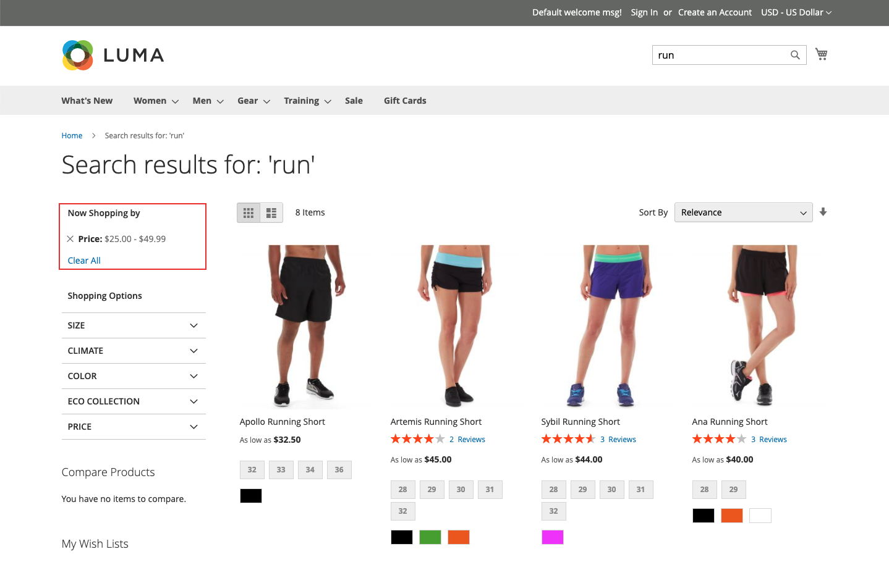

# Tipi di facet

[!DNL Live Search] utilizza diversi tipi di facet e vengono visualizzati nel *Filtri* elencare solo se pertinente. L’elenco dei facet disponibili cambia in base ai prodotti restituiti. Le seguenti caratteristiche influiscono sulla loro presentazione e sul loro comportamento:

* Facet bloccati: i facet più comunemente utilizzati possono essere bloccati in alto nell’elenco. I facet rimanenti sono elencati in *Tipo di ordinamento* ordina dopo i facet bloccati.
* Facet dinamici: attributi di prodotto che [Adobe Sensei](https://www.adobe.com/sensei.html) trova più rilevanti per un set di prodotti e una query. Il calcolo prende in considerazione i metadati dell’attributo dell’intero catalogo e determina in fase di query i facet più rilevanti per la query.
* Facet popolari: attributi di prodotto più spesso presenti nei risultati di ricerca.
* Facet di prezzo - Restituisci i prodotti per fascia di prezzo. È possibile specificare il numero di selezioni e l&#39;intervallo di prezzo nel campo [*Impostazioni*](settings.md) scheda.

Al momento della query, [!DNL Live Search] genera i risultati della ricerca in gruppi di facet dinamici e popolari.

## Opzioni vetrina e headless

Facet sottoposti a rendering per [!DNL Commerce] storefront vengono elaborati dall’adattatore di ricerca, che instrada le richieste ed esegue il rendering dei risultati nella vetrina. Tutti [!DNL Commerce] i facet storefront sono ordinati alfabeticamente con opzioni a selezione singola, indipendentemente dal tipo di input assegnato all’attributo corrispondente. I facet disponibili nella vetrina vengono riprodotti in base al tema corrente e riflettono eventuali personalizzazioni apportate alla presentazione della navigazione a livelli.

Al contrario, [headless](https://developer.adobe.com/commerce/php/architecture/technical-vision/web-api/) Le implementazioni di vengono elaborate dall’API e supportano opzioni aggiuntive. I facet headless possono essere ordinati alfabeticamente o per conteggio e possono avere opzioni a selezione singola o multipla.

### Etichette facet

Per [!DNL Commerce] storefronts, l&#39;etichetta facet è determinata dal [*Proprietà attributo*](https://experienceleague.adobe.com/docs/commerce-admin/catalog/product-attributes/create/attribute-product-create.html). Per i negozi con più viste, è possibile definire etichette aggiuntive in *Gestisci etichette*. Per le implementazioni headless, le etichette vengono modificate dalla [area di lavoro faceting](faceting-workspace.md).

### Tipo di ordinamento

Tutti i facet di cui è stato eseguito il rendering per la vetrina sono ordinati alfabeticamente. Per le implementazioni headless, i facet possono essere ordinati alfabeticamente o per conteggio.

| Tipo di ordinamento | Descrizione |
|--- |--- |
| Alfabetico | Nella vetrina *Filtri* I facet sono ordinati alfabeticamente. |
| Conteggio | (Solo headless) Per le implementazioni headless, i facet possono essere ordinati anche in base al numero di valori trovati per facet nel set corrente di prodotti restituiti. |
