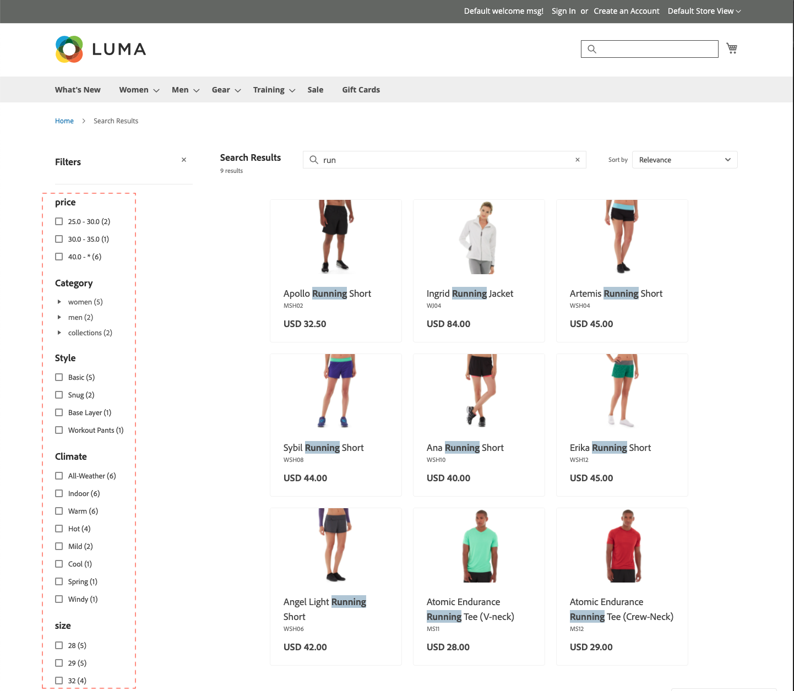

# Facet

Faceting è un metodo di filtro ad alte prestazioni che utilizza più dimensioni di valori di attributo come criteri di ricerca. La ricerca con facet è simile, ma notevolmente &quot;più intelligente&quot; rispetto allo standard [navigazione su più livelli](https://experienceleague.adobe.com/docs/commerce-admin/catalog/catalog/navigation/navigation-layered.html). L’elenco dei filtri disponibili è determinato da [attributi filtrabili](https://experienceleague.adobe.com/docs/commerce-admin/catalog/catalog/navigation/navigation-layered.html#filterable-attributes) dei prodotti restituiti nei risultati della ricerca.

Qualsiasi facet definito può essere utilizzato come parametro URL e i risultati verranno filtrati in base ai valori dei parametri: `http://yourstore.com?brand=acme&color=red`.

## Requisiti di sfaccettato

I requisiti degli attributi di categoria e prodotto per il faceting sono simili agli attributi filtrabili utilizzati per la navigazione su più livelli. Le proprietà storefront di ciascun attributo devono essere impostate su `filterable (with results)`.

[!DNL Live Search] supporta fino a:

* 100 attributi configurati come facet
* 50 attributi ordinabili
* 200 attributi filtrabili
* 200 attributi ricercabili

| Impostazione | Descrizione |
|--- |--- |
| [Impostazioni di visualizzazione categoria](https://experienceleague.adobe.com/docs/commerce-admin/catalog/categories/create/categories-display-settings.html) | Ancoraggio - `Yes` |
| [Proprietà attributo](https://experienceleague.adobe.com/docs/commerce-admin/catalog/product-attributes/create/attribute-product-create.html) | [Tipo di input catalogo](https://experienceleague.adobe.com/docs/commerce-admin/catalog/product-attributes/attributes-input-types.html) - `Yes/No`, `Dropdown`, `Multiple Select`, `Price`, `Visual swatch` (solo widget), `Text swatch` (solo widget) |
| Proprietà vetrina attributo | Utilizzo in Navigazione a livelli dei risultati di ricerca - `Yes` |

## Valori attributi predefiniti

I seguenti attributi di prodotto hanno [proprietà vetrina](https://experienceleague.adobe.com/docs/commerce-admin/catalog/product-attributes/product-attributes.html) utilizzati da [!DNL Live Search] e attivato per impostazione predefinita.

| Proprietà | Storefront, proprietà | Attributo |
|---|---|---|
| Ordinabile | Utilizzato per l’ordinamento nell’elenco prodotti | `price` |
| Ricercabile | Uso nella ricerca | `price`  `sku` `name` |
| FilterableInSearch | Uso in navigazione a livelli - Filtrabile (con risultati) | `price` `visibility` `category_name` |

## Proprietà attributi non di sistema predefinite

La tabella seguente mostra le proprietà predefinite di ricerca e filtrabili degli attributi non di sistema, inclusi quelli specifici dei dati di esempio Luma. Impostazione di *Uso nella ricerca* proprietà attributo a `Yes` rende l’attributo ricercabile in entrambi [!DNL Live Search] e Adobe Commerce nativo.

| Codice attributo | Ricercabile | Uso in navigazione a livelli |
|--- |--- |--- |
| attività | Sì | Filtrabile (con risultati) |
| attributes_brand | Sì | No |
| brand | Sì | No |
| clima | Sì | Filtrabile (con risultati) |
| collare | Sì | Filtrabile (con risultati) |
| colore | Sì | Filtrabile (con risultati) |
| costo | Sì | No |
| eco_collection | Sì | Filtrabile (con risultati) |
| genere | Sì | Filtrabile (con risultati) |
| produttore | Sì | Filtrabile (con risultati) |
| materiale | Sì | Filtrabile (con risultati) |
| scopo | Sì | Filtrabile (con risultati) |
| strap_bag | Sì | Filtrabile (con risultati) |
| style_general | Sì | Filtrabile (con risultati) |

## Proprietà attributi di sistema predefiniti

Nella tabella seguente vengono illustrate le proprietà predefinite di ricerca e filtrabili degli attributi di sistema.

| Codice attributo | Ricercabile | Uso in navigazione a livelli |
|--- |--- |--- |
| allow_open_amount | Sì | Filtrabile (con risultati) |
| descrizione | Sì | No |
| nome | Sì | No |
| prezzo | Sì | Filtrabile (con risultati) |
| short_description | Sì | No |
| sku | Sì | No |
| stato | Sì | No |
| tax_class_id | Sì | No |
| url_key | Sì | No |
| peso | Sì | No |
