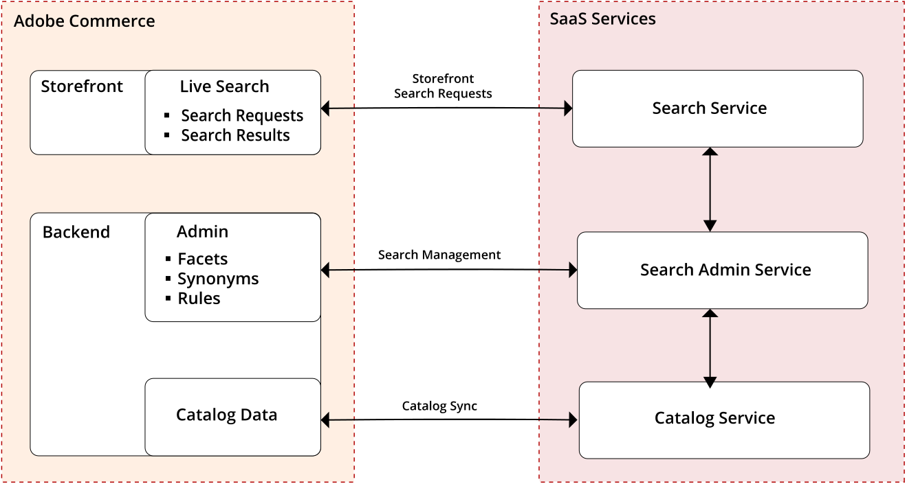

# [!DNL Live Search]

[!DNL Live Search] è un insieme autonomo [pacchetti](#live-search-packages) che sostituisce le funzionalità di ricerca standard di Magenti Open Source e Adobe Commerce. La [!DNL Live Search] Il modulo viene installato dalla riga di comando del server e si connette all’installazione di Adobe Commerce come [servizio](https://docs.magento.com/user-guide/system/saas.html). Al termine del processo, [!DNL Live Search] appare sul *Marketing* menu sotto *SEO e ricerca* in [!DNL Commerce] *Amministratore*.

Il lato Adobe Commerce dell&#39;architettura include l&#39;hosting della ricerca *Amministratore*, sincronizzazione dei dati del catalogo ed esecuzione del servizio query.

