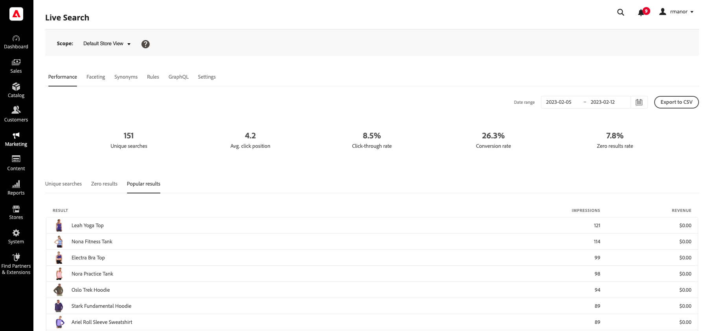

# Prestazioni

La [!DNL Live Search] Il dashboard delle prestazioni fornisce informazioni approfondite sui termini di ricerca utilizzati dagli acquirenti. Le informazioni possono essere utilizzate per identificare le tendenze, aumentare il click-through e migliorare il tasso di conversione. Il dashboard Prestazioni fornisce un’istantanea delle metriche di ricerca per un intervallo di date specifico e include i seguenti rapporti:

* Ricerche univoche
* Zero risultati
* Risultati popolari

## Visualizzare un rapporto

1. Per accedere al **Intervallo date**, fai clic sul calendario () ed effettua una delle seguenti operazioni:

   * Per specificare una data singola, fai doppio clic sulla data nel calendario.
   * Per specificare un intervallo di date, fare clic sulla prima e sull&#39;ultima data del calendario.

   

1. Fare clic sulla scheda del rapporto che si desidera visualizzare.

   

## Descrizioni dei campi

| Dati snapshot | Descrizione |
|--- |--- |
| Ricerche univoche | Numero totale di ricerche univoche per l&#39;intervallo di date specificato. Le ricerche multiple dello stesso acquirente, anche se per la stessa query, sono considerate univoche se inviate più di un’ora di differenza. |
| Frequenza di click-through | La percentuale di ricerche che si concludono con l&#39;acquirente che fa clic su un prodotto. Ad esempio, il tasso di click-through è del 50% se l&#39;acquirente cerca &quot;pantaloni&quot; e &quot;camicia&quot; e poi fa clic su un risultato nella ricerca &quot;camicia&quot;. |
| Tasso di conversione | La percentuale di prodotti acquistati dall’acquirente rispetto al numero di prodotti su cui l’acquirente fa clic per l’intervallo di date specificato. Ad esempio, il tasso di conversione dell’interazione è del 100% se l’acquirente visualizza sei prodotti nell’archivio, fa clic su uno ed effettua un acquisto.   Il tasso di conversione non è influenzato dal numero di visualizzazioni di un dato prodotto. Ad esempio, il tasso di conversione rimane lo stesso se l’acquirente utilizza la ricerca, ma non fa clic su alcun prodotto. |
| Tasso zero risultati | Percentuale di ricerche univoche che non restituisce risultati per l&#39;intervallo di date specificato. Ad esempio, il tasso zero è del 66,67% se l&#39;acquirente cerca &quot;fjjajfjfjf&quot; due volte (senza risultati) e per &quot;pantaloni&quot; una volta (con risultati). |
| Media fare clic su posizione | Posizione relativa del tasso di click-through medio in base a ricerche univoche per l&#39;intervallo di date specificato. |

| Rapporti | Descrizione |
|--- |--- |
| Ricerche univoche | Elenca le query di ricerca univoche utilizzate durante l&#39;intervallo di date specificato. I dati del report vengono calcolati nello stesso modo dei dati snapshot di ricerca univoci. Se un acquirente digita due volte la stessa query di ricerca, ma a più di un’ora di distanza, la ricerca viene considerata come due ricerche univoche. Limite del rapporto: Primi 500 termini |
| Zero risultati | Elenca le query di ricerca che non restituiscono risultati e il numero di volte utilizzate durante l’intervallo di date specificato. Limite del rapporto: Primi 500 termini |
| Risultati popolari | Elenca i nomi dei prodotti che hanno ricevuto il maggior numero di visualizzazioni durante l’intervallo di date specificato. I risultati popolari vengono calcolati solo in base alle impression e non sono influenzati dal numero di clic o di ricavi generati. Limite del rapporto: Primi 500 termini |
