# Widget pagina elenco prodotti

Il [!DNL Live Search Product Listing Page Widget] (PLP) utilizza la piattaforma Commerce Services per fornire una pagina di elenco dei prodotti performante, ricercabile e facet-able. In questo argomento viene descritto come abilitare e assegnare uno stile al widget PLP.

## Abilitazione del widget PLP

Quando [!DNL Live Search] è installato, la funzionalità di ricerca predefinita viene convertita in [!DNL Live Search] automaticamente.
Il widget PLP deve essere abilitato in Admin.

1. Vai a **Negozi** > Impostazioni > **Configurazione** > **[!DNL Live Search]** > **Funzioni vetrina** e imposta **Abilita widget elenco prodotti** a &quot;Sì&quot;.
1. Seleziona **Salva configurazione** per salvare l&#39;impostazione.

## Esempio di stile

È possibile personalizzare l&#39;aspetto del widget PLP in modo che corrisponda al sito utilizzando [CSS](https://developer.adobe.com/commerce/frontend-core/guide/css/).

>[!NOTE]
>
>Gli elementi con classi personalizzate all’interno di un tema Adobe Commerce non vengono ereditati. Questi elementi devono essere oggetto di targeting da parte della classe specifica per corrispondere alle classi personalizzate; le classi di azione primarie non funzioneranno su un pulsante widget.
>Verranno ereditati gli elementi mirati generici all’interno del CSS; `button` verrà applicato ai pulsanti widget.

I div evidenziati contengono la classe target `ds-sdk-product-item__product-name`.

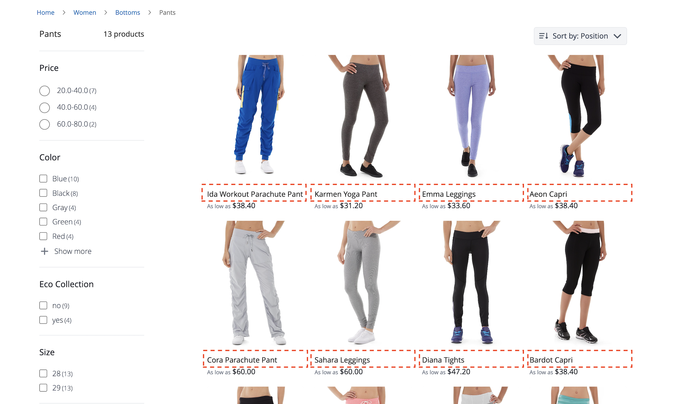

Personalizza il nome del prodotto aggiungendo una regola per renderli maiuscoli.

```css
.ds-sdk-product-item__product-name {
 text-transform: uppercase;
}
```

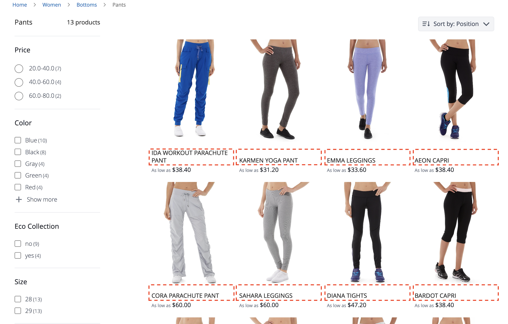

## Classi CSS

### Elenco prodotti

* `.ds-sdk-product-list`: div esterno
* `.ds-sdk-product-list__grid`: div interno

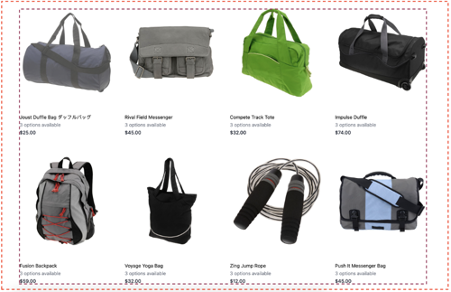

#### Paginazione elenco prodotti

* `.ds-plp-pagination`


* `.ds-plp-pagination_item`


* `.ds-plp-pagination_item--current`

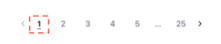

### Widget

* `.ds-widgets`: div esterno
* `.ds-widgets__actions`: div interno lato sinistro
* `.ds-widgets__results`: div interno lato destro

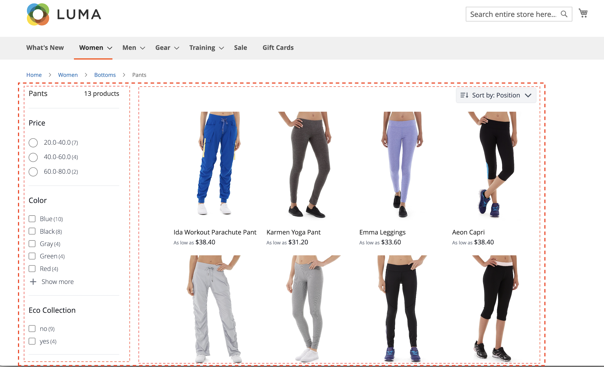

### Menu a discesa Ordina

* `.ds-sdk-sort-dropdown`

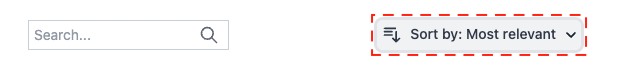

* `.ds-sdk-sort-dropdown__button`

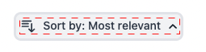

* `.ds-sdk-sort-dropdown__items`

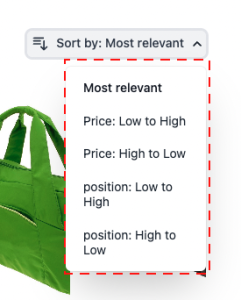

* `.ds-sdk-sort-dropdown__items--item`

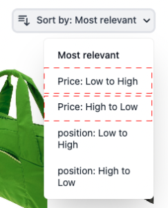

* `.ds-sdk-sort-dropdown__items--item-selected`

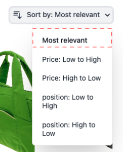

* `.ds-sdk-sort-dropdown__items--item-active`

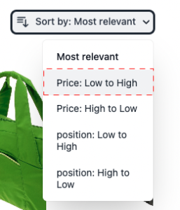

### Facet

* `.ds-plp-facets`
* `.ds-plp-facets__header`
* `.ds-plp-facets__header_title`
* `.ds-plp-facets__header__clear-all`

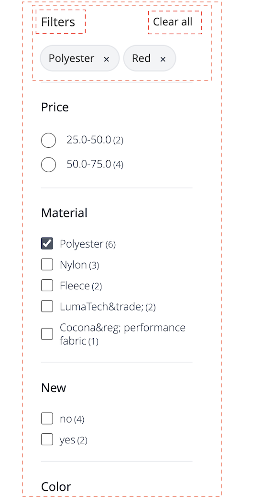{width="350"}

* `.ds-plp-facets__pills`
* `.ds-sdk-pill`

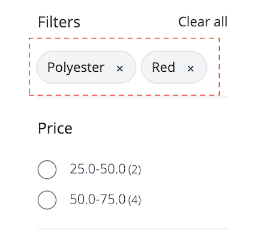{width="350"}

* `.ds-sdk-pill__label`
* `.ds-sdk-pill__cta`

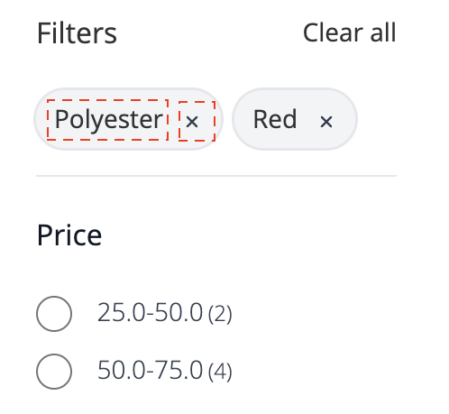{width="350"}

* `.ds-plp-facets__list`

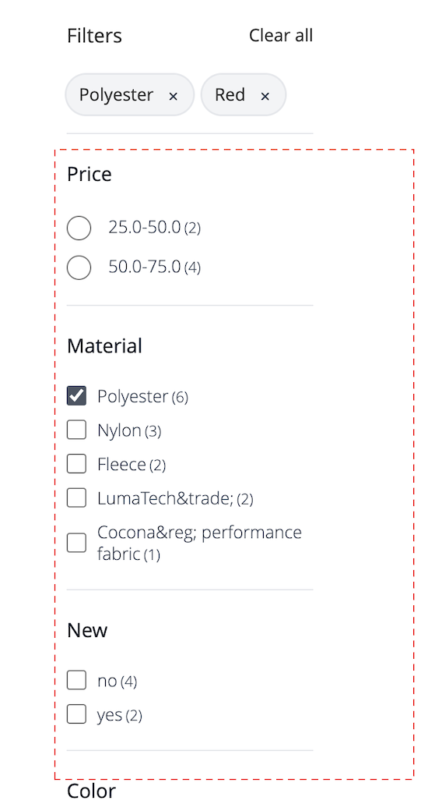{width="350"}

* `.ds-sdk-input`
* `.ds-sdk-input__label`
* `.ds-sdk-input__options`
* `.ds-sdk-input_fieldset_show-more`

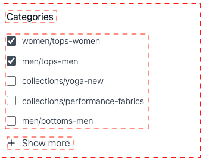

* `.ds-sdk-labelled-input`

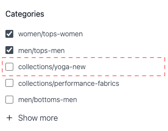

* `.ds-sdk-labelled-input__input`
* `.ds-sdk-labelled-input__label`

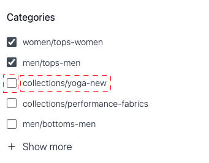

### Elemento prodotto

* `.ds-sdk-product-item`
* `.ds-sdk-product-item__image`
* `.ds-sdk-product-item__product-name`
* `.ds-sdk-product-item__product-options`
* `.ds-sdk-product-price`
   * `.ds-sdk-product-price--no-discount`
   * `.ds-sdk-product-price--grouped`
   * `.ds-sdk-product-price--bundle`
   * `.ds-sdk-product-price--discount`

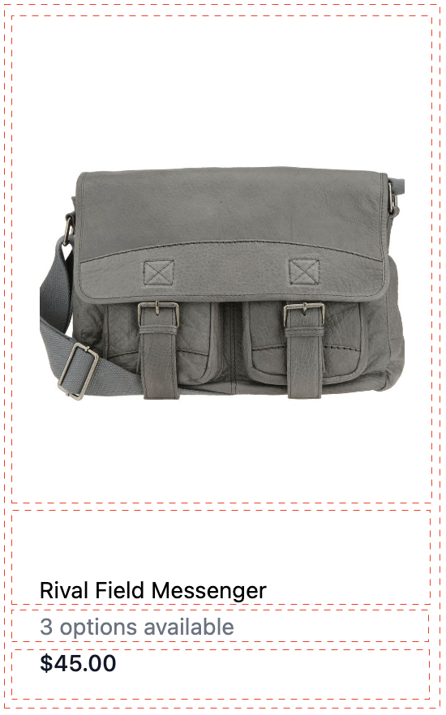

### Caricamento

* `.ds-sdk-loading`
* `.ds-sdk-loading__spinner`
* `.ds-sdk-loading__spinner-label`

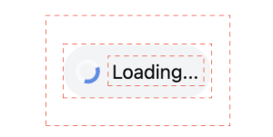
