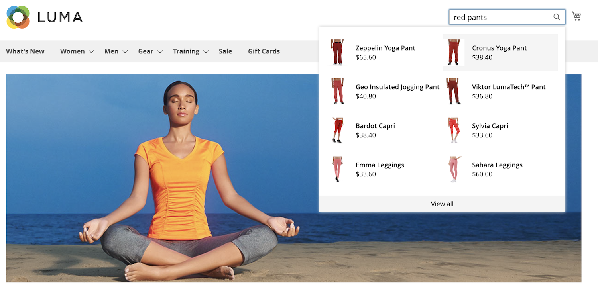

# Presentazione rapida

Con particolare attenzione alla velocità, alla pertinenza e alla facilità d&#39;uso, [!DNL Live Search] è un cambiatore di gioco sia per gli acquirenti che per i commercianti. Segui un rapido tour di [!DNL Live Search] dal negozio.

## Ricerca durante la digitazione

[!DNL Live Search] risponde con i prodotti suggeriti e una miniatura dei risultati della ricerca principale in un [palude](storefront-popover.md) come query di tipo shoppers nel [Ricerca](https://docs.magento.com/user-guide/catalog/search-quick.html) scatola. La [dettaglio del prodotto](https://docs.magento.com/user-guide/quick-tour/product-page.html) quando gli acquirenti fanno clic su un prodotto suggerito o in primo piano. A _Visualizza tutto_ nel piè di pagina del pover viene visualizzata la pagina dei risultati della ricerca.

[!DNL Live Search] restituisce i risultati &quot;search as you type&quot; per una query di due o più caratteri. Per una corrispondenza parziale, il numero massimo di caratteri per parola è 20. Il numero di caratteri nella query non è configurabile. I campi seguenti sono inclusi nel pover: `name`, `sku`e `category_ids`.

## Visualizza tutti i risultati della ricerca

Per elencare tutti i prodotti restituiti dalla query &quot;search as you type&quot;, fai clic su _Visualizza tutto_ nel piè di pagina del pover.

## Ricerca filtrata con facet

La ricerca filtrata utilizza più dimensioni dei valori degli attributi, oppure [facet](facets.md), come criteri di ricerca. La selezione dei filtri è definita dal commerciante e cambia in base ai prodotti restituiti, con i facet più comunemente utilizzati fissati in cima all’elenco.

## Sinonimi

[Sinonimi](synonyms.md) espandere la portata e rendere più nitido lo stato attivo delle query includendo parole che potrebbero essere utilizzate dagli acquirenti diverse da quelle presenti nel catalogo. È possibile ottimizzare il sinonimo di dizionario per mantenere i consumatori impegnati e sul percorso di acquisto.

## Regole di merchandising

Merchandising [regole](rules.md) modellare l’esperienza di acquisto con istruzioni if-then che aggiungono logica ed eventi alla ricerca. È possibile incrementare o seppellire facilmente i prodotti per una promozione, una stagione o un altro periodo di tempo.
