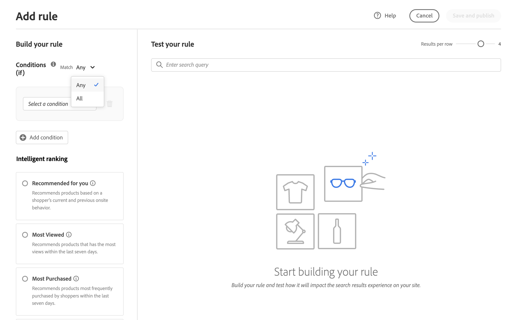
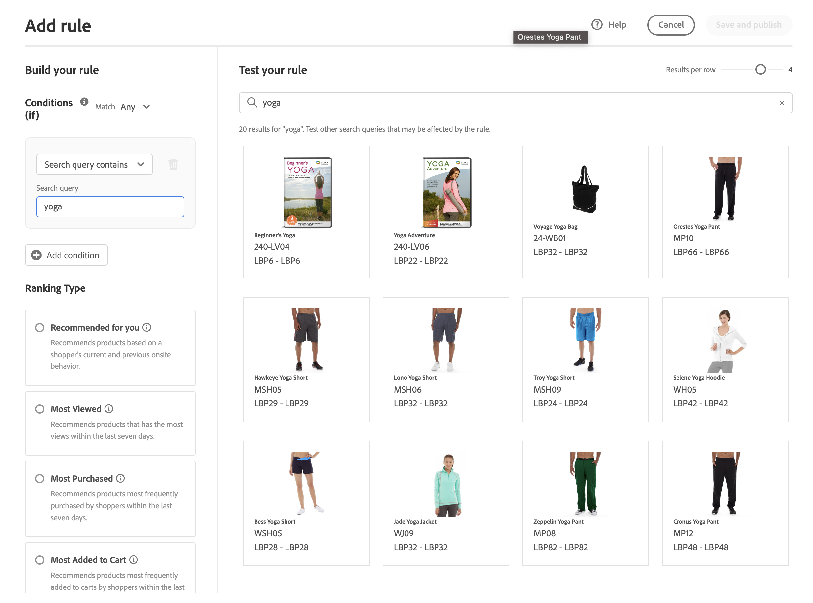
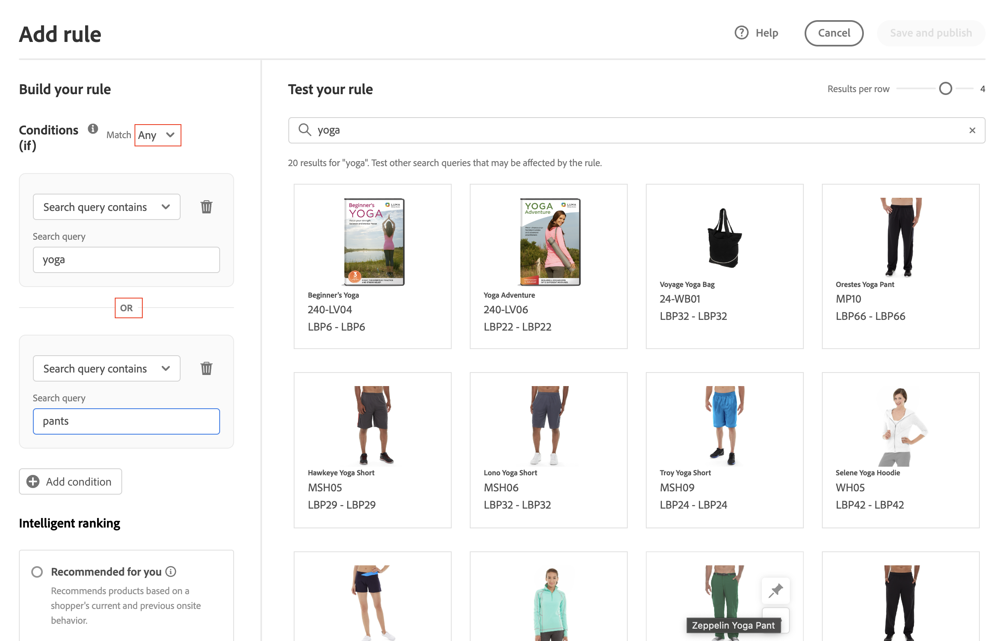
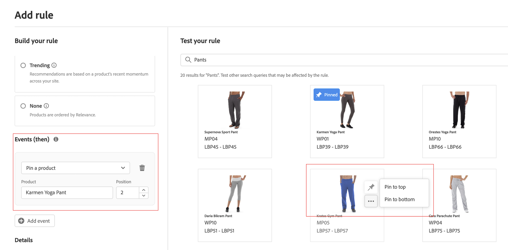
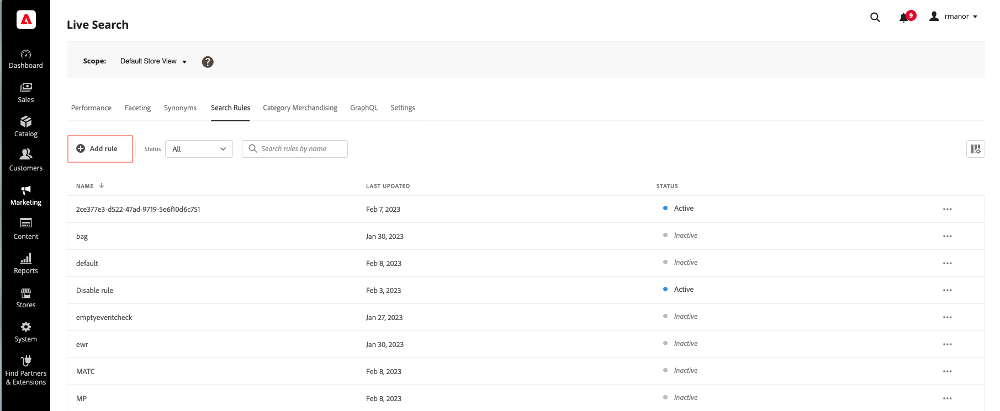

# Aggiungi regole

Per generare una regola, il primo passaggio consiste nell’utilizzare l’editor di regole per definire le condizioni nel testo della query dell’acquirente che attivano gli eventi associati. Quindi, completa i dettagli della regola, verifica i risultati e pubblica la regola.

## Passaggio 1: Aggiungi una regola

1. Nell&#39;Admin, vai a **Marketing** > SEO &amp; Search > **Live Search**.
1. Imposta la **Ambito** per identificare [vista store](https://docs.magento.com/user-guide/configuration/scope.html) dove si applica la regola.
1. Fai clic sul pulsante **Regole** scheda .
1. Fai clic su **Aggiungi regola** per avviare l&#39;editor di regole.

   

## Passaggio 2: Descrivere le condizioni

Le condizioni sono i requisiti per attivare un evento. Una regola può avere fino a dieci condizioni e venticinque eventi.

### Condizione singola

1. Sotto *Creare la regola*, seleziona **Condizione** da soddisfare e seguire le istruzioni per completare la dichiarazione.

   * Ricerca contiene - Immettere la stringa di testo che deve essere presente nella query dell&#39;acquirente. L’impostazione Match (Corrispondenza) determina il grado in cui la query dell’acquirente corrisponde al catalogo. Opzioni:  Any - Qualsiasi parte del testo della query dell&#39;acquirente può corrispondere alla condizione. All - Tutte le query dell&#39;acquirente devono corrispondere alla condizione.
   * La query di ricerca è - Inserisci una stringa di testo che corrisponda esattamente alla query dell’acquirente. Ad esempio: &quot;pantaloni da yoga&quot;. Regole con `Search query is` e Corrispondenza `All` può avere una sola condizione.
   * La query di ricerca inizia con: immetti un carattere o una stringa di testo che deve trovarsi all’inizio della query dell’acquirente.
   * La query di ricerca termina con: immetti un carattere o una stringa di testo che deve trovarsi alla fine della query dell’acquirente.

   I risultati vengono visualizzati immediatamente nel *Verifica la regola* e sono numerati per priorità. È possibile utilizzare *Risultati per riga* cursore in alto a destra per modificare il numero di prodotti in ogni riga.

   

1. Per testare altre query, modifica il testo della query nel *Verifica la regola* casella di ricerca e premere **Ritorno**.
Inizialmente, il riquadro di test esegue il rendering della query dalla casella di ricerca Condizioni. Ma ora sta eseguendo il rendering della query dalla casella di query di test. Il riquadro di test esegue il rendering di una sola query alla volta.

   

1. Se desideri il risultato, aggiorna il testo nella *Condizioni* casella di ricerca. Quindi, fai clic in un punto qualsiasi della pagina per aggiornare i risultati nel riquadro di test.
1. Per creare una regola semplice con una condizione, vai al Passaggio 3: [Aggiungi eventi](#events).

### Condizioni multiple

1. Per creare una regola con più condizioni, fai clic su **Aggiungi condizione**.
Una regola può avere fino a 10 condizioni. L’operatore logico che unisce due condizioni si basa sulla *Corrispondenza* impostazione. Per impostazione predefinita, *Corrispondenza* è `All` e l&#39;operatore logico è `AND`.

   

1. Selezionare la seconda condizione e immettere il testo della query richiesto.

   

1. Per modificare la logica della regola, modifica la variabile **Corrispondenza** impostazione per determinare la corrispondenza tra i criteri di ricerca dell’acquirente e la condizione di query. Imposta **Corrispondenza** in una delle seguenti situazioni:

   * Any - (Predefinito) Tutti gli operatori logici nella regola sono impostati su `OR` e i risultati vengono visualizzati nel riquadro test.
   * All - Tutti gli operatori logici nella regola sono impostati su `AND` e i risultati vengono visualizzati nel riquadro test.

   La *Corrispondenza* determina l&#39;operatore logico utilizzato per unire più condizioni. Modifica della *Corrispondenza* l’impostazione modifica tutti gli operatori logici nella regola. Non è possibile combinare `AND` e `OR` nella stessa regola.
In questo esempio, invece di cercare &quot;pantaloni di yoga&quot;, ci sono due query separate che cercano &quot;yoga&quot; o &quot;pantaloni&quot;. Questa regola è meno specifica e verrà attivata più spesso nella vetrina rispetto all’altra.

   

1. Per aggiungere un’altra condizione, fai clic su **Aggiungi condizione** e ripetere il processo.

## Passaggio 3: Aggiungi eventi

Gli eventi sono azioni che modificano i risultati della ricerca quando le condizioni sono soddisfatte. Una singola regola può contenere fino a venticinque eventi.

1. Sotto *Eventi*, scegli **Evento** da eseguire quando sono soddisfatte le condizioni associate.
Ad esempio, scegli `Pin a product`. Quindi, inserisci il nome del prodotto da fissare. Se hai bisogno di aiuto, puoi trovare il nome nel riquadro di test.
Quindi, inserisci il *Posizione* dove deve apparire il prodotto bloccato. Il prodotto viene spostato nella nuova posizione nel riquadro di test e contrassegnato con un *Fessura* badge anteprima.

   

1. Per più eventi, scegli tutti gli altri eventi che desideri attivare quando vengono soddisfatte le condizioni.

   * Incremento - Selezionare Incremento. Quindi, inserisci il nome del prodotto o lo SKU che desideri spostare più in alto nei risultati della ricerca. Nel riquadro di prova, ogni prodotto potenziato ha un *Aumentato* badge anteprima.
   * Bury - Sposta una SKU più in basso nei risultati della ricerca. Ogni SKU è contrassegnato con un *Sepolto* badge di anteprima nel riquadro di test.
   * Fissa un prodotto - Inserisci il nome del prodotto o SKU. Quindi, seleziona la Posizione nei risultati della ricerca in cui deve essere visualizzato il prodotto. Il prodotto è contrassegnato con un *Fessura* badge di anteprima nel riquadro di test.
   * Nascondere un prodotto - Esclude una SKU dai risultati della ricerca.

## Passaggio 4: Completa i dettagli

Le informazioni immesse in questo campo vengono visualizzate nella sezione [Dettagli regola](rules-workspace.md) pannello.

1. Sotto *Dettagli*, immetti un **Nome** per la regola.
1. Inserisci una breve **Descrizione** della regola.
1. Inserisci il **Data di inizio** e **Data di fine** quando la regola sarà attiva o scegli le date dal calendario.

   Per selezionare un intervallo di date, fai clic sulla prima data e trascina per selezionare l’intervallo.

   

## Passaggio 5: Verifica la regola

1. Esamina i risultati della regola nel riquadro di test.
1. Se la regola dispone di più query, testa ciascuna di esse che potrebbe essere influenzata dalla regola.

## Passaggio 6: Salva e pubblica

Al termine, fai clic su **Salva e pubblica**.
La regola viene aggiunta all&#39;elenco nell&#39;area di lavoro regole. Anche se le regole attive entrano in vigore immediatamente, potrebbero essere necessari fino a quindici minuti perché i risultati delle query memorizzate nella cache vengano aggiornati.

## Descrizioni dei campi

### Condizioni (if)

| Condizione | Descrizione |
|--- |--- |
| La query di ricerca contiene | Un carattere o una stringa di testo inclusi nella query dell’acquirente. Per soddisfare questa condizione, la query dell’acquirente deve corrispondere a un solo carattere. |
| Query di ricerca | Un carattere o una stringa di testo che corrisponde esattamente alla query dell’acquirente. Impossibile comporre query complesse con più condizioni quando si utilizza questa condizione. |
| La query di ricerca inizia con | La query dell’acquirente inizia con questo carattere o stringa di testo. |
| La query di ricerca termina con | La query dell’acquirente termina con questo carattere o stringa di testo. |

### Operatori logici

| Operatore | Descrizione |
|--- |--- |
| O | (Impostazione predefinita) Operatore logico `OR` confronta due condizioni e soddisfa i requisiti per attivare un evento se almeno una condizione è vera. |
| E | Operatore logico `AND` confronta due condizioni e soddisfa i requisiti per attivare un evento se entrambe le condizioni sono vere. |

### Operatori di corrispondenza

| Operatore | Descrizione |
|--- |--- |
| Qualsiasi | Modifica tutti gli operatori logici nella regola in `OR` e restituisce il set di prodotti corrispondenti. |
| Tutto | Modifica tutti gli operatori logici nella regola in `AND` e restituisce il set di prodotti corrispondenti. |

### Eventi

| Evento | Descrizione |
|--- |--- |
| Incremento | Sposta un SKU o un intervallo di SKU più in alto nei risultati della ricerca. Ognuna di esse è contrassegnata da un contrassegno di anteprima &quot;potenziato&quot; nei risultati della ricerca di test. |
| Sepoltura | Sposta un SKU o un intervallo di SKU più in basso nei risultati della ricerca. Ognuna di esse è contrassegnata da un badge di anteprima &quot;sepolto&quot; nei risultati della ricerca di test. |
| Fissare un prodotto | Associa un singolo SKU a una posizione specifica nei risultati della ricerca. Il prodotto viene contrassegnato con un contrassegno di anteprima &quot;bloccato&quot; nei risultati della ricerca di test. |
| Nascondere un prodotto | Esclude una SKU (Stock Keeping Unit) o una gamma di SKU (Stock Keeping Unit) dai risultati della ricerca. |

### Dettagli

| Campo | Descrizione |
|--- |--- |
| Nome | Nome della regola. |
| Data di inizio | La data di inizio della regola, se pianificata. |
| Data di fine | Data di fine della regola, se pianificata. |
| Descrizione | Breve descrizione della regola. |
