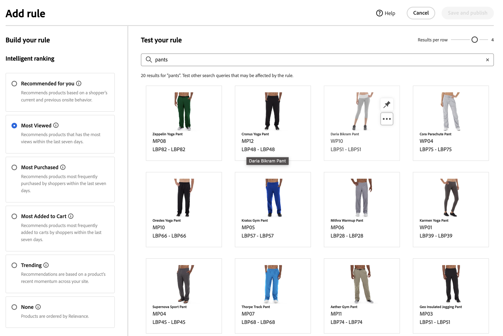

# Aggiungi regole

Per creare una regola, il primo passaggio consiste nell’utilizzare l’editor di regole per definire, nel testo della query dell’acquirente, le condizioni che attivano gli eventi associati. Quindi, completa i dettagli della regola, verifica i risultati e pubblica la regola.

## Aggiungi una regola

1. In Admin (Amministrazione), vai a **Marketing** > SEO e ricerca > **[!DNL Live Search]**.
1. Imposta il **Ambito** per identificare [visualizzazione store](https://experienceleague.adobe.com/docs/commerce-admin/start/setup/websites-stores-views.html#scope-settings) dove si applica la regola.
1. Fai clic su **Regole** scheda.
1. Clic **Aggiungi regola** per avviare l’editor di regole.

## Condizioni

Le condizioni sono i requisiti per attivare un evento. Una regola può avere fino a dieci condizioni e 25 eventi.

>[!NOTE]
>
>Attualmente, non è possibile eseguire il targeting delle regole per un gruppo di clienti specifico.

### Condizione singola

1. Sotto *Creare la regola*, seleziona la **Condizione** e seguire le istruzioni per completare l&#39;istruzione.

   * Query di ricerca contiene: immettere la stringa di testo che deve essere inclusa nella query dell&#39;acquirente. L&#39;impostazione Corrispondenza determina il grado di corrispondenza tra la query dell&#39;acquirente e il catalogo. Opzioni:  Qualsiasi: qualsiasi parte del testo della query dell’acquirente può corrispondere alla condizione. Tutti: tutte le query dell’acquirente devono corrispondere alla condizione.
   * Query di ricerca: immetti una stringa di testo che corrisponda esattamente alla query dell’acquirente. Ad esempio: &quot;pantaloni da yoga&quot;. Regole con `Search query is` e corrisponde a `All` può avere una sola condizione.
   * La query di ricerca inizia con - Inserisci un carattere o una stringa di testo che deve trovarsi all’inizio della query dell’acquirente.
   * La query di ricerca termina con - Immetti un carattere o una stringa di testo che deve trovarsi alla fine della query dell’acquirente.

   I risultati vengono visualizzati immediatamente nella *Verifica la regola* e sono numerati per priorità. È possibile utilizzare *Risultati per riga* cursore in alto a destra per modificare il numero di prodotti in ogni riga.

   

1. Per eseguire il test di altre query, modificare il testo della query in *Verifica la regola* casella di ricerca e premere **Ritorno**.
Inizialmente, il riquadro dei test esegue il rendering della query dalla casella di ricerca Condizioni. Ma ora sta eseguendo il rendering della query dalla casella di query del test. Nel riquadro dei test viene eseguita una sola query alla volta.
1. Se il risultato ti piace, aggiorna il testo nella sezione *Condizioni* casella di ricerca. Quindi, fai clic in un punto qualsiasi della pagina per aggiornare i risultati nel riquadro del test.
1. Per creare una regola semplice con una condizione, passa al passaggio 3: [Aggiungi eventi](#events).

### Condizioni multiple

1. Per creare una regola con più condizioni, fai clic su **Aggiungi condizione**.
Una regola può avere fino a dieci condizioni. L’operatore logico che unisce due condizioni si basa sulla condizione corrente *Corrispondenza* impostazione. Per impostazione predefinita, *Corrispondenza* è `All` e l’operatore logico è `AND`.

   

1. Seleziona la seconda condizione e immetti il testo della query richiesto.

1. Per modificare la logica della regola, modifica il **Corrispondenza** per determinare con quale precisione i criteri di ricerca dell&#39;acquirente devono corrispondere alla condizione di query. Imposta **Corrispondenza** a uno dei seguenti elementi:

   * Qualsiasi - (impostazione predefinita) Tutti gli operatori logici nella regola sono impostati su `OR` e i risultati vengono visualizzati nel riquadro del test.
   * Tutti: tutti gli operatori logici nella regola sono impostati su `AND` e i risultati vengono visualizzati nel riquadro del test.

   Il *Corrispondenza* valore determina l&#39;operatore logico utilizzato per unire più condizioni. Modifica del *Corrispondenza* l&#39;impostazione modifica tutti gli operatori logici della regola. Non è possibile combinare `AND` e `OR` nella stessa regola.

   In questo esempio, invece di cercare &quot;pantaloni yoga&quot;, ci sono due query separate che cercano &quot;yoga&quot; o &quot;pantaloni&quot;. Questa regola è meno specifica e viene attivata più spesso nella vetrina rispetto alle altre.

   

1. Per aggiungere un’altra condizione, fai clic su **Aggiungi condizione** e ripetere il processo.

## Tipo di classificazione

La classificazione combina i comportamenti degli utenti e le statistiche del sito per determinare la classificazione del prodotto.
I proprietari dei negozi possono impostare i seguenti tipi di strategie di classificazione:

* Più acquistati: classifica i prodotti in base agli acquisti totali per SKU nei 7 giorni precedenti.
* La maggior parte è stata aggiunta al carrello, in ordine di attività totali &quot;Aggiungi al carrello&quot; nei 7 giorni precedenti.
* Più visualizzato: classifica le visualizzazioni totali per SKU nei 7 giorni precedenti.
* Consigliato per te - Utilizza il `viewed-viewed` punto dati: gli acquirenti che hanno visualizzato questa SKU hanno esaminato anche queste altre SKU
* Tendenza: considera gli eventi di visualizzazione della pagina delle ultime 72 ore per gli eventi in background e 24 ore per gli eventi in primo piano
* Nessuno: i prodotti sono ordinati in base alla rilevanza

1. Selezionare il tipo di strategia per la regola. Nella finestra Test regola vengono visualizzati i risultati previsti.

## Aggiunta di eventi

Gli eventi sono azioni che modificano i risultati della ricerca quando vengono soddisfatte le condizioni definite. Una singola regola può avere fino a 25 eventi.

* Incrementa: sposta un prodotto più in alto nei risultati di ricerca.
* Intervallo: sposta una SKU in basso nei risultati di ricerca.
* Fissa un prodotto: il prodotto viene visualizzato nella posizione selezionata sulla pagina.
* Nascondi un prodotto: esclude uno SKU dai risultati della ricerca.

Il modo più semplice per fissare un prodotto è tramite trascinamento.

1. Fai clic su un prodotto e trascinalo nel riquadro Test. Trascinalo e rilascialo nella posizione desiderata. I campi Prodotto e Posizione vengono compilati automaticamente nel riquadro Eventi.

   

Puoi anche fare clic sull’icona a forma di pin per fissare un prodotto alla posizione corrente. Utilizza il menu di scelta rapida con puntini di sospensione per &quot;Fissa in alto&quot; o &quot;Fissa in basso&quot;.

Gli eventi OR possono essere impostati manualmente:

1. Sotto *Eventi*, scegli il **Evento** da eseguire quando sono soddisfatte le condizioni associate.

   Ad esempio, scegli `Hide a product`. Quindi, inserisci il nome del prodotto che desideri nascondere. I prodotti vengono suggeriti durante la digitazione.

1. Per più eventi, scegli qualsiasi altro evento che desideri attivare quando vengono soddisfatte le condizioni.

## Dettagli aggiuntivi

Le informazioni immesse vengono visualizzate nel [Dettagli regola](rules-workspace.md) pannello.

1. Sotto *Dettagli*, immetti un **Nome** per la regola. Tutti i nomi delle regole devono essere univoci.
1. Inserisci una descrizione **Descrizione** della regola.
1. Inserisci il **Data di inizio** e **Data di fine** affinché la regola sia attiva o scegli le date dal calendario.

   Per selezionare un intervallo di date, fai clic sulla prima data e trascina per selezionare l’intervallo.

   

## Finalizzazione della regola

1. Esaminare i risultati della regola nel riquadro del test.
1. Se la regola dispone di più query, esegui il test di ciascuna che potrebbe essere interessata dalla regola.
1. Al termine, fai clic su **Salva e pubblica**.

   La regola viene aggiunta all’elenco nell’area di lavoro regole.

1. Anche se le regole attive entrano in vigore immediatamente, potrebbe essere necessario attendere fino a 15 minuti prima che i risultati della query memorizzata nella cache vengano aggiornati nella vetrina.

## Descrizioni dei campi

### Condizioni (if)

| Condizione | Descrizione |
|--- |--- |
| La query di ricerca contiene | Carattere o stringa di testo inclusa nella query dell&#39;acquirente. Per soddisfare questa condizione, la query dell’acquirente deve corrispondere a un solo carattere. |
| Query di ricerca: | Carattere o stringa di testo che corrisponde esattamente alla query dell&#39;acquirente. Non è possibile comporre query complesse con più condizioni quando si utilizza questa condizione. |
| La query di ricerca inizia con | La query del cliente inizia con questo carattere o stringa di testo. |
| La ricerca termina con | La query del cliente termina con questo carattere o stringa di testo. |

### Operatori logici

| Operatore | Descrizione |
|--- |--- |
| OPPURE | Impostazione predefinita. Operatore logico `OR` confronta due condizioni e soddisfa i requisiti per attivare un evento se almeno una condizione è vera. |
| E | Operatore logico `AND` confronta due condizioni e soddisfa i requisiti per attivare un evento se entrambe le condizioni sono vere. |

### Operatori di corrispondenza

| Operatore | Descrizione |
|--- |--- |
| Qualsiasi | Modifica tutti gli operatori logici nella regola in `OR` e restituisce il set di prodotti corrispondenti. |
| Tutti | Modifica tutti gli operatori logici nella regola in `AND` e restituisce il set di prodotti corrispondenti. |

### Eventi

| Evento | Descrizione |
|--- |--- |
| Incrementa | Sposta uno SKU o un intervallo di SKU più in alto nei risultati di ricerca. Ognuno di essi è contrassegnato da un badge di anteprima &quot;potenziato&quot; nei risultati della ricerca di test. |
| Buio | Sposta uno SKU o un intervallo di SKU in un livello inferiore nei risultati di ricerca. Ognuno di essi è contrassegnato da un badge di anteprima &quot;interrato&quot; nei risultati della ricerca di test. |
| Fissa un prodotto | Associa un singolo SKU a una posizione specifica nei risultati della ricerca. Il prodotto è contrassegnato con un badge di anteprima &quot;fissato&quot; nei risultati della ricerca di test. |
| Nascondere un prodotto | Esclude uno SKU, o intervallo di SKU, dai risultati della ricerca. |

### Dettagli

| Campo | Descrizione |
|--- |--- |
| Nome | Nome della regola. I nomi delle regole devono essere univoci. |
| Data di inizio | Data di inizio della regola, se pianificata. |
| Data di fine | Data di fine della regola, se pianificata. |
| Descrizione | Breve descrizione della regola. |
