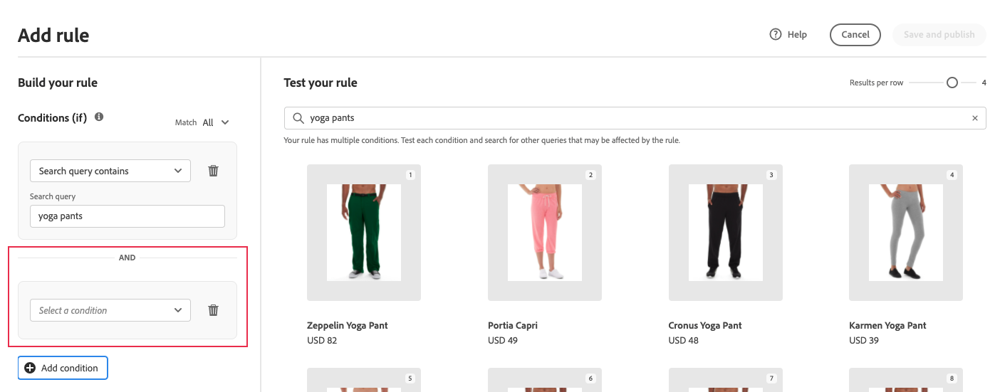

# Aggiungi regole

Per generare una regola, il primo passaggio consiste nell’utilizzare l’editor di regole per definire le condizioni nel testo della query dell’acquirente che attivano gli eventi associati. Quindi, completa i dettagli della regola, verifica i risultati e pubblica la regola.

## Aggiungi una regola

1. Nell&#39;Admin, vai a **Marketing** > SEO &amp; Search > **[!DNL Live Search]**.
1. Imposta la **Ambito** per identificare [vista store](https://experienceleague.adobe.com/docs/commerce-admin/start/setup/websites-stores-views.html#scope-settings) dove si applica la regola.
1. Fai clic sul pulsante **Regole** scheda .
1. Fai clic su **Aggiungi regola** per avviare l&#39;editor di regole.

## Condizioni

Le condizioni sono i requisiti per attivare un evento. Una regola può avere fino a dieci condizioni e 25 eventi.

>[!NOTE]
>
>Attualmente non è possibile eseguire il targeting delle regole per un gruppo di clienti specifico.

### Condizione singola

1. Sotto *Creare la regola*, seleziona **Condizione** da soddisfare e seguire le istruzioni per completare la dichiarazione.

   * Ricerca contiene - Immettere la stringa di testo che deve essere presente nella query dell&#39;acquirente. L’impostazione Match (Corrispondenza) determina il grado in cui la query dell’acquirente corrisponde al catalogo. Opzioni:  Any - Qualsiasi parte del testo della query dell&#39;acquirente può corrispondere alla condizione. All - Tutte le query dell&#39;acquirente devono corrispondere alla condizione.
   * La query di ricerca è - Immettere una stringa di testo che corrisponda esattamente alla query dell&#39;acquirente. Ad esempio: &quot;pantaloni da yoga&quot;. Regole con `Search query is` e Corrispondenza `All` può avere una sola condizione.
   * La query di ricerca inizia con - Inserisci un carattere o una stringa di testo che deve essere all&#39;inizio della query dell&#39;acquirente.
   * La query di ricerca termina con - Immettere un carattere o una stringa di testo che deve trovarsi alla fine della query dell&#39;acquirente.

   I risultati vengono visualizzati immediatamente nel *Verifica la regola* e sono numerati per priorità. È possibile utilizzare *Risultati per riga* cursore in alto a destra per modificare il numero di prodotti in ogni riga.

   

1. Per testare altre query, modifica il testo della query nel *Verifica la regola* casella di ricerca e premere **Ritorno**.
Inizialmente, il riquadro di test esegue il rendering della query dalla casella di ricerca Condizioni. Ma ora sta eseguendo il rendering della query dalla casella di query di test. Il riquadro di test esegue il rendering di una sola query alla volta.
1. Se desideri il risultato, aggiorna il testo nella *Condizioni* casella di ricerca. Quindi, fai clic in un punto qualsiasi della pagina per aggiornare i risultati nel riquadro di test.
1. Per creare una regola semplice con una condizione, vai al Passaggio 3: [Aggiungi eventi](#events).

### Condizioni multiple

1. Per creare una regola con più condizioni, fai clic su **Aggiungi condizione**.
Una regola può avere fino a dieci condizioni. L’operatore logico che unisce due condizioni si basa sulla *Corrispondenza* impostazione. Per impostazione predefinita, *Corrispondenza* è `All` e l&#39;operatore logico è `AND`.

   

1. Selezionare la seconda condizione e immettere il testo della query richiesto.

1. Per modificare la logica della regola, modifica la variabile **Corrispondenza** impostazione per determinare la corrispondenza tra i criteri di ricerca dell’acquirente e la condizione di query. Imposta **Corrispondenza** in una delle seguenti situazioni:

   * Any - (Predefinito) Tutti gli operatori logici nella regola sono impostati su `OR` e i risultati vengono visualizzati nel riquadro test.
   * All - Tutti gli operatori logici nella regola sono impostati su `AND` e i risultati vengono visualizzati nel riquadro test.

   La *Corrispondenza* determina l&#39;operatore logico utilizzato per unire più condizioni. Modifica della *Corrispondenza* l’impostazione modifica tutti gli operatori logici nella regola. Non è possibile combinare `AND` e `OR` nella stessa regola.

   In questo esempio, invece di cercare &quot;pantaloni di yoga&quot;, ci sono due query separate che cercano &quot;yoga&quot; o &quot;pantaloni&quot;. Questa regola è meno specifica e viene attivata più spesso nella vetrina rispetto all&#39;altra.

   

1. Per aggiungere un’altra condizione, fai clic su **Aggiungi condizione** e ripetere il processo.

## Tipo di classificazione

La classificazione combina i comportamenti degli utenti e le statistiche del sito per determinare la classificazione del prodotto.
I proprietari dei negozi possono impostare i seguenti tipi di strategie di classificazione:

* Più acquistati: Questo classifica i prodotti per gli acquisti totali per SKU nei 7 giorni precedenti.
* La maggior parte aggiunto al carrello - Ranks in ordine di attività totali &quot;Aggiungi al carrello&quot; nei 7 giorni precedenti.
* Più visualizzati: Classifica le visualizzazioni totali per SKU nei 7 giorni precedenti.
* Consigliato per te - Utilizza il `viewed-viewed` data point - Gli acquirenti che hanno visualizzato questa SKU hanno guardato anche questi altri SKU
* Tendenza: Osserva gli eventi di visualizzazione della pagina nelle ultime 72 ore per gli eventi in background e 24 ore per gli eventi in primo piano
* Nessuno: I prodotti sono ordinati per rilevanza

1. Seleziona il tipo di strategia per la regola. Nella finestra Prova la regola vengono visualizzati i risultati previsti.

## Aggiunta di eventi

Gli eventi sono azioni che modificano i risultati della ricerca quando vengono soddisfatte determinate condizioni. Una singola regola può contenere fino a 25 eventi.

* Incremento : sposta un prodotto più in alto nei risultati della ricerca.
* Bury - Sposta una SKU più in basso nei risultati della ricerca.
* Fissa un prodotto - Il prodotto viene visualizzato nella &quot;Posizione&quot; selezionata sulla pagina.
* Nascondere un prodotto - Esclude una SKU dai risultati della ricerca.

Il modo più semplice per fissare un prodotto è mediante trascinamento.

1. Fai clic e trascina un prodotto nel riquadro Test . Trascinala nella posizione desiderata. I campi Prodotto e Postione vengono compilati automaticamente nel riquadro Eventi.

   

Puoi anche fare clic sull’icona a forma di pin per fissare un prodotto alla posizione corrente. Utilizzare il menu di scelta rapida dei puntini di sospensione per &quot;Fissa in alto&quot; o &quot;Fissa in basso&quot;.

>[!NOTE]
>
>Puoi bloccare solo i prodotti restituiti nella query.

Oppure gli eventi possono essere impostati manualmente:

1. Sotto *Eventi*, scegli **Evento** da effettuare quando sono soddisfatte le condizioni associate.

   Ad esempio, scegli `Hide a product`. Quindi, inserisci il nome del prodotto che desideri nascondere. I prodotti vengono suggeriti durante la digitazione.

1. Per più eventi, scegli tutti gli altri eventi che desideri attivare quando vengono soddisfatte le condizioni.

## Dettagli aggiuntivi

Le informazioni immesse in questo campo vengono visualizzate nella sezione [Dettagli regola](rules-workspace.md) pannello.

1. Sotto *Dettagli*, immetti un **Nome** per la regola. Tutti i nomi delle regole devono essere univoci.
1. Inserisci una breve **Descrizione** della regola.
1. Inserisci il **Data di inizio** e **Data di fine** affinché la regola sia attiva o scegli le date dal calendario.

   Per selezionare un intervallo di date, fai clic sulla prima data e trascina per selezionare l’intervallo.

   

## Finalizzazione della regola

1. Esamina i risultati della regola nel riquadro di test.
1. Se la regola dispone di più query, testa ciascuna di esse che potrebbe essere influenzata dalla regola.
1. Al termine, fai clic su **Salva e pubblica**.

   La regola viene aggiunta all&#39;elenco nell&#39;area di lavoro regole.

1. Sebbene le regole attive diventino immediatamente attive, potrebbe essere necessario attendere fino a 15 minuti prima che i risultati della query memorizzata nella cache vengano aggiornati.

## Descrizioni dei campi

### Condizioni (if)

| Condizione | Descrizione |
|--- |--- |
| La query di ricerca contiene | Un carattere o una stringa di testo inclusi nella query dell&#39;acquirente. Per soddisfare questa condizione, la query dell’acquirente deve corrispondere a un solo carattere. |
| Query di ricerca | Un carattere o una stringa di testo che corrisponde esattamente alla query dell&#39;acquirente. Impossibile comporre query complesse con più condizioni quando si utilizza questa condizione. |
| La query di ricerca inizia con | La query dell&#39;acquirente inizia con questo carattere o stringa di testo. |
| La query di ricerca termina con | La query dell&#39;acquirente termina con questo carattere o stringa di testo. |

### Operatori logici

| Operatore | Descrizione |
|--- |--- |
| O | (Impostazione predefinita) Operatore logico `OR` confronta due condizioni e soddisfa i requisiti per attivare un evento se almeno una condizione è vera. |
| E | Operatore logico `AND` confronta due condizioni e soddisfa i requisiti per attivare un evento se entrambe le condizioni sono vere. |

### Operatori di corrispondenza

| Operatore | Descrizione |
|--- |--- |
| Qualsiasi | Modifica tutti gli operatori logici nella regola in `OR` e restituisce il set di prodotti corrispondenti. |
| Tutto | Modifica tutti gli operatori logici nella regola in `AND` e restituisce il set di prodotti corrispondenti. |

### Eventi

| Evento | Descrizione |
|--- |--- |
| Incremento | Sposta un SKU o un intervallo di SKU più in alto nei risultati della ricerca. Ognuno di essi è contrassegnato con un contrassegno di anteprima &quot;potenziato&quot; nei risultati della ricerca di test. |
| Sepoltura | Sposta un SKU o un intervallo di SKU più in basso nei risultati della ricerca. Ognuno di essi è contrassegnato con un badge di anteprima &quot;sepolto&quot; nei risultati della ricerca di test. |
| Fissare un prodotto | Associa un singolo SKU a una posizione specifica nei risultati della ricerca. Il prodotto viene contrassegnato con un contrassegno di anteprima &quot;bloccato&quot; nei risultati della ricerca di prova. |
| Nascondere un prodotto | Esclude una SKU (Stock Keeping Unit) o una gamma di SKU (Stock Keeping Unit) dai risultati della ricerca. |

### Dettagli

| Campo | Descrizione |
|--- |--- |
| Nome | Nome della regola. I nomi delle regole devono essere univoci. |
| Data di inizio | La data di inizio della regola, se pianificata. |
| Data di fine | Data di fine della regola, se pianificata. |
| Descrizione | Breve descrizione della regola. |
