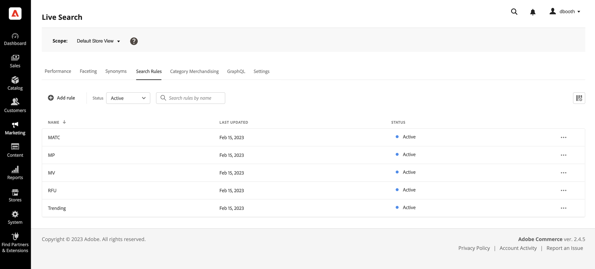
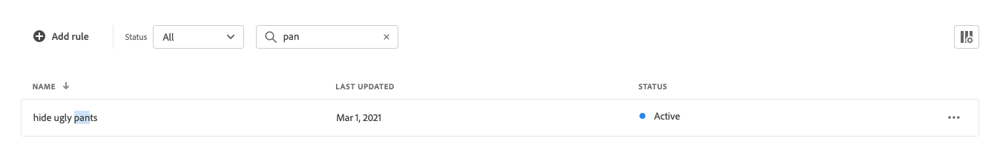
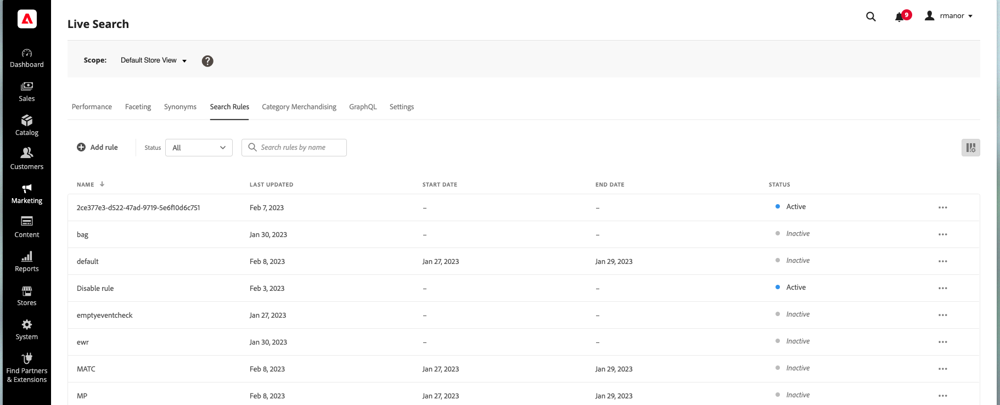

# Area di lavoro regole

L’area di lavoro regole elenca la selezione corrente di regole e il relativo stato e fornisce l’accesso agli strumenti necessari per creare e gestire le regole. Dall’area di lavoro puoi effettuare le seguenti operazioni:

* Cercare regole
* Visualizza dettagli regola
* Attivare/disattivare le regole
* Eliminare le regole
* Accedere all’editor di regole

## Imposta l&#39;ambito

Se l&#39;installazione di Adobe Commerce include più viste Store, imposta **Ambito** al [vista store](https://docs.magento.com/user-guide/configuration/scope.html) dove si applicano le tue regole.

## Mostra/nascondi colonne

1. Nell’angolo in alto a destra, fai clic su **Mostra/nascondi**  colonne.
Le colonne visibili dispongono di un segno di spunta blu nel menu delle opzioni. Il nome della regola è l’unica colonna che non può essere nascosta.

   

1. Nel menu , effettua una delle seguenti operazioni:

   * Per visualizzare una colonna nascosta, fare clic su un nome di colonna senza un segno di spunta.
   * Per nascondere una colonna visibile, fare clic su un nome di colonna con un segno di spunta.

   

## Filtrare le regole per stato

1. Se il tuo negozio dispone di molte regole, puoi filtrare le regole per stato per accorciare l&#39;elenco. Per impostazione predefinita, nell’elenco Regole vengono visualizzate tutte le regole.

   

1. Per elencare solo le regole con un&#39;impostazione di stato specifica, imposta **Stato** in una delle seguenti situazioni:

   * Tutto
   * Attivo
   * Inattivo
   * Pianificato

   

## Cerca regole per nome

Inizia a digitare il nome della regola o qualsiasi parola nel nome della regola.
Ricerca trova le regole corrispondenti durante la digitazione. La stringa di caratteri corrispondenti viene evidenziata nel nome di ogni regola trovata.

## Visualizza dettagli

Il pannello dei dettagli mostra il nome della regola, lo stato, le condizioni e gli eventi, la data di inizio e di fine, la descrizione e la data dell’ultima modifica. Le regole possono essere abilitate, modificate ed eliminate dal pannello dei dettagli.

1. Sulla *Regole* trova la regola nella griglia che desideri visualizzare e fai clic su **Altro** (...)
1. Fai clic su **Visualizza dettagli**.
Dal pannello Visualizza dettagli puoi effettuare una delle seguenti operazioni:

   * Modifica regola
   * Elimina regola
   * Attiva/Disattiva regola

1. Per chiudere la *Visualizza dettagli* pannello, fai clic su **Chiudi** (X) nell&#39;angolo superiore destro.

   

## Descrizioni delle colonne

| Colonna | Descrizione |
|--- |--- |
| Nome | Nome della regola. |
| Ultimo aggiornamento | Data dell’ultimo aggiornamento della regola. |
| Data di inizio | Data di inizio di una regola pianificata. |
| Data di fine | Data di fine di una regola pianificata. |
| Stato | Lo stato con codice a colori indica lo stato corrente della regola. Utilizzare il controllo Stato sopra la griglia per filtrare le regole in base allo stato. Valori: Tutto lo stato - Visualizza tutte le regole indipendentemente dallo stato. Attivo (blu) - Visualizza solo le regole attive. Pianificato (Arancione) - visualizza solo le regole pianificate. Inattivo (grigio) - visualizza solo le regole inattive. |

## Controlli

| Controllo | Descrizione |
|--- |--- |
| Aggiungi regola | Apre la [editor di regole](rules-add.md). |
| Stato | Filtra l’elenco delle regole per stato. Opzioni: Tutto, Attivo, Inattivo, Pianificato |
|  | Specifica le colonne visibili nella griglia. Opzioni: Ultimo aggiornamento, Data di inizio, Data di fine, Stato |
| Ricerca | Cerca una regola per nome completo o per corrispondenza parziale. |
|  | Visualizza un menu contenente altre azioni che possono essere applicate alla regola selezionata. Opzioni: Modifica, Visualizza dettagli, Elimina |

## Dettagli regola

| Campo | Descrizione |
|--- |--- |
| Stato | Lo stato corrente della regola. |
| Condizioni | Query di ricerca che descrive le condizioni associate alla regola. |
| Data di inizio | Data in cui la regola entra in vigore, se pianificata. |
| Data di fine | Data di scadenza della regola, se pianificata. |
| Descrizione | Breve descrizione della regola. |
| Ultimo aggiornamento | Data e ora dell’ultimo aggiornamento della regola. |
| Abilitato | Controllo che modifica lo stato della regola. Opzioni: Abilitato/Disabilitato |
