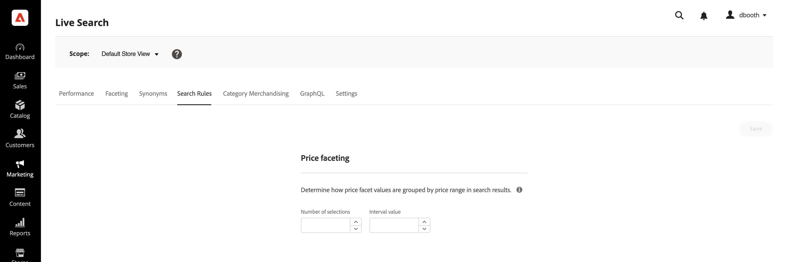

# Impostazioni

Utilizza la *Impostazioni* per configurare gli intervalli e gli intervalli dei facet del prezzo disponibili come filtri di ricerca nella vetrina. Le impostazioni dei facet di prezzo sono statiche anziché dinamiche e non sono basate sui risultati della ricerca.
È possibile specificare il numero di gruppi di fascia di prezzo e come i valori di prezzo vengono distribuiti tra loro. Ogni fascia di prezzo si sovrappone al gruppo precedente di uno. Ad esempio, cinque gruppi con un intervallo di venti crea le seguenti fasce di prezzo: 0-20, 20-40, 40-60, 60-80 e >80. Se nel catalogo non sono presenti prodotti sufficienti per tutti gli intervalli definiti, la visualizzazione dei gruppi disponibili viene regolata di conseguenza. Ad esempio: 0-20, 60-80, >80.

## Configurare i raggruppamenti di facet del prezzo

1. Nell&#39;Admin, vai a **Marketing** > *SEO e ricerca* > **Live Search**.
1. Sulla **Impostazioni** scheda sotto *Orientamento del prezzo*, procedi come segue:
   * Inserisci il **Numero di selezioni** o i raggruppamenti di prezzi da rendere disponibili. È possibile definire fino a 50 raggruppamenti di prezzo.
   * Inserisci il **Valore intervallo** o fascia di prezzo per ciascun gruppo. Il valore massimo è 10.000.
1. Fai clic su **Salva**.
Sono necessari circa quindici minuti perché le impostazioni aggiornate siano disponibili nella vetrina.

## Descrizioni dei campi

| Campo | Descrizione |
|--- |--- |
| Numero di selezioni | Specifica il numero di raggruppamenti per fascia di prezzo che possono essere utilizzati come filtri di ricerca nella vetrina. Valore predefinito: 8, Valore massimo: 50 |
| Valore intervallo | Specifica l&#39;intervallo di prezzo per ciascun gruppo. Ad esempio, cinque selezioni con un valore di intervallo di venti creano cinque raggruppamenti di 0-20, 20-40, 40-60, 60-80 e >80. Valore predefinito: 5, Valore massimo: 10.000 |
