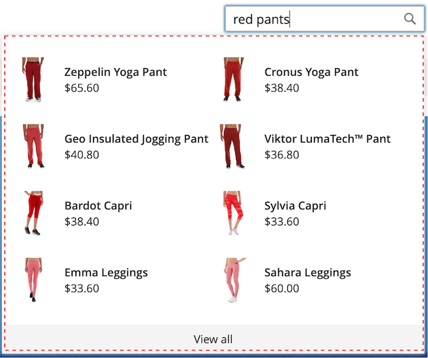
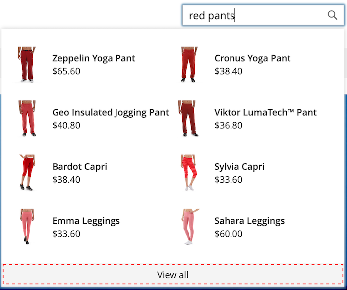
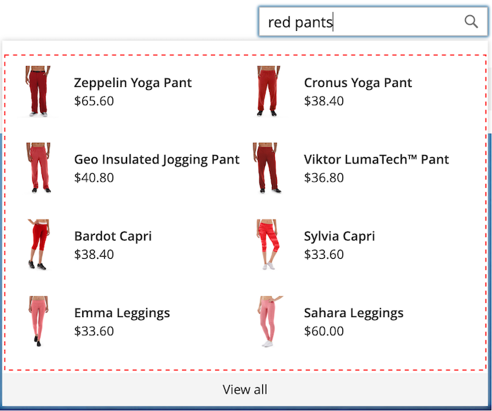
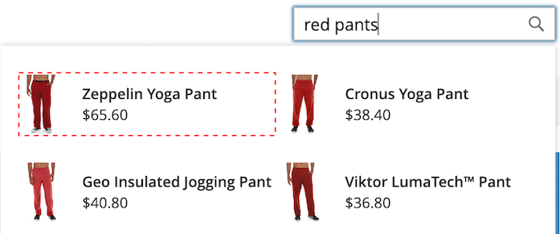
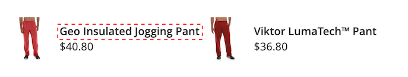

# Stile degli elementi pover

La [pover di vetrina](storefront-popover.md) visualizza sempre il prodotto `name` e `price`e la selezione dei campi non è configurabile. Tuttavia, gli elementi del pover possono essere formattati utilizzando le classi CSS. Ad esempio, nelle dichiarazioni seguenti viene modificato il colore di sfondo del contenitore e del piè di pagina.

```css
.livesearch.popover-container {
    background-color: lavender;
}

.livesearch.view-all-footer {
    background-color: magenta;
}
```

## Visibilità dei contenitori

Il componente principale del `.livesearch.popover-container` è `.search-autocomplete`.  La `.active` Classe indica la visibilità del contenitore. La `.active` La classe viene aggiunta in modo condizionale quando il puntatore è aperto.

```css
.search-autocomplete.active   /* visible */
.search-autocomplete          /* not visible */
```

Per ulteriori informazioni sullo stile degli elementi della vetrina, consulta [Fogli di stile a cascata (CSS)](https://devdocs.magento.com/guides/v2.4/frontend-dev-guide/css-topics/css-overview.html) in [Guida per gli sviluppatori di Frontend](https://devdocs.magento.com/guides/v2.4/frontend-dev-guide/bk-frontend-dev-guide.html).

## Selettori di classe

I seguenti selettori di classe possono essere utilizzati per assegnare uno stile agli elementi contenitore, suggerimento e prodotto nel browser.

* `.livesearch.popover-container`
* `.livesearch.view-all-footer`
* `.livesearch.suggestions-container`
* `.livesearch.suggestions-header`
* `.livesearch.suggestion`
* `.livesearch.products-container`
* `.livesearch.product-result`
* `.livesearch.product-name`
* `.livesearch.product-price`

### Selettori classe contenitore

`.livesearch.popover-container`



`.livesearch.view-all-footer`



### Selettori delle classi di suggerimenti

`.livesearch.suggestions-container`


`.livesearch.suggestions-header`


`.livesearch.suggestion`


### Selettori della classe di prodotto

`.livesearch.products-container`


`.livesearch.product-result`


`.livesearch.product-name`


`.livesearch.product-price`


## Utilizzo di un tema modificato {#working-with-modified-theme}

Il pover della vetrina può essere utilizzato con un [tema](https://devdocs.magento.com/guides/v2.3/frontend-dev-guide/themes/theme-overview.html) che eredita i file richiesti da *Luma*. La `top.search` bloccare `header-wrapper` del `Magento_Search` Impossibile modificare il modulo.

```html
<referenceContainer name="header-wrapper">
   <block class="Magento\Framework\View\Element\Template" name="top.search" as="topSearch" template="Magento_Search::form.mini.phtml">
      <arguments>
         <argument name="configProvider" xsi:type="object">Magento\Search\ViewModel\ConfigProvider</argument>
      </arguments>
   </block>
</referenceContainer>
```

## Disattivazione del pover

Per disabilitare il popover e ripristinare lo standard [Ricerca rapida](https://docs.magento.com/user-guide/catalog/search-quick.html) , immetti il comando seguente:

```bash
bin/magento module:disable Magento_LiveSearchStorefrontPopover
```
