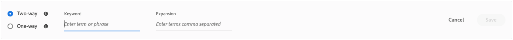
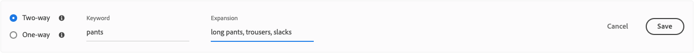
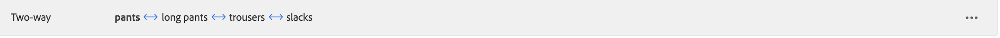
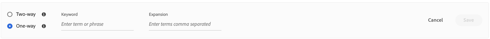
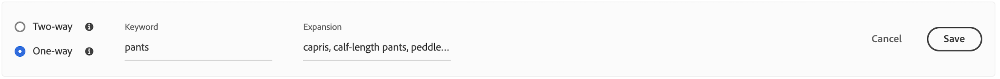
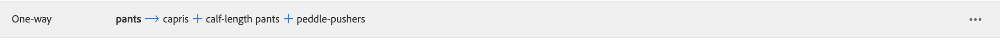

# Aggiungi sinonimi

Aumentare il coinvolgimento dei clienti aggiungendo un elenco personalizzato di [!DNL Live Search] sinonimi. [!DNL Live Search] può gestire fino a 200 sinonimi per `Data Space ID`.

![[!DNL Live Search] sinonimi](assets/synonym-workspace.png)

## Passaggio 1: aggiungere un sinonimo

1. In Admin (Amministrazione), vai a **Marketing** > SEO e ricerca > **[!DNL Live Search]**.
1. Per più store, imposta **Ambito** al [visualizzazione store](https://experienceleague.adobe.com/docs/commerce-admin/start/setup/websites-stores-views.html#scope-settings) dove si applicano le impostazioni del sinonimo.
1. Fai clic su **Sinonimi** scheda.
1. Fai clic su **Aggiungi sinonimi** pulsante.

## Passaggio 2: definire il sinonimo per tipo

Seguire le istruzioni per [tipo di sinonimo](synonyms-type.md) che desideri creare.

### Sinonimo bidirezionale

1. Accetta il valore predefinito **Bidirezionale** opzione.

   

1. Inserisci il **Parola chiave** termine o frase da associare.
1. Inserisci il **Espansione** termini da aggiungere come sinonimi per la parola chiave. Separa più termini con una virgola.
In questo esempio, la parola chiave da associare è &quot;pantaloni&quot; e l&#39;insieme dei termini di espansione sono &quot;pantaloni lunghi, pantaloni, pantaloni allungati&quot;.

   

1. Al termine, fai clic su **Salva**.
Il set di sinonimi viene visualizzato nell&#39;elenco con una freccia bidirezionale tra ciascun termine, il che significa che i termini sono intercambiabili.

   

### Sinonimo unidirezionale

1. Fai clic su **Unidirezionale** tipo di sinonimo.

   

1. Inserisci il **Parola chiave** e **Espansione** termini. Separa più termini con una virgola.

   

   In questo esempio, la parola chiave è &quot;pantaloni&quot; e i termini di espansione unidirezionale &quot;capri, pantaloni a lunghezza di polpaccio, spintori a pedale&quot; sono ciascuno un sottoinsieme di &quot;pantaloni&quot;, ma con un significato specifico.

1. Al termine, fai clic su **Salva**.
Il set di sinonimi viene visualizzato nell&#39;elenco con una freccia unidirezionale che punta dai termini di espansione alla parola chiave per indicare che i termini sono sottoinsiemi della parola chiave. Un segno più separa ogni termine di espansione.

   

## Passaggio 3: Pubblicare le modifiche

1. Una volta completati i sinonimi, fare clic su **Pubblica modifiche**.
1. Attendi fino a due ore prima che gli aggiornamenti diventino disponibili nella vetrina.

## Descrizioni campi

| Campo | Descrizione |
|--- |--- |
| [Tipo](synonyms.md) | Determina se i sinonimi hanno lo stesso significato della parola chiave o sono un sottoinsieme della parola chiave. Opzioni: Bidirezionale (impostazione predefinita): termini che hanno lo stesso significato della parola chiave e restituiscono gli stessi risultati di ricerca Unidirezionale: termini che costituiscono un sottoinsieme della parola chiave. I sinonimi unidirezionali restituiscono un elenco più ristretto di prodotti specifici. |
| Parola chiave | Parola comunemente associata a una selezione di prodotti nel catalogo. |
| Espansione | Termini aggiuntivi che hanno lo stesso significato o un significato simile della parola chiave. |
