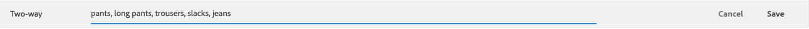

# Gestisci sinonimi

Segui queste istruzioni per gestire le [!DNL Live Search] [sinonimi](synonyms.md).

## Trova sinonimo

Per semplificare la ricerca di un sinonimo, puoi filtrare l’elenco per tipo e cercare per parola chiave o termine di espansione.  Questi metodi possono essere utilizzati singolarmente o insieme.

1. Per filtrare l’elenco, imposta **Tipo** in una delle seguenti situazioni:

   * Tutto
   * unidirezionale
   * A due vie

1. Per cercare una parola chiave o un termine di espansione, immettere almeno tre caratteri in **Ricerca per** scatola.

## Modifica sinonimo

1. Trova il sinonimo da modificare e fai clic su **Altro** Opzioni (..).

1. Fai clic su **Modifica**.
La parola chiave è il primo termine dell’elenco e ogni termine è separato da una virgola. È possibile aggiornare la parola chiave e i termini di espansione, ma non è possibile modificare il tipo del sinonimo.
1. Fare clic sull&#39;elemento da modificare. Quindi, aggiorna il testo in base alle esigenze.

   

1. Al termine, fai clic su **Salva**.

## Elimina sinonimo

1. Trova il sinonimo da eliminare nell’elenco e fai clic su **Altro** Opzioni (..).
1. Fai clic su **Elimina**.
1. Quando richiesto, fai clic su **Elimina sinonimo** per confermare.

## Pubblicare le modifiche

Per completare il processo, le modifiche salvate devono essere pubblicate nella vetrina. Gli aggiornamenti possono richiedere fino a due ore per essere live.

1. Fai clic su **Pubblicare le modifiche**.
1. Cerca il messaggio nella parte superiore della pagina che conferma che le modifiche sono state pubblicate.
