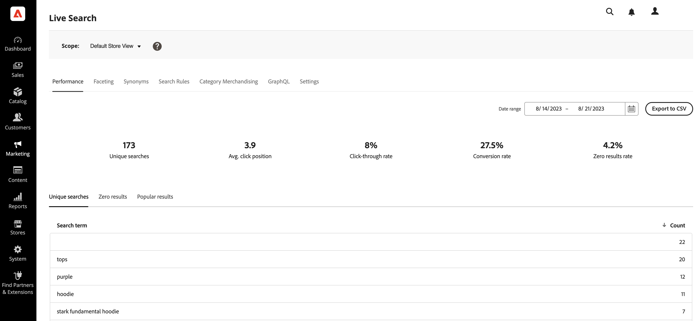

# [!DNL Live Search] Workspace

Nell’area di lavoro puoi configurare, gestire e monitorare le prestazioni di [!DNL Live Search]. Il menu nella parte superiore fornisce l’accesso agli strumenti in ogni area funzionale.  Le funzioni disponibili riflettono la selezione del menu corrente.

## Impostare l&#39;ambito

Inizialmente il [ambito](https://experienceleague.adobe.com/docs/commerce-admin/start/setup/websites-stores-views.html#scope-settings) di tutti [!DNL Live Search] è impostato su `Default Store View`. Se il [!DNL Commerce] l&#39;installazione include più visualizzazioni dello store, set **Ambito** al [visualizzazione store](https://experienceleague.adobe.com/docs/commerce-admin/start/setup/websites-stores-views.html) dove si applicano le impostazioni facet.

## Opzioni menu

| Opzione | Descrizione |
|--- |--- |
| [Prestazioni](performance.md) | Il dashboard fornisce informazioni approfondite sulle prestazioni di ricerca del prodotto. |
| [Faceting](facets.md) | Filtraggio ad alte prestazioni che utilizza più dimensioni di valori di attributo per perfezionare i criteri di ricerca. |
| [Sinonimi](synonyms.md) | Estendi la portata della ricerca per includere le parole che gli acquirenti potrebbero usare per trovare prodotti diversi da quelli nel catalogo. |
| [Regole di ricerca](rules.md) | Forma l’esperienza di ricerca con regole logiche che attivano le azioni pianificate. Puoi promuovere, seppellire, fissare o nascondere i prodotti per calibrare i risultati della ricerca e supportare gli obiettivi aziendali. |
| [Merchandising categorie](category-merch.md) | Applica la regola e il merchandising intelligente a livello di categoria. |
| [GraphQL](https://developer.adobe.com/commerce/webapi/graphql/schema/live-search/) | Gli sviluppatori che hanno effettuato l’accesso all’amministratore del tuo archivio possono comporre e verificare le query con i dati del catalogo effettivo. Per ulteriori informazioni, consulta [Panoramica di GraphQL](https://developer.adobe.com/commerce/webapi/graphql/) nel [!DNL Live Search] documentazione per gli sviluppatori. |
| [Impostazioni](settings.md) | Determinare il modo in cui i valori del facet di prezzo vengono raggruppati per intervallo di prezzi nella vetrina. |
