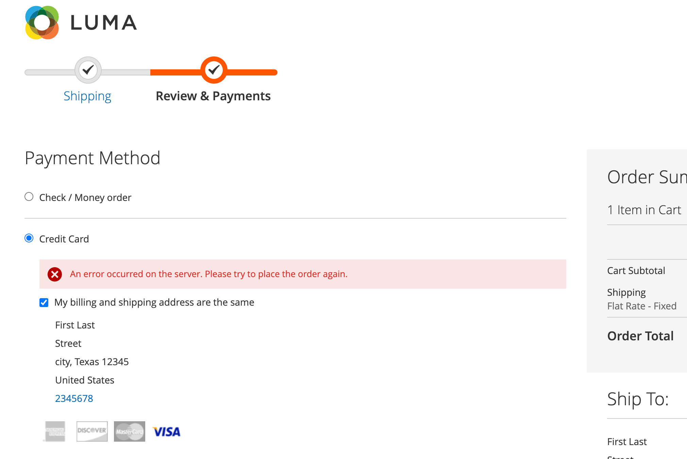
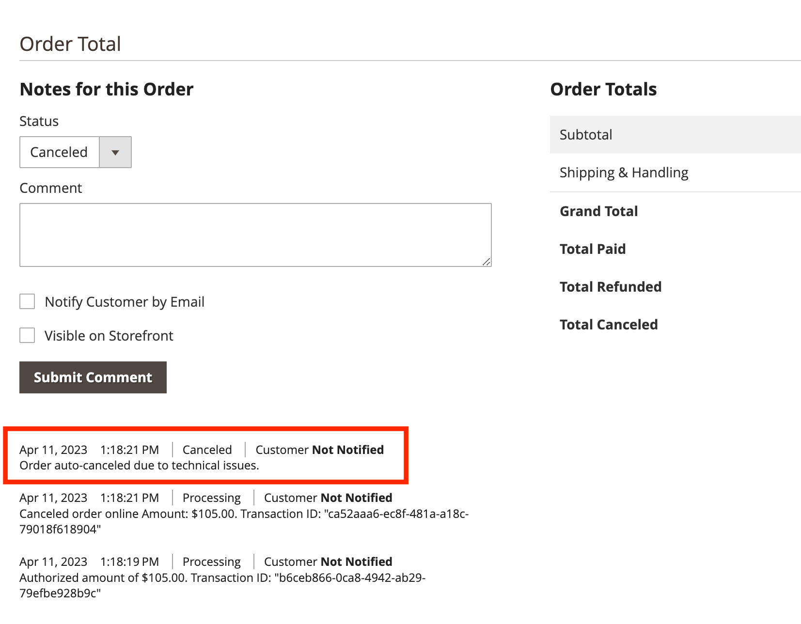

# Pagamento

Puoi configurare il pagamento per Adobe Commerce [!DNL Payment Services] per soddisfare al meglio i vostri acquirenti. Funzionalità come [annullamento automatico ordine](#order-auto-voided-if-error) e [vaulting con carta di credito](#credit-card-vaulting) assicurati che i tuoi acquirenti abbiano un&#39;esperienza d&#39;uso fluida.

## Ordine annullato automaticamente in caso di errore

Se si verifica un errore durante l&#39;estrazione, [!DNL Payment Services] annulla/annulla automaticamente l&#39;ordine.

Nella pagina di pagamento viene visualizzato un messaggio di errore per l’acquirente. Il messaggio può variare.

Un commento relativo all’ordine annullato viene visualizzato anche nell’Amministratore per un [ordine](https://experienceleague.adobe.com/docs/commerce-admin/stores-sales/order-management/orders/orders.html?lang=en).

Se un acquirente ottiene l’autorizzazione per un ordine, ma l’ordine non è stato creato e convertito in un `Capture`, l’ordine viene annullato automaticamente. Questo processo assicura che non venga riservato alcun credito sulla carta di credito dell&#39;acquirente ed evita la commissione che si verifica quando l&#39;autorizzazione viene annullata al termine del periodo standard di 29 giorni.

>[!NOTE]
>
>L&#39;annullamento automatico dell&#39;ordine si verifica solo quando il cliente utilizza un metodo di pagamento impostato su `Authorize` modalità, non `Authorize and Capture` modalità.

## Ritira dalla pagina del prodotto

Quando un cliente effettua il check-out direttamente dalla pagina del prodotto, utilizzando PayPal o [!DNL Pay Later] , viene acquistato solo l&#39;articolo rappresentato nella pagina del prodotto corrente. Gli articoli già presenti nel carrello del cliente non vengono aggiunti al flusso di pagamento e non vengono acquistati.

Questa funzione consente al cliente di acquistare rapidamente l’articolo che sta visualizzando, mantenendo gli articoli precedentemente aggiunti al carrello.
Se il cliente annulla l’ordine, l’articolo nella pagina del prodotto corrente viene aggiunto al carrello del cliente.

Quando un cliente accede al flusso di pagamento dalla pagina del prodotto, la pagina di pagamento viene semplificata: la visualizzazione mostra solo i dati e le opzioni relativi all’ordine.

## Vaulting con carta di credito

Gli acquirenti possono vagliare, o &quot;salvare&quot;, le informazioni sulla loro carta di credito per acquisti futuri a livello del sito web (qualsiasi negozio all&#39;interno dello stesso account del commerciante).

Consulta [Vaulting con carta di credito](vaulting.md) per ulteriori informazioni
