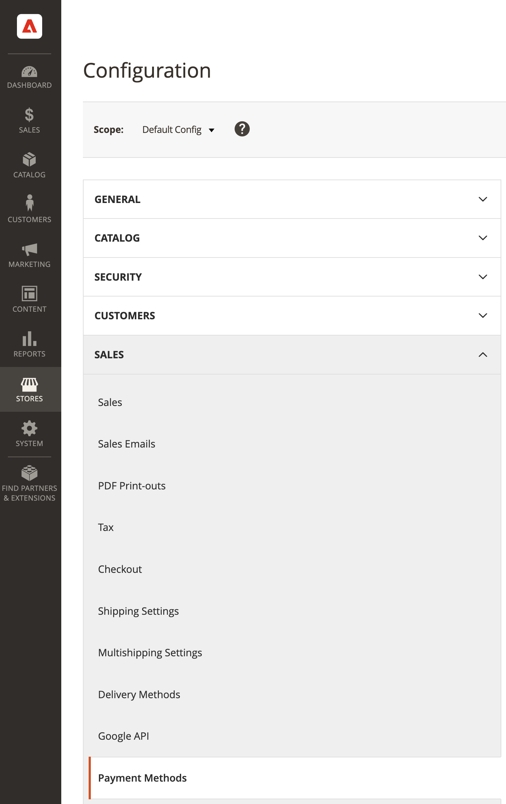

# Configurazione dei servizi di pagamento legacy

Puoi personalizzare [!DNL Payment Services] per soddisfare le tue esigenze con opzioni di configurazione utili nell’amministratore.

Quando si configura [!DNL Payment Services] per [!DNL Adobe Commerce] e [!DNL Magento Open Source] in Admin, tali configurazioni si applicano solo all’ambiente impostato in _[!UICONTROL Method]_campo_[!UICONTROL General Configuration]_. Qualsiasi modifica apportata nei campi di configurazione è indipendente dal passaggio alla _[!UICONTROL Method]_selezione (selection) - se si cambia il metodo, le selezioni non vengono reimpostate.

Consulta la sezione [[!UICONTROL General Configuration] sezione](#general-configuration) per ulteriori informazioni.

## Configurazione generale

È possibile attivare [!DNL Payment Services] per il tuo negozio e abilita il test sandbox o i pagamenti live nel _[!UICONTROL General Configuration]_sezione .

1. Sulla _Amministratore_ barra laterale, vai a **[!UICONTROL Stores]** > _[!UICONTROL Settings]_>**[!UICONTROL Configuration]**.
1. Nel pannello a sinistra, espandi **[!UICONTROL Sales]** e scegli **[!UICONTROL Payment Methods]**.

   

1. Espandi la _[!UICONTROL Recommended Solutions]_sezione .
1. In _[!UICONTROL [!DNL Payment Services]]_espandi la sezione_[!UICONTROL General Configuration]_ sezione .
1. Per **Abilita**, imposta su `Yes` per abilitare [!DNL Payment Services] per il tuo negozio.
1. Per **Metodo**, imposta su `Sandbox` se stai ancora testando [!DNL Payment Services] per il vostro negozio o `Production` se sei pronto per abilitare i pagamenti live.

   >[!WARNING]
   >
   >Le _[!UICONTROL Sandbox Merchant ID]_e_[!UICONTROL Production Merchant ID]_ sono generati automaticamente e presenti nei rispettivi campi al termine dell’onboarding per la sandbox e/o la produzione. Non rimuovere o modificare questi ID.

1. Fai clic su **[!UICONTROL Save Config]** per salvare le modifiche.

### Opzioni di configurazione

| Campo | Ambito | Descrizione |
|---|---|---|
| [!UICONTROL Enable] | sito web | Attiva o disattiva [!DNL Payment Services] per il sito web. Opzioni: [!UICONTROL Yes] / [!UICONTROL No] |
| [!UICONTROL Method] | vista store | Imposta il metodo o l&#39;ambiente per l&#39;archivio. Opzioni: [!UICONTROL Sandbox] / [!UICONTROL Production] |
| [!UICONTROL Sandbox Merchant ID] | vista store | Il tuo ID commerciante sandbox, generato automaticamente durante l’onboarding della sandbox. Non modificare o modificare questo ID. |
| [!UICONTROL Production Merchant ID] | vista store | Il tuo ID commerciante di produzione, generato automaticamente durante l’onboarding della sandbox. Non modificare o modificare questo ID. |

## [!UICONTROL Credit Card Fields]

La [!UICONTROL Credit Card Fields] le opzioni di pagamento forniscono un pagamento semplice e sicuro per le modalità di pagamento con carta di credito o con carta di debito.

Vedi [Opzioni di pagamento](payments-options.md#paypal-smart-buttons) per ulteriori informazioni.

### Configura campi carta di credito

1. Sulla _Amministratore_ barra laterale, vai a **[!UICONTROL Stores]** > _[!UICONTROL Settings]_>**[!UICONTROL Configuration]**.
1. Nel pannello a sinistra, espandi **[!UICONTROL Sales]** e scegli **[!UICONTROL Payment Methods]**.
1. Espandi la _[!UICONTROL Recommended Solutions]_sezione .
1. In _[!UICONTROL Payment Services]_espandi la sezione_[!UICONTROL Credit Card Fields]_ sezione .
1. Per **[!UICONTROL Title]**, immettere il testo (se necessario) per modificare il nome del metodo di pagamento come mostrato durante l&#39;estrazione.
1. A [imposta l&#39;azione di pagamento](production.md#set-payment-services-as-payment-method), seleziona **[!UICONTROL Authorize]** o **Autorizzazione e acquisizione**.
1. Per **Modalità debug**, scegli `Yes` per abilitare la modalità di debug (o `No` per disattivarlo).
1. Fai clic su **[!UICONTROL Save Config]** per salvare le modifiche.

#### Opzioni di configurazione

| Campo | Ambito | Descrizione |
|---|---|---|
| [!UICONTROL Title] | vista store | Aggiungere il testo da visualizzare come titolo per questa opzione di pagamento nella visualizzazione Metodo di pagamento durante il pagamento. Opzioni: [!UICONTROL text field] |
| [!UICONTROL Payment Action] | sito web | La [azione di pagamento](https://docs.magento.com/user-guide/configuration/sales/payment-methods.html#payment-actions){target=&quot;_blank&quot;} per il metodo di pagamento specificato. Opzioni: [!UICONTROL Authorize] / [!UICONTROL Authorize and Capture] |
| [!UICONTROL Debug Mode] | sito web | Attiva o disattiva la modalità di debug. Opzioni: [!UICONTROL Yes] / [!UICONTROL No] |

## [!DNL PayPal Smart Buttons]

La [!DNL PayPal Smart Buttons] le opzioni di pagamento forniscono al cliente un processo di pagamento semplice, rapido e sicuro.

Vedi [Opzioni di pagamento](payments-options.md#paypal-smart-buttons) per ulteriori informazioni.

### Configura [!DNL PayPal Smart Buttons]

Puoi abilitare e configurare le opzioni di pagamento dei pulsanti avanzati PayPal all&#39;interno dell&#39;Amministratore:

1. Sulla _Amministratore_ barra laterale, vai a **[!UICONTROL Stores]** > _[!UICONTROL Settings]_>**[!UICONTROL Configuration]**.
1. Nel pannello a sinistra, espandi **[!UICONTROL Sales]** e scegli **[!UICONTROL Payment Methods]**.
1. Espandi la _[!UICONTROL Recommended Solutions]_sezione .
1. In _[!UICONTROL Payment Services]_espandi la sezione_[!UICONTROL PayPal Smart Buttons]_ sezione .
1. Per modificare il nome del metodo di pagamento come mostrato durante il pagamento, modificare il _[!UICONTROL Title]_campo .
1. A [imposta l&#39;azione di pagamento](production.md#set-payment-services-as-payment-method), seleziona **[!UICONTROL Authorize]** o **[!UICONTROL Authorize and Capture]**.
1. Per disabilitare la funzione [Messaggi di pagamento in un secondo momento](payments-options.md#pay-later-button) (se desiderato), seleziona `No` per **[!UICONTROL Display Pay Later Message]**.
1. Per abilitare la modalità di debug, seleziona `Yes` per **[!UICONTROL Debug Mode]** (`No` lo disattiva).
1. Per salvare le modifiche, fai clic su **[!UICONTROL Save Config]** .

### Opzioni di configurazione

| Campo | Ambito | Descrizione |
|---|---|---|
| [!UICONTROL Title] | vista store | Aggiungere il testo da visualizzare come titolo per questa opzione di pagamento nella visualizzazione Metodo di pagamento durante il pagamento. Opzioni: campo di testo |
| [!UICONTROL Payment Action] | sito web | La [azione di pagamento](https://docs.magento.com/user-guide/configuration/sales/payment-methods.html#payment-actions){target=&quot;_blank&quot;} per il metodo di pagamento specificato. Opzioni: [!UICONTROL Authorize] / [!UICONTROL Authorize and Capture] |
| [!UICONTROL Display Pay Later Message] | sito web | Attiva o disattiva la messaggistica Paga in seguito nel carrello, nella pagina del prodotto, nel mini-carrello e durante il flusso di pagamento. Opzioni: [!UICONTROL Yes] / [!UICONTROL No] |
| [!UICONTROL Venmo Enabled] | vista store | Attiva o disattiva l&#39;opzione di pagamento Venmo in cui vengono visualizzati i pulsanti di pagamento. Opzioni: [!UICONTROL Yes] / [!UICONTROL No] |
| [!UICONTROL Apple Pay Enabled] | vista store | Attiva o disattiva l&#39;opzione Pagamento Apple in cui vengono visualizzati i pulsanti di pagamento. Opzioni: [!UICONTROL Yes] / [!UICONTROL No] |
| [!UICONTROL PayPal Pay Later Enabled] | vista store | Attiva o disattiva l&#39;aspetto dell&#39;opzione di pagamento successivo in cui vengono visualizzati i pulsanti di pagamento. Opzioni: [!UICONTROL Yes] / [!UICONTROL No] |
| [!UICONTROL Debug Mode] | sito web | Attiva o disattiva la modalità di debug. Opzioni: [!UICONTROL Yes] / [!UICONTROL No] |
| [!UICONTROL Show buttons on product detail page] | vista store | Attiva o disattiva [!DNL PayPal Smart Buttons] nella pagina dei dettagli del prodotto. Opzioni: [!UICONTROL Yes] / [!UICONTROL No] |
| [!UICONTROL Show buttons in mini cart preview] | vista store | Attiva o disattiva [!DNL PayPal Smart Buttons] nell&#39;anteprima minicart. Opzioni: [!UICONTROL Yes] / [!UICONTROL No] |
| [!UICONTROL Show buttons on cart page] | vista store | Attiva o disattiva [!DNL PayPal Smart Buttons] nella pagina del carrello. Opzioni: [!UICONTROL Yes] / [!UICONTROL No] |

### [!DNL PayPal Smart Buttons] Opzioni di stile

| Campo | Ambito | Descrizione |
|--- |--- |--- |
| [!UICONTROL Layout] | Visualizzazione store | Definire lo stile del layout per i pulsanti Paypal Smart. Opzioni: [!UICONTROL Vertical] / [!UICONTROL Horizontal] |
| [!UICONTROL Color] | Visualizzazione store | Definire il colore dei pulsanti avanzati Paypal. Opzioni: [!UICONTROL Blue] / [!UICONTROL Gold] / [!UICONTROL Silver] / [!UICONTROL White] / [!UICONTROL Black] |
| [!UICONTROL Shape] | Visualizzazione store | Definire la forma dei pulsanti avanzati Paypal. Opzioni: [!UICONTROL Rectangular] / [!UICONTROL Pill] |
| [!UICONTROL Use Default Height] | Visualizzazione store | Definisce se i pulsanti avanzati PayPal utilizzano un&#39;altezza predefinita. Opzioni: [!UICONTROL Yes] / [!UICONTROL No] |
| [!UICONTROL Height] | Visualizzazione store | Consente di definire l&#39;altezza dei pulsanti avanzati PayPal. Valore predefinito: nessuno |
| [!UICONTROL Label] | Visualizzazione store | Definire l&#39;etichetta visualizzata nei pulsanti avanzati PayPal. Opzioni: [!UICONTROL PayPal] / [!UICONTROL Checkout] / [!UICONTROL Buynow] / [!UICONTROL Pay] / [!UICONTROL Installment] |
| [!UICONTROL Tagline] | Visualizzazione store | Abilita lo slogan. Opzioni: [!UICONTROL Yes] / [!UICONTROL No] |
