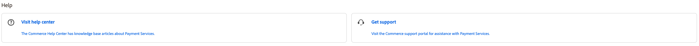

# [!DNL Payment Services] Panoramica della guida

Questa guida è destinata agli amministratori di Adobe Commerce e Magenti Open Source. Include informazioni dettagliate sull&#39;installazione e l&#39;onboarding di [!DNL Payment Services], nonché la configurazione e la gestione dei servizi. Assume una comprensione di base della configurazione e della funzionalità principali di Commerce.

[!DNL Payment Services] dispone di due aree per gli amministratori:

* Amministratore: Utilizza questa area per accedere all’interfaccia utente di configurazione e al reporting.
* Interfaccia della riga di comando: Utilizza questo strumento per eseguire attività di installazione e configurazione di back-end.

Questa guida tratta i seguenti argomenti:

* Tutto [!DNL Payment Services]- attività specifiche eseguite nell’amministratore.
* Tutto [!DNL Payment Services]Attività specifiche eseguite utilizzando la riga di comando Commerce

Questa guida non descrive le funzionalità di base di Adobe Commerce e Magenti Open Source.

## Documentazione aggiuntiva

| Guida | Descrizione |
|------ | ----------- |
| [Guida utente di Adobe Commerce 2.4](https://docs.magento.com/user-guide/) | Documentazione incentrata sul merchant per Adobe Commerce e Magenti Open Source |
| [Guida per gli sviluppatori di Adobe Commerce 2.4](https://devdocs.magento.com/) | Documentazione incentrata sugli sviluppatori utilizzata per creare e personalizzare Adobe Commerce o Magento Open Source |

## Supporto

Se hai bisogno di informazioni o hai domande che non sono incluse in questa guida, utilizza le seguenti risorse disponibili nel dashboard:

* [Centro assistenza](https://support.magento.com/hc/en-us){target=&quot;_blank&quot;}—Vedi il [!DNL Payment Services]Articoli relativi alla risoluzione dei problemi.
* [Biglietti di supporto](https://support.magento.com/hc/en-us/articles/360000913794#submit-ticket){target=&quot;_blank&quot;} - Invia un ticket per ricevere ulteriore assistenza.
