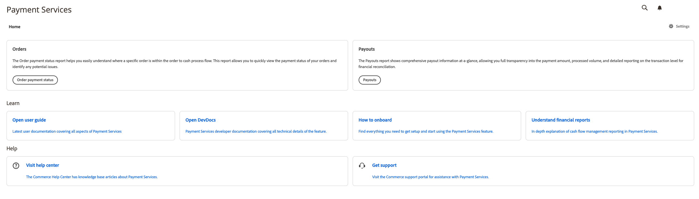

# Introduzione alla [!DNL Payment Services] Home

[!DNL Payment Services] per [!DNL Adobe Commerce] e [!DNL Magento Open Source] fornisce una vista Home con tutte le informazioni necessarie per avviare la configurazione e l’utilizzo dell’estensione.

1. Il giorno _Amministratore_ barra laterale, vai a **[!UICONTROL Sales]** > **[!UICONTROL Payment Services]**:

   

1. In questa visualizzazione Home puoi accedere a _Home_ vista, _Scopri_ informazioni su [!DNL Payment Services], configura l&#39;estensione _Impostazioni_, o get _Aiuto_.

## Home

| Campo | Descrizione |
|---|---|
| [!UICONTROL Orders] | Questi rapporti ti consentono di visualizzare rapidamente lo stato dei pagamenti degli ordini e di identificare eventuali problemi. |
| [!UICONTROL Payouts] | I rapporti Pagamenti mostrano immediatamente informazioni complete sui pagamenti, consentendo la completa trasparenza dell&#39;importo del pagamento, del volume elaborato e dei rapporti dettagliati a livello di transazione per la quadratura finanziaria. |

## Scopri

| Campo | Descrizione |
|---|---|
| [!UICONTROL Read documentation] | Consulta la documentazione più recente per utenti e sviluppatori per [!DNL Payment Services]. |
| [!UICONTROL How to onboard] | Trova tutto il necessario per eseguire la configurazione e iniziare a utilizzare [!DNL Payment Services] funzionalità. |
| [!UICONTROL Understand financial reports] | Spiegazione dettagliata dell’informativa sulla gestione dei flussi di cassa in [!DNL Payment Services]. |

## Aiuto

| Campo | Descrizione |
|---|---|
| [!UICONTROL Visit help center] | Il [!DNL Adobe Commerce] Il Centro risorse dispone di articoli della knowledge base su [!DNL Payment Services]. |
| [!UICONTROL Get support] | Visita il [!DNL Adobe Commerce] portale di assistenza per [!DNL Payment Services.] |

## Impostazioni

Nella vista Home, fai clic su **[!UICONTROL Settings]**. Consulta [Impostazioni](settings.md) per ulteriori informazioni.
