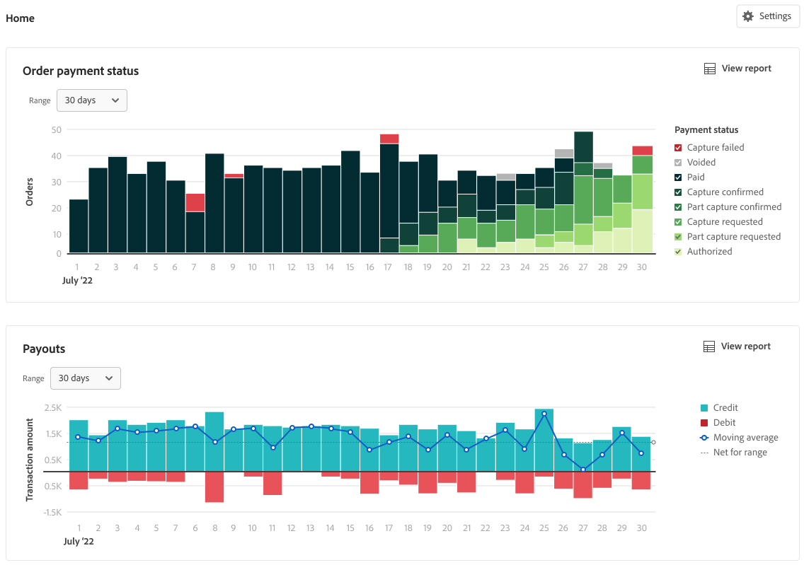

# Rapporto Pagamenti

[!DNL Payment Services] per [!DNL Adobe Commerce] e [!DNL Magento Open Source] offre un reporting completo per ottenere una visione chiara degli ordini e dei pagamenti del tuo negozio.

Il rapporto Pagamenti mostra immediatamente informazioni complete sui pagamenti, consentendo la piena trasparenza sull&#39;importo del pagamento, sul volume elaborato e sulla generazione di rapporti dettagliati a livello di transazione per la riconciliazione finanziaria.

Non è necessario aprire più visualizzazioni per eseguire riferimenti incrociati a ordini e pagamenti o per eseguire la quadratura dei conti. [!DNL Payment Services] per [!DNL Adobe Commerce] e [!DNL Magento Open Source] consente di eseguire tutte queste azioni da un&#39;unica posizione (rapporto Pagamenti) in modo da poter visualizzare e gestire i pagamenti in modo efficiente.

Vedi ID di ordine e transazione commerciali collegati, importi delle transazioni, metodo di pagamento per transazione e altro ancora, tutto all&#39;interno del rapporto Pagamenti in Amministratore.

È possibile scaricare le transazioni di pagamento in un formato file .csv da utilizzare nel software di contabilità o gestione degli ordini esistente.

>[!NOTE]
>
>I dati visualizzati in questa tabella vengono ordinati in ordine decrescente (`DESC`) per impostazione predefinita utilizzando `TRANS DATE`. La `TRANS DATE` è la data e l&#39;ora in cui è stata avviata la transazione.

## Disponibilità

Sulla _Amministratore_ barra laterale, vai a **[!UICONTROL Sales]** > **[!UICONTROL Payment Services]** > **[!UICONTROL Payouts]**.

## Seleziona origine dati

Nella visualizzazione del rapporto Pagamenti, è possibile selezionare l&#39;origine dati—_[!UICONTROL Live]_o [!UICONTROL Sandbox]_—per i quali desideri visualizzare i risultati del rapporto.

Se _[!UICONTROL Live]_è l’origine dati selezionata, puoi visualizzare le informazioni sui rapporti per gli archivi live. Se [!UICONTROL Sandbox]_ è l’origine dati selezionata, puoi visualizzare le informazioni sul rapporto per l’ambiente Sandbox.

Le selezioni dell’origine dati funzionano come segue:

* Se non disponi di archivi in modalità Live, la selezione dell’origine dati viene impostata automaticamente su _[!UICONTROL Sandbox]_.
* Se hai degli archivi (uno o più) in modalità Live, la selezione dell&#39;origine dati viene impostata automaticamente su _[!UICONTROL Live]_.
* Le esportazioni dei rapporti rispettano sempre la selezione dell’origine dati.

Per selezionare l&#39;origine dati per il report Stato pagamento ordine:

1. Sulla _Amministratore_ barra laterale, vai a **[!UICONTROL Sales]** > **[!UICONTROL Payment Services]** > **[!UICONTROL Payouts]**.
1. Fai clic su **[!UICONTROL Data source]** e seleziona _[!UICONTROL Live]_o [!UICONTROL Sandbox]_.

   I risultati del report vengono rigenerati in base all&#39;origine dati selezionata.

## Visualizza transazioni

Per impostazione predefinita, nella griglia sono visualizzati 30 giorni di transazioni.

Il numero di righe restituite in una ricerca, o visualizzate nei 30 giorni predefiniti di transazioni, viene visualizzato sopra la griglia di visualizzazione Pagamenti accanto al filtro di selezione del calendario delle date delle transazioni.

Scorri verso sinistra e verso destra per visualizzare [informazioni per ogni operazione di pagamento](#column-descriptions) nel rapporto giornaliero, compresi la data della transazione, l&#39;ID di riferimento, il numero della fattura e i dettagli del metodo di pagamento.

### Personalizza arco temporale delle transazioni

Nella visualizzazione Pagamenti è possibile personalizzare l&#39;intervallo temporale per le transazioni di pagamento che si desidera visualizzare inserendo date specifiche o selezionando un intervallo di date dal selettore data:

1. Sulla _Amministratore_ barra laterale, vai a **[!UICONTROL Sales]** > **[!UICONTROL Payment Services]** > **[!UICONTROL Payouts]**.
1. Fare clic sul filtro del selettore del calendario delle date delle transazioni.
1. Scegli l’intervallo di date applicabile.
1. Visualizza gli stati dei pagamenti nella griglia per le date specificate.

## Mostra e nascondi colonne

Il rapporto Pagamenti mostra per impostazione predefinita la maggior parte delle colonne di informazioni disponibili. È tuttavia possibile personalizzare le colonne visualizzate nel rapporto.

1. Sulla _Amministratore_ barra laterale, vai a **[!UICONTROL Sales]** > **[!UICONTROL [!DNL Payment Services]]** > **[!UICONTROL Payouts]**.
1. Fai clic sul pulsante _Impostazioni colonna_ icona ().
1. Per personalizzare le colonne visualizzate nel rapporto, selezionare o deselezionare le colonne nell’elenco.

   Il rapporto Pagamenti mostrerà immediatamente tutte le modifiche apportate nel menu Impostazioni colonna. Le preferenze della colonna vengono salvate e rimangono attive se ci si allontana dalla visualizzazione del rapporto.

## Scarica transazioni

È possibile scaricare un file .csv contenente tutte le transazioni visibili nella griglia di visualizzazione Pagamenti.

1. Sulla _Amministratore_ barra laterale, vai a **[!UICONTROL Sales]** > **[!UICONTROL Payment Services]** > **[!UICONTROL Payouts]**.
1. [Personalizzare l’intervallo di tempo per le transazioni](#customize-transactions-timeframe).
1. Fai clic sul pulsante _Scarica_ ().

Le transazioni di pagamento vengono scaricate in formato .csv.

## Informazioni sulle transazioni

La visualizzazione Pagamenti mostra informazioni complete per ogni transazione visualizzata nella griglia.

### Descrizioni delle colonne

I rapporti di pagamento includono le seguenti informazioni.

| Colonna | Descrizione |
| ------------ | -------------------- |
| [!UICONTROL Provider] | Fornitore di pagamenti |
| [!UICONTROL Provider trans] | ID transazione |
| [!UICONTROL Trans date] | Data e ora di avvio della transazione |
| [!UICONTROL Type] | Tipo di transazione *[!UICONTROL PAYMENT]*, *[!UICONTROL AUTH]*, *[!UICONTROL BONUS]*, *[!UICONTROL CHARGEBACK]*, *[!UICONTROL CORRECTION]*, *[!UICONTROL CURRENCY_CONVERSATION]*, *[!UICONTROL DEPOSIT]*, *[!UICONTROL DISBURSEMENT]*, *[!UICONTROL DISPUTE]*, *[!UICONTROL FEES]*, *[!UICONTROL HOLD]*, *[!UICONTROL HOLD_RELEASE]*, *[!UICONTROL INCENTIVES]*, *[!UICONTROL OTHERS]*, *[!UICONTROL RECOUP]*, *[!UICONTROL REFUND]*, *[!UICONTROL REVERSAL]*, *[!UICONTROL WITHDRAWAL]*    Vedi [Tipi di transazione](#transaction-types) per ulteriori informazioni. |
| [!UICONTROL Status] | Stato attuale della transazione—*[!UICONTROL SUCCESS]*, *[!UICONTROL DENIED]*, *[!UICONTROL PENDING]* |
| [!UICONTROL Code] | Codice transazione che indica il credito (*CR*) o Debiti (*DR*) |
| [!UICONTROL Reference ID] | ID transazione originale per il quale è correlato l’evento |
| [!UICONTROL Invoice] | ID fattura (uno per ordine) della transazione |
| [!UICONTROL Commerce order] | ID ordine commerciale    Per visualizzare i dati correlati [info ordine](https://docs.magento.com/user-guide/sales/orders.html){target=&quot;_blank&quot;}, fai clic sull&#39;ID. |
| [!UICONTROL Commerce trans] | ID transazione commerciale    Per visualizzare i dati correlati [informazioni sulle transazioni](https://docs.magento.com/user-guide/sales/transactions.html){target=&quot;_blank&quot;}, fai clic sull&#39;ID. |
| [!UICONTROL Pay method] | Tipo di carta di credito *[!UICONTROL BANK]*, *[!UICONTROL PAYPAL]*, *[!UICONTROL CREDIT_CARD]*- e il provider di carte associato (ad esempio *Visto* o *MasterCard*) |
| [!UICONTROL Trans amt] | Importo della transazione |
| [!UICONTROL Cur] | Unità di valuta per l&#39;importo della transazione |
| [!UICONTROL Pending] | Importo da versare |
| [!UICONTROL Cur] | Unità di valuta per l&#39;importo in sospeso |
| [!UICONTROL Seller amt] | Importo dei fondi trasferiti da o verso un cliente    I fondi che escono dal conto del venditore presentano un prefisso trattino (-). |
| [!UICONTROL Cur] | Unità di valuta per l&#39;importo del venditore |
| [!UICONTROL Partner fee] | Commissioni per i partner associate alla transazione    I fondi che escono dal conto delle tariffe partner presentano un prefisso trattino (-). |
| [!UICONTROL Cur] | Unità di valuta per la tariffa del partner |
| [!UICONTROL Prov fees] | Tariffe associate alla transazione    I fondi che escono dal conto commissioni del fornitore mostrano un prefisso trattino (-). |
| [!UICONTROL Cur] | Unità di valuta per la commissione del fornitore |
| [!UICONTROL Fee %] | Percentuale dell&#39;importo della transazione addebitato come commissione |
| [!UICONTROL Fixed fee] | Importo canone fisso fornitore |
| [!UICONTROL Chbk fee] | Commissioni di addebito associate alla transazione    Un prefisso trattino (-) indica che la tassa di chargeback è stata annullata. |
| [!UICONTROL Cur] | Unità di valuta per la tassa di ricarica |
| [!UICONTROL Hold amt] | Importo messo in attesa o rilasciato dal blocco    Un prefisso trattino (-) indica che i fondi in attesa vengono rilasciati. |
| [!UICONTROL Cur] | Unità di valuta per l&#39;importo del blocco |
| [!UICONTROL Recoup amt] | Importo recuperato dal conto di recupero    I fondi che escono dall&#39;account di recupero presentano un prefisso trattino (-). |
| [!UICONTROL Cur] | Unità di valuta per l&#39;importo del recupero |

### Tipi di transazione

Questi tipi di operazioni possono essere annotati nelle operazioni di pagamento.

| Rapporto | Descrizione |
| ------------ | -------------------- |
| [!UICONTROL PAYMENT] | Il denaro è stato trasferito tra un acquirente e un venditore per un ordine |
| [!UICONTROL AUTH] | Autorizzazione e autorizzazione di transazioni nulle |
| [!UICONTROL BONUS] | — |
| [!UICONTROL CHARGEBACK] | Transazioni di storno di commissioni e di commissioni di addebito |
| [!UICONTROL CORRECTION] | — |
| [!UICONTROL CURRENCY_CONVERSION] | — |
| [!UICONTROL DEPOSIT] | — |
| [!UICONTROL DISBURSEMENT] | — |
| [!UICONTROL DISPUTE] | — |
| [!UICONTROL FEES] | Commissioni partner, commissioni di pagamento e transazioni di storno di commissioni |
| [!UICONTROL HOLD] | — |
| [!UICONTROL HOLD_RELEASE] | — |
| [!UICONTROL INCENTIVES] | — |
| [!UICONTROL OTHERS] | — |
| [!UICONTROL RECOUP] | Ricavi da conti bancari o perdite |
| [!UICONTROL REFUND] | — |
| [!UICONTROL REVERSAL] | — |
| [!UICONTROL WITHDRAWAL] | — |
