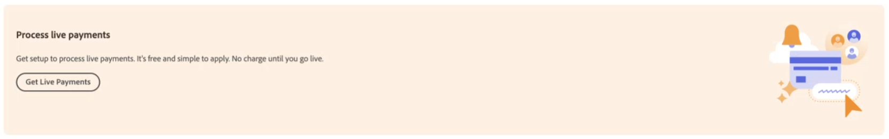

# Abilita [!DNL Payment Services] per la produzione

Puoi mettere il servizio in produzione e completare il [processo di onboarding](onboard.md), secondo i passaggi descritti in questo argomento, dopo aver eseguito le operazioni seguenti:

* [Installa](install.md) estensione Payment Services
* [Configurazione e connessione](connect.md) la tua istanza
* [Configurazione](sandbox.md) e [test](test-validate.md) la tua sandbox

## Imposta [!DNL Payment Services] come metodo di pagamento

Dopo [configurare Commerce Services](connect.md#configure-commerce-services) e consente [test sandbox](sandbox.md#enable-sandbox-testing) o [pagamenti live](#enable-live-payments), è necessario impostare [!DNL Payment Services] come metodo di pagamento.

1. Sulla _Amministratore_ barra laterale, vai a **[!UICONTROL Sales]** > **[!UICONTROL Payment Services]**.
1. Clic **[!UICONTROL Enable Payment Services]**.

   Questa opzione è visibile se non è ancora stata configurata [!DNL Payment Services] come metodo di pagamento per uno o più siti web.

   Viene visualizzata l’area delle impostazioni nella vista Home con le relative opzioni espanse (**[!UICONTROL Sales]** > **[!UICONTROL Payment Services]** > _[!UICONTROL Settings]_), dove è possibile abilitare [!DNL Payment Services] opzioni come [metodo di pagamento](https://docs.magento.com/user-guide/configuration/sales/payment-methods.html){target=&quot;_blank&quot;}.

1. In _[!UICONTROL General Configuration]_, set **[!UICONTROL Enable]**a `Yes`.
1. Imposta **[!UICONTROL Payment Action]**, per _[!UICONTROL Credit Card Fields]_e_[!UICONTROL PayPal Smart Buttons]_, a una delle seguenti operazioni:

   | Impostazione | Descrizione |
   |---|---|
   | `Authorize` | Approva l&#39;acquisto e blocca i fondi. L&#39;importo non viene prelevato finché non viene &quot;catturato&quot; dal commerciante. |
   | `Authorize and Capture` | Approva l&#39;acquisto e il commerciante &quot;cattura&quot; i fondi. |

1. Clic **[!UICONTROL Save]**.
1. Fai clic su **[!UICONTROL Go to Payment Services]** da indirizzare nuovamente al [!DNL Payment Services] Casa.
1. [Svuota la cache](https://docs.magento.com/user-guide/system/cache-management.html){target=&quot;_blank&quot;}.

   La pulizia deve essere eseguita dopo ogni modifica della configurazione.

Vedi [Configurare i servizi di pagamento](settings.md) per ulteriori informazioni sulla configurazione dei campi della carta di credito e dei pulsanti avanzati PayPal.

## Onboarding completo

1. Sulla _Amministratore_ barra laterale, vai a **[!UICONTROL Sales]** > **[!UICONTROL Payment Services]**.
1. Clic **[!UICONTROL Live onboarding]**.

   Questa opzione è visibile se non hai ancora completato l’onboarding live per [!DNL Payment Services].

   Ti viene presentata una finestra PayPal.

1. Continua con il flusso PayPal, utilizzando le credenziali del tuo account PayPal (non le credenziali del tuo account sandbox) o iscriviti a un nuovo account PayPal.
1. Nella barra laterale Amministratore, vai a **[!UICONTROL Sales]** > **[!UICONTROL Payment Services]**

   La _[!UICONTROL Live onboarding]_non è più visibile e viene visualizzato un &quot;[!UICONTROL Live payments pending]&quot; casella di testo.

   In quella casella di testo, ti potrebbe anche essere chiesto di confermare il tuo indirizzo email con PayPal per completare l&#39;onboarding.

1. Se ti viene richiesto di confermare l&#39;indirizzo e-mail, controlla l&#39;e-mail per il messaggio di conferma inviato da PayPal e fai clic su per confermare l&#39;indirizzo e-mail.
1. Nella barra laterale Amministratore, vai a **[!UICONTROL Sales]** > **[!UICONTROL Payment Services]**.
1. Aggiorna la finestra del browser.

   Quando il tuo Negozio PayPal di onboarding è approvato, dovresti vedere una notifica che indica che il tuo sistema di pagamento è in modalità sandbox e non sta elaborando pagamenti live.

   >[!IMPORTANT]
   >
   >Se revochi il consenso a [!DNL Payment Services] per [!DNL Adobe Commerce] e [!DNL Magento Open Source] per l&#39;elaborazione dei pagamenti (nelle impostazioni del tuo account PayPal), gli ordini nel tuo negozio non possono essere elaborati da [!DNL Payment Services]. Nella home di Payment Services viene visualizzato un avviso relativo al consenso revocato.

## Richiesta di diritto di pagamento da Adobe

Per abilitare l’onboarding in diretta, è necessario richiedere l’adesione ai pagamenti dall’Adobe:

1. Sulla _Amministratore_ barra laterale, vai a **[!UICONTROL Sales]** > **[!UICONTROL Payment Services]**.
1. Fai clic su **[!UICONTROL Get Live Payments]** nel tuo [!DNL Payment Services] Casa.

   

1. Compila il modulo.
1. Un membro del team di vendita ti contatterà.

In alternativa, puoi richiedere diritti all’aiuto pagamenti da Adobe all’indirizzo [business.adobe.com](https://business.adobe.com/resources/payment-services.html).

>[!IMPORTANT]
>
>**Onboarding live** non è accessibile fino all&#39;approvazione del diritto all&#39;aiuto.

## Configurare il livello di prezzo

Per ottenere il tuo [!DNL Payment Services] _ID commerciante_:

1. Sulla _Amministratore_ barra laterale, vai a **[!UICONTROL Sales]** > **[!UICONTROL Payment Services]**.
1. Nella visualizzazione Home, fai clic su **[!UICONTROL Settings]**. Vedi [Pagina principale](payments-home.md) per ulteriori informazioni.
1. Seleziona il _ID commerciante_ e invialo al tuo rappresentante commerciale, che configurerà il livello di prezzo corretto.

## Abilita pagamenti live

A _ID commerciante di produzione_ viene generato automaticamente e popolato nel [configurazione](configure-admin.md). Non modificare o modificare questo ID.

Per abilitare i pagamenti live:

1. Sulla _Amministratore_ barra laterale, vai a **[!UICONTROL Sales]** > **[!UICONTROL Payment Services]**.
1. Nella home, fai clic su **[!UICONTROL Settings]** in alto a destra nella pagina. Vedi [Pagina principale](payments-home.md) per ulteriori informazioni.
1. In _[!UICONTROL General Configuration]_set di sezioni **[!UICONTROL Payment mode]**a `Production`.
1. Clic **[!UICONTROL Save]**.
1. [Svuota la cache](https://docs.magento.com/user-guide/system/cache-management.html){target=&quot;_blank&quot;}.

   >[!IMPORTANT]
   >
   >Se non cancelli la cache, i clienti non possono visualizzare le opzioni di pagamento PayPal durante il pagamento.

Se torni a [!DNL Payment Services] Home, il messaggio Modalità di pagamento sandbox non viene più visualizzato perché si stanno elaborando pagamenti live.

Vedi [Configura nell’amministratore](configure-admin.md) per le opzioni di configurazione legacy.

>[!IMPORTANT]
>
>Se revochi il consenso a [!DNL Payment Services] per l&#39;elaborazione dei pagamenti (nelle impostazioni del tuo account PayPal), gli ordini nel tuo negozio non possono essere elaborati da [!DNL Payment Services]. Se desideri riabilitare l’elaborazione dei pagamenti, devi completare nuovamente l’onboarding. Nella home di Payment Services viene visualizzato un avviso relativo al consenso revocato.

## Test in produzione

È vivamente consigliato testare i pagamenti in produzione, con carte di credito reali e banche, prima di esporre questa funzionalità ai consumatori.

Vedi [Test e convalida](test-validate.md) per ulteriori informazioni.
