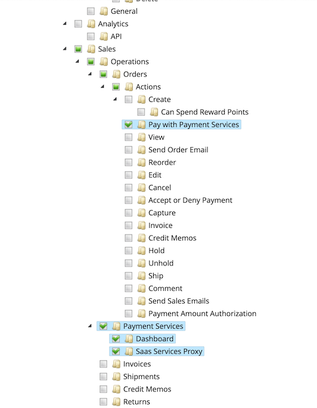

# Impostazioni

Puoi personalizzare [!DNL Payment Services] alle tue esigenze con utili impostazioni nella [!DNL Payment Services] A casa.

Per configurare [!DNL Payment Services] per [!DNL Adobe Commerce] e [!DNL Magento Open Source] click **[!UICONTROL Settings]**. Queste opzioni di configurazione si applicano solo all&#39;ambiente impostato in _[!UICONTROL Payment mode]_campo del[_ Generale _opzioni di configurazione](#configure-general-settings).

Per la configurazione multi-store o legacy consulta [Configurare in Admin](configure-admin.md).

## Configurare le impostazioni generali

Il [!UICONTROL General] Le impostazioni consentono di attivare o disattivare Servizi di pagamento come metodo di pagamento e di aggiungere informazioni alle transazioni dei clienti per contrassegnare o aggiungere come prefisso alle informazioni personalizzate una visualizzazione del sito Web o del negozio.

### Abilita servizi di pagamento

È possibile abilitare [!DNL Payment Services] per il tuo sito web e abilita test sandbox o pagamenti live.

1. Il giorno _Amministratore_ barra laterale, vai a **[!UICONTROL Sales]** > **[!UICONTROL Payment Services]**.

   

1. Clic **[!UICONTROL Settings]**. Consulta [Introduzione a [!DNL Payment Services] Home](payments-home.md) per ulteriori informazioni.

   Il _[!UICONTROL General]_La sezione include le impostazioni utilizzate per abilitare [!DNL Payment Services] come metodo di pagamento.

1. Per abilitare [!DNL Payment Services] come metodo di pagamento per il tuo negozio, nel _[!UICONTROL General]_sezione, interruttore **[!UICONTROL Enable Payment Services as payment method]**a `Yes`.

1. Se stai ancora testando [!DNL Payment Services] per il tuo punto vendita, imposta **Modalità di pagamento** a `Sandbox`. Se sei pronto ad abilitare i pagamenti live, impostalo su `Production`.

   >[!NOTE]
   >
   >Il tuo _[!UICONTROL Sandbox Merchant ID]_e_[!UICONTROL Production Merchant ID]_ sono generati automaticamente e presenti nei rispettivi campi al termine dell’onboarding per la sandbox e/o la produzione.

1. Clic **[!UICONTROL Save]**.

   Se si tenta di uscire da questa visualizzazione senza salvare le modifiche, viene visualizzata una finestra modale che richiede di ignorare le modifiche, di continuare a modificarle o di salvarle.

1. Accedi a **[!UICONTROL System]** > **[!UICONTROL Cache Management]** e fai clic su **[!UICONTROL Flush Cache]** per aggiornare tutte le cache non valide.

È ora possibile modificare le impostazioni predefinite per [opzioni di pagamento](#configure-payment-options) funzioni e visualizzazione vetrina.

### Aggiungi descrittore soft

Puoi aggiungere una [!UICONTROL Soft Descriptor] ai tuoi siti web o alla configurazione delle singole visualizzazioni store. I descrittori soft vengono visualizzati nei rendiconti bancari delle transazioni dei clienti. Se ad esempio disponi di più store, marchi o cataloghi, puoi facilmente distinguerli aggiungendo testo personalizzato alla sezione [!UICONTROL Soft Descriptor] campo.

1. Il giorno _Amministratore_ barra laterale, vai a **[!UICONTROL Sales]** > **[!UICONTROL Payment Services]**.

   

1. Clic **[!UICONTROL Settings]**. Consulta [Introduzione a [!DNL Payment Services] Home](payments-home.md) per ulteriori informazioni.
1. Selezionare la visualizzazione del sito Web o dello store nella **[!UICONTROL Scope]** menu a discesa, per il quale si desidera creare un soft descriptor. Per la configurazione iniziale, lascia questo campo come **[!UICONTROL Default]** per impostare il valore predefinito.
1. Aggiungi il testo personalizzato (fino a 22 caratteri) nel campo di testo, sostituendo `Custom descriptor`.
1. Clic **[!UICONTROL Save]**.
1. Per creare un soft descriptor diverso da quello predefinito configurato per una visualizzazione per siti web o store:
   1. Selezionare la visualizzazione del sito Web o dello store nella **[!UICONTROL Scope]** menu a discesa, per il quale si desidera creare un soft descriptor.
   1. Attiva/Disattiva _disattivato_ **[!UICONTROL Use website]** (o **[!UICONTROL Use default]**, a seconda dell&#39;ambito selezionato).
   1. Aggiungi il testo personalizzato nel campo di testo.
   1. Clic **[!UICONTROL Save]**.
1. Per attivare la visualizzazione di un sito Web o di un archivio, utilizzare il soft descriptor predefinito _o_ il soft descriptor utilizzato per il sito web principale:
   1. Selezionare la visualizzazione del sito Web o dello store nella **[!UICONTROL Scope]** menu a discesa, per il quale si desidera abilitare un soft descriptor esistente.
   1. Attiva/Disattiva _il_ **[!UICONTROL Use website]** (o **[!UICONTROL Use default]**, a seconda dell&#39;ambito selezionato).
   1. Clic **[!UICONTROL Save]**.

   Se si tenta di uscire da questa visualizzazione senza salvare le modifiche, viene visualizzata una finestra modale che richiede di ignorare le modifiche, di continuare a modificarle o di salvarle.

### Opzioni di configurazione

| Campo | Ambito | Descrizione |
|---|---|---|
| [!UICONTROL Enable] | sito web | Attiva o disattiva [!DNL Payment Services] per il tuo sito web. Opzioni: [!UICONTROL Yes] / [!UICONTROL No] |
| [!UICONTROL Payment mode] | visualizzazione store | Imposta il metodo o l’ambiente per lo store. Opzioni: [!UICONTROL Sandbox] / [!UICONTROL Production] |
| [!UICONTROL Sandbox Merchant ID] | visualizzazione store | L’ID venditore della sandbox, generato automaticamente durante l’onboarding della sandbox. |
| [!UICONTROL Production Merchant ID] | visualizzazione store | L’ID esercente di produzione, generato automaticamente durante l’onboarding della sandbox. |
| [!UICONTROL Soft Descriptor] | visualizzazione sito Web o store | Aggiungi un soft descriptor ai tuoi siti web e alle viste store per aggiungere informazioni alle transazioni dei clienti che delineano marchi, store o linee di prodotti. Il [!UICONTROL Use website] applica un qualsiasi soft descriptor aggiunto a livello di sito web. Il [!UICONTROL Use default] applica o meno qualsiasi soft descriptor aggiunto come impostazione predefinita. |

## Configurare le opzioni di pagamento

Ora che hai abilitato [!UICONTROL Payment Services] per il sito web, puoi modificare le impostazioni predefinite per le funzioni di pagamento e la visualizzazione della vetrina.

1. Il giorno _Amministratore_ barra laterale, vai a **[!UICONTROL Sales]** > **[!UICONTROL Payment Services]**.

   

1. Clic **[!UICONTROL Settings]**. Consulta [Introduzione a [!DNL Payment Services] Home](payments-home.md) per ulteriori informazioni.
1. Configurare le opzioni di pagamento per [carte di credito](#credit-card-fields), [pulsanti di pagamento](#payment-buttons), e [stile pulsante](#button-style), in base alle sezioni seguenti.

### Campi carta di credito

Il _[!UICONTROL Credit Card Fields]_Le impostazioni forniscono un&#39;opzione di pagamento semplice e sicura per i metodi di pagamento con carta di credito o con carta di debito.

Consulta [Opzioni di pagamento](payments-options.md#credit-card-fields) per ulteriori informazioni.

1. Il giorno _Amministratore_ barra laterale, vai a **[!UICONTROL Sales]** > **[!UICONTROL Payment Services]**.

   

1. Selezionare la visualizzazione del punto vendita nella **[!UICONTROL Scope]** menu a discesa, per il quale si desidera attivare un metodo di pagamento.
1. Per modificare il nome del metodo di pagamento visualizzato durante il pagamento, modificare il valore in **[!UICONTROL Checkout title]** campo.
1. A [imposta l&#39;azione di pagamento](production.md#set-payment-services-as-payment-method), attiva/disattiva **[!UICONTROL Payment action]** a `Authorize` o `Authorize and Capture`.
1. Per abilitare [Autenticazione protetta 3DS](security.md#3ds) (`Off` per impostazione predefinita) **[!UICONTROL 3DS Secure authentication]** selettore su `Always` o `When required`.
1. Per abilitare o disabilitare i campi della carta di credito nella pagina di pagamento, attiva/disattiva **[!UICONTROL Show on checkout page]** selettore.
1. Per attivare o disattivare [vaulting delle carte](#card-vaulting), attiva/disattiva **[!UICONTROL Vault enabled]** selettore.
1. Per attivare o disattivare [Metodi di pagamento in Vault nell’Amministratore](#card-vaulting) (per consentire ai commercianti di completare gli ordini dei clienti nell’amministratore utilizzando il metodo di pagamento a scaffale), imposta il **[!UICONTROL Show vaulted methods in Admin]** selettore.
1. Per abilitare o disabilitare la modalità di debug, attiva/disattiva **[!UICONTROL Debug Mode]** selettore.
1. Clic **[!UICONTROL Save]**.

   Se si tenta di uscire da questa visualizzazione senza salvare le modifiche, viene visualizzata una finestra modale che richiede di ignorare le modifiche, di continuare a modificarle o di salvarle.

1. [Svuota la cache](#flush-the-cache).

#### Opzioni di configurazione

| Campo | Ambito | Descrizione |
|---|---|---|
| [!UICONTROL Title] | visualizzazione store | Aggiungere il testo da visualizzare come titolo per questa opzione di pagamento nella vista Metodo di pagamento durante l&#39;estrazione. Opzioni: [!UICONTROL text field] |
| [!UICONTROL Payment Action] | sito web | Il [azione di pagamento](https://docs.magento.com/user-guide/configuration/sales/payment-methods.html#payment-actions){target="_blank"} per il metodo di pagamento specificato. Opzioni: [!UICONTROL Authorize] / [!UICONTROL Authorize and Capture] |
| [!UICONTROL 3DS Secure authentication] | sito web | Attiva o disattiva [Autenticazione protetta 3DS](security.md#3ds). Opzioni: [!UICONTROL Always] / [!UICONTROL When Required] / [!UICONTROL Off] |
| [!UICONTROL Show on checkout page] | sito web | Attiva o disattiva i campi della carta di credito da visualizzare nella pagina di pagamento. Opzioni: [!UICONTROL Yes] / [!UICONTROL No] |
| [!UICONTROL Vault enabled] | visualizzazione store | Attiva o disattiva [vaulting con carta di credito](vaulting.md). Opzioni: [!UICONTROL Yes] / [!UICONTROL No] |
| [!UICONTROL Show vaulted payment methods in Admin] | visualizzazione store | Abilita o disabilita la possibilità per l’esercente di completare gli ordini per i clienti nell’Admin [utilizzo di un metodo di pagamento a scaffale](vaulting.md). Opzioni: [!UICONTROL Yes] / [!UICONTROL No] |
| [!UICONTROL Debug Mode] | sito web | Attiva o disattiva la modalità di debug. Opzioni: [!UICONTROL Yes] / [!UICONTROL No] |

### Pulsanti di pagamento

Il [!DNL PayPal Smart Buttons] le opzioni di pagamento offrono al cliente un processo di pagamento semplice, veloce e sicuro. Consulta [Opzioni di pagamento](payments-options.md#paypal-smart-buttons) per ulteriori informazioni.

Puoi abilitare e configurare le opzioni di pagamento dei pulsanti avanzati PayPal:

1. Selezionare la visualizzazione del punto vendita nella **[!UICONTROL Scope]** menu a discesa, per il quale si desidera attivare un metodo di pagamento.
1. Per modificare il nome del metodo di pagamento come mostrato durante il pagamento, modificare il valore in **[!UICONTROL Checkout Title]** campo.
1. A [imposta l&#39;azione di pagamento](production.md#set-payment-services-as-payment-method), attiva/disattiva **[!UICONTROL Payment action]** a `Authorize` o `Authorize and Capture`.
1. Utilizza i selettori per attivare o disattivare [!DNL PayPal smart button] funzioni di visualizzazione:

   - **[!UICONTROL Show PayPal buttons on product checkout page]**
   - **[!UICONTROL Show PayPal buttons on product detail page]**
   - **[!UICONTROL Show PayPal buttons in mini-cart preview]**
   - **[!UICONTROL Show PayPal buttons on cart page]**
   - **[!UICONTROL Show PayPal Pay Later button]**
   - **[!UICONTROL Show PayPal Pay Later message]**
   - **[!UICONTROL Show Venmo button]**
   - **[!UICONTROL Show Apple Pay button]**
   - **[!UICONTROL Show PayPal Credit and Debit Card button]**

     >[!NOTE]
     >
     > Per utilizzare Apple Pay you [deve avere un account di test sandbox di Apple](https://developer.apple.com/apple-pay/sandbox-testing/#create-a-sandbox-tester-account) (completa di informazioni false sulla carta di credito e sulla fatturazione) per testarla. Quando sei pronto a utilizzare Apple Pay in sandbox _o_ modalità di produzione, dopo aver completato [test e convalida](test-validate.md#test-in-sandbox-environment), completo [registrazione autonoma con [!DNL Apple Pay]](https://developer.paypal.com/docs/checkout/apm/apple-pay/#register-your-live-domain) (_Registra il dominio live_ solo sezione ) e [configuralo per i tuoi store in [!DNL Payment Services]](settings.md#payment-buttons).

     Quando attivi/disattivi la visibilità dei pulsanti di pagamento o del messaggio PayPal Pay Later (Paga più tardi), nella parte inferiore della pagina Settings (Impostazioni) viene visualizzata un&#39;anteprima visiva della configurazione.

1. Per abilitare la modalità di debug, attiva/disattiva **[!UICONTROL Debug Mode]** selettore.
1. Clic **[!UICONTROL Save]**.

   Se si tenta di uscire da questa visualizzazione senza salvare le modifiche, viene visualizzata una finestra modale che richiede di ignorare le modifiche, di continuare a modificarle o di salvarle.

1. [Svuota la cache](#flush-the-cache).

#### Opzioni di configurazione

| Campo | Ambito | Descrizione |
|---|---|---|
| [!UICONTROL Title] | visualizzazione store | Aggiungere il testo da visualizzare come titolo per questa opzione di pagamento nella visualizzazione Metodo di pagamento durante l&#39;estrazione. Opzioni: campo di testo |
| [!UICONTROL Payment Action] | sito web | Il [azione di pagamento](https://docs.magento.com/user-guide/configuration/sales/payment-methods.html#payment-actions){target="_blank"} per il metodo di pagamento specificato. Opzioni: [!UICONTROL Authorize] / [!UICONTROL Authorize and Capture] |
| [!UICONTROL Show PayPal buttons on checkout page] | visualizzazione store | Attiva o disattiva [!DNL PayPal Smart Buttons] nella pagina di pagamento. Opzioni: [!UICONTROL  Yes] / [!UICONTROL No] |
| [!UICONTROL Show PayPal buttons on product detail page] | visualizzazione store | Attiva o disattiva [!DNL PayPal Smart Buttons] nella pagina dei dettagli del prodotto. Opzioni: [!UICONTROL  Yes] / [!UICONTROL No] |
| [!UICONTROL Show PayPal buttons in mini-cart preview] | visualizzazione store | Attiva o disattiva [!DNL PayPal Smart Buttons] nell’anteprima del mini-carrello. Opzioni: [!UICONTROL Yes] / [!UICONTROL No] |
| [!UICONTROL Show PayPal buttons on cart page] | visualizzazione store | Attiva o disattiva [!DNL PayPal Smart Buttons] sulla pagina del carrello. Opzioni: [!UICONTROL Yes] / [!UICONTROL No] |
| [!UICONTROL Show PayPal Pay Later button] | visualizzazione store | Abilita o disabilita l&#39;aspetto dell&#39;opzione di pagamento successivo in cui vengono visualizzati i pulsanti di pagamento. Opzioni: [!UICONTROL Yes] / [!UICONTROL No] |
| [!UICONTROL Show PayPal Pay Later Message] | sito web | Abilita o disabilita la funzione di messaggistica Paga più tardi nel carrello, nella pagina del prodotto, nel mini-carrello e durante il flusso di pagamento. Opzioni: [!UICONTROL Yes] / [!UICONTROL No] |
| [!UICONTROL Show Venmo button] | visualizzazione store | Abilita o disabilita l&#39;opzione di pagamento Venmo in cui sono visualizzati i pulsanti di pagamento. Opzioni: [!UICONTROL Yes] / [!UICONTROL No] |
| [!UICONTROL Show Apple Pay button] | visualizzazione store | Abilita o disabilita l&#39;opzione di pagamento Apple Pay in cui sono visualizzati i pulsanti di pagamento. Opzioni: [!UICONTROL Yes] / [!UICONTROL No] |
| [!UICONTROL Show PayPal Credit and Debit card button] | visualizzazione store | Abilita o disabilita l&#39;opzione di pagamento con carta di credito e debito in cui sono visualizzati i pulsanti di pagamento. Opzioni: [!UICONTROL Yes] / [!UICONTROL No] |
| [!UICONTROL Debug Mode] | sito web | Attiva o disattiva la modalità di debug. Opzioni: [!UICONTROL Yes] / [!UICONTROL No] |

### Stile pulsante

Puoi anche configurare il _[!UICONTROL Button style]_opzioni degli smart button PayPal:

1. Per modificare il **[!UICONTROL Layout]**, seleziona `Vertical` o `Horizontal`.

   >[!NOTE]
   >
   > Se lo stile del pulsante è configurato come `Horizontal` e il tuo negozio è configurato per mostrare più pulsanti avanzati PayPal, puoi vedere solo due pulsanti visualizzati sulla pagina del prodotto, pagina di pagamento e mini-carrello, e un pulsante visualizzato nel carrello.

1. Per attivare la tagline in un layout orizzontale, attiva **[!UICONTROL Show tagline]** selettore.
1. Per modificare **[!UICONTROL Color]**, seleziona l’opzione di colore desiderata.
1. Per modificare **[!UICONTROL Shape]**, seleziona `Pill` o `Rectangle`.
1. Per abilitare il selettore dell’altezza del pulsante, attiva/disattiva **[!UICONTROL Responsive button height]** selettore.
1. Per modificare **[!UICONTROL Label]**, seleziona l’opzione etichetta desiderata.

   Quando si modificano le opzioni di configurazione per layout, colore, forma, altezza ed etichetta, nella parte inferiore della pagina Impostazioni viene visualizzata un&#39;anteprima visiva della configurazione.

   ![[!DNL PayPal Smart Buttons] opzioni](assets/payment-buttons.png){width="500"}

1. Clic **[!UICONTROL Save]**.

   Se si tenta di uscire da questa visualizzazione senza salvare le modifiche, viene visualizzata una finestra modale che richiede di ignorare le modifiche, di continuare a modificarle o di salvarle.

1. [Svuota la cache](#flush-the-cache).

Puoi configurare [!DNL PayPal Smart Buttons] stile [nella configurazione legacy in Admin](configure-admin.md#configure-paypal-smart-buttons) o qui in [!DNL Payment Services Home]. Consulta [Guida allo stile Pulsanti di PayPal](https://developer.paypal.com/docs/checkout/standard/customize/buttons-style-guide/) per ulteriori informazioni sulle opzioni.

#### Opzioni di configurazione

| Campo | Ambito | Descrizione |
|--- |--- |--- |
| [!UICONTROL Layout] | Visualizzazione store | Consente di definire lo stile del layout dei pulsanti di pagamento. Opzioni: [!UICONTROL Vertical] / [!UICONTROL Horizontal] |
| [!UICONTROL Tagline] | Visualizzazione store | Attiva/disattiva tagline. Opzioni: [!UICONTROL Yes] / [!UICONTROL No] |
| [!UICONTROL Color] | Visualizzazione store | Definire il colore dei pulsanti di pagamento. Opzioni: [!UICONTROL Blue] / [!UICONTROL Gold] / [!UICONTROL Silver] / [!UICONTROL White] / [!UICONTROL Black] |
| [!UICONTROL Shape] | Visualizzazione store | Definire la forma dei pulsanti di pagamento. Opzioni: [!UICONTROL Rectangular] / [!UICONTROL Pill] |
| [!UICONTROL Responsive Button Height] | Visualizzazione store | Definisce se i pulsanti di pagamento utilizzano un&#39;altezza predefinita. Opzioni: [!UICONTROL Yes] / [!UICONTROL No] |
| [!UICONTROL Height] | Visualizzazione store | Definire l&#39;altezza dei pulsanti di pagamento. Valore predefinito: nessuno |
| [!UICONTROL Label] | Visualizzazione store | Definire l&#39;etichetta visualizzata nei pulsanti di pagamento. Opzioni: [!UICONTROL PayPal] / [!UICONTROL Checkout] / [!UICONTROL Buynow] / [!UICONTROL Pay] / [!UICONTROL Installment] |

## Configurare i ruoli

Per garantire che gli utenti Admin possano creare e gestire gli ordini in Commerce Admin, abilita [!DNL Payment Services]risorse specifiche per i ruoli utente.

Consulta [Ruoli utente](https://experienceleague.adobe.com/docs/commerce-admin/systems/user-accounts/permissions-user-roles.html) per scoprire come gestire i ruoli.

Quando si assegnano risorse al ruolo, è necessario selezionare:

- **Paga con[!DNL Payment Services]**- Questa risorsa garantisce che quando crei un ordine in Admin, [!DNL Payment Services] le carte di credito sono disponibili come metodo di pagamento. Se si seleziona la **Azioni** risorsa principale, verrà selezionata anche questa risorsa.
- **[!DNL Payment Services]**- Questa risorsa include **Dashboard** e **Proxy servizi SaaS** risorse, che devono essere anch’esse selezionate. Garantiscono che [!DNL Payment Services] viene visualizzato nel _Vendite_ menu.

  

## Svuota la cache

Se modifichi la configurazione in _Impostazioni_, ad esempio l’attivazione dei pulsanti Apple Pay, Venmo o PayPal PayLater, svuota manualmente la cache in modo che il tuo negozio mostri le configurazioni più recenti.

1. Il giorno _Amministratore_ barra laterale, vai a **[!UICONTROL System]** > **[!UICONTROL Cache Management]**.
1. Clic **[!UICONTROL Flush Cache]** per aggiornare tutte le cache non valide.

Se un tipo di cache nella tabella Gestione cache ha `INVALIDATED` stato, l&#39;archivio potrebbe non mostrare la configurazione più recente per quell&#39;elemento. Svuota la cache per aggiornare l’archivio in modo da visualizzare la configurazione più recente.

Per garantire che il tuo archivio mostri la configurazione corretta, periodicamente [svuotare la cache](https://docs.magento.com/user-guide/system/cache-management.html).

## Vaulting delle carte

È possibile abilitare funzionalità che consentono ai clienti di archiviare, o &quot;salvare&quot;, le informazioni sulla carta di credito nel proprio Account personale per utilizzarle per acquisti futuri.

Puoi anche utilizzare il vaulting delle carte nell’amministratore per completare gli ordini successivi per i clienti esistenti.

Attivare o disattivare il vaulting delle schede in [Impostazioni campo carta di credito](#credit-card-fields).

Consulta [Vaulting con carta di credito](vaulting.md) per ulteriori informazioni.

## 3DS

3DS protegge clienti e commercianti da attività fraudolente nei loro negozi e consente la conformità con gli standard dell&#39;Unione europea (UE).

Attivare o disattivare 3DS in [Impostazioni campo carta di credito](#credit-card-fields).

Consulta [3DS in sicurezza](security.md#3ds) per ulteriori informazioni.

## Usa più account PayPal

In entrata [!UICONTROL Payment Services], è possibile utilizzare più account PayPal in **uno** account esercente a livello di sito web. Ad esempio, se gestisci il/i tuo/i negozio/i in più paesi (che utilizzano diversi [valute](https://docs.magento.com/user-guide/stores/currency.html)) o desideri utilizzare Adobe Commerce per alcune parti della tua attività ma non _tutto_, puoi impostare il tuo account esercente per utilizzare più account PayPal.

Consulta [Ambito sito, archivio e visualizzazione](https://experienceleague.adobe.com/docs/commerce-admin/start/setup/websites-stores-views.html) per ulteriori informazioni sulla gerarchia di siti web, store e viste store.

Il tuo rappresentante commerciale può creare un nuovo [ambito](https://experienceleague.adobe.com/docs/commerce-admin/start/setup/websites-stores-views.html#scope-settings) per il tuo account esercente e onboarding del sito aggiuntivo con PayPal in modo che tutti i pulsanti PayPal configurati per apparire vengano visualizzati sul sito. Contatta il tuo rappresentante commerciale per assistenza sull&#39;utilizzo di più account PayPal per i tuoi siti Web.
