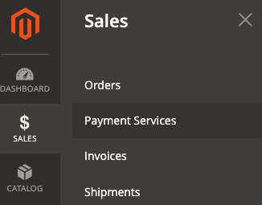

# Impostazioni

Puoi personalizzare [!DNL Payment Services] per soddisfare le tue esigenze con le impostazioni disponibili nella sezione [!DNL Payment Services] Casa.

Per configurare [!DNL Payment Services] per [!DNL Adobe Commerce] e [!DNL Magento Open Source] click **[!UICONTROL Settings]**. Queste opzioni di configurazione si applicano solo all’ambiente impostato nel _[!UICONTROL Payment mode]_campo[_ Generale _opzioni di configurazione](#configure-general-settings).

Per la configurazione multi-store o legacy consulta [Configura nell’amministratore](configure-admin.md).

## Configurare le impostazioni generali

La [!UICONTROL General] Le impostazioni consentono di abilitare o disabilitare Servizi di pagamento come metodo di pagamento e di aggiungere informazioni alle transazioni dei clienti per contrassegnare o preimpostare un sito web o una visualizzazione store con informazioni personalizzate.

### Abilita servizi di pagamento

È possibile attivare [!DNL Payment Services] per il tuo sito web e abilita test sandbox o pagamenti live.

1. Sulla _Amministratore_ barra laterale, vai a **[!UICONTROL Sales]** > **[!UICONTROL Payment Services]**.

   

1. Fai clic su **[!UICONTROL Settings]**. Vedi [Introduzione a [!DNL Payment Services] Pagina principale](payments-home.md) per ulteriori informazioni.

   La _[!UICONTROL General]_include le impostazioni utilizzate per abilitare [!DNL Payment Services] come metodo di pagamento.

1. Per abilitare [!DNL Payment Services] come metodo di pagamento per il tuo negozio, nel _[!UICONTROL General]_sezione, interruttore **[!UICONTROL Enable Payment Services as payment method]**a `Yes`.

1. Se stai ancora testando [!DNL Payment Services] per il tuo negozio, imposta **Modalità di pagamento** a `Sandbox`. Se sei pronto per abilitare i pagamenti live, impostalo su `Production`.

   >[!NOTE]
   >
   >Le _[!UICONTROL Sandbox Merchant ID]_e_[!UICONTROL Production Merchant ID]_ sono generati automaticamente e presenti nei rispettivi campi al termine dell’onboarding per la sandbox e/o la produzione.

1. Fai clic su **[!UICONTROL Save]**.

   Se tenti di allontanarti da questa visualizzazione senza salvare le modifiche, viene visualizzato un modale che richiede di ignorare le modifiche, continuare a modificare o salvare le modifiche.

1. Passa a **[!UICONTROL System]** > **[!UICONTROL Cache Management]** e fai clic su **[!UICONTROL Flush Cache]** per aggiornare tutte le cache non valide.

È ora possibile modificare le impostazioni predefinite per [opzioni di pagamento](#configure-payment-options) funzioni e visualizzazione della vetrina.

### Aggiungi descrittore soft

Puoi aggiungere una [!UICONTROL Soft Descriptor] al sito web o alla configurazione di singole viste store. I descrittori morbidi vengono visualizzati sui rendiconti bancari delle transazioni cliente. Se disponi di più store, marchi, cataloghi, ad esempio, puoi facilmente delineare tra loro aggiungendo testo personalizzato al [!UICONTROL Soft Descriptor] campo .

1. Sulla _Amministratore_ barra laterale, vai a **[!UICONTROL Sales]** > **[!UICONTROL Payment Services]**.

   

1. Fai clic su **[!UICONTROL Settings]**. Vedi [Introduzione a [!DNL Payment Services] Pagina principale](payments-home.md) per ulteriori informazioni.
1. Seleziona la visualizzazione del sito web o del negozio nella **[!UICONTROL Scope]** menu a discesa, per il quale si desidera creare un descrittore soft. Per la configurazione iniziale, lasciare impostato come **[!UICONTROL Default]** per impostare il valore predefinito.
1. Aggiungi il testo personalizzato (fino a 22 caratteri) nel campo di testo, sostituendo `Custom descriptor`.
1. Fai clic su **[!UICONTROL Save]**.
1. Per creare un descrittore software diverso da quello predefinito configurato per una visualizzazione sito Web o store:
   1. Seleziona la visualizzazione del sito web o del negozio nella **[!UICONTROL Scope]** menu a discesa, per il quale si desidera creare un descrittore soft.
   1. Attiva/disattiva _off_ **[!UICONTROL Use website]** o **[!UICONTROL Use default]**, a seconda dell’ambito selezionato).
   1. Aggiungi il testo personalizzato nel campo di testo.
   1. Fai clic su **[!UICONTROL Save]**.
1. Per abilitare la visualizzazione di un sito Web o di un archivio, visualizzare il descrittore software predefinito _o_ il descrittore software utilizzato per il sito web principale:
   1. Seleziona la visualizzazione del sito web o del negozio nella **[!UICONTROL Scope]** menu a discesa, per il quale si desidera abilitare un descrittore software esistente.
   1. Attiva/disattiva _su_ **[!UICONTROL Use website]** o **[!UICONTROL Use default]**, a seconda dell’ambito selezionato).
   1. Fai clic su **[!UICONTROL Save]**.

   Se tenti di allontanarti da questa visualizzazione senza salvare le modifiche, viene visualizzato un modale che richiede di ignorare le modifiche, continuare a modificare o salvare le modifiche.

### Opzioni di configurazione

| Campo | Ambito | Descrizione |
|---|---|---|
| [!UICONTROL Enable] | sito web | Attiva o disattiva [!DNL Payment Services] per il sito web. Opzioni: [!UICONTROL Yes] / [!UICONTROL No] |
| [!UICONTROL Payment mode] | vista store | Imposta il metodo o l&#39;ambiente per l&#39;archivio. Opzioni: [!UICONTROL Sandbox] / [!UICONTROL Production] |
| [!UICONTROL Sandbox Merchant ID] | vista store | Il tuo ID commerciante sandbox, generato automaticamente durante l’onboarding della sandbox. |
| [!UICONTROL Production Merchant ID] | vista store | Il tuo ID commerciante di produzione, generato automaticamente durante l’onboarding della sandbox. |
| [!UICONTROL Soft Descriptor] | visualizzazione sito Web o negozio | Aggiungi un descrittore soft al tuo sito web e alle visualizzazioni store per aggiungere informazioni alle transazioni dei clienti che delineano marchi, store o linee di prodotto. La [!UICONTROL Use website] l’opzione attiva/disattiva applica eventuali descrittori soft aggiunti a livello di sito web. La [!UICONTROL Use default] l’opzione attiva/disattiva applica eventuali descrittori soft aggiunti come predefiniti. |

## Configurare le opzioni di pagamento

Ora che hai abilitato [!UICONTROL Payment Services] per il tuo sito web, puoi modificare le impostazioni predefinite per le funzioni di pagamento e la visualizzazione della vetrina.

1. Sulla _Amministratore_ barra laterale, vai a **[!UICONTROL Sales]** > **[!UICONTROL Payment Services]**.

   

1. Fai clic su **[!UICONTROL Settings]**. Vedi [Introduzione a [!DNL Payment Services] Pagina principale](payments-home.md) per ulteriori informazioni.
1. Configura le opzioni di pagamento per [carte di credito](#credit-card-fields), [pulsanti di pagamento](#payment-buttons)e [stile pulsante](#button-style), secondo le sezioni seguenti.

### Campi carta di credito

La _[!UICONTROL Credit Card Fields]_Le impostazioni forniscono un&#39;opzione di pagamento semplice e sicura per i metodi di pagamento con carta di credito o con carta di debito.

Vedi [Opzioni di pagamento](payments-options.md#credit-card-fields) per ulteriori informazioni.

1. Sulla _Amministratore_ barra laterale, vai a **[!UICONTROL Sales]** > **[!UICONTROL Payment Services]**.

   

1. Seleziona la vista Store nella **[!UICONTROL Scope]** menu a discesa, per il quale si desidera abilitare un metodo di pagamento.
1. Per modificare il nome del metodo di pagamento visualizzato durante il pagamento, modificare il valore nel **[!UICONTROL Checkout title]** campo .
1. A [imposta l&#39;azione di pagamento](production.md#set-payment-services-as-payment-method), interruttore **[!UICONTROL Payment action]** a `Authorize` o `Authorize and Capture`.
1. Per abilitare [Autenticazione protetta 3DS](security.md#3ds) (`Off` per impostazione predefinita, attiva/disattiva **[!UICONTROL 3DS Secure authentication]** selettore su `Always` o `When required`.
1. Per abilitare o disabilitare i campi della carta di credito nella pagina di pagamento, attiva **[!UICONTROL Show on checkout page]** selettore.
1. Per attivare o disattivare [archiviazione di schede](#card-vaulting), attiva/disattiva **[!UICONTROL Vault enabled]** selettore.
1. Per attivare o disattivare [metodi di pagamento vagliati nell&#39;amministratore](#card-vaulting) (per consentire ai commercianti di completare gli ordini dei clienti nell&#39;amministratore utilizzando il metodo di pagamento attivato), seleziona **[!UICONTROL Show vaulted methods in Admin]** selettore.
1. Per attivare o disattivare la modalità di debug, attiva **[!UICONTROL Debug Mode]** selettore.
1. Fai clic su **[!UICONTROL Save]**.

   Se tenti di allontanarti da questa visualizzazione senza salvare le modifiche, viene visualizzato un modale che richiede di ignorare le modifiche, continuare a modificare o salvare le modifiche.

1. [Svuotare la cache](#flush-the-cache).

#### Opzioni di configurazione

| Campo | Ambito | Descrizione |
|---|---|---|
| [!UICONTROL Title] | vista store | Aggiungere il testo da visualizzare come titolo per questa opzione di pagamento nella visualizzazione Metodo di pagamento durante il pagamento. Opzioni: [!UICONTROL text field] |
| [!UICONTROL Payment Action] | sito web | La [azione di pagamento](https://docs.magento.com/user-guide/configuration/sales/payment-methods.html#payment-actions){target="_blank"} per il metodo di pagamento specificato. Opzioni: [!UICONTROL Authorize] / [!UICONTROL Authorize and Capture] |
| [!UICONTROL 3DS Secure authentication] | sito web | Attiva o disattiva [Autenticazione protetta 3DS](security.md#3ds). Opzioni: [!UICONTROL Always] / [!UICONTROL When Required] / [!UICONTROL Off] |
| [!UICONTROL Show on checkout page] | sito web | Attiva o disattiva i campi della carta di credito da visualizzare nella pagina di pagamento. Opzioni: [!UICONTROL Yes] / [!UICONTROL No] |
| [!UICONTROL Vault enabled] | vista store | Attiva o disattiva [archiviazione carte di credito](vaulting.md). Opzioni: [!UICONTROL Yes] / [!UICONTROL No] |
| [!UICONTROL Show vaulted payment methods in Admin] | vista store | Attiva o disattiva la possibilità per gli esercenti di completare gli ordini per i clienti nell&#39;amministratore [utilizzando un metodo di pagamento vaultato](vaulting.md). Opzioni: [!UICONTROL Yes] / [!UICONTROL No] |
| [!UICONTROL Debug Mode] | sito web | Attiva o disattiva la modalità di debug. Opzioni: [!UICONTROL Yes] / [!UICONTROL No] |

### Pulsanti di pagamento

La [!DNL PayPal Smart Buttons] le opzioni di pagamento forniscono al cliente un processo di pagamento semplice, rapido e sicuro. Vedi [Opzioni di pagamento](payments-options.md#paypal-smart-buttons) per ulteriori informazioni.

Puoi abilitare e configurare le opzioni di pagamento dei pulsanti intelligenti PayPal:

1. Seleziona la vista Store nella **[!UICONTROL Scope]** menu a discesa, per il quale si desidera abilitare un metodo di pagamento.
1. Per modificare il nome del metodo di pagamento come mostrato durante il pagamento, modifica il valore nel **[!UICONTROL Checkout Title]** campo .
1. A [imposta l&#39;azione di pagamento](production.md#set-payment-services-as-payment-method), interruttore **[!UICONTROL Payment action]** a `Authorize` o `Authorize and Capture`.
1. Usa i selettori di attivazione/disattivazione [!DNL PayPal smart button] caratteristiche di visualizzazione:
   - **[!UICONTROL Show PayPal buttons on product checkout page]**
   - **[!UICONTROL Show PayPal buttons on product detail page]**
   - **[!UICONTROL Show PayPal buttons in mini-cart preview]**
   - **[!UICONTROL Show PayPal buttons on cart page]**
   - **[!UICONTROL Show PayPal Pay Later button]**
   - **[!UICONTROL Show PayPal Pay Later message]**
   - **[!UICONTROL Show Venmo button]**
   - **[!UICONTROL Show Apple Pay button]**

      >[!NOTE]
      >
      > Per utilizzare Apple Paga [deve avere un account Apple sandbox tester](https://developer.apple.com/apple-pay/sandbox-testing/#create-a-sandbox-tester-account) (completo di false carte di credito e informazioni di fatturazione) per testarlo. Quando sei pronto a utilizzare Apple Pay in sandbox _o_ modalità di produzione, dopo aver completato [test e convalida](test-validate.md#test-in-sandbox-environment), contatta il tuo rappresentante commerciale per abilitarlo per i tuoi store live.

      Quando si attiva/disattiva la visibilità dei pulsanti di pagamento o il messaggio PayPal Pay Later, viene visualizzata un&#39;anteprima visiva della configurazione nella parte inferiore della pagina Settings (Impostazioni).

1. Per abilitare la modalità di debug, attiva **[!UICONTROL Debug Mode]** selettore.
1. Fai clic su **[!UICONTROL Save]**.

   Se tenti di allontanarti da questa visualizzazione senza salvare le modifiche, viene visualizzato un modale che richiede di ignorare le modifiche, continuare a modificare o salvare le modifiche.

1. [Svuotare la cache](#flush-the-cache).

#### Opzioni di configurazione

| Campo | Ambito | Descrizione |
|---|---|---|
| [!UICONTROL Title] | vista store | Aggiungere il testo da visualizzare come titolo per questa opzione di pagamento nella visualizzazione Metodo di pagamento durante il pagamento. Opzioni: campo di testo |
| [!UICONTROL Payment Action] | sito web | La [azione di pagamento](https://docs.magento.com/user-guide/configuration/sales/payment-methods.html#payment-actions){target="_blank"} per il metodo di pagamento specificato. Opzioni: [!UICONTROL Authorize] / [!UICONTROL Authorize and Capture] |
| [!UICONTROL Show PayPal buttons on checkout page] | vista store | Attiva o disattiva [!DNL PayPal Smart Buttons] nella pagina di pagamento. Opzioni: [!UICONTROL  Yes] / [!UICONTROL No] |
| [!UICONTROL Show PayPal buttons on product detail page] | vista store | Attiva o disattiva [!DNL PayPal Smart Buttons] nella pagina dei dettagli del prodotto. Opzioni: [!UICONTROL  Yes] / [!UICONTROL No] |
| [!UICONTROL Show PayPal buttons in mini-cart preview] | vista store | Attiva o disattiva [!DNL PayPal Smart Buttons] nell’anteprima del mini-carrello. Opzioni: [!UICONTROL Yes] / [!UICONTROL No] |
| [!UICONTROL Show PayPal buttons on cart page] | vista store | Attiva o disattiva [!DNL PayPal Smart Buttons] nella pagina del carrello. Opzioni: [!UICONTROL Yes] / [!UICONTROL No] |
| [!UICONTROL Show PayPal Pay Later button] | vista store | Attiva o disattiva l&#39;aspetto dell&#39;opzione di pagamento successivo in cui vengono visualizzati i pulsanti di pagamento. Opzioni: [!UICONTROL Yes] / [!UICONTROL No] |
| [!UICONTROL Show PayPal Pay Later Message] | sito web | Attiva o disattiva la messaggistica Paga in seguito nel carrello, nella pagina del prodotto, nel mini-carrello e durante il flusso di pagamento. Opzioni: [!UICONTROL Yes] / [!UICONTROL No] |
| [!UICONTROL Show Venmo button] | vista store | Attiva o disattiva l&#39;opzione di pagamento Venmo in cui vengono visualizzati i pulsanti di pagamento. Opzioni: [!UICONTROL Yes] / [!UICONTROL No] |
| [!UICONTROL Show Apple Pay button] | vista store | Attiva o disattiva l&#39;opzione Pagamento Apple in cui vengono visualizzati i pulsanti di pagamento. Opzioni: [!UICONTROL Yes] / [!UICONTROL No] |
| [!UICONTROL Debug Mode] | sito web | Attiva o disattiva la modalità di debug. Opzioni: [!UICONTROL Yes] / [!UICONTROL No] |

### Stile pulsante

Puoi anche configurare le _[!UICONTROL Button style]_opzioni dei pulsanti intelligenti PayPal:

1. Per modificare la variabile **[!UICONTROL Layout]**, seleziona `Vertical` o `Horizontal`.

   >[!NOTE]
   >
   > Se lo stile del pulsante è configurato come `Horizontal` e il tuo negozio è configurato per mostrare più pulsanti intelligenti PayPal, puoi visualizzare solo due pulsanti sulla pagina del prodotto, la pagina di pagamento e il mini-carrello, e un pulsante visualizzato nel carrello.

1. Per attivare la linea di graduazione in un layout orizzontale, attiva la **[!UICONTROL Show tagline]** selettore.
1. Per modificare il **[!UICONTROL Color]**, seleziona l’opzione di colore desiderata.
1. Per modificare il **[!UICONTROL Shape]**, seleziona `Pill` o `Rectangle`.
1. Per abilitare il selettore dell’altezza del pulsante, attiva/disattiva **[!UICONTROL Responsive button height]** selettore.
1. Per modificare il **[!UICONTROL Label]**, seleziona l’opzione di etichetta desiderata.

   Quando si modificano le opzioni di configurazione per layout, colore, forma, altezza ed etichetta, viene visualizzata un&#39;anteprima visiva della configurazione nella parte inferiore della pagina Impostazioni.

1. Fai clic su **[!UICONTROL Save]**.

   Se tenti di allontanarti da questa visualizzazione senza salvare le modifiche, viene visualizzato un modale che richiede di ignorare le modifiche, continuare a modificare o salvare le modifiche.

1. [Svuotare la cache](#flush-the-cache).

Puoi configurare [!DNL PayPal Smart Buttons] stile [nella configurazione Legacy in Admin](configure-admin.md#configure-paypal-smart-buttons) o qui [!DNL Payment Services Home]. Vedi [Guida allo stile dei pulsanti di PayPal](https://developer.paypal.com/docs/checkout/standard/customize/buttons-style-guide/) per ulteriori informazioni sulle opzioni.

#### Opzioni di configurazione

| Campo | Ambito | Descrizione |
|--- |--- |--- |
| [!UICONTROL Layout] | Visualizzazione store | Definire lo stile del layout dei pulsanti di pagamento. Opzioni: [!UICONTROL Vertical] / [!UICONTROL Horizontal] |
| [!UICONTROL Tagline] | Visualizzazione store | Attiva/disattiva la linea di tag. Opzioni: [!UICONTROL Yes] / [!UICONTROL No] |
| [!UICONTROL Color] | Visualizzazione store | Definire il colore dei pulsanti di pagamento. Opzioni: [!UICONTROL Blue] / [!UICONTROL Gold] / [!UICONTROL Silver] / [!UICONTROL White] / [!UICONTROL Black] |
| [!UICONTROL Shape] | Visualizzazione store | Definire la forma dei pulsanti di pagamento. Opzioni: [!UICONTROL Rectangular] / [!UICONTROL Pill] |
| [!UICONTROL Responsive Button Height] | Visualizzazione store | Definisce se i pulsanti di pagamento utilizzano un&#39;altezza predefinita. Opzioni: [!UICONTROL Yes] / [!UICONTROL No] |
| [!UICONTROL Height] | Visualizzazione store | Definire l’altezza dei pulsanti di pagamento. Valore predefinito: nessuno |
| [!UICONTROL Label] | Visualizzazione store | Definire l’etichetta visualizzata nei pulsanti di pagamento. Opzioni: [!UICONTROL PayPal] / [!UICONTROL Checkout] / [!UICONTROL Buynow] / [!UICONTROL Pay] / [!UICONTROL Installment] |

## Svuotare la cache

Se modifichi la configurazione in _Impostazioni_, ad esempio attivando i pulsanti Pay, Venmo o PayPal PayLater di Apple, scarica manualmente la cache in modo che il tuo negozio mostri le configurazioni più recenti.

1. Sulla _Amministratore_ barra laterale, vai a **[!UICONTROL System]** > **[!UICONTROL Cache Management]**.
1. Fai clic su **[!UICONTROL Flush Cache]** per aggiornare tutte le cache non valide.

Se un tipo di cache nella tabella Gestione cache ha un `INVALIDATED` stato, l&#39;archivio potrebbe non mostrare la configurazione più recente per quell&#39;elemento. Esegui il flush della cache per aggiornare il tuo archivio per mostrare la configurazione più recente.

Per garantire che lo store mostri la configurazione corretta, periodicamente [svuota la cache](https://docs.magento.com/user-guide/system/cache-management.html).

## Vaulting delle schede

È possibile abilitare funzionalità che consentono ai clienti di archiviare, o &quot;salvare&quot;, le informazioni sulla carta di credito nel proprio account personale da utilizzare per acquisti futuri.

Puoi anche utilizzare l’archiviazione delle schede nell’amministratore per completare gli ordini successivi per i clienti esistenti.

Attiva o disattiva l&#39;archiviazione delle schede nel [Impostazioni campo carta di credito](#credit-card-fields).

Vedi [Archiviazione carte di credito](vaulting.md) per ulteriori informazioni.

## 3DS

3DS protegge clienti e commercianti da attività fraudolente nei loro negozi e consente il rispetto degli standard dell&#39;Unione Europea (UE).

Attivare o disattivare i 3DS in [Impostazioni campo carta di credito](#credit-card-fields).

Vedi [3DS in sicurezza](security.md#3ds) per ulteriori informazioni.

## Utilizzare più account PayPal

In [!UICONTROL Payment Services], puoi utilizzare più account PayPal all&#39;interno di **uno** conto commerciale a livello di sito web. Ad esempio, se gestisci i tuoi store in più paesi (che utilizzano diversi) [valute](https://docs.magento.com/user-guide/stores/currency.html)) o desideri utilizzare Adobe Commerce per alcune parti della tua attività ma non per _tutto_, puoi configurare il tuo account commerciale per l&#39;utilizzo di più account PayPal.

Vedi [Sito, archiviazione e visualizzazione ambito](https://experienceleague.adobe.com/docs/commerce-admin/start/setup/websites-stores-views.html) per ulteriori informazioni sulla gerarchia di siti web, store e viste store.

Il rappresentante commerciale può creare un nuovo [scope](https://experienceleague.adobe.com/docs/commerce-admin/start/setup/websites-stores-views.html#scope-settings) per il tuo conto commerciale e a bordo del sito aggiuntivo con PayPal in modo che uno qualsiasi dei pulsanti PayPal che configuri per apparire verrà mostrato sul tuo sito. Contatta il tuo rappresentante commerciale per assistenza sull&#39;utilizzo di più account PayPal per i tuoi siti web.
