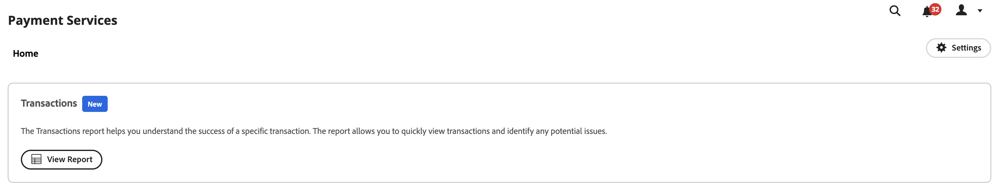

# Rapporto Transazioni

[!DNL Payment Services] per [!DNL Adobe Commerce] e [!DNL Magento Open Source] offre una funzione di reporting completa che consente di ottenere una chiara visualizzazione delle transazioni, degli ordini e dei pagamenti del negozio.

{width="700" zoomable="yes"}

Il rapporto Transazioni fornisce visibilità sui tassi di autorizzazione delle transazioni e sulle tendenze negative delle transazioni, consentendo di monitorare in modo efficace lo stato del tuo archivio e di identificare in modo preventivo e risolvere eventuali problemi relativi alle transazioni.

Vedi singole transazioni per gli ordini inseriti in vetrina e relativi metodi di pagamento, risultato, codici di risposta pagamento e altro ancora.

Le informazioni fornite nel rapporto Transazioni sono destinate esclusivamente all&#39;uso da parte degli esercenti. Non condividere queste informazioni con clienti o altri potenziali truffatori. Le informazioni sulle transazioni possono essere utilizzate per evitare controlli di sicurezza o per eseguire ordini che determinano rettifiche.

È possibile scaricare il report Transazioni in un formato di file .csv da utilizzare nel software di contabilità o gestione ordini esistente.

>[!NOTE]
>
>Non è possibile visualizzare i rapporti finanziari se non [Modalità Live onboarded e attivata](production.md#enable-live-payments) per [!DNL Payment Services].

## Visualizzazione report transazioni

La vista del rapporto Transazioni è disponibile nella vista Transazioni di Payment Services. Include tutte le informazioni disponibili sulle transazioni per i tuoi store.

Il giorno _Amministratore_ barra laterale, vai a **[!UICONTROL Sales]** > **[!UICONTROL Payment Services]** > _[!UICONTROL Transactions]_>**[!UICONTROL View Report]**per visualizzare la tabella dettagliata Visualizzazione del rapporto Transazioni.

{width="600" zoomable="yes"}

È possibile configurare questa visualizzazione in base alle sezioni di questo argomento per presentare al meglio i dati che si desidera visualizzare.

Vedi ID transazione fornitore e ordine Commerce collegati, importi transazione, metodo di pagamento per transazione e altro all’interno di questo rapporto.

Non tutti i metodi di pagamento forniscono la stessa granularità delle informazioni. Ad esempio, le transazioni con carta di credito forniscono i codici di risposta, AVS e CCV nel rapporto Transazioni, mentre i pulsanti Smart di PayPal no.

È possibile [scarica transazioni](#download-transactions) in un formato di file .csv da utilizzare nel software di contabilità o di gestione degli ordini esistente.

### Seleziona origine dati

Nella visualizzazione del rapporto Transazioni è possibile selezionare l&#39;origine dati:**[!UICONTROL Live]** o **[!UICONTROL Sandbox]**- per il quale si desidera visualizzare i risultati del rapporto.

{width="300" zoomable="yes"}

Se _[!UICONTROL Live]_è l&#39;origine dati selezionata, è possibile visualizzare le informazioni del report per gli archivi che utilizzano [!DNL Payment Services] in modalità di produzione. Se_[!UICONTROL Sandbox]_ è l’origine dati selezionata, puoi visualizzare le informazioni del rapporto per la modalità sandbox.

Le selezioni delle origini dati funzionano come segue:

* Se non si dispone di negozi che utilizzano [!DNL Payment Services] in modalità di produzione, l’impostazione predefinita della selezione dell’origine dati è _[!UICONTROL Sandbox]_.
* Se sono presenti negozi (uno o più) che utilizzano [!DNL Payment Services] in modalità di produzione, l’impostazione predefinita della selezione dell’origine dati è _[!UICONTROL Live]_.
* Le esportazioni dei rapporti rispettano sempre la selezione dell’origine dati.

Per selezionare l&#39;origine dati per [!UICONTROL Transactions] rapporto:

1. Il giorno _Amministratore_ barra laterale, vai a **[!UICONTROL Sales]** > **[!UICONTROL [!DNL Payment Services]]** > _[!UICONTROL Transactions]_>**[!UICONTROL View Report]**.
1. Clic **[!UICONTROL Data source]** e seleziona **[!UICONTROL Live]** o **[!UICONTROL Sandbox]**.

   I risultati del report vengono rigenerati in base all&#39;origine dati selezionata.

### Personalizzare l’intervallo temporale delle date

Nella visualizzazione del rapporto Transazioni è possibile personalizzare l&#39;intervallo temporale delle transazioni da visualizzare selezionando date specifiche. Per impostazione predefinita, nella griglia sono visualizzati 30 giorni di transazioni.

1. Il giorno _Amministratore_ barra laterale, vai a **[!UICONTROL Sales]** > **[!UICONTROL [!DNL Payment Services]]** > _[!UICONTROL Transactions]_>**[!UICONTROL View Report]**.
1. Fai clic su **[!UICONTROL Transaction dates]** filtro selettore calendario.
1. Scegli l’intervallo di date applicabile.
1. Visualizza le transazioni per le date specificate nella griglia.

### Filtrare le informazioni del rapporto

Dalla vista del rapporto Transazioni, è possibile filtrare i risultati degli stati che si desidera visualizzare selezionando i criteri di filtro.

1. Il giorno _Amministratore_ barra laterale, vai a **[!UICONTROL Sales]** > **[!UICONTROL [!DNL Payment Services]]** > _[!UICONTROL Transactions]_>**[!UICONTROL View Report]**.
1. Fai clic su **[!UICONTROL Filter]** selettore.
1. Attiva/disattiva _[!UICONTROL Transaction Result]_opzioni per visualizzare i risultati del rapporto solo per le transazioni ordine selezionate.
1. Attiva/disattiva _[!UICONTROL Payment Method]_opzioni per visualizzare i risultati del rapporto solo per i metodi di pagamento selezionati.
1. Immetti un _Importo minimo ordine_ o _Importo massimo ordine_ per visualizzare i risultati del rapporto all&#39;interno dell&#39;intervallo di importi dell&#39;ordine.
1. Immetti un _[!UICONTROL Order ID]_per cercare una transazione specifica.
1. Clic **[!UICONTROL Hide filters]** per nascondere il filtro.

### Mostra e nascondi colonne

Il rapporto Transazioni mostra tutte le colonne di informazioni disponibili per impostazione predefinita. È tuttavia possibile personalizzare le colonne visualizzate nel rapporto.

1. Il giorno _Amministratore_ barra laterale, vai a **[!UICONTROL Sales]** > **[!UICONTROL [!DNL Payment Services]]** > _[!UICONTROL Transactions]_>**[!UICONTROL View Report]**.
1. Fai clic su **[!UICONTROL Column settings]** icona {width="20" zoomable="yes"}.
1. Per personalizzare le colonne visualizzate nel report, selezionare o deselezionare le colonne nell&#39;elenco.

   Nel rapporto Transazioni vengono immediatamente visualizzate le modifiche apportate nel menu Impostazioni colonna. Le preferenze di colonna vengono salvate e rimangono attive se ci si sposta dalla vista del rapporto.

### Aggiornare i dati del rapporto

La vista del rapporto Transazioni mostra una _[!UICONTROL Last updated]_timestamp che mostra l’ultimo aggiornamento delle informazioni del rapporto. Per impostazione predefinita, i dati del rapporto Transazioni vengono aggiornati automaticamente ogni tre ore.

Puoi anche forzare manualmente un aggiornamento dei dati del rapporto per visualizzare le informazioni più aggiornate.

1. Il giorno _Amministratore_ barra laterale, vai a **[!UICONTROL Sales]** > **[!UICONTROL [!DNL Payment Services]]** > _[!UICONTROL Transactions]_>**[!UICONTROL View Report]**.
1. Fai clic su _Aggiorna_ icona ({width="20" zoomable="yes"}).

   I dati del rapporto Transazioni vengono aggiornati, *[!UICONTROL Update complete]* viene visualizzata la conferma e nella griglia sono presenti le informazioni più recenti.

### Scarica transazioni

È possibile scaricare un file .csv con tutte le transazioni visibili nella griglia di visualizzazione delle transazioni, sia che si visualizzino i 30 giorni predefiniti delle transazioni o un intervallo temporale personalizzato.

1. Il giorno _Amministratore_ barra laterale, vai a **[!UICONTROL Sales]** > **[!UICONTROL [!DNL Payment Services]]** > **[!UICONTROL Transactions]**.
1. Se desideri visualizzare le transazioni per un arco temporale diverso dagli ultimi 30 giorni, [personalizza l’intervallo di date temporale per i tuoi stati](#customize-dates-timeframe).
1. Fai clic su _Scarica_ {width="20" zoomable="yes"} icona.

Le transazioni vengono scaricate in formato .csv.

### Descrizioni delle colonne

I rapporti sulle transazioni includono le seguenti informazioni.

| Colonna | Descrizione |
| ------------ | -------------------- |
| [!UICONTROL Order ID] | ID ordine commerciale (contiene solo i valori per le transazioni riuscite ed è vuoto per le transazioni rifiutate)   Per visualizzare i [informazioni ordine](https://docs.magento.com/user-guide/sales/orders.html){target="_blank"}, fai clic sull&#39;ID. |
| [!UICONTROL Provider Transaction ID] | ID transazione fornito dal provider dei pagamenti; contiene solo valori per le transazioni riuscite e un trattino per le transazioni rifiutate. |
| [!UICONTROL Transaction Date] | Timestamp data transazione |
| [!UICONTROL Payment Method] | Metodo di pagamento della transazione; disponibile per le versioni di Payment Services 1.6.0 e successive |
| [!UICONTROL Result] | Risultato della transazione:*[!UICONTROL OK]* (operazione riuscita), *[!UICONTROL Rejected by Payment Provider]* (rifiutato da PayPal), *[!UICONTROL Rejected by Bank]* (rifiutato dalla banca che ha emesso la carta) |
| [!UICONTROL Response Code] | Codice di errore che fornisce il motivo del rifiuto da parte del provider di pagamenti o della banca. Vedere l&#39;elenco dei possibili codici di risposta e le descrizioni per [`Rejected by Bank` stato](https://developer.paypal.com/docs/api/orders/v2/#definition-processor_response) e [`Rejected by Payment Provider` stato](https://developer.paypal.com/api/rest/reference/orders/v2/errors/). |
| [!UICONTROL AVS Code] | Indirizzo: codice del servizio di verifica; informazioni di risposta del processore per le richieste di pagamento. Consulta [elenco dei codici e delle descrizioni possibili](https://developer.paypal.com/docs/api/orders/v2/#definition-processor_response) per ulteriori informazioni. |
| [!UICONTROL CVV Code] | Codice valore di verifica della carta per le carte di credito e di debito; vedere [elenco dei codici e delle descrizioni possibili](https://developer.paypal.com/docs/api/orders/v2/#definition-processor_response) per ulteriori informazioni. |
| [!UICONTROL Amount] | Importo dell’ordine della transazione |
| [!UICONTROL Currency] | Valuta utilizzata per l&#39;ordine nella transazione |
| [!UICONTROL Type] | [Azione di pagamento](../payment-services/production.md#set-payment-services-as-payment-method) per transazione:`Authorize` o `Authorize and Capture` |

### Codici di risposta di errore

Il _Codice di risposta_ mostra un errore specifico o un codice di successo relativo alla transazione. Alcuni codici di errore comuni che potresti visualizzare includono:

* `PAYMENT_DENIED`—La transazione è stata rifiutata da PayPal perché sospettata di frode.
* `INTERNAL_SERVER_ERROR`- La transazione è stata rifiutata da PayPal e si è verificato un errore del server PayPal. È possibile ritentare la transazione.
* `INSTRUMENT_DECLINED`- Il cliente è stato rifiutato da PayPal in base al metodo di pagamento selezionato. La transazione può essere ritentata con un metodo di pagamento diverso.
* `9500`- La transazione è stata rifiutata dalla banca associata perché sospettata di frode.
* `5120`- La transazione è stata rifiutata dalla banca associata perché il cliente non disponeva di fondi sufficienti per il pagamento.
* `5650`- La transazione è stata rifiutata dalla banca associata perché la banca richiede l&#39;autenticazione forte del cliente ([3DS](security.md#3ds)).

I codici di risposta di errore dettagliati per le transazioni non riuscite sono disponibili per le transazioni successive al 1° giugno 2023. I dati del rapporto parziale verranno visualizzati per le transazioni avvenute prima del 1° giugno 2023.

