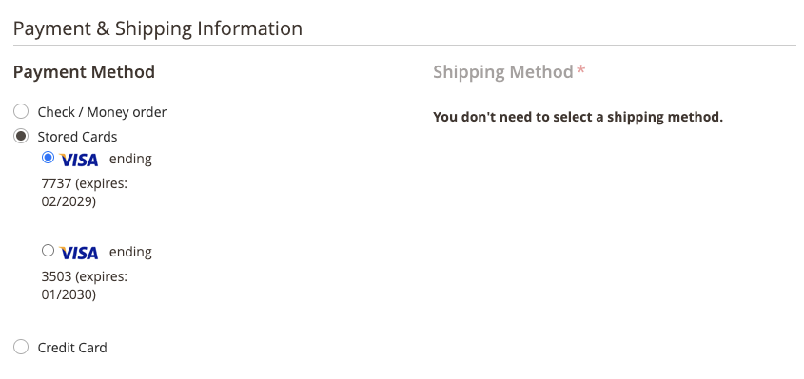

# Archiviazione carte di credito

Convertire clienti una tantum in acquirenti fedeli con il vaulting della carta di credito. Gli acquirenti possono salvare le credenziali della propria carta di credito durante il pagamento per utilizzarle in un acquisto successivo per lo stesso, o per un altro, negozio all&#39;interno dello stesso account commerciale.

Gli acquirenti utilizzano il token memorizzato per completare un checkout futuro con le informazioni sulla carta di credito salvate.

Inoltre possono facilmente cancellare le loro carte di credito evaulate da [Metodi di pagamento memorizzati](https://docs.magento.com/user-guide/customers/account-dashboard-stored-payment-methods.html) nel loro account personale.

## Abilita vaulting

È possibile abilitare l&#39;archiviazione delle carte di credito per i clienti _e_ esercenti nell&#39;amministratore: per i tuoi negozi in [!DNL Payment Services] [Impostazioni](settings.md#card-vaulting).

## Utilizzare il vaulting nell&#39;amministratore

Se un cliente ha una carta di credito precedentemente attivata, un esercente può creare un ordine successivo per quel cliente nell&#39;Amministratore utilizzando i metodi di pagamento vagliati.

È possibile utilizzare le schede con privilegi nell&#39;amministratore solo se il cliente dispone sia di un account esistente che di un token valido memorizzato nel sistema da un pagamento completato in precedenza.

Per creare un ordine nell&#39;amministratore per un cliente utilizzando la sua carta di credito vaultata:

1. [Creare un ordine e aggiungere prodotti](https://experienceleague.adobe.com/docs/commerce-admin/stores-sales/point-of-purchase/assist/customer-account-create-order.html).
1. In _[!UICONTROL Payment & Shipping Information]_, seleziona **[!UICONTROL Stored Cards]**come metodo di pagamento.
1. Selezionare il metodo di pagamento con carta di credito desiderato.
1. Dopo aver completato tutte le altre fasi necessarie per l&#39;ordine, [inviare](https://experienceleague.adobe.com/docs/commerce-admin/stores-sales/point-of-purchase/assist/customer-account-create-order.html?lang=en#step-3%3A-submit-the-order).

   

## Sicurezza

Le informazioni minime sulla carta di credito sono condivise con l&#39;acquirente; vedono solo le ultime quattro cifre, la data di scadenza e il marchio della loro carta di credito vaulted. Le informazioni sulla carta di credito sono memorizzate con il provider di pagamento per soddisfare [PCI](security.md#PCI-compliance) norme di conformità.
