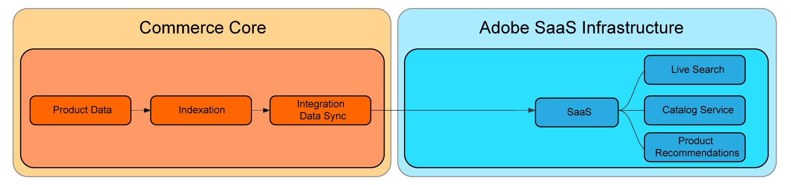
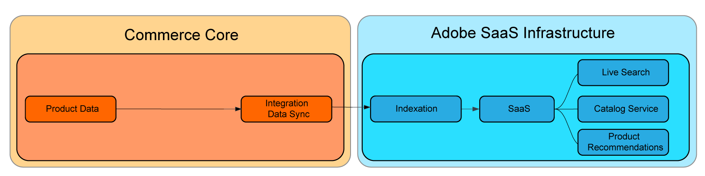

# Indicizzazione dei prezzi SaaS

L’indicizzazione dei prezzi SaaS accelera il tempo necessario affinché le variazioni di prezzo si riflettano sul sito web di un cliente SaaS dopo l’invio. Questo modulo opzionale consente ai commercianti con cataloghi complessi di grandi dimensioni o con più siti Web o gruppi di clienti di elaborare le variazioni di prezzo in modo più rapido e continuo.

Il più grande collo di bottiglia della pipeline: i processi pesanti computazionali come l’indicizzazione e il calcolo dei prezzi, sono stati spostati dal core PHP all’infrastruttura cloud di Adobe. Questo consente ai commercianti di aumentare rapidamente le risorse per aumentare i tempi di indicizzazione dei prezzi e riflettere tali modifiche ai siti web a velocità molto più elevate.

Il flusso di dati di indicizzazione Core ai servizi SaaS è simile al seguente:



Con l’indicizzazione dei prezzi SaaS, il flusso è:



Tutti i commercianti che soddisfano i requisiti possono trarre vantaggio da questi miglioramenti, ma coloro che ne trarranno i maggiori vantaggi sono i clienti con:

* Variazioni di prezzo costanti: commercianti che richiedono modifiche ripetute ai prezzi per soddisfare obiettivi strategici quali promozioni frequenti, sconti stagionali o riduzioni di scorte.
* Più siti web e/o gruppi di clienti: commercianti con cataloghi di prodotti condivisi su più siti web (domini/marchi) e/o gruppi di clienti.
* Grande numero di prezzi univoci su siti web o gruppi di clienti: commercianti con ampi cataloghi di prodotti condivisi che contengono prezzi univoci su siti web o gruppi di clienti, come commercianti B2B con prezzi pre-negoziati, marchi con diverse strategie di prezzo.

Se disponi di applicazioni di terze parti che si basano sull&#39;indicizzatore dei prezzi PHP di base, leggi la documentazione e consulta il provider di estensioni prima di apportare qualsiasi modifica.

L’indicizzazione dei prezzi SaaS è disponibile gratuitamente per i clienti che utilizzano i servizi Adobe Commerce.

Questa mini-guida descrive come funziona l’indicizzazione dei prezzi SaaS e come abilitarla.

## Requisiti di sistema

Per utilizzare l’indicizzazione dei prezzi SaaS, è necessario:

* Adobe Commerce 2.4.4+
* Almeno uno dei seguenti servizi SaaS installati:

   * [Servizio catalogo](../catalog-service/overview.md)
   * [Live Search](../live-search/guide-overview.md)
   * [Recommendations del prodotto](../product-recommendations/guide-overview.md)

## Moduli

L’indicizzazione dei prezzi SaaS utilizza una serie di moduli per fornire funzionalità. L’elenco dei moduli richiesti potrebbe essere leggermente diverso, a seconda della configurazione del negozio.

Questi moduli aggiungono i nuovi feed all’amministratore. Questi feed trasferiscono i dati necessari per il calcolo dei prezzi all’indicizzatore SaaS e ignorano l’indicizzatore dei prezzi PHP di base.

```
magento/module-saas-price
magento/module-saas-scopes
magento/module-product-override-price-remover
magento/module-bundle-product-override-data-exporter
```

I clienti che utilizzano Luma e Adobe Commerce Core GraphQL possono installare un modulo che fornisce compatibilità con Luma e Core GraphQL e disabilita l’indicizzatore prezzi PHP di base:

```
adobe-commerce/catalog-adapter
```

Il `catalog-adapter` è compatibile solo con la versione 2.4.5. Il supporto per le versioni 2.4.4 e 2.4.6 verrà rilasciato a breve.
Se necessario, l&#39;indicizzatore dei prezzi PHP di base può essere riattivato da un&#39;estensione di terze parti o per qualsiasi altro motivo.

## Avvertenze

A seconda di fattori quali i tipi di prodotto, la complessità del prezzo e le dimensioni del catalogo, l&#39;indicizzazione dei prezzi SaaS potrebbe essere la soluzione giusta per il tuo negozio. Leggi le seguenti limitazioni e stabilisci se si tratta di una buona soluzione per il tuo sito.

Attualmente, l’indicizzazione dei prezzi SaaS supporta tipi di prodotto dinamici semplici, raggruppati, virtuali, configurabili e in bundle.
Il supporto per i tipi di prodotti scaricabili, gift card e bundle fissi sarà presto disponibile.

I nuovi feed devono essere sincronizzati manualmente con `resync` [Comando CLI](https://experienceleague.adobe.com/docs/commerce-merchant-services/user-guides/data-services/catalog-sync.html#resynccmdline). In caso contrario, i dati vengono aggiornati nel processo di sincronizzazione standard. Ulteriori informazioni su [Sincronizzazione catalogo](../landing/catalog-sync.md) processo.

## Scenari di utilizzo

### Luma senza dipendenze di estensione

* Un commerciante Luma o Abode Commerce Core GraphQL che dispone di un servizio richiesto installato (Live Search, Product Recommendations, Catalog Service)
* Nessuna estensione di terze parti basata sull&#39;indicizzatore dei prezzi PHP di base
* Vendita di prodotti semplici, configurabili, raggruppati, virtuali e dinamici in bundle

1. Abilita nuovi feed.
1. Installare la scheda catalogo.

### Luma e Adobe Commerce Core GraphQl con dipendenze dell’indicizzatore del prezzo di base PHP

* Un commerciante Luma o Abode Commerce Core GraphQL che dispone di un servizio supportato installato (Live Search, Product Recommendations, Catalog Service)
* Con un&#39;estensione di terze parti che si basa sull&#39;indicizzatore dei prezzi PHP di base
* Vendita di prodotti semplici, configurabili, raggruppati, virtuali e dinamici in bundle

1. Abilita i nuovi feed
1. Installare la scheda catalogo.
1. Riattivare l&#39;indicizzatore prezzi PHP di base.
1. Utilizzare i nuovi feed e il codice di compatibilità Luma nel `catalog-adapter` modulo.

### Mercante headless

* Un commerciante headless che dispone di un servizio supportato installato (Live Search, Product Recommendations, Catalog Service)
* Nessuna dipendenza dall&#39;indicizzatore prezzi PHP di base
* Vendita di prodotti semplici, configurabili, raggruppati, virtuali e dinamici in bundle

1. Abilita nuovi feed
1. Installare la scheda catalogo, che disabilita l&#39;indicizzatore prezzi PHP di base.

### Luma/Core GraphQL/Headless con tipi di prodotto non supportati

* Luma/commerciante headless
* Vendita di gift card, scaricabili o pacchetti di prodotti fissi

Con i tipi di prodotto attualmente non supportati, attendi il supporto completo per i tipi di prodotto.
