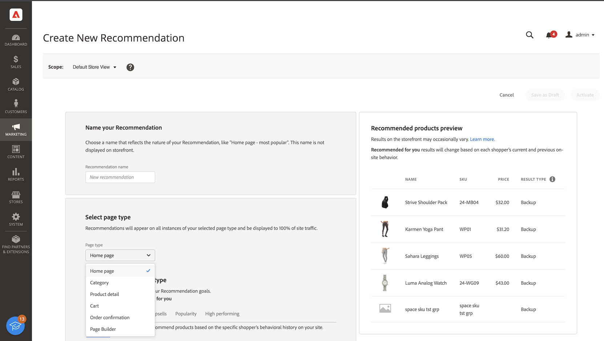
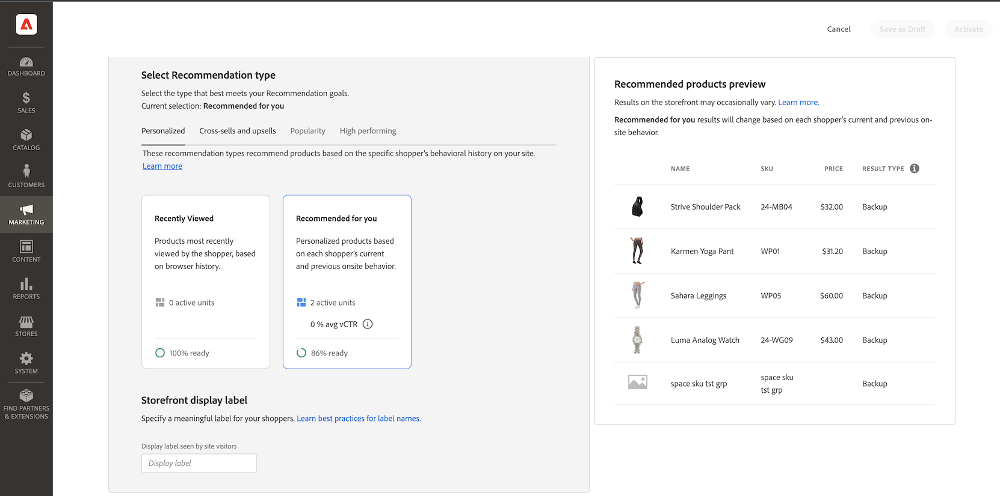
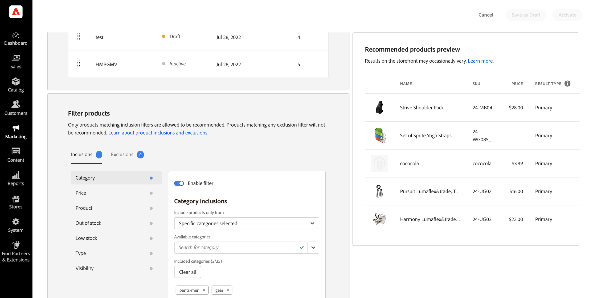

# Crea nuova raccomandazione

Quando create una raccomandazione, create una _unità di raccomandazione_ che contiene il prodotto consigliato _items_.

_Unità di raccomandazione_

Quando attivate l&#39;unità di raccomandazione, Adobe Commerce inizia a [raccogliere dati](workspace.md) per misurare impression, visualizzazioni, clic e così via. La [!DNL Product Recommendations] Nella tabella sono visualizzate le metriche per ogni unità di raccomandazione per aiutarti a prendere decisioni aziendali informate.

1. Sulla _Amministratore_ barra laterale, vai a **Marketing** > _Promozioni_ > **Recommendations di prodotto** per visualizzare _Recommendations di prodotto_ workspace.

1. Specifica la [Visualizzazione store](https://docs.magento.com/user-guide/configuration/scope.html) in cui visualizzare i consigli.

   >[!NOTE]
   >
   > Le unità consigliate di Page Builder possono essere create solo per la visualizzazione store predefinita. Per ulteriori informazioni sulla creazione di consigli di prodotto con Page Builder, consulta [Aggiungi contenuto - Recommendations prodotto](https://docs.magento.com/user-guide/cms/page-builder-add-recommendations.html).

1. Fai clic su **Crea consiglio**.

1. In _Denomina la raccomandazione_ immettere un nome descrittivo per il riferimento interno, ad esempio `Home page most popular`.

1. In _Seleziona il tipo di pagina_ selezionate la pagina in cui desiderate visualizzare il consiglio tra le seguenti opzioni:

   - Home page
   - Categoria
   - Dettagli prodotto
   - Carrello
   - Conferma
   - [Page Builder](https://docs.magento.com/user-guide/cms/page-builder-add-recommendations.html)

   Potete creare fino a cinque unità di raccomandazione attive per ciascun tipo di pagina e fino a 25 per Page Builder. Il tipo di pagina è grigio Quando viene raggiunto il limite.

   
   _Nome e posizione della pagina del consiglio_

1. In _Seleziona il tipo di raccomandazione_ specifica la sezione [tipo di raccomandazione](type.md) nella pagina selezionata. Per alcune pagine, il [placement](placement.md) Le raccomandazioni sono limitate a determinati tipi.

   Alcuni tipi di consigli utilizzano i dati comportamentali degli acquirenti per [modelli di apprendimento automatico](behavioral-data.md) per generare consigli personalizzati. Per visualizzare l&#39;avanzamento del training di ciascun tipo di raccomandazione, in questa sezione viene visualizzata una misura di preparazione per ciascun tipo. Questi indicatori di preparazione sono calcolati sulla base di un paio di fattori:

   - Dimensione del set di risultati sufficiente: Ci sono abbastanza risultati che vengono restituiti nella maggior parte degli scenari per evitare di utilizzare [consigli di backup](behavioral-data.md#backuprecs)?

   - Varietà di set di risultati sufficiente: I prodotti restituiti rappresentano una varietà di prodotti del catalogo? L&#39;obiettivo con questo fattore è quello di evitare che una minoranza di prodotti sia gli unici articoli consigliati in tutto il sito.

   In base ai fattori di cui sopra, viene calcolato e visualizzato un valore di preparazione. Un tipo di raccomandazione è considerato pronto per essere distribuito quando il suo valore di preparazione è pari o superiore al 75%. Un tipo di raccomandazione è considerato parzialmente pronto quando la sua disponibilità è almeno del 50%. Infine, un tipo di raccomandazione non è pronto per essere distribuito quando il suo valore di preparazione è inferiore al 50%.

   
   _Tipo di raccomandazione_

1. In _Etichetta della visualizzazione di Storefront_ nella sezione [etichetta](placement.md#recommendation-labels) che è visibile ai tuoi acquirenti, come &quot;Top seller&quot;.

1. In _Scegliere il numero di prodotti_ utilizzate il cursore per specificare quanti prodotti visualizzare nell&#39;unità di raccomandazione.

   Il valore predefinito è `5`, con un massimo di `20`.

1. In _Seleziona posizionamento_ specificate la posizione in cui l&#39;unità raccomandazione deve essere visualizzata nella pagina.

   - Nella parte inferiore del contenuto principale
   - Nella parte superiore del contenuto principale

1. (Facoltativo) Per modificare l’ordine delle raccomandazioni, selezionate e spostate le righe nella sezione _Scegli posizione_ tabella.

   La _Scegli posizione_ visualizza tutte le raccomandazioni (se presenti) create per il tipo di pagina selezionato.

   
   _Ordine dei consigli nella pagina_

1. (Facoltativo) In _Filtri_ sezione [applica filtri](filters.md) per controllare quali prodotti vengono visualizzati nell&#39;unità di raccomandazione.

   
   _Filtri di prodotto consigliati_

1. Al termine, fai clic su una delle seguenti opzioni:

   - **Salva come bozza** per modificare l&#39;unità di raccomandazione in un secondo momento. Non potete modificare il tipo di pagina o di raccomandazione per un&#39;unità di raccomandazione in uno stato di bozza.

   - **Attiva** per abilitare l&#39;unità di raccomandazione sulla vetrina.

## Anteprima Recommendations {#preview}

La _Anteprima dei prodotti consigliati_ Il pannello è sempre disponibile con una selezione di prodotti di esempio che potrebbero essere visualizzati nell&#39;unità di raccomandazione quando viene distribuito nella vetrina.

Per sottoporre a test una raccomandazione quando si lavora in un ambiente non di produzione, è possibile recuperare i dati della raccomandazione da un [sorgente diversa](settings.md). Questo consente ai commercianti di sperimentare le regole e visualizzare in anteprima i consigli prima di distribuirli in produzione.

| Campo | Descrizione |
|---|---|
| Nome | Nome del prodotto. |
| SKU | Unità di conservazione delle scorte assegnata al prodotto |
| Prezzo | Il prezzo del prodotto. |
| Tipo di risultato | Primaria - indica che sono stati raccolti dati di formazione sufficienti per visualizzare una raccomandazione. Backup: indica che non sono raccolti dati di formazione sufficienti, quindi viene utilizzato un consiglio di backup per riempire lo slot. Vai a [Dati comportamentali](behavioral-data.md) per ulteriori informazioni sui modelli di apprendimento automatico e sui consigli di backup. |

Man mano che crei l&#39;unità di raccomandazione, sperimenta con il tipo di pagina, il tipo di raccomandazione e i filtri per ottenere un feedback immediato in tempo reale sui prodotti che verranno inclusi. Non appena iniziate a capire quali prodotti vengono visualizzati, potete configurare l&#39;unità di raccomandazione per soddisfare le vostre esigenze aziendali.

Adobe Commerce [filtri](filters.md) consigli per evitare la visualizzazione di prodotti duplicati quando più unità di raccomandazione sono distribuite su una singola pagina. Di conseguenza, i prodotti visualizzati nel pannello di anteprima potrebbero essere diversi da quelli visualizzati nella vetrina.

>[!NOTE]
>
> Non è possibile visualizzare in anteprima la `Recently viewed` tipo di raccomandazione perché i dati non sono disponibili nell&#39;amministratore.
