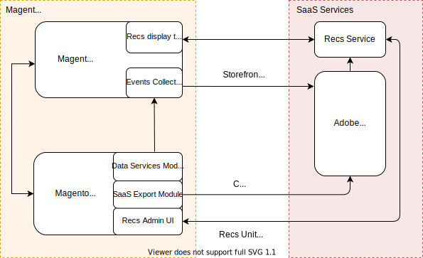

# Sviluppo per l&#39;amministratore di prodotto Recommendations

Product Recommendations è un potente strumento di marketing che può essere utilizzato per aumentare le conversioni, aumentare i ricavi e stimolare il coinvolgimento degli acquirenti. I prodotti Recommendations vengono visualizzati nella vetrina sotto forma di unità quali &quot;I clienti che hanno visualizzato questo prodotto hanno visualizzato anche&quot;, &quot;I clienti che hanno acquistato questo prodotto hanno acquistato anche&quot;, &quot;Consigliato per te&quot; e così via. Adobe Commerce Product Recommendations è basato su [Adobe Sensei](https://www.adobe.com/sensei.html), che utilizza algoritmi di intelligenza artificiale e machine-learning per eseguire un&#39;analisi approfondita dei dati aggregati dell&#39;acquirente. Questi dati, se combinati con il catalogo Commerce, danno luogo a esperienze altamente coinvolgenti, rilevanti e personalizzate per l’acquirente.

>[!NOTE]
>
>Se la vetrina è implementata utilizzando PWA Studi, consulta [Documentazione di PWA](https://developer.adobe.com/commerce/pwa-studio/integrations/product-recommendations/). Se utilizzi una tecnologia front-end personalizzata come React o Vue JS, consulta la guida utente per scoprire come integrare Product Recommendations in una [senza testa](headless.md) ambiente.

## Panoramica dell&#39;architettura

Ad alto livello, Commerce Product Recommendations è implementato come SaaS. Il lato Commerce include la vetrina, che contiene il modello di layout raccolta eventi e consigli e il backend, che include i servizi dati, il modulo Esportazione SaaS e l’interfaccia utente amministratore. I servizi di intelligence Adobe Sensei sono sfruttati dal lato SaaS.

Una volta installati e configurati i moduli di raccomandazione, la vetrina inizierà a raccogliere i dati comportamentali. Adobe Sensei elabora questi dati comportamentali insieme ai dati del catalogo e calcola le associazioni di prodotti sfruttate dal servizio di consigli. A questo punto, il commerciante può creare, gestire e distribuire unità di consigli di prodotto nella propria vetrina direttamente dall’interfaccia utente amministratore.

## Tipi di dati

Il Recommendations del prodotto richiede i seguenti dati:

- **Comportamento** - Dati relativi al coinvolgimento di un acquirente sul sito, ad esempio visualizzazioni di prodotto, elementi aggiunti al carrello e acquisti. Commerce e Adobe Sensei non raccolgono informazioni personali identificabili.

- **Catalogo** - Metadati del prodotto quali nome, prezzo, disponibilità e così via.

Quando installi `magento/product-recommendations` Adobe Sensei aggrega i dati comportamentali e di catalogo, creando Product Recommendations per ogni tipo di raccomandazione. Il servizio Recommendations per prodotti distribuisce quindi tali raccomandazioni alla vetrina.

## Passaggi successivi

Leggi i seguenti argomenti per iniziare a utilizzare Product Recommendations:

- [Come implementare il Recommendations del prodotto](implementation-workflow.md)

- [Installare e configurare Product Recommendations](install-configure.md)

- [Crea Recommendations di prodotto](create.md)
