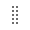
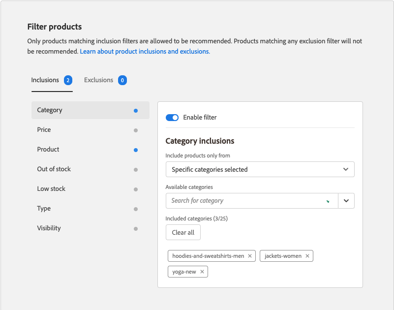

# Modifica consiglio

La pagina Edit Recommendation (Modifica raccomandazione) consente di modificare le singole impostazioni che compongono la raccomandazione. È possibile modificare tutte le impostazioni, tranne il tipo di pagina e il tipo di raccomandazione. È possibile modificare le seguenti impostazioni:

- [Nome raccomandazione](#name)
- [Etichetta Storefront](#label)
- [Numero di prodotti](#number)
- [Posizionamento e posizione](#placement)
- [Filtra prodotti](#filters)

L&#39;anteprima sul lato destro della pagina mostra come la raccomandazione con le impostazioni correnti potrebbe apparire nella vetrina. La _Anteprima dei prodotti consigliati_ rimane visibile come riferimento mentre scorri la pagina verso il basso. Nell’anteprima viene visualizzata un’immagine del prodotto in miniatura, il nome del prodotto, la SKU (Stock Keeping Unit), il prezzo e il tipo di risultato per ciascun prodotto restituito. Il tipo di risultato indica se esistono abbastanza dati comportamentali primari per generare la raccomandazione o se utilizza dati comportamentali di backup.

## Modificare una raccomandazione

1. Sulla _Amministratore_ barra laterale, vai a **Marketing** > _Promozioni_ > **Recommendations di prodotto**.

1. Selezionate la raccomandazione da modificare.

1. Fai clic su **Modifica**. Quindi, segui le istruzioni riportate di seguito per apportare le modifiche necessarie.

1. Al termine, fai clic su **Salva modifiche**.

### Nome raccomandazione {#name}

Scegliete un nome descrittivo che indichi lo scopo della raccomandazione. Il nome è per riferimento interno e non viene visualizzato nella vetrina.

### Etichetta Storefront {#label}

Immetti il testo da utilizzare come etichetta per l&#39;unità di raccomandazione nella vetrina.

### Numero di prodotti {#number}

Regolate il cursore per visualizzare fino a 20 prodotti nell&#39;unità di raccomandazione.

### Posizionamento e posizione {#placement}

1. Scegliete la posizione della pagina in cui l&#39;unità di raccomandazione deve essere visualizzata nella vetrina.

   - Nella parte inferiore del contenuto principale
   - Nella parte superiore del contenuto principale

   

1. Per modificare l’ordine delle raccomandazioni incluse nell’unità, utilizza **Sposta**  per trascinare i consigli in posizione.

   

### Filtra prodotti {#filters}

Qualsiasi modifica apportata al prodotto [filtri](filters.md) sono riflessi nel _Anteprima dei prodotti consigliati_. È consentito consigliare solo i prodotti che corrispondono ai filtri di inclusione. I prodotti che corrispondono a qualsiasi filtro di esclusione non sono consigliati.

La _Inclusioni_ e _Esclusioni_ le schede elencano i filtri disponibili per ciascun tipo. Nell’elenco, ogni filtro attivo è contrassegnato da un punto blu.

- Per visualizzare i dettagli di ciascun filtro, fai clic sul nome del filtro.
- Per modificare lo stato del filtro, imposta la **Abilita filtro** passa alla `on` o `off` posizione.

Le impostazioni del filtro descrivono i prodotti da includere o escludere nell&#39;unità di raccomandazione. Ad esempio, il _Categoria_ le impostazioni di inclusione dei filtri indicano al sistema di includere i prodotti solo dalle categorie selezionate.

