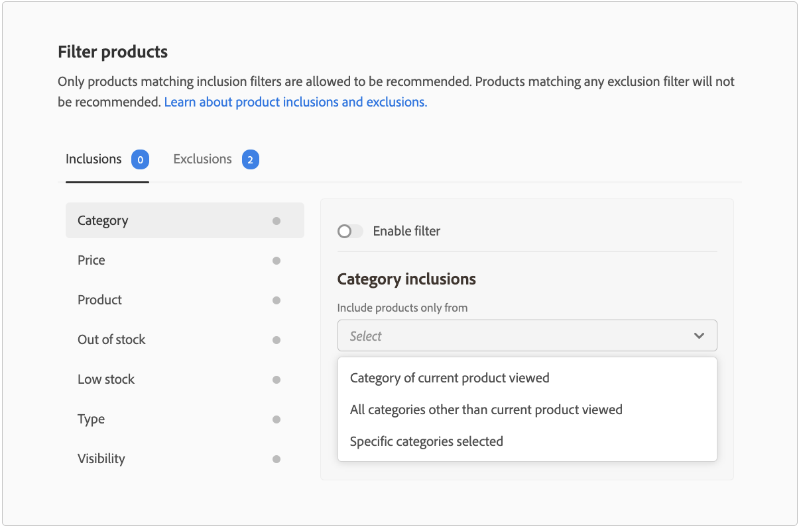

# Filtra prodotti

Adobe Commerce applica automaticamente filtri predefiniti non configurabili alle unità dei consigli. Se a una pagina sono state distribuite più unità di raccomandazione, Adobe Commerce filtra tutti i prodotti che vengono ripetuti nelle unità. Viene utilizzato solo il primo riferimento a un prodotto ripetuto, per fare spazio ad altri prodotti da raccomandare. Adobe Commerce inoltre filtra i prodotti acquistati in precedenza e quelli presenti nel carrello.

Quando [creare](create.md) un&#39;unità di raccomandazione, potete definire filtri che controllano quali prodotti possono essere visualizzati nei consigli. Questi filtri si basano su un set di condizioni di inclusione o esclusione definite dall’utente. Nei consigli vengono visualizzati solo i prodotti che corrispondono a tutte le condizioni di inclusione. I prodotti che corrispondono a una qualsiasi delle condizioni di esclusione non sono consigliati.

Puoi configurare più filtri e abilitare solo quelli desiderati selezionando l’opzione su ogni pagina del filtro. Questo consente di creare bozze di filtri da utilizzare in futuro. In ogni scheda viene visualizzato il numero di filtri abilitati.

## Condizioni

Le condizioni possono essere statiche o dinamiche.

- Una condizione statica utilizza gli attributi di prodotto esistenti per determinare quali prodotti possono apparire nell’unità. Ad esempio, puoi specificare che nell’unità vengono visualizzati solo i prodotti in magazzino con un prezzo superiore a 25 $. Le condizioni statiche sono disponibili in tutti i tipi di pagina.

- Una condizione dinamica chiave del contesto corrente di un acquirente, ad esempio la categoria o il prodotto attualmente visualizzato. Ad esempio, quando crei una raccomandazione di prodotto da distribuire nelle pagine dei dettagli del prodotto, puoi creare una condizione per consigliare solo i prodotti che rientrano in una fascia di prezzo relativa del prodotto attualmente visualizzato. Le condizioni dinamiche sono disponibili in ogni tipo di pagina, ad eccezione della home page e nelle pagine con consigli inseriti con Page Builder.

### Operatori logici

Operatori logici `AND` e `OR` sono utilizzati per unire più condizioni. Se utilizzi sia filtri di inclusione che filtri di esclusione, le inclusioni vengono valutate per prime per determinare tutti i prodotti possibili che possono essere consigliati, i prodotti che corrispondono a eventuali filtri di esclusione vengono rimossi dall’elenco.

- `AND` - Unisce due condizioni di filtro dell’inclusione
- `OR` - Unisce due condizioni di filtro di esclusione

>[!NOTE]
>
> I filtri di inclusione e esclusione sostituiscono le esclusioni di categoria legacy nelle versioni 3.2.2 e successive della `magento/product-recommendations` modulo . Consulta la sezione [note sulla versione](release-notes.md) per ulteriori informazioni sulle versioni di Adobe Commerce.

## Tipi di filtri {#filtertypes}

### Categoria

I filtri basati sulla categoria di un prodotto utilizzano assegnazioni di categorie dirette e relative sottocategorie. Ad esempio, l’abilitazione di una condizione di esclusione per una categoria `Gear` esclude i prodotti assegnati a `Gear` e tutte le sue sottocategorie quali `Gear/Bags` o `Gear/Fitness Equipment`. Per i commercianti B2B, il filtro Categoria aderisce a qualsiasi [categorie di prodotti specifiche per il cliente](https://docs.magento.com/user-guide/catalog/category-permissions.html) hai configurato.

Adobe Commerce consiglia di utilizzare la seguente configurazione di filtro categorie quando distribuisci consigli ai tipi di pagina:

| Pagina | Filtra per |
|---|---|
| Pagina principale | Non filtrare i prodotti. |
| Categoria | Filtrare i prodotti nella categoria specifica. |
| Dettagli prodotto | Filtrare i prodotti nelle stesse categorie. |
| Carrello | Filtrare categorie di prodotti nel carrello. |
| Conferma ordine | Filtra categorie di prodotti acquistati. |

### Prodotto

I filtri dei prodotti specificano quali prodotti specifici sono idonei, o non idonei, da visualizzare nei consigli. Non è possibile selezionare prodotti disattivati o non visibili individualmente perché tali prodotti non possono mai essere visualizzati nei consigli.

### Tipo

Un filtro basato sul tipo di prodotto include o esclude tutti i prodotti di un tipo specifico. I tipi supportati includono _Semplice_, _Configurabile_, _Virtuale_, _Scaricabile_ oppure _Carta regalo_. _Bundle_ e _Raggruppato_ i prodotti non sono ancora supportati.

### Visibilità

Filtra i prodotti in base alla visibilità, ad esempio: _Catalogo_, _Ricerca_ o entrambi.

### Prezzo

Un filtro basato sul prezzo del prodotto utilizza il prezzo finale per eseguire il confronto. Il prezzo finale comprende eventuali sconti o prezzi speciali disponibili per i consumatori anonimi. Per i commercianti B2B, il prezzo visualizzato riflette il [determinazione dei prezzi di gruppo specifici per i clienti](https://docs.magento.com/user-guide/catalog/pricing-advanced.html#customer-group-price) hai configurato.

### Stato delle scorte

I seguenti filtri di esclusione possono essere utilizzati per filtrare i prodotti in base allo stato delle scorte:

- Non disponibile - (Solo esclusione) Esclude i prodotti che non sono disponibili.
- Basso in stock - (solo esclusione) Esclude i prodotti a basso contenuto di stock. Lo stato di stock ridotto si basa sul _Solo X soglia sinistra_ valore in [Configurazione dell’inventario](https://docs.magento.com/user-guide/configuration/catalog/inventory.html).
