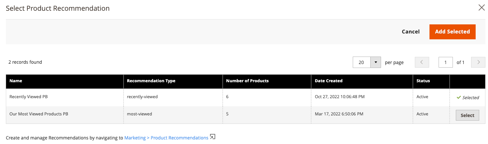

# [!DNL Page Builder] Integrazione

Product Recommendations può essere integrato in qualsiasi contenuto di Page Builder distribuito sul sito.

>[!NOTE]
>
> In una pagina nativa di Page Builder puoi avere fino a 25 unità di consigli. Le pagine di Page Builder non native possono avere fino a 5 unità di consigli. Consulta [Crea nuovo consiglio](create.md) per ulteriori informazioni.

## Utilizzo del Recommendations di prodotto con il contenuto di Page Builder

1. Crea un’unità di consigli nella visualizzazione store predefinita di un sito web. Devono essere create nella vista predefinita del Negozio anche se si prevede di utilizzarle in viste diverse.
1. In Page Builder, seleziona il widget di contenuto Recommendations del prodotto e inseriscilo sul tuo sito.

1. Clic **Modifica consiglio prodotto**
1. Clic **Seleziona**
1. Seleziona l’unità Consigli creata in precedenza e fai clic su **Aggiungi selezionati**

1. Apporta eventuali altre modifiche al contenuto di Page Builder e salva le modifiche.

Al momento del rendering, il contesto e l’ambito del contenuto di Page Builder vengono rispettati dall’unità di consigli.
