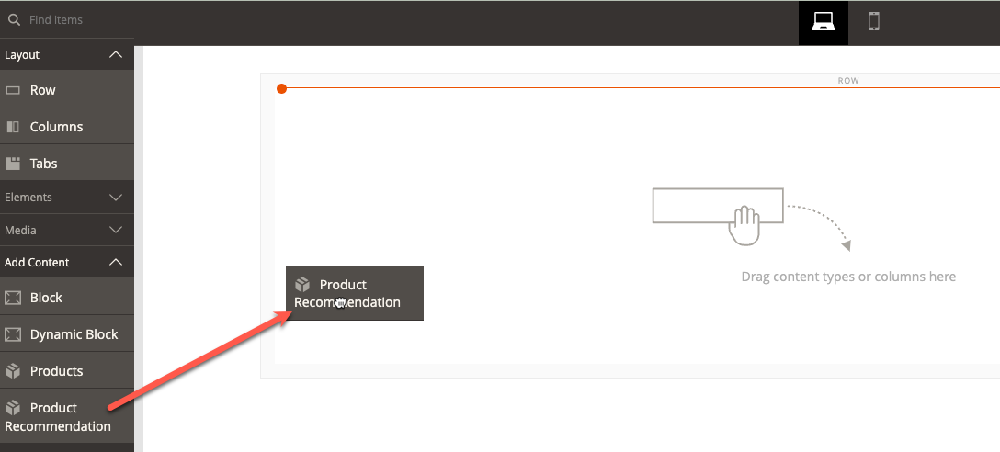

# [!DNL Page Builder] Integrazione

Product Recommendations può essere integrato all’interno di qualsiasi contenuto Page Builder distribuito sul sito.

>[!NOTE]
>
> È possibile avere fino a 25 unità di consigli su una pagina nativa di Page Builder. Le pagine non native di Page Builder possono avere fino a 5 unità di consigli. Vedi [Crea nuova raccomandazione](create.md) per ulteriori informazioni.

## Utilizzo di Recommendations di prodotto con i contenuti di Page Builder

1. Crea un&#39;unità di raccomandazione nella visualizzazione store predefinita di un sito web. Devono essere creati nella visualizzazione store predefinita anche se si prevede di utilizzarli in diverse viste store.
1. In Page Builder, seleziona il widget di contenuto Recommendations prodotto e inserisci sul sito.

1. Fai clic su **Modifica consiglio prodotto**
1. Fai clic su **Seleziona**
1. Seleziona l&#39;unità di raccomandazione creata in precedenza e fai clic su **Aggiungi selezionati**

1. Apporta qualsiasi altra modifica al contenuto di Page Builder e salva le modifiche.

Al momento del rendering, il contesto e l’ambito del contenuto Page Builder vengono rispettati dall’unità di raccomandazione.
