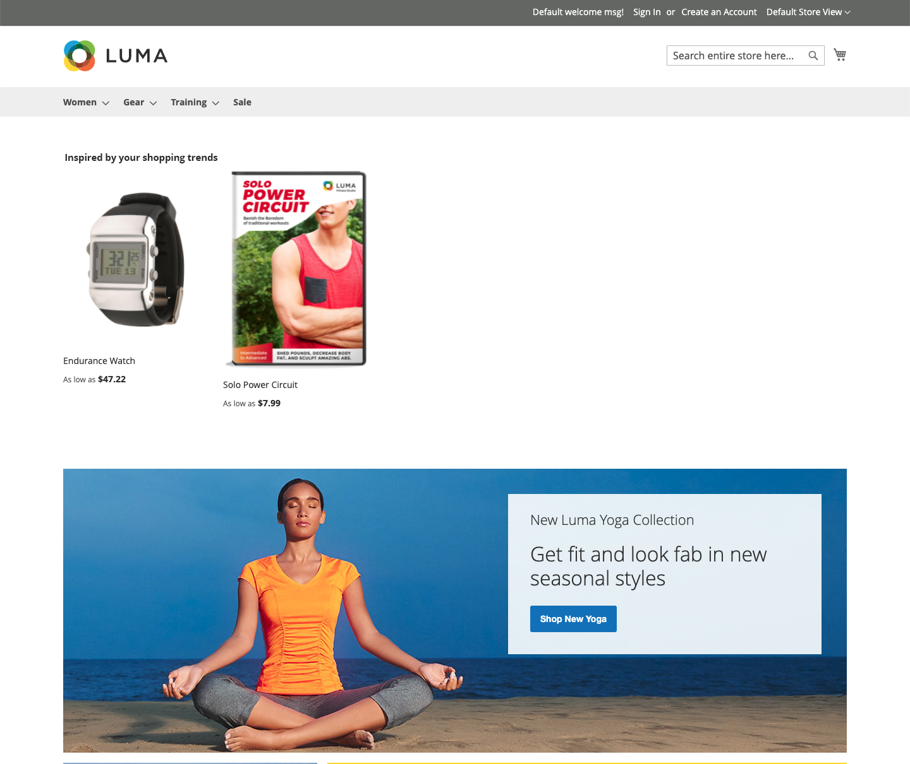

# Posizionamento ed etichette

Con così tanti tipi di consigli tra cui scegliere, quale utilizzare in ogni pagina? Se non si è sicuri della posizione da cui iniziare, provare a eseguire le operazioni seguenti:

| Pagina | Tipo di consiglio |
|---|---|
| Home page | `Recommended for you` |
| Pagina prodotto | `Viewed this, viewed that` |
| Carrello | `Bought this, bought that` |

Puoi tenere traccia di [metriche](workspace.md) e regolarli se necessario. Ricordate che la sperimentazione è fondamentale.

Alcune pagine di vetrina limitano la posizione in cui è possibile inserire i consigli. Puoi posizionare i consigli in una delle seguenti posizioni di pagina. Per ulteriori informazioni, consulta la tabella seguente.

- Nella parte superiore del contenuto principale - Recommendations viene visualizzato sopra l’area del contenuto principale appena sotto la barra di navigazione superiore.
- Nella parte inferiore del contenuto principale (impostazione predefinita): Recommendations viene visualizzato sotto l’area del contenuto principale e prima di qualsiasi altro blocco di contenuto della pagina, ad esempio _Prodotti correlati_.

_Consiglio nella parte superiore della home page_

## Etichette per consigli

L’etichetta assegnata a un consiglio nella vetrina influisce sul modo in cui i consumatori ne interpretano la rilevanza per gli stessi. Le seguenti etichette vengono spesso utilizzate per ogni tipo di consiglio.

_Consiglio nella parte superiore dei risultati di ricerca_

| Tipo di consiglio | Etichette consigliate |
|---|---|
| Articoli più visualizzati  Più aggiunti al carrello Più acquistati Conversione (da vista a carrello) Conversione (visualizzazione all&#39;acquisto) | Più popolari Elementi popolari Di tendenza Popolare al momento Popolari di recente Articoli popolari ispirati da questo articolo (PDP) Articoli più venduti Potrebbe interessarti |
| Consigliato per te | Solo per te Consigliato per te Ispirato dalle tendenze di acquisto |
| Ha Visualizzato Questo, Ha Visualizzato Quello | Hanno visto anche i clienti che hanno visto questo oggetto Clienti visualizzati anche Elementi correlati |
| Ha visualizzato questo, ha acquistato quello | I clienti che hanno visualizzato questo hanno acquistato I clienti hanno acquistato Cosa acquistano gli altri dopo aver visualizzato questo oggetto? |
| Ho Comprato Questo E Quello | Ottieni tutto il necessario Non dimenticate questi Acquistato di frequente insieme |
| Altri argomenti correlati | Altri elementi come questo Simile a questo |
| Generico | Ti potrebbe piacere Piaceva anche agli acquirenti Opzioni simili Elementi correlati |
| Di tendenza | Di tendenza Di tendenza Di tendenza recente Elementi attivi Prodotti correlati di tendenza (PDP) |
| Visualizzato di recente | Visualizzato di recente Dai un&#39;altra occhiata |

## Consigli supportati per pagina

Nella tabella seguente sono elencate le pagine iniziali in cui è possibile inserire i consigli e i tipi di consigli consentiti in ogni pagina.

| Pagina | Recommendations di posizionamento |
|---|---|
| Home page | Nella parte superiore del contenuto principale Nella parte inferiore del contenuto principale (impostazione predefinita) | Articoli più visualizzati Più acquistati Più aggiunti al carrello Consigliato per te Di tendenza |
| Categoria | Nella parte superiore del contenuto principale Nella parte inferiore del contenuto principale (impostazione predefinita) | Articoli più visualizzati Più acquistati Più aggiunti al carrello Consigliato per te Di tendenza |
| Dettagli prodotto | Nella parte inferiore del contenuto principale (impostazione predefinita) | Articoli più visualizzati Più acquistati Più aggiunti al carrello Ha visualizzato questo, ha visualizzato quello Ho visto questo, ho comprato quello Ho comprato questo e quello Altri argomenti correlati Di tendenza Somiglianza visiva |
| Carrello | Nella parte inferiore del contenuto principale (impostazione predefinita) | Articoli più visualizzati Più acquistati Più aggiunti al carrello Ha visualizzato questo, ha visualizzato quello Ho visto questo, ho comprato quello Ho comprato questo e quello Altri argomenti correlati Di tendenza |
| Conferma | Nella parte inferiore del contenuto principale (impostazione predefinita) | Articoli più visualizzati Più acquistati Più aggiunti al carrello Ha visualizzato questo, ha visualizzato quello Ho visto questo, ho comprato quello Ho comprato questo e quello Altri argomenti correlati Di tendenza |
| Page Builder | [Trascina](https://experienceleague.adobe.com/docs/commerce-admin/page-builder/add-content/recommendations.html) per posizionare il tipo di contenuto | Articoli più visualizzati Più acquistati Più aggiunti al carrello Consigliato per te Di tendenza |
