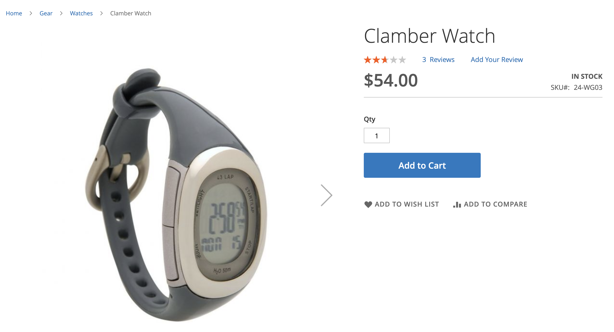
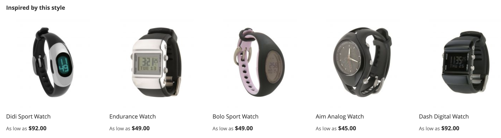

# Tipi di consigli

Adobe Commerce fornisce un ampio set di consigli da distribuire su varie pagine del sito. Tutti i tipi di consigli sono basati su dati. Sono basati su dati comportamentali, dati degli attributi di prodotto e metriche. Per un riferimento semplice, i tipi di raccomandazione sono raggruppati come segue:

- [Personalizzato](#personalized)
- [Cross-selling e up-sell](#crossup)
- [Popolarità](#popularity)
- [Prestazioni elevate](#highperf)

Come best practice, l’Adobe consiglia le seguenti linee guida quando si utilizzano i consigli:

- Diversificate i tipi di raccomandazione. I clienti iniziano a ignorare le raccomandazioni se suggeriscono gli stessi prodotti più e più volte.

- Non distribuire gli stessi consigli alla pagina del carrello e alla pagina di conferma dell’ordine. Considera l&#39;utilizzo di `Most Added to Cart` per la pagina del carrello e `Bought This, Bought That` per la pagina di conferma dell’ordine.

- Tieni il tuo sito aggiornato. Non distribuire più di tre unità di raccomandazione sulla stessa pagina.

- Se il tuo negozio vende abbigliamento, il `More like this` i consigli possono suggerire prodotti specifici per genere che non corrispondono al genere del prodotto visualizzato. Considera l&#39;utilizzo di questo tipo di raccomandazione solo per le categorie non di abbigliamento.

## Personalizzato {#personalized}

Questi tipi di consigli consigliano i prodotti in base alla cronologia comportamentale specifica dell’acquirente sul sito.

| Tipo | Descrizione |
|---|---|
| Consigliato per te | Consiglia i prodotti in base al comportamento corrente e precedente di ciascun acquirente sul sito. Visualizza consigli altamente pertinenti in base alla cronologia di navigazione e acquisto dell&#39;acquirente. Questo tipo di raccomandazione è efficace nella home page in cui la maggior parte degli acquirenti inizia il loro percorso su un sito. Per i nuovi acquirenti sul sito che non hanno generato alcun segnale per personalizzare la loro esperienza, Adobe Commerce mostra i prodotti in base al tipo di raccomandazione più visualizzato. Tuttavia, quando l&#39;acquirente inizia a interagire con i prodotti sul sito, i prodotti consigliati si adeguano in tempo reale al loro comportamento.  **Se utilizzato:** - Home page - Categoria   **Etichette consigliate:**  - Solo per te - Consigliato per te - Ispirato alle tue tendenze di shopping |
| Visualizzato di recente | Visualizza i prodotti visualizzati più di recente dall’acquirente, in base alla cronologia del browser. Gli eventuali prodotti eliminati vengono rimossi dall&#39;unità di raccomandazione. L&#39;unità di raccomandazione non viene visualizzata se non è presente una cronologia del browser o se non è disponibile una cronologia sufficiente quando vengono applicate le regole di filtro. Se i risultati contengono meno prodotti di quelli configurati, l&#39;unità di raccomandazione visualizza solo i prodotti restituiti.  **Se utilizzato:** - Home page - Categoria - Dettagli del prodotto - Carrello - Conferma   **Etichette consigliate:** - Visualizzato di recente - Dare un&#39;altra occhiata |

## Cross-selling e up-sell {#crossup}

Questi tipi di consigli sono a prova di social-proof guidati per aiutare gli acquirenti a trovare ciò che altri hanno apprezzato o prodotto guidato per aiutarli a trovare altri prodotti simili

| Tipo | Descrizione |
|---|---|
| Ho visualizzato questo, visto che | Consiglia i prodotti che gli acquirenti visualizzano in modo sproporzionato più spesso con il prodotto attualmente visualizzato.  **Se utilizzato:** - Dettagli del prodotto - Carrello - Conferma   **Etichette consigliate:** - I clienti che hanno visualizzato questo prodotto hanno visualizzato anche (PDP) |
| Ho visto questo, l&#39;ho comprato | Consiglia i prodotti che gli acquirenti tendono ad acquistare in modo sproporzionato più spesso dopo aver visualizzato il prodotto corrente. Aiuta i clienti a scoprire prodotti che altrimenti non avrebbero notato.  **Se utilizzato:** - Dettagli del prodotto - Carrello - Conferma   **Etichette consigliate:** - Clienti che hanno visualizzato questo risultato finale - Clienti acquistati - Cosa acquistano gli altri dopo aver visualizzato questo prodotto? |
| Ho comprato questo, l&#39;ho comprato | Consiglia prodotti che gli acquirenti acquistano in modo sproporzionato più spesso con il prodotto attualmente visualizzato. Nella pagina dei dettagli del carrello o del prodotto, la maggior parte delle volte viene utilizzata per aumentare l’esposizione del prodotto di cross-selling correlato per aumentare il valore medio dell’ordine. Mostra prodotti altamente rilevanti che gli acquirenti possono aggiungere al loro carrello aggregando ciò che gli altri acquirenti hanno acquistato con il prodotto corrente.  **Se utilizzato:** - Dettagli del prodotto - Carrello - Conferma   **Etichette consigliate:** - Ottieni tutto quello di cui hai bisogno - Non dimenticatele - Comprato frequentemente insieme |
| Più simile a questo | Consiglia i prodotti in base a metadati simili, quali nome, descrizione, assegnazione di categorie e attributi. Valutando gli attributi per i prodotti visualizzati, consiglia prodotti simili nella stessa categoria. Ad esempio, se un acquirente sta navigando nei tappetini di yoga, si consiglia di utilizzare altri prodotti della categoria di attrezzature. Poiché questo tipo di raccomandazione non distingue i generi, non è consigliato per abbigliamento, moda o altri verticali specifici per genere.  **Se utilizzato:** - Dettagli del prodotto - Carrello - Conferma   **Etichette consigliate:**  - Più prodotti come questo - Simile a questo |
| [Somiglianza visiva](#visualsim) | Consiglia prodotti simili al prodotto visualizzato. Questo tipo di raccomandazione è particolarmente utile se le immagini e gli aspetti visivi dei prodotti sono importanti per l’esperienza di acquisto. |

## Popolarità {#popularity}

Questi tipi di consigli consigliano i prodotti più popolari o di tendenza negli ultimi sette giorni.

| Tipo | Descrizione |
|---|---|
| Più visualizzati | Consiglia i prodotti più visualizzati contando il numero di sessioni in cui si è verificata un’azione di visualizzazione negli ultimi sette giorni.  **Se utilizzato:** - Home page - Categoria - Dettagli del prodotto - Carrello - Conferma   **Etichette consigliate:** - Più popolare - Tendenza - Popolare in questo momento - Di recente popolari - Prodotti popolari ispirati da questo prodotto (PDP) - Articoli più venduti |
| Più acquistati | Consiglia i prodotti acquistati più frequentemente dagli acquirenti negli ultimi sette giorni.  **Se utilizzato:** - Home page - Categoria - Dettagli del prodotto - Carrello - Conferma   **Etichette consigliate:**  - Più popolare - Tendenza - Popolare in questo momento - Di recente popolari - Prodotti popolari ispirati da questo prodotto (PDP) - Articoli più venduti |
| Più aggiunto al carrello | Consiglia i prodotti più frequentemente aggiunti ai carrelli da acquirenti negli ultimi sette giorni. Questo tipo di raccomandazione può essere utilizzato su tutte le pagine.  **Se utilizzato:** - Home page - Categoria - Dettagli del prodotto - Carrello - Conferma   **Etichette consigliate:**  - Più popolare - Tendenza - Popolare in questo momento - Di recente popolari - Prodotti popolari ispirati da questo prodotto (PDP) - Articoli più venduti |
| Tendenza | Consiglia i prodotti in base al recente slancio della popolarità di un prodotto in tutto il sito.  Adobe Sensei aggrega i dati di navigazione e acquisto sul sito per determinare e classificare quali prodotti sono più popolari tra i clienti più di recente. Poiché Trending analizza il recente slancio dei prodotti, è un tipo di raccomandazione efficace per i cataloghi con un fatturato elevato. Se il catalogo è più statico, potrebbe non essere utile a meno che i pattern di acquisto del pubblico non siano molto variabili.  Se utilizzato nella home page, Trending consiglia i prodotti di recente popolarità nell’intero sito. La tendenza non mostra prodotti che sono costantemente popolari, ma piuttosto quelli che sono diventati di recente popolari. Ad esempio, se disponi di una campagna di marketing e-mail che promuove determinati prodotti, l’aumento di popolarità generato dall’e-mail aumenta la probabilità che i prodotti promossi classifichino come trend.  **Se utilizzato:** - Home page - Categoria - Dettagli del prodotto - Carrello - Conferma   **Etichette consigliate:** - Tendenza - Tendenza ora - Tendenza recente - Prodotti caldi - Prodotti correlati alle tendenze (PDP) |

## Prestazioni elevate {#highperf}

Questi tipi di consigli consigliano prodotti dalle prestazioni migliori in base a criteri di successo come i tassi di conversione o i componenti aggiuntivi per il carrello.

| Tipo | Descrizione |
|---|---|
| Visualizza conversione acquisto | Consiglia i prodotti con il più alto tasso di conversione da visualizzazione a acquisto. Di tutte le sessioni dell&#39;acquirente che hanno registrato una visualizzazione del prodotto, qual è la proporzione che alla fine ha registrato un acquisto da parte dell&#39;acquirente.  **Se utilizzato:** - Home page - Categoria - Dettagli del prodotto - Carrello - Conferma   **Etichette consigliate:**  -Articoli più venduti - Prodotti popolari - Potrebbe interessarti |
| Visualizzazione della conversione al carrello | Consiglia i prodotti con il più alto tasso di conversione da visualizzazione a carrello. Di tutte le sessioni dell&#39;acquirente che hanno registrato una visualizzazione del prodotto, qual è la proporzione che alla fine ha registrato un&#39;aggiunta al carrello da parte dell&#39;acquirente.  **Se utilizzato:** - Home page - Categoria - Dettagli del prodotto - Carrello - Conferma   **Etichette consigliate:**  - Articoli più venduti - Prodotti popolari - Potrebbe interessarti |
| Più acquistati | Spesso denominato &quot;Più venduti&quot;, questo tipo di raccomandazione conta il numero di sessioni in cui si è verificata un’azione di ordine di acquisto negli ultimi sette giorni. Questo tipo di raccomandazione può essere utilizzato su tutte le pagine.  **Se utilizzato:** - Home page - Categoria - Dettagli del prodotto - Carrello - Conferma   **Etichette consigliate:**  - Più popolare - Tendenza - Popolare in questo momento - Di recente popolari - Prodotti popolari ispirati da questo prodotto (PDP) - Articoli più venduti |
| Più aggiunto al carrello | Consiglia i prodotti più frequentemente aggiunti ai carrelli da acquirenti negli ultimi sette giorni. Questo tipo di raccomandazione può essere utilizzato su tutte le pagine.  **Se utilizzato:** - Home page - Categoria - Dettagli del prodotto - Carrello - Conferma   **Etichette consigliate:**  - Più popolare - Tendenza - Popolare in questo momento - Di recente popolari - Prodotti popolari ispirati da questo prodotto (PDP) - Articoli più venduti |

## Somiglianza visiva {#visualsim}

La _Somiglianza visiva_ il tipo di raccomandazione consiglia prodotti simili a quelli visualizzati. Questo tipo di raccomandazione è particolarmente utile quando le immagini e gli aspetti visivi dei prodotti sono parti importanti dell’esperienza di acquisto.

### Come funziona

La _Somiglianza visiva_ il tipo di raccomandazione offre consigli per altri prodotti del catalogo con una somiglianza visiva alle immagini attualmente visualizzate. La somiglianza visiva include aspetti quali:

- Colore
- Forma
- Dimensione
- Texture
- Materiale
- Stile

Adobe Sensei utilizza l’intelligenza artificiale per elaborare e analizzare le immagini nel catalogo e generare gli attributi utilizzati per determinare le somiglianze visive.

>[!NOTE]
>
> Se sottoponete a test questo tipo di raccomandazione in un ambiente non di produzione, accertatevi che gli URL delle immagini siano accessibili al pubblico.

>[!NOTE]
>
> Attualmente, le immagini del prodotto devono avere dimensioni non superiori a 10 MB.

Poiché questo tipo di raccomandazione non è applicabile alla maggior parte dei cataloghi, non è abilitato per impostazione predefinita. Devi abilitare esplicitamente questo tipo di raccomandazione.

### Abilita tipo di raccomandazione per similarità visiva

>[!NOTE]
>
> La _Somiglianza visiva_ il tipo di raccomandazione è disponibile quando [installare](install-configure.md) come modulo facoltativo.

1. Sulla _Amministratore_ barra laterale, vai a **Marketing** > _Promozioni_ > **Recommendations di prodotto** per visualizzare _Recommendations di prodotto_ dashboard.

1. Fai clic su **Impostazioni** (icona a forma di ingranaggio) per visualizzare il _Impostazioni_ pagina.

1. In _Recommendations visivo_ sezione , seleziona **Abilita Visual Recommendations**.

1. Fai clic su **Salva modifiche** quando hai finito.

   La [Crea nuova raccomandazione](create.md) viene visualizzata la pagina **Somiglianza visiva** come tipo di raccomandazione selezionabile quando il tipo di pagina è **Dettagli prodotto**.

Dopo aver abilitato le raccomandazioni visive, Adobe Sensei avvia l’elaborazione delle immagini. Il tempo necessario dipende dalle dimensioni del catalogo.

### Se utilizzato

- Dettagli del prodotto

### Etichette consigliate per la vetrina

- Può piacerti anche
- Abbiamo trovato altri prodotti che potrebbero piacerti
- Ispirato a questo stile

### Esempio

L’immagine seguente mostra la pagina dei dettagli del prodotto per _Orologio Clare_:

Di seguito viene illustrata la _Somiglianza visiva_ unità di raccomandazione per _Orologio Clare_:

