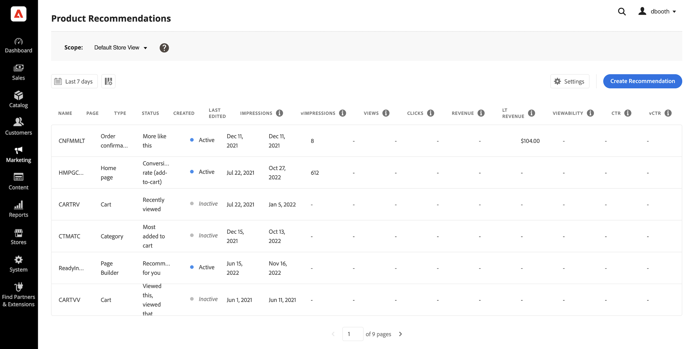
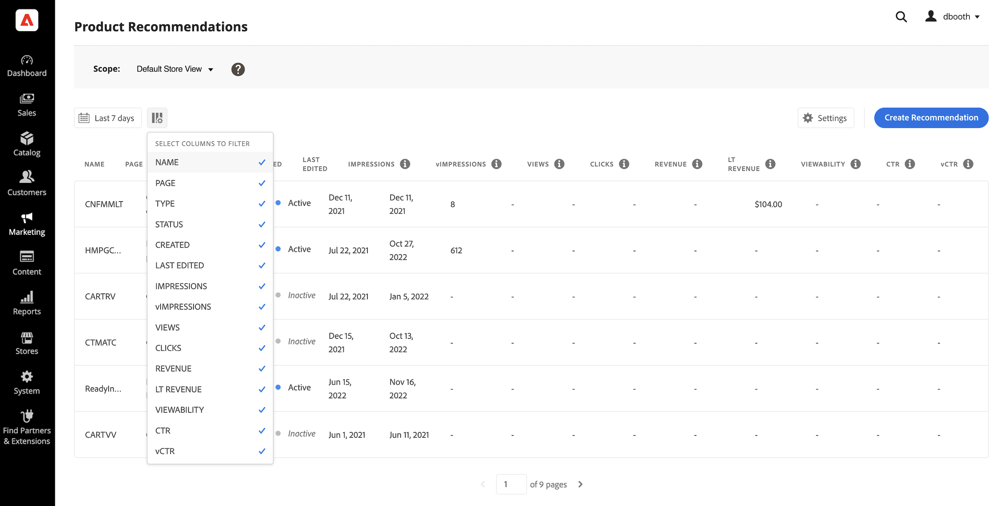
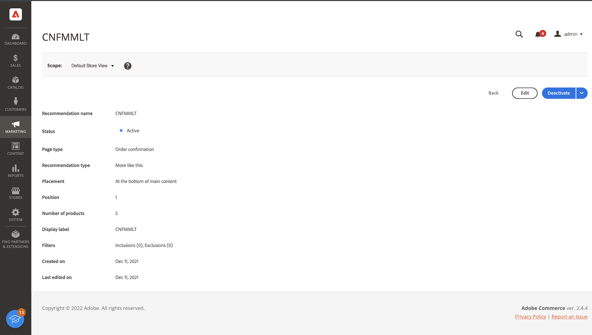

# Area di lavoro

La [!DNL Product Recommendations] workspace visualizza un elenco di consigli configurati in precedenza con metriche che consentono di tenere traccia del successo di ogni raccomandazione. L’elenco può essere configurato per calcolare le metriche per l’ultimo giorno, settimana o mese. Puoi utilizzare le metriche per creare informazioni fruibili in base alla frequenza con cui viene visualizzata o su cui viene fatto clic un’unità di raccomandazione oppure per analizzare le prestazioni delle raccomandazioni.

_Area di lavoro Recommendations_

## Imposta l&#39;ambito

Inizialmente il [scope](https://docs.magento.com/user-guide/stores/websites-stores-views.html) di tutte le impostazioni per i consigli è impostato su `Default Store View`. Se l’installazione Commerce include più viste Store, imposta **Ambito** al [vista store](https://docs.magento.com/user-guide/configuration/scope.html) a cui si applicano le raccomandazioni.

## Imposta intervallo di date delle metriche

1. Fai clic sul pulsante **Calendario**  controllo.

1. Scegliere una delle seguenti opzioni:

   - Ultime 24 ore
   - Ultimi 7 giorni
   - Ultimi 30 giorni

   I valori calcolati nelle colonne delle metriche cambiano per riflettere l’intervallo di date corrente.

## Mostra/nascondi colonne

1. Nell&#39;angolo in alto a sinistra, fai clic su **Mostra/nascondi**  colonne.

   Le colonne visibili hanno un segno di spunta blu.

1. Nel menu , effettua una delle seguenti operazioni:

   - Per visualizzare una colonna nascosta, fare clic su un nome di colonna senza un segno di spunta.
   - Per nascondere una colonna visibile, fare clic su un nome di colonna con un segno di spunta.

   La tabella viene aggiornata in modo da includere solo le colonne selezionate.

   
   _Mostra/nascondi colonne_

## Impostazioni

Le impostazioni determinano lo spazio dati SaaS che fornisce i dati comportamentali della raccomandazione.

- Per modificare la provenienza dei dati comportamentali dei consigli, scegliete un diverso spazio dati SaaS.

- Per configurare un nuovo spazio dati SaaS, fai clic su **Modifica configurazione**. Per ulteriori informazioni, consulta [Impostazioni](settings.md).

_Impostazioni Recommendations_

## Visualizza dettagli

1. Nella tabella, fate clic sulla raccomandazione da esaminare.

   
   _Dettagli del tasso di conversione della pagina Home_

1. Per modificare lo stato della raccomandazione, fate clic su **Attiva** o **Disattiva**.

## Modifica consiglio

Dalla pagina dei dettagli della raccomandazione, fate clic su **Modifica**. Per ulteriori informazioni, vai a [Modifica Recommendations](edit.md).

## Creare un consiglio

Dalla pagina dei dettagli della raccomandazione, fate clic su **Crea**. Per ulteriori informazioni, vai a [Creare Recommendations](create.md).

## Controlli Workspace

| Controllo | Descrizione |
|---|---|
|  | Determina l&#39;intervallo di tempo utilizzato per i calcoli delle metriche. Opzioni: 24 ore / 7 giorni / 30 giorni |
|  | Determina le colonne visualizzate nel [!DNL Product Recommendations] tabella. |
| Impostazioni | Determina lo spazio dati SaaS in cui vengono recuperati i dati comportamentali dei consigli e abilita anche il tipo di raccomandazione per somiglianza visiva. |
| Crea consiglio | Apre la [Crea nuova raccomandazione](create.md) pagina. |

## Descrizioni colonna

| Colonna | Descrizione |
|---|---|
| Nome | Nome della raccomandazione. |
| Pagina | La pagina in cui viene visualizzata la raccomandazione. |
| Tipo | Il tipo di raccomandazione. |
| Stato | Lo stato della raccomandazione. Opzioni: Inattivo/Attivo/Bozza |
| Creato | Data di creazione della raccomandazione. |
| Ultima modifica | Data dell&#39;ultima modifica apportata alla raccomandazione. |
| Impressioni | Il numero di volte in cui un&#39;unità di raccomandazione viene caricata e sottoposta a rendering su una pagina. Un&#39;unità di raccomandazione che si trova sotto la piega del riquadro di visualizzazione del browser viene riprodotta sulla pagina, ma non viene visualizzata dall&#39;acquirente. In questo caso, l&#39;unità di cui è stato effettuato il rendering viene conteggiata come impression, ma una visualizzazione viene conteggiata solo se l&#39;utente scorre l&#39;unità in visualizzazione. |
| vImpression | (Impression visualizzabili) Il numero di unità di raccomandazione che registrano almeno una visualizzazione. |
| Viste | Il numero di unità di raccomandazione che vengono visualizzate nella finestra della finestra del browser dell&#39;acquirente. Questo evento può essere attivato più volte su una pagina. |
| Clic | La somma del numero di volte in cui un acquirente fa clic su un elemento nell&#39;unità di raccomandazione e del numero di volte in cui l&#39;acquirente fa clic sul **Aggiungi al carrello** nell&#39;unità di raccomandazione |
| Entrate | I ricavi generati dalla raccomandazione per l&#39;intervallo di tempo corrente. |
| Entrate Lt | (Ricavi del ciclo di vita) I ricavi del ciclo di vita generati da una raccomandazione. |
| Visualizzazione | La percentuale di unità di raccomandazione registrate per la visualizzazione. |
| Ctr | (Tasso di click-through) La percentuale di impression unitarie per la raccomandazione che registra un clic. |
| vCtr | (Tasso di click-through visualizzabile) La percentuale di impression visualizzabili per l&#39;unità di raccomandazione che registra un clic. |
