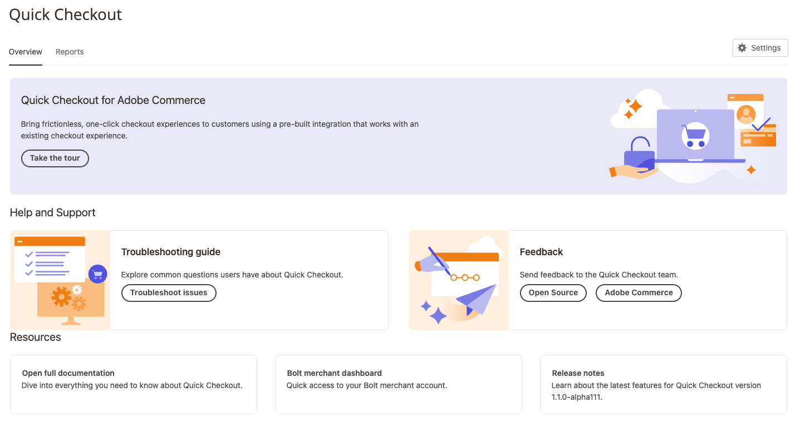

# Introduzione alla [!DNL Quick Checkout] Pannello di amministrazione

[!DNL Quick Checkout] per Adobe Commerce e Magento Open Source fornisce una vista del pannello di amministrazione con tutte le informazioni necessarie per configurare e utilizzare l’estensione.

1. Il giorno _Amministratore_ barra laterale, vai a **[!UICONTROL Sales]** > **[!UICONTROL Quick Checkout]**:
1. In questa visualizzazione, è possibile accedere al _Pannello di amministrazione_ panoramica, _Risorse_ informazioni su [!DNL Quick Checkout], get _Guida e supporto_, o configura l&#39;estensione tramite _Impostazioni_.

   {width="600" zoomable="yes"}

Verifica che all’utente siano concessi i ruoli e le autorizzazioni appropriati per il [!DNL Quick Checkout] Pannello di amministrazione da visualizzare. Consulta la [Ruoli utente e autorizzazioni](../quick-checkout/user-roles-setup.md) per ulteriori informazioni.

Consulta la sezione [Onboarding](../quick-checkout/onboarding.md) per ulteriori informazioni su come configurare [!DNL Quick Checkout] per Adobe Commerce.

## Home

| Campo | Descrizione |
|---|---|
| [!UICONTROL Overview] | La scheda Panoramica mostra tutte le risorse per l’utilizzo di [!DNL Quick Checkout]. |
| [!UICONTROL Reports] | La scheda Rapporti mostra informazioni complete [!DNL Quick Checkout] informazioni. |

## Guida e supporto

| Campo | Descrizione |
|---|---|
| [!UICONTROL Troubleshooting guide] | Il Centro assistenza Adobe Commerce contiene [!DNL Quick Checkout] articoli sulla risoluzione dei problemi. |
| [!UICONTROL Feedback] | Fornisci un feedback al team. |

## Risorse

| Campo | Descrizione |
|---|---|
| [!UICONTROL Open documentation] | Vedi i documenti più recenti per [!DNL Quick Checkout]. |
| [!UICONTROL [!DNL Bolt] merchant dashboard] | Accedi al tuo [!DNL Bolt] account esercente e dashboard. |
| [!UICONTROL Release notes] | Scopri le ultime modifiche apportate a [!DNL Quick Checkout]. |

## Impostazioni

Nella vista del pannello di amministrazione, fai clic su **[!UICONTROL Settings]** per accedere a [!DNL Quick Checkout] configurazione. Consulta [Configurazione amministratore](onboarding.md#complete-admin-configuration) per ulteriori informazioni.
